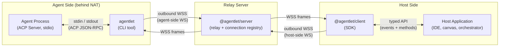
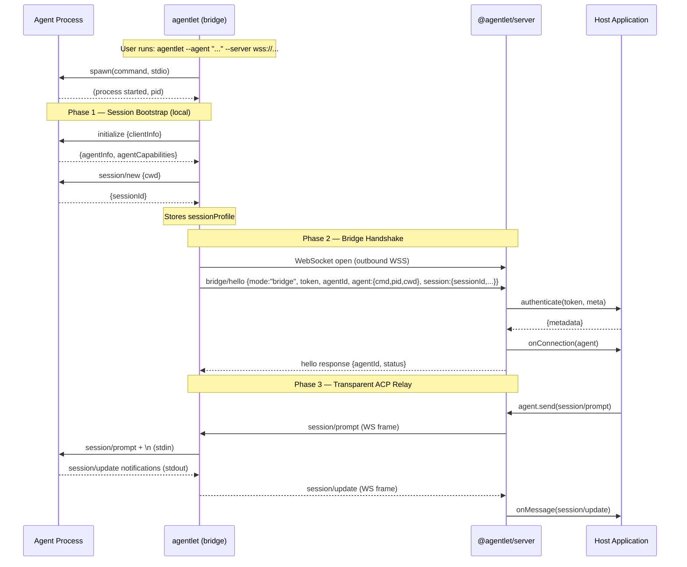
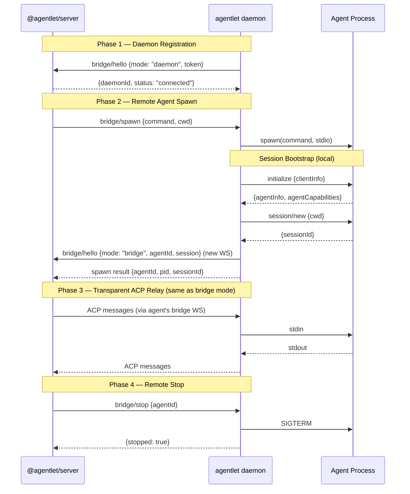
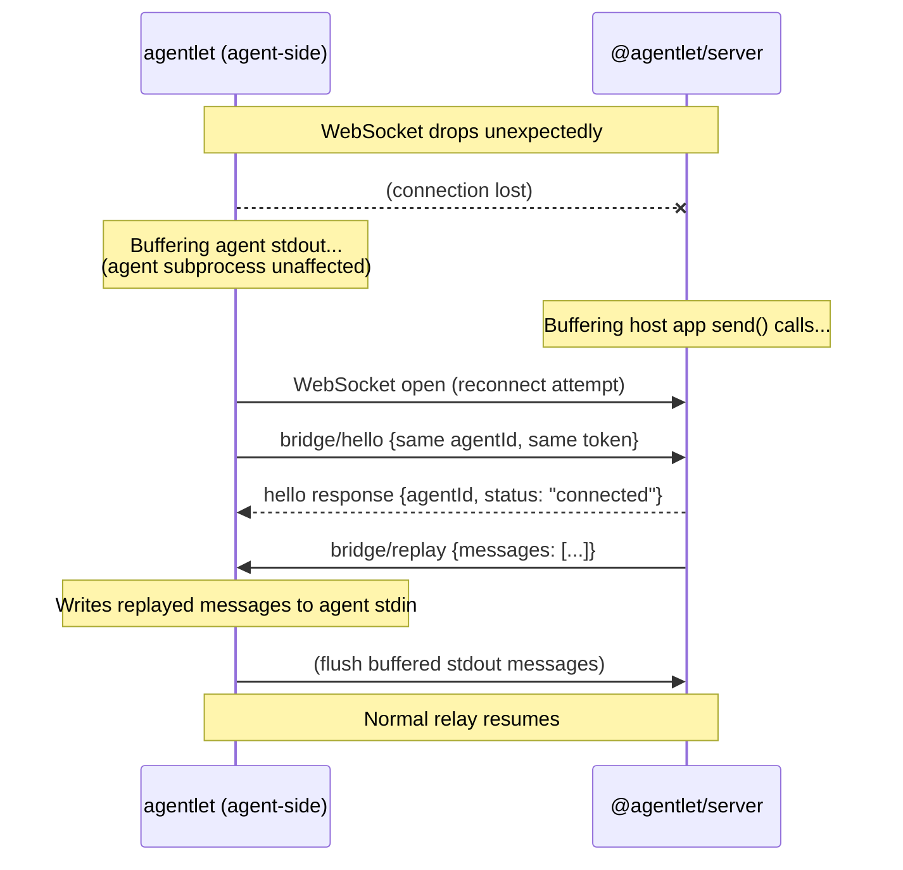

# Agentlet — Specification

> Make your local agents accessible from anywhere, without exposing them to the public internet.

---

## 1. Overview

**ACP agents are local-only, but the world needs them over the network — from machines that cannot be publicly reached.**

[Agent Client Protocol](https://agentclientprotocol.com) (ACP) is rapidly becoming the standard interface for AI agents. Most of the popular agents today (Claude Code, Copilot CLI, Gemini CLI, etc.) implement the ACP server side over stdio — they run as subprocesses and communicate via stdin/stdout. This design is stable, battle-tested, and works across all platforms. However, it has a critical limitation: it assumes the agent (the server) must be on the same machine as the client, because the only transport is stdio. Even for the in-draft WebSocket transport, the agent is still a server that listens for inbound connections, which means it must be on a machine with a public IP or properly configured NAT/firewall. However, many real-world use cases require the agent to run on a developer's local machine (where the code, credentials, and tools are) while being driven by a remote system (cloud-hosted IDE, canvas, orchestrator). This creates a fundamental mismatch: the agent is running in an environment that is not designed to accept inbound connections, yet the demand is for remote access from machines that cannot reach it directly.

This is the same class of problem that `ngrok` solves for HTTP servers, or SSH reverse tunnels solve for arbitrary TCP — **but for ACP agents specifically.** The agent can't be a server; someone needs to bridge it out.

### 1.1. What Agentlet Does

**Agentlet** is a thin relay process (~500 lines) that upgrades any stdio-only ACP agent into a network-accessible agent. It:

1. Spawns the agent locally via ACP stdio (the only stable transport)
2. Opens an **outbound** WebSocket to a remote server (traversing NAT naturally)
3. Relays ACP JSON-RPC messages bidirectionally — transparently, without interpretation
4. Handles reconnection and buffering so the agent is never disturbed by network issues

It has **zero AI logic**, **zero application knowledge**, and is completely server-agnostic. Any system that accepts an ACP-over-WebSocket connection can use Agentlet as its local-side adapter.

### 1.2. Why not wait for ACP's native WebSocket transport?

The [Streamable HTTP & WebSocket Transport RFD](https://agentclientprotocol.com/rfds/streamable-http-websocket-transport) is in active development (Working Group formed April 2026), but:

- It may take 6–12+ months to stabilize and for agents to adopt it
- Even when stable, it makes the **agent** a WebSocket server — the NAT/firewall problem remains (the remote system still can't reach a server behind the developer's firewall)
- Agentlet is forward-compatible: once agents expose native WebSocket, Agentlet simply connects locally instead of spawning, and the remote relay stays the same

| Constraint | How Agentlet solves it |
|---|---|
| Agent only speaks stdio | Agentlet spawns it locally and bridges stdio ↔ WebSocket |
| Agent is behind NAT | All connections are **outbound** from the user's machine — no public IP needed |
| Remote system needs push | WebSocket is full-duplex — server can send prompts at any time |
| Network is unreliable | Agentlet buffers and reconnects; agent subprocess is never touched |

---

## 2. Get Started

### 2.1. Prerequisites

- Node.js ≥ 20
- pnpm ≥ 9 (for building from source)
- An ACP-compatible agent installed locally (e.g., Claude Code, Copilot CLI, Gemini CLI)

### 2.2. Quick Start (standalone server + one agent)

**1. Install packages**

```bash
npm install -g agentlet @agentlet/server
```

Since packages are not yet published to npm, install from the git repository:

```bash
git clone https://github.com/anthropics/agentlet.git
cd agentlet
pnpm run source-install
```

After linking, `agentlet` and `agentlet-server` are available as global commands.

**2. Start the server**

```bash
# With inline token (simplest)
agentlet-server --port 8080 --token "tok_dev_123" --allow-insecure
# Multiple tokens via JSON file:
# { "tok_dev_123": { "user": "alice", "expireTime": null }, "tok_dev_456": { "user": "bob", "expireTime": null } }
agentlet-server --port 8080 --token "./tokens.json" --allow-insecure
```

The server is now listening on `http://localhost:8080` with the Web UI, REST API, and WebSocket endpoints.

**3. Connect an agent (bridge mode — explicit)**

In the agent-side terminal, where you previously ran the agent command (e.g., `copilot --allow-all` or `claude`, etc.), run the `agentlet` CLI to start an agent instance in the current directory and connect it to the server:

```bash
agentlet --agent "copilot --acp --allow-all" \
         --server "ws://localhost:8080/api/bridge" \
         --token "tok_dev_123" \
         --allow-insecure
```

**3b. Or: run a daemon (server-driven agent spawning)**

Instead of manually specifying which agent to run, start the daemon and let the server decide:

```bash
agentlet daemon --server "ws://localhost:8080/api/bridge" \
               --token "tok_dev_123" \
               --allow-insecure
```

The daemon connects to the server and waits. Spawn agents remotely via the REST API or Web UI:

```bash
curl -X POST http://localhost:8080/api/daemons/<daemonId>/spawn \
  -H "Authorization: Bearer tok_dev_123" \
  -H "Content-Type: application/json" \
  -d '{"command": "copilot --acp --allow-all", "cwd": "/home/user/project"}'
```

**4. Open the Web UI**

Navigate to `http://localhost:8080` — select the agent from the dropdown and start chatting. The Web UI also shows connected daemons and lets you spawn/stop agents on them.

You can also use the headless WebSocket API (e.g., via `@agentlet/client`) or embed `@agentlet/server` directly in your own host application for programmatic access.

---

## 3. Architecture

### 3.1. Three Components

| Component | Package | Where it runs | Nature |
|---|---|---|---|
| **Agent-side adapter** | `agentlet` | User's machine (next to the agent) | CLI tool (installed by end user) |
| **Agent-side daemon** | `agentlet daemon` | Worker node (always-on) | CLI tool — daemon mode (kubelet-like) |
| **Relay server** | `@agentlet/server` | Remote server | Library (embedded) or standalone executable |
| **Host-side SDK** | `@agentlet/client` | Inside the host application | Library (imported by host app developers) |
| **Web UI** | `@agentlet/ui` | Browser (served by standalone server) | Built-in first-party host app (Vue 3 SPA — thin message viewport) |



### 3.2. Two modes for the agent-side adapter

| Mode | Use case | How |
|---|---|---|
| **Daemon** | Machine is an always-on worker node; server controls which agents to spawn | `agentlet daemon --server wss://...` |
| **Bridge** | User explicitly spawns one agent (ad-hoc / development) | `agentlet --agent "copilot --acp" --server wss://...` |

The **daemon** mode is the expected primary mode for production. It is analogous to `kubelet` in Kubernetes: the daemon registers with the server, and the server (or UI) remotely instructs it to spawn, stop, or list agents. Each spawned agent gets its own bridge connection — from the server's perspective, daemon-spawned agents are indistinguishable from manually-bridged agents.

**Bridge** mode is simpler (one agent, explicit command) and useful during development or when a user wants to connect a single agent on demand. In production deployments, daemon mode is preferred because it enables centralized orchestration — the server decides what to run, where, and when.

### 3.3. Two modes for the relay server

| Mode | Use case | How |
|---|---|---|
| **Embedded (library)** | Host app runs its own server and wants in-process access | `import { AgentletServer } from '@agentlet/server'` — mount on existing HTTP server |
| **Standalone (executable)** | Quick setup, self-hosted, or when host app is a separate service | `agentlet-server --port 8080 --token tok_abc` — runs its own HTTP server with REST + WS endpoints |

When embedded, the host app imports `@agentlet/server` and interacts with agents directly via TypeScript API (no network hop on the host side — `@agentlet/client` is not needed).

When standalone, the host app connects remotely via `@agentlet/client` SDK, which provides the **same typed API** as the embedded mode.

### 3.4. Data flow

```
Host Application
    ↕ @agentlet/client (typed API, or direct import of @agentlet/server)
Relay Server — @agentlet/server (manages connections, routes messages, stores session profiles)
    ↕ WebSocket (ACP JSON-RPC + bridge/* control messages)
Agent-side adapter — agentlet (session bootstrap + transparent relay)
    ↕ stdin/stdout (ACP JSON-RPC)
Agent Process (Claude Code / Copilot CLI / etc.)
```

Every message between the relay server and the agent is a **standard ACP JSON-RPC 2.0** message. The agent-side adapter does not interpret, transform, or filter these messages — it is a transparent pipe.

### 3.5. Session Ownership Model

**Agentlet owns the ACP session lifecycle.** When an agent process is spawned (in both bridge and daemon modes), agentlet immediately sends `initialize` and `session/new` to the agent — before any remote client connects. The resulting session profile (sessionId, agent capabilities) is reported to the server via `bridge/hello`.

This means:
- The server never sends `initialize` or `session/new` — it's a pure message router
- The UI never sends `initialize` or `session/new` — it attaches to an active session
- The UI is a **thin message viewport**: it fetches the sessionId from the REST API, opens a WebSocket, and immediately starts sending `session/prompt`
- Session bootstrap happens once, locally, with the correct `cwd` — no remote CWD guessing

```
agentlet spawns agent → initialize → session/new → sessionProfile
                                                          ↓
                                          bridge/hello {session: {sessionId, ...}}
                                                          ↓
                                              server stores session info
                                                          ↓
                                          GET /api/agents/:id → {session: {sessionId}}
                                                          ↓
                                              UI reads sessionId, opens WS
                                                          ↓
                                              UI sends session/prompt directly
```

### 3.6. Host-side WebSocket protocol

When the host app connects to the relay server via `@agentlet/client` (or raw WebSocket), the following envelope protocol is used:

```jsonc
// ─── Host → Server ───────────────────────────────
// Send an ACP message to a specific agent
{ "type": "send", "agentId": "dev-laptop:node:my-project:f47ac10b", "message": { "jsonrpc": "2.0", ... } }

// ─── Server → Host ───────────────────────────────
// ACP message received from an agent
{ "type": "message", "agentId": "dev-laptop:node:my-project:f47ac10b", "message": { "jsonrpc": "2.0", ... } }

// Agent lifecycle event
{ "type": "lifecycle", "agentId": "dev-laptop:node:my-project:f47ac10b", "event": { "type": "agent_exited", ... } }

// Agent came online
{ "type": "connected", "agentId": "dev-laptop:node:my-project:f47ac10b", "agentInfo": { "command": "...", "pid": 12345, "cwd": "/home/user/project" }, "session": { "sessionId": "sess_abc", "supportsLoad": true } }

// Agent went offline
{ "type": "disconnected", "agentId": "dev-laptop:node:my-project:f47ac10b", "reason": "websocket_closed" }
```

---

## 4. Agent-Side Adapter — `agentlet` CLI

### 4.1. Agent Identity (`agentId`)

Each agent-side adapter instance generates a globally unique `agentId` on startup:

```
Format:  <hostname>:<executable>:<cwd-basename>:<8-char-uuid>
Example: dev-laptop:node:my-project:f47ac10b
```

| Component | Source | Purpose |
|---|---|---|
| `hostname` | `os.hostname()` | Which machine the agent runs on |
| `executable` | basename of first token in `--agent` | Which agent program (e.g., `node`, `claude`, `python`) |
| `cwd-basename` | basename of `--cwd` (or process.cwd) | Which project/directory context |
| `8-char-uuid` | `crypto.randomUUID().slice(0,8)` | Uniqueness across concurrent instances |

**Lifecycle:** The `agentId` is generated once when the bridge process starts and remains stable for its entire lifetime — surviving WebSocket reconnections and agent restarts (if `--auto-restart` is enabled). It changes only when the bridge process itself restarts.

**Used by:** The relay server uses `agentId` as the primary key for its connection registry. Host apps address agents by `agentId`.

### 4.2. Core Responsibilities

| # | Responsibility | Details |
|---|---|---|
| 1 | **Spawn agent subprocess** | Start the agent command via child process with stdio pipes. Respect the agent's expected working directory and environment. |
| 2 | **Bootstrap ACP session** | After spawn, send `initialize` and `session/new` to the agent. Capture the session profile (sessionId, capabilities). This happens before any remote connection. |
| 3 | **Establish outbound WebSocket** | Connect to the relay server's endpoint using the provided token for authentication. Report agent info + session profile in `bridge/hello`. TLS required in production. |
| 4 | **Relay messages bidirectionally** | Forward every complete JSON-RPC message from stdout → WebSocket and from WebSocket → stdin. No buffering beyond message framing. |
| 5 | **Handle reconnection** | On WebSocket disconnect: buffer agent stdout, reconnect with exponential backoff, replay buffered messages on reconnection. Agent subprocess is unaffected. |
| 6 | **Report lifecycle events** | Notify the server of bridge-level events (agent crash, agent exit, bridge shutting down) via bridge-specific control messages. |
| 7 | **Graceful shutdown** | On SIGINT/SIGTERM: send `bridge/goodbye` to server, send SIGTERM to agent, close WebSocket cleanly. |

### 4.3. Non-responsibilities (explicit)

- ❌ No AI logic — never generates prompts or interprets agent responses.
- ❌ No application knowledge — does not know what the remote system does (canvas, IDE, orchestrator — irrelevant).
- ❌ No message transformation — after session bootstrap, all ACP messages pass through verbatim.
- ❌ No credential management — does not handle the agent's API keys (those belong to the agent's own environment).
- ❌ No agent configuration — the agent command is passed opaquely; doesn't know or care which agent it is.

---

### 4.4. CLI Interface

### 4.5. Installation

```bash
npm install -g agentlet
```

### 4.6. Usage (Bridge Mode — default)

```bash
agentlet --agent <command> --server <wss-url> --token <token> [options]
# or explicitly:
agentlet bridge --agent <command> --server <wss-url> --token <token> [options]
```

### 4.7. Required arguments

| Argument | Description | Example |
|---|---|---|
| `--agent` | Shell command to spawn the agent. Must support ACP stdio. | `"claude --acp --stdio"` |
| `--server` | Remote server's bridge endpoint (WSS URL). | `"wss://app.example.com/api/bridge"` |
| `--token` | Authentication token identifying this connection to the remote server. | `"tok_abc123..."` |

### 4.8. Optional arguments

| Argument | Default | Description |
|---|---|---|
| `--cwd` | Current directory | Working directory for the agent subprocess |
| `--reconnect-max` | `300` (5 min) | Maximum reconnection backoff in seconds |
| `--buffer-limit` | `1000` | Max messages buffered during disconnection (oldest dropped on overflow) |
| `--auto-restart` | `false` | Restart agent subprocess if it exits unexpectedly |
| `--restart-delay` | `2000` | Milliseconds to wait before restarting agent |
| `--restart-max` | `5` | Maximum consecutive restart attempts before giving up |
| `--log-level` | `info` | Logging verbosity: `debug`, `info`, `warn`, `error` |
| `--log-file` | (none) | Path to write structured log output (JSON lines) |
| `--env` | (none) | Extra environment variables for the agent: `--env KEY=VALUE` (repeatable) |
| `--heartbeat` | `30` | WebSocket ping interval in seconds (0 to disable) |

### 4.9. Examples

```bash
# Connect Claude Code to a remote server
agentlet --agent "claude --acp --stdio" \
         --server "wss://app.example.com/api/bridge" \
         --token "tok_from_server_ui"

# Connect Copilot CLI with a specific project directory
agentlet --agent "copilot --acp --stdio" \
         --server "wss://localhost:3001/api/bridge" \
         --token "tok_dev_local" \
         --cwd "/home/user/my-project" \
         --auto-restart

# Connect with custom environment for the agent
agentlet --agent "gemini-cli --stdio" \
         --server "wss://app.example.com/api/bridge" \
         --token "tok_xyz" \
         --env "GEMINI_API_KEY=sk-..." \
         --env "PROJECT_ROOT=/workspace"
```

---

### 4.10. Daemon Mode

> **Source:** [`packages/local/src/daemon.ts`](packages/local/src/daemon.ts)

Daemon mode turns a machine into a managed **ACP agent worker node**. Instead of the user deciding which agent to run, the daemon connects to the server and waits for remote instructions to spawn/stop agents.

**Analogy:** Just as `kubelet` makes a machine a Kubernetes worker node (accepting pod scheduling from the control plane), `agentlet daemon` makes a machine an ACP agent pool node (accepting agent spawn commands from the server).

#### Usage

```bash
agentlet daemon --server <wss-url> --token <token> [options]
```

#### Required arguments

| Argument | Description | Example |
|---|---|---|
| `--server` | Remote server's bridge endpoint (WSS URL). | `"wss://app.example.com/api/bridge"` |
| `--token` | Authentication token for this daemon. | `"tok_node_123"` |

#### Optional arguments

| Argument | Default | Description |
|---|---|---|
| `--reconnect-max` | `300` (5 min) | Maximum reconnection backoff in seconds |
| `--buffer-limit` | `1000` | Max messages buffered during disconnection per agent |
| `--max-agents` | `10` | Maximum concurrent agents this daemon can manage |
| `--heartbeat` | `30` | WebSocket ping interval in seconds (0 to disable) |
| `--log-level` | `info` | Logging verbosity: `debug`, `info`, `warn`, `error` |
| `--log-file` | (none) | Path to write structured log output (JSON lines) |
| `--allow-insecure` | `false` | Allow ws:// (non-TLS) connections (local development only) |

#### Examples

```bash
# Run daemon connected to a remote server
agentlet daemon --server "wss://app.example.com/api/bridge" \
               --token "tok_worker_node_1"

# Local development with higher agent limit
agentlet daemon --server "ws://localhost:8080/api/bridge" \
               --token "tok_dev_123" \
               --max-agents 20 \
               --allow-insecure
```

#### How it works

See **§5.1 Connection Establishment** for the full protocol specification, sequence diagrams, and message formats.

In summary:
1. Daemon connects to the server via `/api/bridge` with `mode: 'daemon'` in the `bridge/hello` handshake.
2. Server registers the daemon in its daemon registry.
3. Server (via REST API or UI) sends `bridge/spawn` requests to the daemon.
4. Daemon spawns the agent, bootstraps its ACP session, then opens a second WebSocket for relay.
5. Server can send `bridge/stop` to terminate an agent, or `bridge/list` to list running agents.

---

### 4.11. Agent Subprocess Management

#### Spawning

> **Source:** [`packages/local/src/agent-process.ts`](packages/local/src/agent-process.ts)

- **stdin**: Writable — Agentlet writes ACP messages (from server) here.
- **stdout**: Readable — Agent writes ACP responses here. Agentlet reads and relays.
- **stderr**: Readable — Agent diagnostic output. Logged by Agentlet but **not relayed** to server (it's not ACP protocol traffic).

#### Exit Handling

| Exit type | Action |
|---|---|
| Clean exit (code 0) | Send `bridge/agent_exited` with code 0. Do not restart. |
| Crash (code ≠ 0) | Send `bridge/agent_exited`. If `--auto-restart` enabled, restart after delay (up to `--restart-max`). |
| Signal (SIGTERM, SIGKILL) | Send `bridge/agent_exited` with signal name. Respect `--auto-restart`. |

#### Graceful Shutdown

> **Source:** `Bridge.shutdown()` in [`packages/local/src/bridge.ts`](packages/local/src/bridge.ts)

On SIGINT or SIGTERM to Agentlet:

1. Send `bridge/goodbye` to server.
2. Close stdin to agent (signals EOF → agent should exit).
3. Wait up to 5 seconds for agent to exit.
4. If agent still alive, send SIGTERM.
5. Wait 2 more seconds, then SIGKILL if necessary.
6. Close WebSocket.
7. Exit with code 0.

---

## 5. Relay Server — `@agentlet/server`

### 5.1. Overview

`@agentlet/server` is a lightweight TypeScript package that manages agent connections over WebSocket. It can be used in two ways:

1. **Embedded library** — import into your own server for in-process access to agents
2. **Standalone executable** — run independently, exposing REST + WebSocket APIs for host apps to connect remotely

The relay server is where **multiplexing** happens — a single instance manages connections from many agents simultaneously.

### 5.2. Installation

```bash
npm install @agentlet/server
```

### 5.3. Embedded Mode (Library API)

```ts
import { AgentletServer, type AgentConnection } from '@agentlet/server'

const server = new AgentletServer({
  authenticate: async (token, meta) => {
    const record = await db.findToken(token)
    if (!record || record.expired) throw new Error('Invalid token')
    return { metadata: { userId: record.userId } }
  },
  onConnection: (agent) => console.log(`Agent connected: ${agent.agentId}`),
  onReconnection: (agent) => console.log(`Agent reconnected: ${agent.agentId}`),
  onDisconnection: (agent, reason) => console.log(`Agent disconnected: ${agent.agentId} — ${reason}`),
})

// Mount on your HTTP server (works with any framework)
httpServer.on('upgrade', (req, socket, head) => {
  if (req.url === '/api/bridge') {
    server.handleUpgrade(req, socket, head)
  }
})

// Graceful shutdown
process.on('SIGTERM', async () => {
  await server.close()
  process.exit(0)
})
```

> See **§5.6 Protocol Type Reference** for full `AgentletServerOptions` and `AgentConnection` definitions.

### 5.4. Standalone Mode (CLI)

```bash
agentlet-server --port 8080 --token "tok_abc"
```

| Argument | Default | Description |
|---|---|---|
| `--host` | `0.0.0.0` | Bind address |
| `--port` | `8080` | Listen port |
| `--token <value\|path>` | (required) | A single token string, or path to a JSON token file (see format below) |
| `--admin-token <token>` | (disabled) | Enable admin API with this token. If not set, admin routes are disabled. |
| `--allow-insecure` | `false` | Allow ws:// (non-TLS) for local development |
| `--no-ui` | `false` | Disable the built-in web UI (headless mode) |

**Token file format:**

```json
{
  "tok_alice_123": { "user": "alice", "expireTime": null },
  "tok_bob_456": { "user": "bob", "expireTime": 1735689600 }
}
```

Each key is a token string. `expireTime` is a Unix timestamp (seconds) or `null` for no expiry.

When running standalone, the server exposes:
- `WS /api/bridge` — agent-side WebSocket (agentlet CLI connects here)
- `WS /api/host` — host-side WebSocket (host app connects here via `@agentlet/client`)
- `WS /agents/:agentId/ws?token=<tok>` — per-agent raw ACP WebSocket (token-authenticated)
- `GET /api/agents` — REST: list connected agents (filtered by `Authorization: Bearer <token>`)
- `GET /api/agents/:id` — REST: get agent info
- `DELETE /api/agents/:id` — REST: disconnect an agent
- `GET /api/health` — REST: health check
- `GET /api/admin/tokens` — Admin: list all tokens (requires `--admin-token`)
- `POST /api/admin/tokens` — Admin: replace full token map (requires `--admin-token`)

### 5.5. `AgentletServer` instance methods

> **Source:** [`packages/server/src/server.ts`](packages/server/src/server.ts)

Key methods: `handleUpgrade()`, `getConnection(agentId)`, `getConnections(filter?)`, `connectionCount`, `close()`.

> **Library design notes:**
> - Multiple `AgentletServer` instances in a single process are supported (no global state, no singletons).
> - In embedded mode, the server never calls `listen()` — it only accepts already-upgraded sockets.
> - Importing the package has zero side effects.
> - Call `server.close()` during shutdown to ensure all agents receive `bridge/shutdown`.

> For full type definitions of `AgentletServerOptions`, `AuthResult`, `AgentConnection`, and `BridgeLifecycleEvent`, see **§5.6 Protocol Type Reference**.

### 5.6. Connection Registry & Reconnection

The relay server maintains an internal registry: `Map<agentId, AgentConnection>`. The `agentId` is the stable identity (see §4 "Agent Identity"). See **§5.5 Reconnection Protocol** for the full reconnection flow.

### 5.7. Core Responsibilities

| # | Responsibility | Details |
|---|---|---|
| 1 | **Agent-side WebSocket endpoint** | Accept incoming WSS connections from agent-side adapters (`agentlet` CLI). |
| 2 | **Host-side WebSocket endpoint** | Accept incoming WSS connections from host apps (standalone mode) or provide in-process API (embedded mode). |
| 3 | **Token validation** | Delegate to `authenticate` callback (embedded) or static token file (standalone). Reject invalid/expired tokens. |
| 4 | **Connection registry** | Track all active agent connections. Provide lookup by agentId. |
| 5 | **Message routing** | Forward ACP messages from host → correct agent, and from agent → host. Pure fan-out relay — no ACP-level inspection or rewriting. |
| 6 | **Reconnection handling** | Recognize reconnecting agents (same agentId), restore connection state, replay buffered messages. |
| 7 | **Session info storage** | Store the session profile reported by agentlet in `bridge/hello`. Expose via REST API so UI/clients can discover the active sessionId. |
| 8 | **Lifecycle events** | Surface `bridge/agent_exited`, `bridge/goodbye`, etc. to host via typed events. |

### 5.8. Non-responsibilities

- ❌ No AI logic — never generates prompts or interprets agent responses.
- ❌ No ACP session management — never sends `initialize`, `session/new`, or `session/load`. Session bootstrap is owned by agentlet.
- ❌ No message rewriting — all ACP messages pass through verbatim. No CWD injection, no session interception.
- ❌ No token generation — host app generates and manages tokens. Server only validates.
- ❌ No persistence — connection and session state is in-memory. If the server restarts, agents reconnect automatically and new sessions are created.

### 5.9. Web UI (Standalone Mode)

When running in standalone mode, `agentlet-server` serves a built-in web interface at the root path (`/`). This provides a **first-party host application** for interactive use — chatting with agents, monitoring traffic, and managing connections — without requiring a separate host app.

#### Per-Agent Raw ACP WebSocket Endpoint

To support standard ACP-compatible UIs, the standalone server exposes a **raw ACP WebSocket** per connected agent:

```
WS /agents/:agentId/ws
```

This endpoint speaks **raw ACP JSON-RPC** — no envelope protocol. Each WebSocket frame is a single ACP JSON-RPC message, identical to how standard ACP clients expect to communicate. The server transparently bridges between this raw endpoint and the internal agent connection.

This means:

- The built-in UI connects via standard ACP WebSocket transport (no custom protocol)
- Any external ACP-compatible UI (e.g., [acp-ui](https://github.com/formulahendry/acp-ui)) can also connect to individual agents
- The envelope-based `/api/host` endpoint remains available for multi-agent programmatic access via `@agentlet/client`

#### Data Flow (UI → Agent)

```
Browser (Web UI)
    ↕ Raw ACP JSON-RPC over WebSocket (/agents/:agentId/ws)
agentlet-server (standalone — pure message relay)
    ↕ Internal bridge protocol (already connected)
agentlet (agent-side adapter — session already bootstrapped)
    ↕ stdin/stdout (ACP JSON-RPC)
Agent Process
```

The per-agent endpoint is essentially a **transparent ACP proxy**: the server strips/adds internal routing but from the UI's perspective it's talking directly to an ACP agent. The UI never sends `initialize` or `session/new` — it fetches the active `sessionId` from `GET /api/agents/:id` and sends `session/prompt` immediately.

#### UI Features

| Feature | Description |
|---|---|
| **Chat** | Send prompts, receive streaming responses, view agent messages |
| **Multi-agent** | Agent selector — switch between connected agents (discovered via REST API) |
| **Daemon management** | View connected daemons, spawn agents on them, stop agents — all from the UI |
| **Permissions** | Approve/deny agent permission requests (tool calls, file access) |
| **Traffic monitor** | Inspect raw ACP JSON-RPC messages in real time |
| **Session attach** | Automatically attaches to the agent's active session (bootstrapped by agentlet) — no manual session creation |
| **Connection status** | Live indicator for agent online/offline/reconnecting state |

#### Technology Stack

The UI is a Vue 3 single-page application (SPA) built with Vite, bundled as static assets:

- **Framework:** Vue 3 + TypeScript + Pinia (state management)
- **Build:** Vite → static `dist/` directory
- **Transport:** Standard ACP WebSocket transport (connects to `/agents/:agentId/ws`)
- **Session model:** Thin viewport — fetches `sessionId` from REST API, then sends only `session/prompt`. No `initialize` or `session/new` from the UI.
- **Agent discovery:** `GET /api/agents` REST endpoint (returns session info per agent)
- **Packaging:** Pre-built assets included in `@agentlet/server` package, served at `/` in standalone mode

#### Updated Standalone Endpoints

Full endpoint list when running standalone (supersedes the table above):

| Endpoint | Purpose |
|---|---|
| `GET /` | Web UI (static SPA) |
| `WS /api/bridge` | Agent-side WebSocket (agentlet CLI connects here — both bridge and daemon modes) |
| `WS /api/host` | Host-side WebSocket — envelope protocol (programmatic multi-agent access) |
| `WS /agents/:agentId/ws?token=<tok>` | Per-agent raw ACP WebSocket — token-authenticated, transparent relay |
| `GET /api/agents` | REST: list connected agents with session info (filtered by `Authorization: Bearer <token>`) |
| `GET /api/agents/:id` | REST: get agent info |
| `DELETE /api/agents/:id` | REST: disconnect an agent |
| `GET /api/daemons` | REST: list connected daemons (filtered by `Authorization: Bearer <token>`) |
| `GET /api/daemons/:id` | REST: get daemon info |
| `POST /api/daemons/:id/spawn` | REST: spawn an agent on a daemon |
| `POST /api/daemons/:id/stop` | REST: stop an agent on a daemon |
| `GET /api/daemons/:id/agents` | REST: list agents running on a daemon |
| `GET /api/health` | REST: health check |
| `GET /api/admin/tokens` | Admin: list tokens (gated by `--admin-token`) |
| `POST /api/admin/tokens` | Admin: replace full token map (gated by `--admin-token`) |

#### Reference: acp-ui

The UI design is adapted from [acp-ui](https://github.com/formulahendry/acp-ui) (MIT licensed, Vue 3 + Vite). Key adaptations from acp-ui:

| acp-ui (original) | agentlet UI (adapted) |
|---|---|
| Tauri desktop app + web build | Web-only (served by `agentlet-server`) |
| Agent config via local JSON file | Agent discovery via `GET /api/agents` |
| Connects to agent URL directly | Connects via `/agents/:agentId/ws` (server proxies) |
| Supports stdio + WebSocket transport | WebSocket only (agents are always remote via agentlet) |
| Single-agent per connection | Multi-agent (selector UI with all connected agents) |

---

### 5.10. Admin Control Plane

When `--admin-token` is set, the server exposes admin routes for token management:

```bash
agentlet-server --port 8080 --token "./tokens.json" --admin-token "admin_secret_xyz"
```

#### Admin API

All admin requests require `Authorization: Bearer <admin-token>` header.

**`GET /api/admin/tokens`** — Returns the current full token map:

```json
{
  "tok_alice_123": { "user": "alice", "expireTime": null },
  "tok_bob_456": { "user": "bob", "expireTime": 1735689600 }
}
```

**`POST /api/admin/tokens`** — Atomically replaces the entire token map:

```bash
curl -X POST http://localhost:8080/api/admin/tokens \
  -H "Authorization: Bearer admin_secret_xyz" \
  -H "Content-Type: application/json" \
  -d '{"tok_new": {"user": "charlie", "expireTime": null}}'
```

This is a full-map swap (not per-token CRUD) — designed for POC simplicity. For any token changes, modify your local file and POST the entire file content.

#### Multi-User Flow

Each token represents a user. The token is used for:
1. **Agent bridge authentication** — `agentlet --token <tok>` identifies which user owns this agent
2. **REST API filtering** — `GET /api/agents` with `Authorization: Bearer <tok>` returns only that user's agents
3. **WebSocket authentication** — `/agents/:agentId/ws?token=<tok>` validates access
4. **UI login** — user enters their token in the web UI to see only their agents

---

### 5.11. Session Lifecycle

**Agentlet owns the ACP session lifecycle.** The server is a pure message router and the UI is a thin viewport.

#### How It Works

```
agentlet spawns agent process
    ↓
agentlet sends initialize → agent responds with capabilities
    ↓
agentlet sends session/new {cwd: actual_local_cwd} → agent responds with sessionId
    ↓
agentlet connects to server via bridge/hello {session: {sessionId, supportsLoad, initializeResult}}
    ↓
server stores session info in AgentConnection
    ↓
UI fetches GET /api/agents/:id → receives {session: {sessionId, supportsLoad}}
    ↓
UI opens WebSocket, sets sessionId locally → immediately ready for session/prompt
```

#### Key Design Decisions

- **No session map on the server** — the server never intercepts or rewrites `initialize`, `session/new`, or `session/load`.
- **No CWD injection** — agentlet knows the correct `cwd` (it spawned the process there) and passes it in `session/new` directly.
- **No ACP handshake from UI** — the UI never sends `initialize` or `session/new`. It reads the sessionId from the agent's profile and sends prompts immediately.
- **Session info in REST API** — `GET /api/agents/:id` returns `session: { sessionId, supportsLoad }` so any client can discover the active session.
- **`supportsLoad` flag** — if the agent supports `session/load` (from `initializeResult.agentCapabilities.loadSession`), a future reconnecting agentlet can resume the session instead of creating a new one.

---

### 5.12. Framework Integration Examples (Embedded Mode)

```ts
// Express
const app = express()
const httpServer = app.listen(3001)
httpServer.on('upgrade', (req, socket, head) => {
  if (req.url === '/api/bridge') server.handleUpgrade(req, socket, head)
})

// Fastify
fastify.server.on('upgrade', (req, socket, head) => {
  if (req.url === '/api/bridge') server.handleUpgrade(req, socket, head)
})

// Plain Node.js http
const httpServer = http.createServer()
httpServer.on('upgrade', (req, socket, head) => {
  server.handleUpgrade(req, socket, head)
})
httpServer.listen(3001)
```

### 5.13. Host App Usage Pattern (Embedded Mode)

```ts
// When user triggers an action that requires the agent:
const agent = server.getConnection('dev-laptop:node:my-project:f47ac10b')
if (!agent || agent.status !== 'connected') {
  throw new Error('Agent is offline')
}

// Session is already active (bootstrapped by agentlet)
// Just read the sessionId from the connection profile:
const sessionId = agent.session?.sessionId
if (!sessionId) {
  throw new Error('Agent has no active session')
}

// Send prompts directly — no initialize or session/new needed
agent.send({
  jsonrpc: '2.0', method: 'session/prompt', id: 1,
  params: { sessionId, prompt: [{ type: 'text', text: 'Refactor the auth module' }] }
})

// Listen for responses
agent.onMessage((msg) => {
  if (msg.method === 'session/update') {
    // Streaming content from agent
    renderToUI(msg.params)
  }
  if (msg.id === 1 && msg.result) {
    // Prompt completed
    console.log('Prompt finished')
  }
})
```

---

## 6. Protocol

### 6.1. Connection Establishment

There are two paths to establishing an agent connection, but both converge on the same outcome: a transparent ACP relay between the host application and the agent process. In production, **daemon mode** is expected to be the most common deployment.

#### Bridge Mode (explicit, single agent)

The user explicitly spawns one agent. Three phases: **session bootstrap** (local), **bridge handshake** (agentlet ↔ server), then **transparent relay**.



#### Daemon Mode (server-driven, multi-agent)

The daemon registers with the server and waits for spawn commands. In production, this is the expected primary mode — enabling centralized agent orchestration from the server or UI.



#### Convergence

After connection establishment, **both modes are identical** from the server's perspective: an agent connection with a stable `agentId`, a session profile, and a transparent ACP relay. Daemon-spawned agents are indistinguishable from manually-bridged agents — they appear in `GET /api/agents`, have their own WebSocket, and can be used by any host/UI.

#### Daemon Registration & Control Messages

A daemon connects to the same `/api/bridge` endpoint as a bridge, but sends `mode: "daemon"` in its `bridge/hello`:

```jsonc
// Daemon → Server
{
  "jsonrpc": "2.0",
  "method": "bridge/hello",
  "id": 1,
  "params": {
    "token": "tok_worker_node_1",
    "agentId": "worker-01:daemon:agentlet:f47ac10b",
    "mode": "daemon",
    "bridge": { "name": "agentlet", "version": "1.0.0" },
    "machine": { "hostname": "worker-01", "platform": "linux" },
    "capabilities": { "autoRestart": true, "bufferLimit": 1000, "maxAgents": 10 }
  }
}
```

The server registers the daemon in a separate registry. Daemons are addressable via REST API (`GET /api/daemons`, `POST /api/daemons/:id/spawn`, etc.).

**Daemon control messages** (all are JSON-RPC requests):

| Direction | Method | Params | Response |
|---|---|---|---|
| Server → Daemon | `bridge/spawn` | `{ "command": "...", "cwd": "...", "env": {...}, "autoRestart": false }` | `{ "agentId": "...", "pid": 12345, "sessionId": "sess_..." }` |
| Server → Daemon | `bridge/stop` | `{ "agentId": "..." }` | `{ "stopped": true }` |
| Server → Daemon | `bridge/list` | `{}` | `{ "agents": [{ "agentId": "...", "command": "...", "pid": 12345 }] }` |

**Spawn lifecycle:** On `bridge/spawn`, the daemon validates `command`/`cwd`, spawns the process, performs session bootstrap, opens a second WebSocket (standard `bridge/hello` with `mode: "bridge"`), and returns the result. If bootstrap fails, the daemon terminates the agent and returns a JSON-RPC error.

#### Identity Model

| Entity | Format | Example | Lifecycle |
|---|---|---|---|
| Agent (bridge) | `<hostname>:<executable>:<cwd-basename>:<8-char-uuid>` | `dev-laptop:claude:my-project:a1b2c3d4` | Stable for bridge process lifetime |
| Daemon | `<hostname>:daemon:agentlet:<8-char-uuid>` | `worker-01:daemon:agentlet:f47ac10b` | Stable for daemon process lifetime |

The server uses `agentId` / `daemonId` as primary keys. The `authenticate()` callback only validates the token and returns optional metadata; it does not assign identity.

#### Security (Daemon Mode)

- Only the token owner can spawn/stop agents on their daemon (validated via `Authorization: Bearer <token>`)
- The daemon only accepts `bridge/spawn`, `bridge/stop`, and `bridge/list` from the server over its authenticated WebSocket
- All agent commands run under the daemon's OS user — no privilege escalation
- The `command` field in `bridge/spawn` is passed to `spawn` with `shell: true` — only trusted commands should be sent

### 6.2. Bridge Handshake Messages

Upon connecting, the agent-side adapter sends a single `bridge/hello` message before any ACP traffic:

```jsonc
// Agentlet → Server (bridge mode — default)
{
  "jsonrpc": "2.0",
  "method": "bridge/hello",
  "id": 1,
  "params": {
    "token": "tok_abc123...",
    "agentId": "yuqyang-laptop:claude:my-project:a1b2c3d4",
    "mode": "bridge",
    "bridge": {
      "name": "agentlet",
      "version": "1.0.0"
    },
    "agent": {
      "command": "claude --acp --stdio",
      "pid": 12345,
      "cwd": "/home/user/my-project"
    },
    "session": {
      "sessionId": "sess_a1b2c3d4",
      "supportsLoad": true,
      "initializeResult": { "agentInfo": { "name": "claude-code" }, "agentCapabilities": { "loadSession": true } }
    },
    "machine": {
      "hostname": "yuqyang-laptop",
      "platform": "win32"
    },
    "capabilities": {
      "autoRestart": true,
      "bufferLimit": 1000
    }
  }
}
```

```jsonc
// Agentlet → Server (daemon mode)
{
  "jsonrpc": "2.0",
  "method": "bridge/hello",
  "id": 1,
  "params": {
    "token": "tok_worker_node_1",
    "agentId": "worker-01:daemon:agentlet:f47ac10b",
    "mode": "daemon",
    "bridge": {
      "name": "agentlet",
      "version": "1.0.0"
    },
    "machine": {
      "hostname": "worker-01",
      "platform": "linux"
    },
    "capabilities": {
      "autoRestart": true,
      "bufferLimit": 1000,
      "maxAgents": 10
    }
  }
}
```

```jsonc
// Server → Agentlet (success)
{
  "jsonrpc": "2.0",
  "id": 1,
  "result": {
    "agentId": "yuqyang-laptop:claude:my-project:a1b2c3d4",
    "status": "connected"
  }
}
```

```jsonc
// Server → Agentlet (failure)
{
  "jsonrpc": "2.0",
  "id": 1,
  "error": {
    "code": -32001,
    "message": "Invalid or expired token"
  }
}
```

On successful handshake, the WebSocket enters **relay mode** — all subsequent messages are raw ACP JSON-RPC forwarded transparently.

### 6.3. Message Relay (Steady State)

```
Server → Agentlet → Agent stdin:   ACP requests  (initialize, session/new, session/prompt, ...)
Agent stdout → Agentlet → Server:  ACP responses (results, notifications, streaming chunks)
```

**Framing:** Each WebSocket text frame contains exactly one JSON-RPC message (same as ACP stdio framing — newline-delimited JSON on stdio, one message per WS frame on WebSocket).

**Agentlet behavior:**
- Read stdout line-by-line; parse as JSON; forward each valid JSON-RPC message as a WebSocket text frame.
- Read each WebSocket text frame; write as a line to agent stdin (append `\n`).
- Invalid JSON from stdout: log warning, skip (do not forward garbage to server).
- Binary WebSocket frames: reject and log (protocol violation).

### 6.4. Bridge Control Messages

These are **not** ACP messages — they are bridge-level events sent alongside ACP traffic. They use the `bridge/` method namespace to avoid collision with ACP methods.

| Direction | Method | When | Params |
|---|---|---|---|
| Agentlet → Server | `bridge/hello` | On connect | See §5.2 |
| Agentlet → Server | `bridge/agent_exited` | Agent process exits | `{ "code": 0, "signal": null, "willRestart": true }` |
| Agentlet → Server | `bridge/agent_restarted` | Agent restarted after crash | `{ "pid": 12346, "attempt": 2 }` |
| Agentlet → Server | `bridge/goodbye` | Bridge shutting down gracefully | `{ "reason": "user_interrupt" }` |
| Agentlet → Server | `bridge/buffer_overflow` | Buffer limit reached during disconnect | `{ "dropped": 12 }` |
| Server → Agentlet | `bridge/replay` | After reconnection handshake | `{ "messages": [/* buffered ACP messages */] }` |
| Server → Agentlet | `bridge/ping` | Keepalive (if heartbeat enabled) | `{}` |
| Server → Agentlet | `bridge/pong` | Response to ping | `{}` |
| Server → Agentlet | `bridge/shutdown` | Server requests bridge to terminate | `{ "reason": "token_revoked" }` |
| Server → Daemon | `bridge/spawn` | Server requests daemon to spawn an agent | `{ "command": "...", "cwd": "...", "env": {...}, "autoRestart": false }` |
| Server → Daemon | `bridge/stop` | Server requests daemon to stop an agent | `{ "agentId": "..." }` |
| Server → Daemon | `bridge/list` | Server requests daemon to list running agents | `{}` |

- `bridge/hello` is a **request** (has `id`, expects a response). `bridge/spawn`, `bridge/stop`, and `bridge/list` are also **requests** (daemon control — see §5.1). All others are **notifications** (no `id`, no response expected).
- Heartbeat: The agent-side adapter sends WebSocket-level pings at `--heartbeat` interval. `bridge/ping` / `bridge/pong` are application-level keepalives initiated by the server for connection liveness detection.

### 6.5. Reconnection Protocol

When the WebSocket drops unexpectedly:

1. **Buffer**: Continue reading agent stdout into an in-memory queue (up to `--buffer-limit` messages).
2. **Backoff**: Reconnect attempts with exponential backoff: 1s, 2s, 4s, 8s, ... capped at `--reconnect-max`.
3. **Re-handshake**: On reconnection, send `bridge/hello` again (with same token).
4. **Server replay first**: If the server has buffered outbound messages (from host app `send()` calls during disconnect), it sends `bridge/replay` immediately after the hello response.
5. **Client replay second**: After receiving the hello response (and any `bridge/replay`), Agentlet flushes its own buffered messages to the server in order.
6. **Resume**: Normal relay resumes.



**Agent subprocess is never restarted due to network issues.** The agent continues running, writing to stdout, which Agentlet buffers. From the agent's perspective, nothing happened.

---

### 6.6. Protocol Type Reference

The definitive type contract for the bridge protocol lives in `@agentlet/protocol` (source of truth). See the source files directly:

| Types | Source |
|---|---|
| **Base Types** — `JsonRpcRequest`, `JsonRpcNotification`, `JsonRpcResponse`, `JsonRpcError`, `JsonRpcMessage`, `AcpMessage` | [`packages/protocol/src/json-rpc.ts`](packages/protocol/src/json-rpc.ts) |
| **Bridge Hello** — `BridgeHelloParams`, `BridgeHelloResult`, `BridgeHelloError` | [`packages/protocol/src/bridge-messages.ts`](packages/protocol/src/bridge-messages.ts) |
| **Bridge Control Notifications** — `BridgeAgentExitedParams`, `BridgeAgentRestartedParams`, `BridgeGoodbyeParams`, `BridgeBufferOverflowParams`, `BridgeReplayParams`, `BridgePingParams`, `BridgePongParams`, `BridgeShutdownParams` | [`packages/protocol/src/bridge-messages.ts`](packages/protocol/src/bridge-messages.ts) |
| **Lifecycle Events** — `BridgeLifecycleEvent` | [`packages/protocol/src/bridge-messages.ts`](packages/protocol/src/bridge-messages.ts) |
| **Server Configuration** — `AgentletServerOptions`, `AuthResult` | [`packages/protocol/src/gateway-types.ts`](packages/protocol/src/gateway-types.ts) |
| **AgentConnection** — the interface host apps interact with | [`packages/protocol/src/gateway-types.ts`](packages/protocol/src/gateway-types.ts) |
| **Daemon Control** — `DaemonSpawnParams`, `DaemonSpawnResult`, `DaemonStopParams`, `DaemonStopResult`, `DaemonListParams`, `DaemonListResult`, `DaemonConnection` | [`packages/protocol/src/bridge-messages.ts`](packages/protocol/src/bridge-messages.ts) |
| **Error Codes & Constants** — `BridgeErrorCodes`, `BridgeMethods`, `PROTOCOL_VERSION` | [`packages/protocol/src/constants.ts`](packages/protocol/src/constants.ts) |

#### Error Codes (quick reference)

| Code | Name | When |
|------|------|------|
| `-32001` | `INVALID_TOKEN` | Token is invalid, expired, or revoked |
| `-32002` | `VERSION_MISMATCH` | Bridge protocol version is incompatible |
| `-32003` | `HANDSHAKE_TIMEOUT` | `bridge/hello` not received within timeout |
| `-32600` | `INVALID_REQUEST` | Malformed JSON-RPC (standard JSON-RPC error) |
| `-32700` | `PARSE_ERROR` | Invalid JSON (standard JSON-RPC error) |

---

## 7. Security Considerations

| Concern | Mitigation |
|---|---|
| **Token exposure** | Token is passed via CLI argument. Recommend: environment variable (`AGENTLET_TOKEN`) as alternative. Token should be short-lived and revocable from the server. |
| **WebSocket TLS** | Production connections MUST use `wss://`. Agentlet should reject `ws://` unless `--allow-insecure` is explicitly passed (for local development only). |
| **Agent command injection** | The `--agent` value (or daemon's received `command`) is passed to `spawn` with `shell: true`. Document that users should only run trusted agent commands. In daemon mode, only the token owner can trigger spawns. |
| **Message integrity** | Agentlet relays messages verbatim — no validation of ACP semantics. Server-side must validate all incoming ACP messages. |
| **Credential isolation** | Agentlet never touches the agent's credentials (API keys, SSH keys). Those live in the agent's own process environment. |
| **Token revocation** | If the server revokes the token, it sends `bridge/shutdown`. Agentlet terminates agent and exits. |

---

## 8. Observability

### 8.1. Logging

Structured JSON-lines output when `--log-file` is specified:

```jsonc
{"ts":"2026-05-20T10:30:00Z","level":"info","event":"ws_connected","server":"wss://app.example.com/api/bridge"}
{"ts":"2026-05-20T10:30:00Z","level":"info","event":"agent_spawned","pid":12345,"command":"claude --acp --stdio"}
{"ts":"2026-05-20T10:30:01Z","level":"info","event":"handshake_ok","agentId":"dev-laptop:claude:my-project:a1b2c3d4"}
{"ts":"2026-05-20T10:35:22Z","level":"warn","event":"ws_disconnected","code":1006,"reason":""}
{"ts":"2026-05-20T10:35:23Z","level":"info","event":"reconnecting","attempt":1,"backoff_ms":1000}
{"ts":"2026-05-20T10:35:24Z","level":"info","event":"ws_reconnected","buffered_replayed":3}
```

### 8.2. Metrics (future)

Optional Prometheus-compatible metrics endpoint (`--metrics-port`):

- `agentlet_messages_relayed_total{direction="to_server|to_agent"}`
- `agentlet_ws_reconnections_total`
- `agentlet_buffer_depth`
- `agentlet_agent_restarts_total`
- `agentlet_uptime_seconds`

---

## 9. Technology Choices

| Decision | Choice | Rationale |
|---|---|---|
| **Language** | TypeScript (Node.js) | Excellent child process and WebSocket support; broad ecosystem familiarity. |
| **WebSocket client** | `ws` (npm) | De-facto standard, lightweight, well-maintained. |
| **CLI parsing** | `commander` or `yargs` | Mature, minimal dependencies. |
| **Process management** | Node.js `child_process.spawn` | Native, no extra dependencies. |
| **Packaging** | Single executable via `pkg` or `esbuild` bundle | Zero-dependency distribution for users without Node.js installed. |
| **Distribution** | npm (`npm install -g agentlet`) + standalone binaries | Dual distribution for different user preferences. |
| **ACP dependency** | None — define minimal JSON-RPC 2.0 types in `@agentlet/protocol` | Agentlet is transport-only; never interprets ACP semantics. Avoids coupling to evolving ACP spec. Host apps bring their own ACP SDK if needed. |

---

## 10. Future Evolution

### 10.1. When ACP HTTP/WebSocket transport stabilizes

The [Streamable HTTP & WebSocket Transport RFD](https://agentclientprotocol.com/rfds/streamable-http-websocket-transport) (Working Group formed April 2026) will allow agents to expose a native HTTP/WebSocket endpoint.

**Impact on Agentlet:**

| Scenario | Agentlet's role |
|---|---|
| Agent exposes local HTTP endpoint | Agentlet becomes a **WebSocket tunnel** only — no subprocess management. Connects to agent's local HTTP and relays to remote server's WSS. Simpler, ~100 lines. |
| Agent exposes public WebSocket | Agentlet is **unnecessary** — remote server connects directly to agent. Agentlet retired for that agent. |
| Agent is still stdio-only | No change — Agentlet continues as today. |

The current architecture is **forward-compatible**: the bridge/hello handshake and relay protocol remain identical regardless of how the agent is reached locally. Only the "local side" connector changes.

### 10.2. Multi-agent support

**Current design:** The relay server and Web UI **natively support multiple agents** — any number of agent-side adapters can connect simultaneously, each identified by its unique `agentId`. The server maintains a connection registry (`Map<agentId, AgentConnection>`), the REST API lists all agents, and the UI provides an agent selector.

**Agent-side (bridge mode):** Each `agentlet bridge` instance spawns and manages exactly **one** agent process. To connect multiple agents, run multiple `agentlet` instances (one per agent). This keeps each bridge simple and independently restartable.

**Agent-side (daemon mode):** A single `agentlet daemon` instance can manage **multiple** agent processes concurrently — each spawned on demand from the server. This is the recommended approach for worker nodes that need to run multiple agents.

**Future (post-v1):** Static config file support for bridge mode:

```bash
agentlet --config agents.yaml --server "wss://app.example.com/api/bridge"
```

```yaml
# agents.yaml
agents:
  - name: claude
    command: "claude --acp --stdio"
    token: "tok_111"
    cwd: "/home/user/project-a"
  - name: copilot
    command: "copilot --acp --stdio"
    token: "tok_222"
    cwd: "/home/user/project-b"
```

---

## 11. Project Structure

```
agentlet/
├── packages/
│   ├── local/                    # Agent-side adapter (CLI tool: `agentlet`)
│   │   ├── src/
│   │   │   ├── index.ts          # CLI entry point (routes to bridge or daemon)
│   │   │   ├── cli.ts            # Argument parsing & validation (bridge + daemon subcommands)
│   │   │   ├── bridge.ts         # Bridge mode orchestrator (lifecycle state machine)
│   │   │   ├── daemon.ts         # Daemon mode orchestrator (multi-agent, server-driven)
│   │   │   ├── agent-process.ts  # Subprocess spawning, stdio handling, restart logic
│   │   │   ├── session-bootstrap.ts # ACP session bootstrap (initialize + session/new)
│   │   │   ├── ws-client.ts      # WebSocket connection, reconnection, buffering
│   │   │   ├── relay.ts          # Bidirectional message forwarding (transparent pipe)
│   │   │   └── logger.ts         # Structured logging
│   │   ├── tests/
│   │   └── package.json          # name: "agentlet"
│   │
│   ├── server/                    # Relay server (`@agentlet/server`)
│   │   ├── src/
│   │   │   ├── index.ts          # Public API exports
│   │   │   ├── server.ts         # Main AgentletServer class (connection registry, lifecycle)
│   │   │   ├── connection.ts     # AgentConnection implementation (stores session profile)
│   │   │   ├── agent-ws.ts       # Agent-side WebSocket handler (transparent relay)
│   │   │   ├── host-ws.ts        # Host-side WebSocket endpoint (standalone mode)
│   │   │   ├── rest-api.ts       # REST endpoints (standalone mode, exposes session info)
│   │   │   ├── token-store.ts    # Token validation and management
│   │   │   └── standalone.ts     # CLI entry point for standalone mode
│   │   ├── tests/
│   │   └── package.json          # name: "@agentlet/server"
│   │
│   ├── client/                    # Host-side SDK (`@agentlet/client`)
│   │   ├── src/
│   │   │   ├── index.ts          # Public API exports
│   │   │   └── client.ts         # AgentletClient — connects to standalone server
│   │   ├── tests/
│   │   └── package.json          # name: "@agentlet/client"
│   │
│   ├── ui/                        # Built-in Web UI (`@agentlet/ui`)
│   │   ├── src/
│   │   │   ├── main.ts           # Vue app entry point
│   │   │   ├── App.vue           # Root component (layout, agent selector)
│   │   │   ├── components/
│   │   │   │   ├── ChatView.vue      # Chat interface (prompts, responses, streaming)
│   │   │   │   ├── AgentSelector.vue  # Connected agents picker
│   │   │   │   ├── PermissionDialog.vue  # Agent permission approval UI
│   │   │   │   ├── TrafficMonitor.vue    # Raw ACP message inspector
│   │   │   │   └── SessionList.vue       # Session management
│   │   │   ├── stores/
│   │   │   │   ├── session.ts    # ACP session state (Pinia)
│   │   │   │   └── agents.ts     # Agent connection state (from REST API)
│   │   │   └── lib/
│   │   │       └── transport.ts  # ACP WebSocket transport (connects to /agents/:id/ws)
│   │   ├── index.html            # SPA shell
│   │   ├── vite.config.ts
│   │   └── package.json          # name: "@agentlet/ui"
│   │
│   └── protocol/                  # Shared protocol definitions (`@agentlet/protocol`)
│       ├── src/
│       │   ├── index.ts          # Public exports
│       │   ├── json-rpc.ts       # JSON-RPC 2.0 base types
│       │   ├── bridge-messages.ts # bridge/* message type definitions
│       │   ├── gateway-types.ts   # AgentletServerOptions, AgentConnection, AuthResult
│       │   └── constants.ts      # Protocol version, method names, error codes
│       └── package.json          # name: "@agentlet/protocol"
│
├── package.json                   # Workspace root (pnpm)
├── pnpm-workspace.yaml
├── tsconfig.json
├── vitest.config.ts
└── README.md
```

---

## 12. Milestone Plan

| Milestone | Scope | Exit Criteria | Status |
|---|---|---|---|
| **M1: Transparent relay** | Spawn agent, connect WSS, relay messages. No reconnection, no restart. | Can relay ACP `initialize` → response between a mock agent and a mock server. | ✅ Done |
| **M2: Resilience** | Reconnection with buffering, exponential backoff, replay. | Survives 30s network disconnect without losing messages. Agent unaffected. | Not started |
| **M3: Agent lifecycle** | Auto-restart, graceful shutdown, exit reporting. | Agent crash → auto-restart → server notified → new session resumes. | Not started |
| **M4: Standalone server** | REST API, host-side WS, per-agent raw ACP WS endpoint, static token auth. | `agentlet-server --port 8080` works; agents connectable via REST + WS. | ✅ Done |
| **M5: Web UI** | Built-in Vue 3 SPA: chat, agent selector, permissions, traffic monitor. | Can chat with a connected agent via browser at `http://localhost:8080/`. | ✅ Done |
| **M5.5: Daemon mode** | Daemon CLI, server-side daemon registry, REST API, UI spawn/stop panel. | `agentlet daemon` registers with server; agents spawnable/stoppable via REST/UI. | ✅ Done |
| **M6: Production readiness** | TLS enforcement, logging, error handling, tests, docs. | CI green, README complete, npm publishable. | Not started |
| **M7: Distribution** | Standalone binaries (macOS, Linux, Windows). | `npx agentlet` works; standalone binary works without Node.js. | Not started |

---

## 13. Appendix A: ACP Message Examples

For reference — these are the ACP messages involved in the session lifecycle. Session bootstrap (`initialize` + `session/new`) is performed **locally by agentlet** before connecting to the server. All subsequent messages flow through the relay transparently.

```jsonc
// ─── Session Bootstrap (agentlet → agent, LOCAL, before server connection) ───

// Agentlet → Agent: Initialize the ACP session
{ "jsonrpc": "2.0", "method": "initialize", "id": 1, "params": { "protocolVersion": 1, "clientInfo": { "name": "agentlet", "version": "1.0" }, "clientCapabilities": {} } }

// Agent → Agentlet: Initialization response (capabilities)
{ "jsonrpc": "2.0", "id": 1, "result": { "agentInfo": { "name": "claude-code", "version": "2.1" }, "agentCapabilities": { "streaming": true, "loadSession": true } } }

// Agentlet → Agent: Start a new session (with correct local cwd)
{ "jsonrpc": "2.0", "method": "session/new", "id": 2, "params": { "cwd": "/home/user/project", "mcpServers": [] } }

// Agent → Agentlet: Session created
{ "jsonrpc": "2.0", "id": 2, "result": { "sessionId": "sess_1" } }

// ─── After bootstrap, agentlet connects to server with session profile in bridge/hello ───
// ─── All subsequent messages below flow THROUGH the relay transparently ───

// Host → Agent: Send a prompt (UI only needs sessionId)
{ "jsonrpc": "2.0", "method": "session/prompt", "id": 3, "params": { "sessionId": "sess_1", "prompt": [{ "type": "text", "text": "Refactor the auth module to use JWT" }] } }

// Agent → Host: Streaming response chunks (notifications, no id)
{ "jsonrpc": "2.0", "method": "session/update", "params": { "sessionId": "sess_1", "update": { "sessionUpdate": "agent_message_chunk", "content": { "type": "text", "text": "I'll start by..." } } } }

// Agent → Host: Permission request
{ "jsonrpc": "2.0", "method": "session/permission", "id": 4, "params": { "sessionId": "sess_1", "permission": { "type": "tool_call", "tool": "bash", "args": { "command": "rm -rf node_modules" } } } }

// Host → Agent: Permission granted
{ "jsonrpc": "2.0", "id": 4, "result": { "granted": true } }

// Host → Agent: Cancel a running session
{ "jsonrpc": "2.0", "method": "session/cancel", "id": 5, "params": { "sessionId": "sess_1" } }
```

---

## 14. Appendix B: Server-Side Contract

Agentlet is intentionally server-agnostic. Any system can accept Agentlet connections by implementing:

1. **WebSocket endpoint** — accepts incoming WSS connections.
2. **`bridge/hello` handshake** — validates the token, stores the session profile, echoes back the `agentId` and status.
3. **ACP message relay** — forwards ACP JSON-RPC messages between host apps and agents transparently (no interpretation or rewriting).
4. **Bridge control messages** — handles `bridge/agent_exited`, `bridge/goodbye`, etc. as lifecycle signals.
5. **Reconnection** — recognizes a reconnecting bridge (same token) and optionally replays lost messages.

Note: The server does **not** need to implement ACP client behavior (`initialize`, `session/new`). Session bootstrap is owned by agentlet — the server only stores and exposes the resulting session profile.

This enables:

- **Independent development** — Agentlet can be versioned, released, and tested without any specific server deployment.
- **Ecosystem reuse** — Any application (IDE backend, AI canvas, CI orchestrator, research platform) can integrate by implementing the server side of this contract.
- **User trust** — Agentlet is open-source and auditable. Users can verify it doesn't exfiltrate code (it's ~500 lines of relay logic with no network calls beyond the configured server).
- **Minimal install** — Users install one small tool. No SDK, no heavy dependencies.
