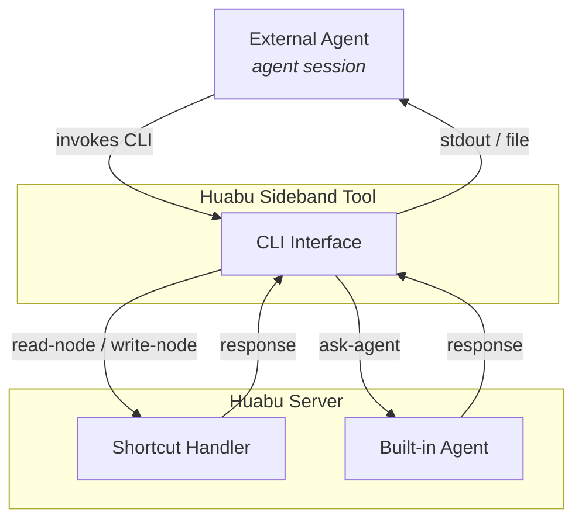

# Agent Sideband: External Agent Access to Huabu

## Overview

Huabu is a shared workspace for both human users and AI agents. Agents can be **internal** (built-in agents working within Huabu) or **external** (agents running outside of Huabu but interacting with it). Giving external agents full access to the workspace — including node contents, spatial/visual canvas information, and interaction history — is crucial for them to understand user intentions and provide effective assistance.

External agents connect to Huabu through **agentlet**, a lightweight ACP (Agent Client Protocol) bridge. The agentlet daemon (analogous to `kubelet` for Kubernetes) runs on a remote machine (or the same machine) and spawns agent sessions on behalf of Huabu.

The **primary channel** between Huabu and an external agent is the ACP prompt→response flow: Huabu sends prompts, the agent responds with messages that appear on the canvas.

The **Agent Sideband** is a parallel, out-of-band channel that enables external agents to read from and write to the Huabu canvas and workspace — operations that don't fit naturally into the sequential prompt flow. The term "sideband" is borrowed from networking/hardware, where it refers to an auxiliary channel running alongside the main data path for control and metadata operations.

## Motivating Example

On the Huabu canvas, there is a `note` node (`node-id-123456`) containing a user's idea for a new project feature. The user spawns an external agent session (`session-id-7890`) via the agentlet daemon on a remote machine with the project's development environment. The agent is instructed to read the content of `node-id-123456` and implement the feature.

Typical sideband interactions:

1. **Read**: The agent reads the content of `node-id-123456` through the sideband to understand the feature request.
2. **Write + Link**: After implementation, the agent writes a summary to a new node on the canvas and links it back to `node-id-123456`.
3. **Context gathering**: The agent queries neighboring nodes and interaction history around `node-id-123456` for additional context (via a built-in agent).

All three interactions are initiated by the external agent through the sideband.

## Design Choices

### Transport: CLI-first

For the sideband transport, we adopt a **CLI-first approach** — the Huabu Sideband Tool (HST) is a standalone script that the external agent invokes via shell commands, analogous to how one uses `curl` to interact with HTTP APIs.

**Why CLI over MCP for sideband:**

| Consideration | MCP | CLI |
|---|---|---|
| Setup | Zero-install, JSON config | Requires script distribution |
| Sync/Async | Sync only (blocking tool calls) | Both sync & async, streaming |
| Flexibility | Fixed request-response | Rich interaction patterns |
| Agent support | Widely supported | Universally supported |

While MCP is excellent for simple synchronous operations, the sideband needs to support potentially asynchronous agent-to-agent communication. CLI provides the flexibility needed while remaining universally supported by agent harnesses. The distribution cost is mitigated by bundling HST with the agentlet daemon.

### Interaction Model: A2A Skeleton + Shortcuts

The sideband exposes two types of commands:

- **Shortcuts**: deterministic, server-handled CRUD operations (fast, no LLM reasoning)
- **Built-in agent commands**: natural language requests routed to built-in agents with full canvas context (flexible, semantic)

The external agent doesn't need to decide the routing — the command name itself determines whether it's a shortcut (`read-node`, `write-node`) or an agent request (`ask-agent`).



**Why this hybrid:**

- Shortcuts cover the high-frequency, deterministic operations (~80% of sideband calls) with minimal latency and zero LLM cost.
- Built-in agents handle the long tail of complex, semantic operations (spatial reasoning, multi-node queries, context understanding) without bloating the shortcut surface.
- The shortcut boundary is intentionally minimal: **if it takes an explicit ID and does one atomic CRUD operation, it's a shortcut. Everything else goes to `ask-agent`.**

## Agentlet Sideband Setup

The agentlet daemon prepares the sideband environment for each spawned agent session:

### Environment Variables

| Variable | Description |
|---|---|
| `AGENTLET_SIDEBAND_DIR` | Directory containing the HST script(s) |
| `AGENTLET_TOKEN` | Authentication token for the Huabu server. Also serves as user identification (per-token access scoping, consistent with existing Huabu auth design). |
| `HUABU_CANVAS_ID` | The canvas ID that this agent session is scoped to. Injected at spawn time from the `sessionSpec`. HST reads this automatically so commands don't need a per-call `--canvas` flag. |
| `HUABU_SERVER` | Base URL of the Huabu server (e.g., `http://localhost:3001`). Required — HST uses this to construct API request URLs. |

### Script Distribution

The HST source lives in the Sediment (Huabu) project. The Huabu server serves it as a ZIP package via `GET /api/sideband/tools` (see Daemon API below). The agentlet daemon downloads and extracts it to `${AGENTLET_SIDEBAND_DIR}` on first session spawn (or at daemon startup), ensuring the script version always matches the running server's API. ETag-based caching avoids redundant downloads. Future: auto-update when the server is upgraded.

### Agent Prompt Injection

When spawning an external agent session, Huabu includes a short usage description of the sideband commands in the agent's system prompt. This eliminates discovery overhead — the agent knows how to use the sideband from the start.

## Huabu Sideband Tool (HST)

### Invocation

```bash
node ${AGENTLET_SIDEBAND_DIR}/huabu-sideband-tool.mjs <command> [args...]
```

The HST automatically reads `${AGENTLET_TOKEN}` for authentication. Machine-consumable results are printed to stdout; metadata and errors go to stderr. Non-zero exit codes indicate failure. Use `--help` or `-h` on any command for usage details.

### Commands

#### Shortcuts (deterministic, server-handled)

**`read-node`** — Read node content to a file

```bash
node ${AGENTLET_SIDEBAND_DIR}/huabu-sideband-tool.mjs read-node [--output-dir <folder>] <node-id>
```

- `--output-dir` is optional; defaults to the current working directory.
- Saves the node content to `<folder>/<node-id>.<ext>`, where `.<ext>` is automatically determined by HST based on the node's type (e.g., `.md` for note, `.html` for web).
- **stdout**: the saved file path (one line) — usable directly in shell composition.
- **stderr**: node metadata (`type=<type> size=<bytes>`).

**`write-node`** — Create or update a node

```bash
# Create a new node
node ${AGENTLET_SIDEBAND_DIR}/huabu-sideband-tool.mjs write-node --type <type> [options] <path-to-content-file>

# Update an existing node
node ${AGENTLET_SIDEBAND_DIR}/huabu-sideband-tool.mjs write-node --id <node-id> [options] <path-to-content-file>
```

- `--type <type>`: create a new node (e.g., `note`, `web`). Returns the new node id to stdout.
- `--id <node-id>`: update an existing node. Overwrites current content directly.
- Only one of `--type` or `--id` may be specified.
- **stdout**: the node ID (created or updated).
- **stderr**: action metadata (`action=created|updated nodeId=<id>`).

**Additional options:**

| Option | Description |
|---|---|
| `--link-to <node-id>` | Link the new/updated node → specified node |
| `--link-from <node-id>` | Link the specified node → new/updated node |
| `--notify` | Fire-and-forget notification to the default built-in agent for canvas positioning. Non-blocking. (Future: `--notify-to <agent-id>` for targeting a specific agent.) |

#### Built-in Agent Commands (semantic, LLM-mediated)

**`ask-agent`** — Query a built-in agent

```bash
# Inline prompt
node ${AGENTLET_SIDEBAND_DIR}/huabu-sideband-tool.mjs ask-agent "<prompt>"

# Prompt from file (@ convention, like curl -d @file)
node ${AGENTLET_SIDEBAND_DIR}/huabu-sideband-tool.mjs ask-agent @path/to/prompt.txt
```

- Sends a natural language prompt to a built-in agent with full canvas context.
- The built-in agent can perform complex reasoning: spatial queries, semantic search, multi-node operations, neighbor discovery, interaction history lookup, etc.
- If the argument starts with `@`, the prompt is read from the specified file (useful for long or multi-line prompts).
- In v1, a single default built-in agent handles all requests. (Future: `--agent <agent-id>` for targeting a specific agent.)
- Response is printed to stdout.

### Sync/Async Behavior

All HST commands are **blocking** — they run until the operation completes, then print the result and exit. This is the same model as `curl`: the caller waits for the response, however long it takes.

This works because modern agent harnesses (Copilot CLI, Claude Code, Cursor, etc.) already handle long-running CLI commands gracefully — they start the command synchronously, and if it exceeds an internal timeout, the harness automatically promotes it to a background task and retrieves the output later. The harness, not the HST, is responsible for managing timing.

This means:
- HST does not need `--timeout`, `poll-result`, or explicit async modes.
- The interface stays maximally simple (single blocking call per command).
- Agent harnesses that support streaming CLI output will naturally benefit if HST streams partial responses in the future.

### Error Handling (v1)

All error cases produce a descriptive message on stderr and a non-zero exit code:

- Node not found
- Invalid or expired token
- Network failure
- Target node deleted during operation
- Notified agent offline or not found

No automatic retry or recovery in HST — the external agent decides how to handle errors.

## Known Issues & Future Work

- **Concurrency / versioning**: `write-node --id` currently overwrites without conflict detection. An ETag-based CAS mechanism (`--expect-version` flag) should be added for concurrent edit scenarios. This is interface-compatible — no breaking changes when added.
- **Target agent identification**: Both `write-node --notify-to <agent-id>` and `ask-agent --to <agent-id>` need a way to specify a target built-in agent. This requires defining agent identification (agent-id vs agent-template-id), discovery mechanism, and routing logic. For v1, all requests go to the single default built-in agent.
- **Structured output**: v1 uses plain text output (curl-style). A `--format json` flag can be added later if needed for programmatic consumption.
- **Script versioning**: v1 guarantees script existence via bundled installation. Auto-update mechanism TBD.
- **Push notifications (server→agent)**: Currently all sideband communication is agent-initiated. Server-push (e.g., "node X was edited by another user") is a future consideration.

## Implementation Plan

### Component: Huabu Sideband Tool (HST)

The standalone CLI script (`huabu-sideband-tool.mjs`) running in the external agent's environment. The source lives in the **Sediment (Huabu) project** since it's a thin client tightly coupled to the server's sideband API — keeping them in the same repo ensures API and client stay in sync. The script is shipped as a build artifact that the agentlet daemon bundles during installation.

- [x] CLI argument parser: command routing (`read-node`, `write-node`, `ask-agent`), flag parsing, `--help` / `-h` support
- [x] `read-node` implementation: call server API, write content to `<output-dir>/<node-id>.<ext>`, print file path to stdout, metadata to stderr
- [x] `write-node` implementation: read content file, call server API (create or update), print node id to stdout, action metadata to stderr
- [x] `write-node --link-to` / `--link-from`: include link creation in the write request
- [ ] `write-node --notify`: include notification flag in the write request (pending server-side support)
- [x] `ask-agent` implementation: send prompt (inline or `@file`) to server API, print response to stdout
- [x] Auth: read `${AGENTLET_TOKEN}` from env, attach to all HTTP requests
- [x] Error handling: map HTTP errors to stderr messages + non-zero exit codes
- [x] Package as standalone `.mjs` with zero external dependencies

### Component: Huabu Server

New REST API endpoints for sideband operations, grouped by consumer.

#### Daemon API (consumed by agentlet daemon)

**`GET /api/sideband/tools`** — Download HST tool package

| Field | Value |
|---|---|
| Auth | `Authorization: Bearer ${AGENTLET_TOKEN}` |
| Response | `application/zip` — ZIP archive containing the HST script(s) |
| Headers | `ETag: <version-hash>` — for cache validation |
| Conditional | `If-None-Match: <hash>` → `304 Not Modified` if unchanged |
| Errors | `401` invalid token |

The agentlet daemon calls this endpoint to fetch the latest HST tools and extracts the ZIP directly to `${AGENTLET_SIDEBAND_DIR}`. ZIP format is chosen for cross-platform compatibility (natively supported on Windows, macOS, and Linux).

In v1, one daemon connects to one Huabu server, so no namespace/subfolder isolation is needed. Future: if multi-server support is added, tools can be extracted to `${AGENTLET_SIDEBAND_DIR}/<server-id>/`.

#### HST API (consumed by the HST script itself, not involving agentlet daemon)

**`GET /api/canvas/:canvasId/nodes/:nodeId/content`** — Read node content (existing endpoint)

| Field | Value |
|---|---|
| Auth | `Authorization: Bearer ${AGENTLET_TOKEN}` |
| Response | `{ nodeId, type, content, ... }` |
| Errors | `404` node not found, `401` invalid token |

**`POST /api/canvas/:canvasId/execute`** — Create/update node + link (existing endpoint)

| Field | Value |
|---|---|
| Auth | `Authorization: Bearer ${AGENTLET_TOKEN}` |
| Body | `{ commands: CanvasCommand[], originator }` — HST constructs appropriate add-node/edit-content/add-edge commands |
| Response | `{ canvasId, fromVersion, toVersion, deltas, results }` |
| Errors | `401` invalid token, `404` canvas not found |

Note: HST translates its CLI flags (`--type`, `--id`, `--link-to`, `--link-from`, `--notify`) into the appropriate `CanvasCommand[]` array internally. The external agent never sees `CanvasCommand` directly.

**`POST /api/sideband/ask-agent`** — Send prompt to built-in agent

| Field | Value |
|---|---|
| Auth | `Authorization: Bearer ${AGENTLET_TOKEN}` |
| Body | `{ prompt, canvasId }` |
| Response | `{ response }` (plain text from the built-in agent) |
| Errors | `401` invalid token, `503` agent unavailable |

> **TBD (implementation detail):** The server internally consumes `runAgent()` (an `AsyncGenerator<StreamEvent>`) and must decide how to surface the result to HST — options include buffered JSON response, chunked transfer, or SSE. This does not affect the HST CLI interface (HST always prints final text to stdout). To be resolved during implementation.

#### Server-side work items

- [ ] Add Bearer token auth as an alternative to Basic Auth (Fastify `preHandler` hook that accepts either) — enables HST to call existing canvas endpoints
- [ ] Implement `POST /api/sideband/ask-agent` — new endpoint that calls `runAgent()` internally, scoped to a sideband-appropriate tool set
- [ ] Implement notification dispatch: after execute with `notify` flag, fire-and-forget internal event to built-in agent
- [ ] Serve HST tool package: `GET /api/sideband/tools` with ETag caching
- [ ] Error responses: ensure existing endpoints return consistent `{ message }` format for HST consumption

### Component: Huabu (Host App)

The host application that orchestrates agent sessions and canvas interactions.

- [ ] Prompt injection: include sideband usage description in the agent's system prompt when spawning an external agent session
- [ ] Node ID embedding: pass referenced node IDs into the agent's initial context
- [ ] Pass `HUABU_CANVAS_ID` and `HUABU_SERVER` via `sessionSpec.env` when spawning an external agent session

### Component: Agentlet Protocol (`@agentlet/protocol`)

Shared protocol definition between agentlet server and daemon.

- [x] `env?: Record<string, string>` field already exists on `SessionSpec` — used to pass host-app-specific environment variables into the spawned agent process

### Component: Agentlet Daemon (worker-side)

The daemon running on the remote machine that spawns agent processes.

- [ ] Environment setup: set `AGENTLET_SIDEBAND_DIR` for each spawned session; `AGENTLET_TOKEN` is already available from the daemon's own `--token` startup argument and injected into the spawned process env if not already set
- [x] `env` forwarding: agentlet daemon already merges `sessionSpec.env` (including `HUABU_CANVAS_ID`, `HUABU_SERVER`) into the spawned process environment
- [ ] Script download: fetch HST script from `${HUABU_SERVER}/api/sideband/tools` and save to `${AGENTLET_SIDEBAND_DIR}` (on first spawn or at daemon startup)

### Component: Built-in Agent (Huabu-side)

The default built-in agent that handles `ask-agent` requests and `--notify` events.

- [ ] `ask-agent` handler: receive natural language prompt, execute with full canvas context, return response
- [ ] Notification handler: receive write-node notification, decide canvas positioning, create layout/links
- [ ] Canvas context access: read nodes, edges, spatial info, interaction history for reasoning
