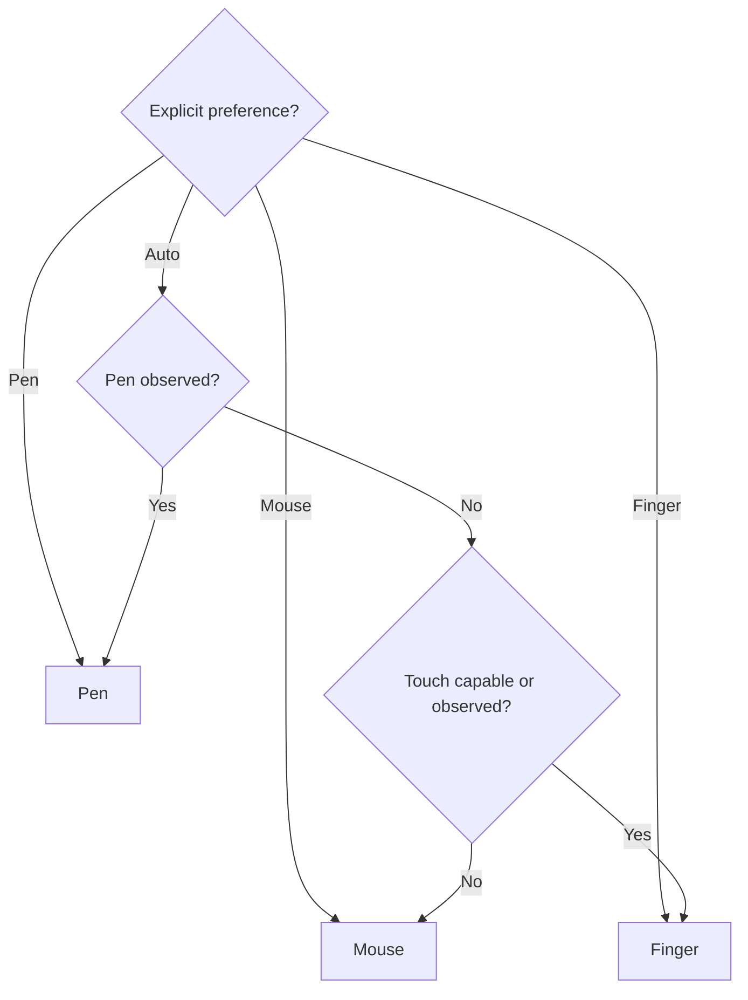
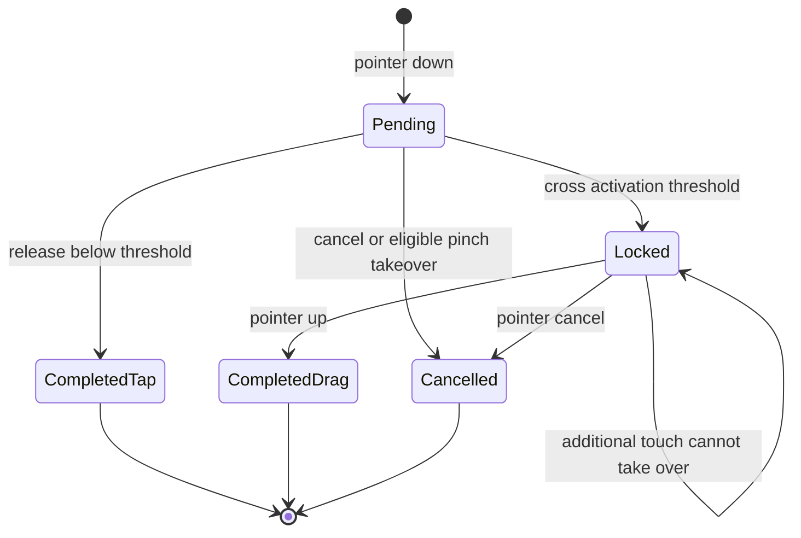
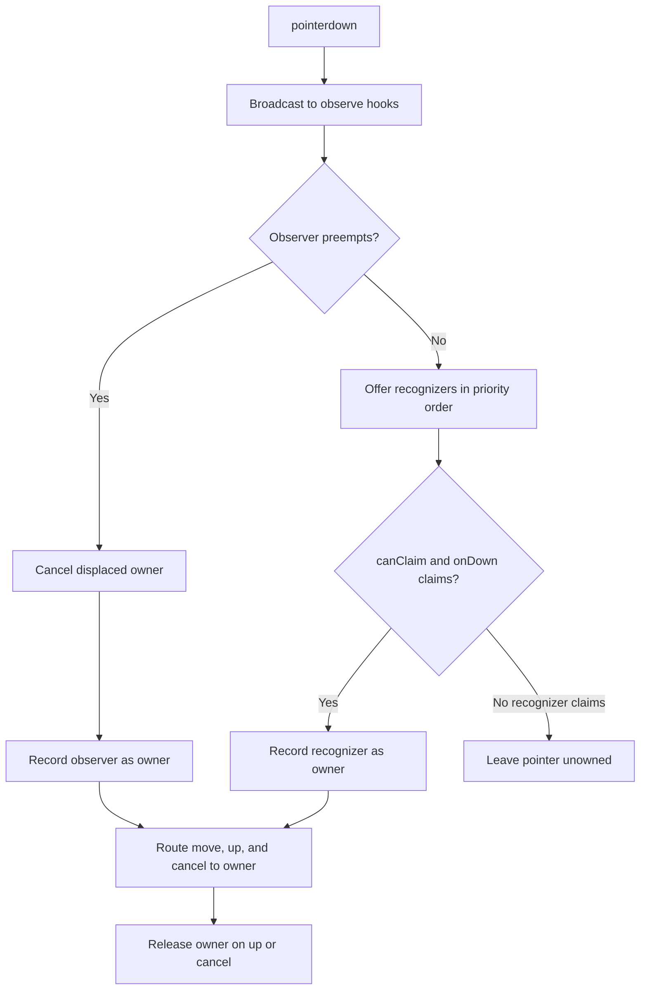

# Canvas Input Interactions

> The single, complete reference for canvas gestures across mouse, touch, and pen.
> Sections 1–5 define the interaction contract (the rules), section 6 describes the pointer-router mechanism that delivers it, section 7 is the validation boundary, and the appendix places the model against mainstream whiteboard and note apps.
> Last updated: 2026-09-18

## 1. Input preferences

Canvas input uses one persisted preference in `toolStore`, plus a reactive signal that tracks the pointer currently in use.

| Signal                     | Values                           | Responsibility                                                                                                                                                                                                       |
| -------------------------- | -------------------------------- | -------------------------------------------------------------------------------------------------------------------------------------------------------------------------------------------------------------------- |
| Input mode (persisted)     | `auto`, `mouse`, `pen`, `finger` | Gates which non-mouse pointers may reach the canvas and disambiguates whether pen or finger directly manipulates versus navigates.                                                                                   |
| Current pointer (reactive) | mouse vs touch/pen               | Drives UI density and pointer-appropriate affordances — toolbar contents, keyboard-shortcut hints, on-canvas delete buttons, resize-handle size, pan vs box-select, node draggability, and tap-versus-drag distance. |

Auto resolves to Pen after a trusted `pointerdown` reports `pointerType === 'pen'`; the resulting `penObserved` flag persists for the browser profile and origin. Before a pen is observed, Auto resolves to Finger when the browser reports touch capability or observes touch or pen input, and Mouse otherwise. Explicit Mouse, Pen, and Finger preferences always win and are never rewritten by observation.



The mouse is a precise, unambiguous pointer and always operates the canvas — it is never blocked by the input mode. The input mode only decides how the touchscreen and pen behave. Mouse mode additionally ignores touchscreen and pen input entirely: those pointers do not navigate, place nodes, draw Lasso or Sketch gestures, or manipulate content. Trackpad wheel gestures remain available because browsers expose them as wheel input rather than touchscreen pointer events.

The reactive current-pointer signal (`useIsNotMouse`) follows the most recent `pointerdown` so hybrid devices (e.g. Surface) switch between the desktop and touch experiences the instant the pointer changes. Mouse mode pins this signal to mouse because it ignores touch and pen.

## 2. Tool mapping

While the mouse is the current pointer, the toolbar keeps the Select, Pan, and Lasso tools and their existing mouse and keyboard behavior, including shortcut hints and badges.

Holding Space temporarily selects Pan. `useCanvasShortcuts` is the sole Space-pan keyboard owner; React Flow's `panActivationKeyCode` is disabled so its default listener cannot consume Space before Huabu updates the tool state used by the pointer router. If Space is released during an active mouse pan, Pan remains selected until the gesture's `mouseup` has completed so React Flow can tear down its native viewport-drag session before `panOnDrag` is reconfigured; releasing the mouse first keeps Pan selected until Space is released. Window blur and page hiding cancel this temporary tool state so a swallowed `keyup` cannot leave the canvas in Pan.

Temporary Space pan yields to already-handled events and keyboard-interactive targets through the shared `isKeyboardInteractiveTarget` predicate, also used by canvas search. Focused native buttons (including portalled toolbar type buttons), links, selects, editors, and button/menuitem roles retain their own keyboard behavior; Enter/Space activation stays native rather than being synthesized by toolbar handlers. Releasing Space still ends an existing temporary pan even if focus has moved to a control.

Mouse Pan also has a Canvas-bound release guard for temporary Pan, persistent Pan, and middle-button Pan. A matching `pointerup` synchronously dispatches a window-level fallback `mouseup` so React Flow's d3-zoom session removes its global move listeners before any queued pointer movement can move the viewport; the later native `mouseup` is harmless. The guard applies the same fallback when a later pointer move reports no pressed buttons, the pointer is cancelled, or the window loses focus.

While touch or pen is active, Select is the visible default tool and the safe home base: a tap selects an ordinary node and a drag on an already-selected ordinary node moves it, all through React Flow with no accidental ink. A finger treats Sketch as transparent for direct selection and drag, continuing hit-testing to an eligible ordinary node below it; deliberate Ink editing uses Lasso. Pan collapses to the internal direct-manipulation state and is hidden from the touch-first toolbar; Select and Lasso are the visible tools, and Sketch is an explicit sticky tool listed among the creation nodes. Pan shortcuts resolve to the internal Select state instead of creating hidden Pan state. Because the toolbar layout follows the current pointer rather than the persisted mode, a mouse and a finger used on the same hybrid device each get their native toolbar.

New empty canvases carry a one-shot input-appropriate creation intent: Mouse starts with Note armed, while Pen and Finger start with Sketch armed. This intent is consumed once, on the first completed load of a freshly created empty canvas. After it is consumed — and after any one-shot placement tool finishes on any canvas — the tool falls back to Select rather than re-arming Sketch, so a resting finger or pen can never accidentally draw or erase.

Lasso and Sketch remain explicit persistent modes across pointer and input-mode changes: once chosen they stay active until the user switches away. Lasso owns only empty-pane gestures, so activating it does not disable dragging nodes that were already selected before pointer down.

## 3. Direct manipulation

There is no canvas-wide interactivity lock. Dragging, connecting, selection, and touch-tap routing follow the active tool and input-mode policies directly; per-node movement restrictions remain unchanged.

Blue selection outlines remain visible while dragging nodes, drawing a mouse selection box, or holding Ctrl/Cmd to build a selection. Individual-node resize corners hide during those interactions. Multiple selected nodes instead share the bounding-box corners, which remain visible during box selection and Ctrl/Cmd selection, but hide while moving the selected nodes. Eligible corners return after movement or selection ends; the multi-selection bounding-box outline remains visible throughout. Box selection hides floating toolbars and per-node connection ports, even while only one node is inside the box. Normal locked-node, Frame-suppression, and collapsed-mark resize restrictions still apply.

Canvas owns one React Flow provider, and the canvas shell and node wrappers read its `userSelectionActive` flag directly; both native and custom marquee selection write that flag. The custom marquee activity callback only distinguishes its own auto-pan from native selection auto-pan. An already-started resize retains its controls until completion, even when Ctrl/Cmd is pressed mid-gesture, so hiding idle controls cannot detach the active gesture target. Multi-selection resize also finalizes on lost pointer capture through the same guarded path as pointer release and cancellation.

The single current-type button inside `NodeFloatingToolbar` doubles as a drag surface for all unlocked, movable node types, regardless of source availability, minimal presentation, or reader activation; there is no separate leading or shell-level grip. Existing toolbar mounting and suppression rules remain: sole selection is required, and Frame suppression, resizing, stroke-level selection, pending connection creation, and surface-level suppression still apply. Text/Note conversion is an explicit overflow command, disabled during ingestion or preview editing. The current-type button remains usable for dragging and focus exit during ingestion. Other toolbar controls and native content retain their own input behavior.

Type buttons reuse `useTakeoverMarkDrag` because the toolbar lives in `document.body`, outside native React Flow dragging. The hook uses shared pointer eligibility and activation distances and drives `onNodeDragStart` → `onNodesChange` + `onNodeDrag` → `onNodeDragStop`, retaining snapping, Frame previews/reparenting, persistence, and single-entry undo. Toolbar callers pass `enabled`, `soleSelectionOnly: true`, and `onActiveChange`, wire the returned pointer/capture handlers and `onClickCapture` to the same type button, and retain that captured DOM target and toolbar throughout their own gesture, including modifier-key Frame entry; ordinary body dragging still hides the toolbar. The hook rejects locked nodes, `draggable: false`, competing gestures, and disallowed input modes. Pointer cancel, lost capture, Escape, window blur, page hiding, disabling, and unmount release ownership; an active drag rolls back through `cancelActiveNodeDrag` without a drop. Type-button callers also suppress conversion after a cancelled pending press, before the drag threshold is crossed. Pressing a type button transfers focus out of native media/iframes; clicking the current-type button focuses the canvas root. Keyboard movement remains with existing canvas shortcuts, not a new button-specific command scheme.

Current-type buttons return focus to the canvas root on pointer click or native Enter/Space activation. Overflow conversion commands retain conversion ownership without that focus handoff. Menu commands execute before their enclosing overflow menu closes; the menu content then stops click propagation to React Flow node handlers, including clicks from nested submenu portals, without preventing native activation defaults. Settings panels remain open while values are edited.

Sole-selected embedded PDF readers and node toolbars own Arrow keys and Space through the shared `handleCanvasNavigationKey` bubbling boundary. It stops propagation without preventing the native default, preserving document scrolling, input caret movement, menu navigation, and button activation while preventing React Flow from interpreting descendant events as node movement. Interactive reader roots opt into `isKeyboardInteractiveTarget` with `data-keyboard-interactive`, so temporary Space pan and canvas search also yield. The boundary leaves Escape, other keys, and keyup to their existing owners; a pending Space pan can still end after focus changes. Direct keyboard movement from a focused selected node shell remains unchanged. Unselected/multi-selected PDF readers stay inert and do not claim keyboard ownership; expanded previews retain their existing behavior.

PDF and Web preview-card Retry buttons use the same navigation boundary for both source and cover-image failures. Arrow keys cannot move the enclosing node while Retry is focused; native Enter/Space activation, Escape focus exit, and keyup propagation remain intact. Their `nodrag`/`nopan` classes only govern pointer gestures and do not replace keyboard event ownership.

Escape uses a two-step focus exit through `useCanvasFocusEscape`: the first unhandled Escape from a focused selected node's content or its toolbar focuses the canvas root without changing selection or playback; a second Escape at the canvas root clears selected nodes through the existing `selectNodes([])` action. Pointer selection without content focus clears directly: the idle pane or a body-targeted Escape belongs to the active canvas only while the shared canvas-attention store reports canvas engagement and no modal is present. Chat and other surfaces retain their own Escape behavior. Child editors and menus retain first refusal, and active drag cancellation takes priority over focus exit. Tooltips dismiss on the same Escape without consuming an extra keypress before focus exit; menus and popovers retain exclusive Escape dismissal priority. The focus-exit policy does not intercept modified, repeated, composing, or fullscreen Escape events. Escape inside a cross-origin iframe cannot reach the parent canvas; clicking the toolbar's current-type button provides an explicit focus exit instead.

Video's inactive poster has a translucent overlay and a centered, localized Play button; selection alone never activates the player. Without a cover, the placeholder glyph is omitted beneath that action, leaving exactly one Play icon. Without an offered action, the fallback is a neutral Video glyph, with the no-source label retained when appropriate. Only the Play button owns poster input, through the existing video-control marker and canvas guards; the rest retains native node selection and dragging, including while selected. Clicking Play (or pressing Enter/Space on it) selects that node through the existing selection setter and starts playback in one gesture. The mounted player then owns native pointer, keyboard, wheel, and pinch-wheel interaction. Its toolbar type button moves the node without unmounting the player or revoking explicit playback intent. Deselecting, multi-selection, leaving the viewport, minimal presentation, Frame suppression, opening its preview, or replacing its source pauses/removes the player and forgets activation; returning shows the poster without resuming. A failed native play request is handled with a localized retry message. Expanded preview still mounts paused. Production browser coverage checks toolbar and poster dragging, persisted positions, one-step undo, cancellation recovery, native controls, explicit click/keyboard playback, and deselection at 50% and 100%, plus the single-icon poster at 200%.

While touch or pen is the current pointer, ordinary node objects are draggable only when they were selected before the render that precedes pointer down. An unselected-node gesture can therefore select the node but cannot move it during that same gesture; the next gesture can drag it. A finger never directly drags a Sketch or carries a selected Sketch in a mixed drag. The mouse drags ordinary nodes directly; Frame blank bodies under Select use the pre-press selection rule below. Pen behavior is unchanged. Dragging an already-selected ordinary member continues to use React Flow's existing multi-selection drag behavior.

Mouse Select uses one app-owned rectangular marquee gesture for both empty pane and the blank body of an unselected Frame. Eligibility reads the closest node and the canonical selection at pointerdown, before native selection can change it. A Frame already selected at that point retains native Frame/group dragging; a descendant node retains its own interaction rather than promoting the gesture to its ancestor. Frame title inputs, links, buttons, editable content, `nodrag`/`nokey` surfaces, connection handles, and resize controls retain their existing owners. There is no long-press timer and no always-body-marquee override.

The `mouse-marquee` recognizer captures the primary mouse pointer and suppresses compatibility mousedown only for its owned press. Selection remains unchanged while pending. Releasing below the shared 1 CSS px activation distance selects the starting Frame (Ctrl/Meta retains click-to-toggle) or clears selection for a pane start. Crossing the threshold starts a rectangle and replaces selection just like ordinary pane selection, including modifier-held drags. Frames require full containment, including equality at the boundary; ordinary nodes require positive-area partial intersection. The policy applies on every live move, viewport transform, and release, using the shared indexed absolute-position resolver underlying `getAbsolutePosition` and `getNodeSize`, including nested Frames. A fully enclosed Frame and its children all remain selected; no ancestor normalization or selection-cardinality rule is added.

The rectangle owner reuses `canvasGestureSession`, the pointer router, the existing selection auto-pan velocity policy, and React Flow's marquee paint and retained group-drag overlay. React Flow's native mouse Select rectangle recognizer is disabled, including its Shift shortcut in that mode; touch/pen and other tools retain their existing routing. The flow-space start stays fixed across pan and zoom, auto-pan reads capture-phase pointer movement even when the owner stops bubbling, and transform changes recompute membership without synthetic DOM events. Live ticks use the existing selection-change actions; release records the final selection once through `selectNodes`. Escape, pointer cancellation, lost capture, missing mouse buttons, blur, page hiding, disabling, and unmount clear the rectangle and restore the pre-gesture selection after activation; a pending cancel has no selection effect. Navigation clears ownership without restoring IDs from the previous canvas. Cancellation does not undo viewport navigation. Trailing pointer clicks are consumed, while a subsequent real press clears stale click suppression. Interactivity lock, Pan, Lasso, Sketch, pending creation, non-primary/middle-button input, and competing locked gestures cannot start this mouse owner.

Mouse rectangle selection and Lasso share `nodesInSelection` for membership and `createAreaSelectionSession` for live updates, one-time commit, and cancellation restoration. Ordinary nodes require positive-area intersection; Frames require full containment in the actual selection shape, including its boundary. A concave Lasso notch or self-crossing boundary through a Frame excludes that Frame even if all four corners lie inside the loop; selecting inside a Frame therefore selects only its intersected contents. Both paths resolve nested absolute positions, measured sizes, visible collapsed marks, and hidden/unselectable exclusions identically, preserving fully enclosed ancestors and descendants without normalization. Geometry lives in `selectionGeometry`; its even-odd point test is also used by Sketch stroke selection.

Both tools replace the previous selection during an activated drag, show live selection, and record only the release through `selectNodes`. They share `useAreaSelectionClickGuard` to consume compatibility mouse events and the trailing click after commit or cancellation; a new pointer press resets stale suppression. Lasso uses the same selection-in-progress chrome suppression as rectangle selection, but retains its polygon rather than a native rectangular group overlay on commit. Its intentional exception is Sketch: it selects individual captured strokes, never the whole Sketch node, while mouse rectangle selection selects whole nodes. Lasso cancellation restores nodes, edges, captured strokes, and the prior retained polygon; navigation does not restore the old canvas's selection. Escape, pointer cancellation, lost capture, missing buttons, blur, page hiding, disabling, and unmount cancel the gesture. A pending empty click clears both selection layers. Ink submission preparation reserves the current selection and prevents a new Lasso gesture.

Child Frames are frozen as complete nodes during an unmodified drag, regardless of whether the dragged node starts at the canvas root or inside another Frame. A node arriving from the canvas root can therefore enter a qualifying root Frame but cannot pass through it into a nested child Frame. Inside a structured Frame, passing over a sibling child Frame reorders the dragged node in the parent instead of nesting it into that sibling; the same nested-entry block applies inside free Frames. Holding Cmd on macOS or Ctrl on Windows/Linux explicitly enables nested Frame entry and selects the deepest qualifying Frame surface that physically contains the pointer. Exposed parent padding or header space therefore targets that parent, while pointing inside a nested child targets the child directly without allowing a deeper Frame to win from body overlap alone. A real modifier-state transition clears the previous frame and reflow preview immediately, invalidates its cached decision, and recomputes under the new mode on the next pointer move; repeated keydown events while the modifier remains held preserve the current preview. Drop-time fallback reads the current modifier state even when release occurs before that move. Space remains the stronger opt-out and preserves the current parent, including when the node is pulled away to expand a Hug Frame rather than leave it.

Frame ownership is pointer-first. With pointer coordinates, the deepest permitted Frame surface containing the pointer determines the target and the dragged body needs only positive contact with that surface; overlap percentage never overrides a pointer aimed elsewhere. The current parent is a no-op surface, an exposed ancestor surface moves the node upward to that ancestor, and leaving every ancestor targets the canvas root. The 50% overlap ratio remains only as a fallback for callers without pointer information. For synthetic portal and multi-selection drags, the positive-contact check prevents a pointer associated with one footprint from pulling a completely separate dragged body into a Frame.

Cross-Frame entry previews project the complete structural transaction. When removing the dragged node reflows its structured source parent, the target Frame branch is first moved to its projected source-layout position; the target's structured drop zone or free-frame fit preview is then calculated at that future absolute position. The transient reflow includes both the source parent's remaining direct children and the target Frame's affected children, so a nested Frame drop cannot preview against the target's old slot and jump on commit.

Drop commit follows the same inner-to-outer ownership order. Reparenting first computes the complete Hug fit for the source and target Frames, then emits geometry from that fitted tree, and finally reflows every affected structured ancestor. A free/Hug child Frame may therefore resize around its new child, but its position remains owned by the outer row, column, or grid track instead of drifting to the intermediate fit position after release.

Live drag preview and commit share `projectAffectedFrameGeometry` from the shared canvas engine. The preview constructs the future source membership without writing it to the canvas store, projects Hug fits and structured ancestors deepest-first, and publishes only changed non-dragged node geometry to `gesturePreviewStore`. `Canvas` folds those transient positions and sizes into React Flow at the render boundary, so a nested source Frame, its remaining children, and every structured ancestor display one coherent future tree rather than combining an updated outline with stale node bodies. Projection remains capped at one run per animation frame; unchanged geometry preserves the preview-store state identity and unrelated canvas nodes retain their object references.

Target entry uses the same future-tree contract. Free/Hug targets project a temporary reparent through the shared Frame hierarchy algorithm; structured targets run the drop-zone solver against the already-projected source tree, so a node promoted from a deeply nested descendant is not counted once inside its old ancestor footprint and again as the target's new direct child. The solver's exact Frame size and peer positions are then projected through the target's structured ancestors. Frame fit overlays are aligned back to the resulting entity geometry and carry only source/target emphasis, while the structured drop overlay communicates the intended row, column, or slot. Entities therefore represent the release result; dashed or tinted overlays represent intent, and the previous full geometry is not drawn concurrently.

Structured relayout normalizes every requested Frame set to deepest-first order inside the shared engine rather than trusting caller insertion order. Each Auto/Hug ancestor therefore observes the already-resolved size of its direct child in the same pass, including executor batches whose affected set lists the outer target before the nested source branch; a second relayout pass must never be required to stabilize ancestor height.

Drag preview geometry merges each store node with the live React Flow drag node before frame detection and structured-layout solving. Each source is read through the shared `getNodeSize` contract, with the live drag measurement preferred over the store snapshot and the node-type default used only for a still-missing axis. This keeps content-sized Text and Question nodes eligible for frame previews while their asynchronous store measurement is missing or stale, instead of producing a zero-height footprint that suppresses the preview.

Direct-manipulation gestures use a shared screen-space activation policy: touch locks after 8 CSS px, pen after 4 CSS px, and mouse after 1 CSS px. React Flow receives the distance for the current pointer for both node drag activation and click tolerance, while custom pan, mouse marquee, Lasso, and Sketch paths choose by each event's pointer type through `canvasGestureSession` and transition from `pending` to `locked`.

Image and Video nodes preserve their current aspect ratio for direct resize-handle gestures, multi-selection resize gestures, Frame resize cascades, and toolbar width/height edits. A multi-selection containing Image, Video, Text, or Question anywhere in its resize snapshot, including descendants of selected Frames, forces one uniform geometry scale for the entire selection. Text/Question fonts scale from the immutable gesture-start font by each node's new/start outer-width ratio, without fitting or rounding. A Hug Frame with a direct Image, Video, Text, or Question child likewise uses a uniform Frame scale; Text/Question child content scales proportionally through the existing cascade. Direct Manual Frame resize continues to change only its own box and leaves children unchanged; a selected Frame in a multi-selection still participates with its descendant subtree. The single-node resize session normalizes every aspect-locked live proposal against the gesture-start ratio before mirroring it into React Flow or committing it, and the toolbar geometry resolver derives the unedited axis from each media node's current rendered size.

Uniform group geometry is not strict whole-scene visual scaling when a Note is included. Note container resizing is unchanged: its typography and padding stay fixed in canvas units, and its document reflows or scrolls under the existing height policy rather than scaling its font with Text/Question or media.

Text and Question nodes use ordinary native transparent left/right line controls, matching other nodes' transparent edge controls, with no visible side bars or width-grip overlay. Selected by `isAlwaysAutoHeightNodeType`, these controls use `width` mode with `resizeDirection="horizontal"` and reuse the native width-only resize session: dragging preserves the captured font and reflows content-driven height. In this mode the live resize mirror writes only their width and never pins the gesture's stale input height into `style` or `measured`. Because XYFlow's internal measurement can remain at that input height while a resize is active, the single-node selection HUD observes the rendered node border box for these content-height types and follows its intrinsic reflow before pointer-up. Both types also expose restored aspect-locked corner controls and corner HUD paint in `scale` mode; neither exposes top/bottom height controls. Their `useTextAutoSize` proportional policy scales the stored `data.style.fontSize` and base padding together, using Text's 16px default or Question's `QUESTION_NODE_DEFAULT_FONT_SIZE` (24px) when no valid font is stored. Corner scaling uses the new/start outer-width ratio without fitting or rounding, while settled height is content-driven and not persisted. Existing Question font values are respected without automatic persisted-data migration. Text retains toolbar font editing; Question exposes width reflow and a Scale percentage control based on its 24px default, preserving the width/font ratio through `SET_QUESTION_CARD_SCALE`. The separate 28px card artwork basis controls proportional chrome, not the toolbar percentage. Undo/redo and other node types' controls are unchanged.

Corner resize grips paint in a pointer-transparent Canvas HUD above selection outlines, using the same layer pattern as connection ports; no selection stroke cuts through the grip. Idle connection circles and resize squares share `NODE_CONTROL_CHROME` dimensions: equal screen-space diameter/side length (8px for mouse, 14px for touch/pen). Connection circles use opaque `info-light` fill without a border; resize squares use `NODE_RESIZE_GRIP_STYLE` with opaque `surface` fill and a 1.5px `info` border inside the same outer dimensions, distinguishing outlined resize controls from solid connection dots without letting the selection stroke show through. Each square's inward corner touches the rounded selection outline's outer arc at 45 degrees. `NodeResizeControls` shares one `useRenderedNodeGeometry` measurement between HUD paint and native hit regions, including Question's font-scaled custom radius and live content-height reflow; before measurement, both use the same `nodeSelectionGeometry` fallback. Native hit regions remain 20×20px for mouse and 28×28px for touch/pen, including above 100%. Native XYFlow controls retain gesture ownership; their asymmetric auto-scaling is disabled and the shared screen-space geometry is converted into node-local positions and hit dimensions using the live zoom. The connection hover `+` retains its larger size and `info` emphasis fill.

Single- and multi-selection reuse the store-free `SelectionOutline` and `ResizeGrip` painters in `Panels/Canvas/selectionChrome`, with stroke color/width, grip paint, and pointer-specific dimensions defined in `nodeInteractionChrome.ts`. Per-node outlines use an opaque 1.5px `info` stroke for every node type, including Sketch, without a glow. Ordinary outlines use a zero-blur outer box-shadow spread and resize grips use an inset spread, avoiding Chromium's fractional border/outline-width snapping while preserving grip outer dimensions. Their rounded geometry still scales with the node shell; resize grip dimensions do not. Collapsed-mark outline morphing retains its CSS outline and offset.

The multi-selection rectangle fits the existing `getSelectionBounds` union exactly, with no extra padding and no layout border. It uses a straight-corner SVG dashed stroke with the same 1.5px `info` paint, avoiding CSS outline-width snapping. Individual selected-node outlines remain visible. Four surface-filled, outlined square grips sit centered on the union corners, using the same 8px mouse / 14px touch-and-pen paint and transparent 20px / 28px hit regions as single selection. Both are screen-space overlays; viewport zoom never scales their stroke, dashes, or grip dimensions. Shared painters own no stores or gesture handlers: native XYFlow controls still own single-node resizing, while `MultiSelectResizer` retains group bounds, subtree scaling, pointer capture, and one-gesture undo.

XYFlow's retained `.react-flow__nodesselection-rect` remains mounted and focusable for native keyboard group movement, but its background, border, and shadow are suppressed so it cannot paint a second selection box over the HUD or a selected Frame. While Mouse Select marquee is enabled, `data-mouse-marquee` makes only that retained rectangle pointer-transparent: empty pane gaps inside the old union and unrelated unselected Frame bodies reach the existing marquee owner, while actual selected Frame/node bodies retain XYFlow's native multi-selection dragging and children/controls retain their own target priority. No selection is cleared on pointerdown; the existing activation snapshot and Escape restoration apply unchanged. Non-mouse input, other tools, pending creation, and interactivity lock retain native overlay hit-testing. The live marquee `.react-flow__selection` retains its paint. Selection membership is unchanged: selecting a Frame together with its descendants still produces a Frame outline, and child-only selection uses their absolute union, not the parent Frame bounds.

Multi-selection HUD visibility depends on the number of selected nodes, not the number of ancestor-deduplicated resize roots. A selected Frame plus selected descendants therefore retains the outer dashed selection rectangle and four grips even when there is only one resize root. Bounds include every selected node, matching the toolbar; only the resize snapshot removes selected descendants from the root list so each subtree is scaled once.



The shared values define only the tap-versus-drag activation gate. Feature-specific quantities retain their separate meanings, including Lasso point sampling and minimum polygon span, Frame minimum creation size, Sketch merge distance, eraser radius, and Smart Snap distance.

Locked selected roots do not participate in multi-selection resize geometry. Resizing an unlocked selected Frame continues to cascade through its subtree as one coordinate-space operation.

In Finger mode, one-finger touch on empty canvas owns a pending viewport gesture: releasing below the touch activation distance clears the current whole-node selection and retained Lasso stroke selection, while crossing the distance locks and pans without clearing selection. Empty-canvas ownership is determined by excluding ordinary nodes and React Flow panels rather than requiring a particular React Flow pane descendant, so Background and other non-interactive canvas layers remain pannable. Painted Sketch content is transparent to finger selection: the recognizer owns that touch, excludes every Sketch from the shared screen-point hit-test, and selects the topmost eligible ordinary node below it or applies empty-Canvas dismissal when none exists.

Multi-selection resize hit regions (`data-multi-resize-control`) and their descendants are control-owned targets for the capture-phase pointer router, like panels. Touch navigation must not claim a press on these controls before their resize handler receives it.

Text/Question proportional corner gestures keep height renderer-owned during movement as well as after release. Like width-only reflow, the resize mirror updates width but does not pin the pointer-proposed height into `style`; the sizing hook derives height from the live font and content.

Resize test coverage is layered: resolver, sizing-hook, geometry, and store tests verify exact calculations and history contracts; real Canvas Playwright flows verify hit-testing, mouse/touch manipulation, unclipped content, persistence, and undo/redo. The injected Question fixture is tagged `@component` because it tests browser layout and animation without a complete Canvas lifecycle. Multi-selection DOM comparisons sample related bounds in one browser execution. React Flow measures dimensions with integer `offsetWidth`/`offsetHeight`, so comparisons against fractional rendered bounds allow `0.5 * zoom + 0.02` CSS pixels for measurement quantization and layout rounding; control-local alignment, fixed anchors, and viewport ownership are checked separately.

The canvas root suppresses browser long-press callouts and native context menus on non-editable interaction surfaces so they cannot interrupt Pan, Lasso, Sketch, or node manipulation. While a finger or pen is the current pointer (`[data-canvas-root][data-not-mouse]`) it also disables text selection (`user-select: none`), so a drawing/pan/drag gesture that crosses node or panel text cannot select it and pop the iOS copy callout; the mouse keeps text selection so desktop users can still copy node text. Text inputs, selects, editable content, and real links retain their native context menus and remain selectable.

The React Flow interactivity lock applies to native and pointer-router interaction paths alike. While locked, node dragging, Lasso selection, retained Sketch-selection movement, and touch tap selection are disabled; viewport pan and zoom remain available, matching React Flow's native lock behavior. Creation tools remain governed by their own active-tool state rather than the interactivity lock.

In Pen mode, pen input manipulates on-canvas nodes and content while touch input is intercepted before React Flow selection and drives viewport navigation. Touch remains available to application chrome inside React Flow panels. A finger tap that never locks into a pan doubles as selection: on a pending release the `viewport-navigation` recognizer resolves the topmost non-Sketch node under the touch-down point through the shared `nodeIdAtScreenPoint` hit-test and selects it (or clears the selection on empty canvas). Because that hit-test walks node bounding boxes rather than the DOM target and explicitly excludes Sketch IDs, it works even when either the full-screen Sketch overlay or painted Ink covers the ordinary node, so the pen keeps drawing while the finger picks non-Ink nodes and navigates.

Still in Pen mode, a finger that presses an **already-selected non-Sketch node** and drags moves the non-Sketch members of the current selection, while the pen keeps drawing. The dedicated `node-drag` recognizer excludes Sketch IDs from both point hit-testing and its gesture set, is offered before `viewport-navigation` so it wins the eligible selected-node case, and is gated to `inputMode === 'pen'`. It cannot delegate to React Flow because node dragging is disabled and the overlay covers the nodes while Sketch is armed, so it drives the move through the store's existing drag lifecycle (`onNodeDragStart` → `onNodesChange` position ticks → `onNodeDragStop`), keeping smart-snap, frame re-parenting, autosave, and single-entry undo identical to a mouse or pen drag. A finger on Ink, an unselected ordinary node, or empty canvas falls through to tap-select / pan, and while the drag's snap session is active a second finger can neither pinch nor claim a competing pan (`canTouchClaimViewport` and `canTouchTakeOverForPinch` both reject it).

Click-to-place creation tools such as Note, Text, and Question always accept a mouse click through the pane click handler. Non-mouse placement uses an explicit primary Pointer Events tap gated by the input mode: Pen accepts the pen tip and rejects touch placement; Finger accepts touch and rejects pen placement; Mouse mode rejects both. Placement starts only from empty canvas surfaces and is cancelled when movement reaches the pointer's activation distance.

The four connection ports on a node are the single control for both connecting and creating. A drag that lands on another node connects the two; a drag released on empty canvas creates a connected node at the release point; a plain click on a port creates a connected node auto-aligned off that side, nudged perpendicular until it clears existing nodes. All three cases are resolved in one place — React Flow's `onConnectEnd` — because a click on a port is simply a connect gesture that ends back on its own source node. This requires `connectionDragThreshold={0}`: React Flow otherwise waits for the pointer to travel 1px before a connection counts as started, and a click that never moves would end without firing `onConnectEnd` at all. It also requires `connectOnClick={false}`, which disables React Flow's built-in click-to-connect: that feature arms a pending handle on the first port click and completes a connection on the next one, so two unrelated create gestures on different nodes would silently link them together. The gesture decides the geometry, and a small type picker (`ConnectedNodePicker`) then decides whether the new node is a Note or a Question. Releasing the drag tears down React Flow's own connection line, so the picker redraws the pending edge itself and holds it on screen until a type is chosen — otherwise the popover would read as "a menu opened" rather than "this edge still needs a node at its end". It is painted as the finished edge, not as a dashed hint: stroke, width and arrowhead all come from running the real creation style through `applyEdgeStyle`, so committing the pick changes what the edge is attached to rather than what it looks like. A port click needs no such tether, because the source and the release point coincide.

Progressive disclosure keeps that control quiet. The four solid dots appear only after a node becomes the sole selection, for mouse, pen, and touch alike; hovering an unselected node never reveals them during idle interaction, and multi-selection hides every per-node port. Each painted centre sits 16 CSS screen px outward from its side's boundary at every zoom; the enlarged hit area moves independently with it, while the always-mounted, zero-thickness React Flow handles keep committed edge endpoints on the actual node border (or the existing takeover-mark boundary). Idle dots and the hot `+` share one HUD painter and the same outward offset; collapsed paint and hit geometry use the same live-zoom rect. During an active connection drag, only the node under the pointer temporarily reveals its target ports; releasing anywhere on that node still connects through the node-level fallback in `onConnectEnd`, so the user does not need to hit a port precisely. Only the dot the pointer is actually aiming at grows and shows a `+`, without changing React Flow's handle bounds. The hit element remains a descendant of its source node, preserving both drag-connect bubbling and click-create's side-aligned release classification. While the picker is open the source port is pinned to that grown state through [`connectPortStore`](../../apps/web/src/store/connectPortStore.ts), because the selection or pointer may change while the picker is open, which would otherwise hide the `+` the user just pressed. The optional `NodeConnectionHandles.resizing` flag defaults to `false`; when supplied as `true`, it hides all port paint, including pinned and active-source overlays, disables pointer and keyboard activation and React Flow connection starts/ends, and retains every handle for edge measurement. That pending gesture is a store rather than a React context wrapped around `<ReactFlow>`: node components are React Flow's descendants, so a provider would re-render every node whenever the value changed and would nest the whole canvas subtree a level deeper for a single nullable record.

`NodeConnectionHandles` resolves one boundary for native handles, HUD paint, and keyboard creation anchors. Selected nodes, hovered connection targets, and pinned connection sources use `useRenderedNodeGeometry` to measure the visible surface and its actual layout-border offsets, including the zero-border PDF/Web reading state. Hidden ordinary controls use model geometry and the node-type border policy without DOM observers or viewport subscriptions; their zero-thickness native anchors remain mounted at boundary midpoints, while fixed-screen hit sizing resumes when controls become active. Collapsed nodes consume the published `blendedMarkRect` without reconstructing the mark's size. The owner converts this boundary into local handle coordinates and screen-space HUD coordinates. Cached handle refreshes depend on local dimensions, mark offsets, border offsets, and handle size rather than ordinary screen translation; requests are deduplicated per React Flow instance over an animation frame and passed to its native batch update. Unmounting cancels pending requests. Active surface style and presentation changes are observed even when the outer dimensions remain unchanged.

The single-node toolbar reuses the port geometry in `nodeInteractionChrome.ts`: its boundary gap is 28px for mouse, leaving 2px beyond the centered 20px port hit area, and 45px for pen/touch, leaving 8px beyond the outward-expanded hit area. These are fixed screen pixels at every zoom. The shared floating popover retains this gap when it flips below the node and shifts horizontally within the canvas. Multi-selection and edge toolbars keep their existing spacing.

The connected-node type picker also uses the shared 28/45px clearance after a port click or keyboard activation, rather than a 12px gap from the release point. This keeps the pinned `+` exposed for releases anywhere inside the port hit area and when the picker flips below its anchor near the canvas top. Drag-to-empty-canvas pickers retain their 12px release-point gap and pending edge.

The port's hover tooltip remains anchored to the zero-thickness boundary handle. Its gap includes the absolute vertical paint offset plus half the hot circle diameter and 8 screen px, so the outward `+` is not covered. Bottom ports prefer a tooltip below; other ports prefer above, with the same clearance retained when Floating UI flips placement.

The press area is larger than the painted circle. Mouse uses a centered 20px target around the unchanged 16px-outward circle center, leaving 6px between the target and the node body. Pen/touch retains a 28px target with all extra space directed outward and its inner edge aligned with the idle circle. Neither mode extends the hit region into the node body; the compact mouse toolbar does not reduce the port's target size.

Hit-testing follows visibility rather than focusability, and that is load-bearing rather than cosmetic. `pointer-events: none` on the handle does not stop a descendant from turning pointer events back on, so a press area that opts in unconditionally stays live on every node on the canvas even at zero opacity — and because a press-and-release on a port creates a node, a click aimed near a node's edge would silently spawn one. Keyboard reachability does not independently open a hidden press area; only the sole-selection visibility rule does.

For keyboard input, selecting a node adds one focus stop for each of its four sides. Enter or Space on a focused port opens the same connected-node type picker with side-aligned placement; the duplicate target handle under each source handle remains outside the tab order. The picker portals to the end of `document.body`, so opening it moves focus onto the first choice — otherwise the user would have to tab through the entire canvas to reach the control their own keypress produced. Dismissing it (Escape, or a press outside) hands focus back to the port it came from; committing a choice deliberately does not, because the new node may open its own editor and restoring focus would steal it straight back out.

All visible ports use one screen-space painter (`ConnectionPortOverlay`) portalled into the React Flow container above nodes and selection outlines. Idle dots and the hot `+` share the same HUD layer and centre calculation, for both ordinary cards and collapsed marks; hover changes the diameter, glyph, and emphasis fill, not the stacking level. No in-flow circles are painted, so source/target handle pairs cannot duplicate paint or leave a smaller ring underneath the hot port. Idle dots are fully opaque for every pointer type, and active connection targets retain their glow. The overlay is pointer-transparent: native in-flow handles retain hit-testing, focus, event bubbling, and edge geometry. The sole selection's existing temporary node elevation keeps its hit areas above ordinary neighbouring nodes; painting ports in the HUD does not independently change the hit priority of an unselected connection target.

## 4. Multi-touch navigation

### Selected Note wheel ownership

A sole-selected, visible, fixed-height Note with available content accepts native vertical wheel/trackpad scrolling whenever its document body is shown, in both overview and reading. Unlike PDF and Web, Notes already show the document in overview, so the 560 × 360 reading threshold must not gate scrolling. Plain wheel is stopped before React Flow's bubbling handler only when the document overflows; it stays contained at either end rather than panning the canvas. Ctrl/Meta/Alt/Shift-wheel is not intercepted, and the canvas's earlier capture-phase trackpad pinch handler retains zoom ownership. Unselected, multi-selected, auto-height, minimal, offscreen, and missing-content Notes leave wheel input to the canvas and reset their document offset to the top. The read-only document does not enable editing, links, or text selection. No body-wide `nodrag`/`nopan` override is added, so node dragging and selection remain unchanged. This is wheel/trackpad support, not touchscreen document scrolling: the canvas touch-action and pointer-router contract still own finger/pen navigation and manipulation; the toolbar Expand action provides the full reading surface.

Canvas PDF readers follow the same sole-selection gate for native scrolling. Web reading nodes expose the original site in a sandboxed iframe: an unselected or multi-selected iframe is inert and pointer-disabled, preserving node selection and canvas wheel routing; sole selection enables native website interaction. Cross-origin iframe wheel, pinch, keyboard, and pointer events cannot be forwarded reliably to the canvas. This is an explicit website-interaction mode, not the Note's scroll-only contract. External-open remains available for sites that refuse framing. See [canvas-zoom-rendering.md](./canvas-zoom-rendering.md).

### Touch navigation ownership

The pointer router's `viewport-navigation` recognizer owns touch navigation through one capture-phase Pointer Events stream from pointer down through move and release. The same stream intercepts React Flow and drives the viewport, avoiding browser-dependent compatibility ordering between Pointer Events and legacy Touch Events. Pinch scale is anchored to the takeover midpoint and midpoint translation contributes pan, preventing a viewport jump.

React Flow's own `zoomOnPinch` runs on d3-zoom's separate Touch Events stream, which the capture-phase Pointer Events suppression cannot stop; leaving it enabled lets it and the recognizer both write `setViewport` and the gesture stalls. It is therefore disabled whenever a finger or pen is the current pointer — mirroring the touch `panOnDrag` disable — so the router is the sole viewport driver; only the mouse/trackpad keeps React Flow's native pinch.

The pinch is always driven by the first two active touches, and its baseline (start distance, start midpoint, and start viewport) is keyed by that pointer-id pair. Whenever the pair changes — a third finger lands, or one of the two lifts — the baseline is re-captured from the live finger positions and viewport on the next move. This keeps the zoom continuous with three or more fingers down (no freeze) and prevents a jump when the gesture drops back to a different two-finger pair. While a pinch is live, additional touches only extend the pinch's touch set; they never claim a competing single-finger pan.

Touches that begin inside React Flow panels remain application-chrome input and are not added to the viewport recognizer's active-touch set. A panel touch therefore cannot become one half of a canvas pinch.

A one-finger viewport pan is an ordinary exclusive pointer-router owner. Only the multi-pointer observer tracks touches outside that owner lifecycle, allowing the second finger to cancel eligible pending owners and begin pinch takeover. A two-finger navigation gesture remains latched when its pointer count falls to one. The remaining touch is suppressed and cannot resume selection, drag, Lasso, Sketch, link, or control behavior; the gesture ends only after all participating touches are released. A locked one-finger viewport pan may upgrade directly to pinch because both gestures retain viewport ownership.

A live node drag is considered locked while the snap session is active, so a second finger is ignored instead of taking over. When pinch takeover is allowed, the router cancels any owner held by each participating pointer before viewport navigation begins; this prevents a pending click-to-place pointer from committing after the pinch ends. Pending Lasso and Sketch gestures are also cancellable: takeover clears their gesture-local preview before viewport navigation begins. Locked Lasso and Sketch gestures retain ownership and reject takeover.

## 5. Lasso and Sketch routing

In Pen mode, Lasso and Sketch accept pen pointers and reject touch drawing. In Finger mode, they accept touch pointers and reject pen drawing. Mouse mode accepts only mouse pointers. Lasso begins only from the React Flow pane and excludes panels, nodes, edges, and handles. Lasso and Frame are exclusive pointer-router owners: after a successful down, only that owner receives the pointer's move/up/cancel lifecycle, and pinch takeover cancels the owner through its normal cancellation path. The global observer channel is reserved for multi-pointer viewport takeover rather than ordinary tool dispatch. Sketch draw and erase movement is keyed by the active pointer id; only mouse movement additionally requires the primary button bit.

Lasso does not clear selection or expose a path while pending. Crossing the activation distance locks the gesture, clears selection, and starts the preview path. Releasing below the activation distance on an eligible empty Lasso surface, or after pressing empty space inside the retained Lasso region without locking into its move gesture, dismisses the retained Lasso result and whole-node selection; cancellation before lock has no selection side effect. While the retained Ink operands are reserved by pre-acceptance submission preparation, either dismissal path is ignored and retained-region movement cannot start. If preparation begins after a move has already claimed the pointer, that move is cancelled without committing its preview. Durable acceptance retires the matching selection, while a known rejection releases it for retry.

After commit, the retained Lasso loop is a screen-space Canvas HUD rather than a viewport child. `StrokeSelectionRegion` applies the viewport transform and live move delta to the stored flow-space polygon and portals the SVG into the React Flow root at `z-999`. The HUD is visual-only so underlying connection handles and resize controls remain native hit targets; the earlier pointer-router recognizer claims ordinary retained-region moves from flow-space point-in-polygon and explicitly yields to those controls. This places the loop above selection outlines, resize chrome, Frames, Images, and every manually ordered node without blocking their controls, while body-portalled Canvas floating toolbars remain above it at `z-index: 1000`.

Sketch drawing remains gesture-local until pointer up. A normal pointer release commits any non-empty mark, including a one-point dot or two-point stroke that stayed pending below the drag activation distance; keeping it pending during contact still allows an eligible pinch takeover to cancel it. Sketch erasing collects hit stroke ids in a gesture-local map and immediately hides those strokes through the transient gesture preview store, then builds one command batch on pointer up after lock. Cancelling the gesture clears the draw or erase preview and restores hidden strokes, producing no canvas mutation or undo entry.

A stroke ends at its last pointermove; the coordinates carried by `pointerup` are discarded because pen lift can report a degraded terminal position. The buffered pointermove points are otherwise committed unchanged, so the final live preview and persistent Sketch node render the same geometry without a shortening handoff.

The live preview republishes the in-progress stroke at most once per animation frame; pointermove appends to a buffer and schedules the publish. The overlay's origin is cached and refreshed from resize, scroll, and each gesture start rather than measured per event, so recording a point never forces a synchronous layout.

The Sketch overlay never selects nodes: whichever pointer it accepts (the pen in Pen mode, the finger in Finger mode) only draws or erases. Selection stays with the two natural owners — React Flow's native tap for a finger under the Select tool, and the `viewport-navigation` recognizer for the finger in Pen mode — so the drawing pointer and the selecting pointer are always different channels and the concern never mixes into the overlay component.

### 5.1 Raw-touch stylus engine

WebKit synthesises stylus pointer events through a gesture recogniser that drops light or fast contacts before dispatch, so an Apple Pencil stroke can fire no `pointerdown` at all — the ink is lost and the contact falls through to the native selection callout. The Sketch overlay compensates with a raw-touch engine (`stylusRawTouch.ts`): it listens to the non-passive `touch` stream, `preventDefault()`s each stylus contact to claim it, and replays it into the overlay's existing pointer handlers as a synthetic pen event. Draw, erase, merge, commit, and storage logic is therefore reused verbatim rather than duplicated; synthetic pointer ids live in a separate numeric namespace so they cannot collide with browser pointer ids.

The engine is gated on two static device capabilities, probed on first use and memoised: touch capability, and whether the browser exposes WebKit's non-standard `Touch.touchType`. The second is load-bearing — without it a finger contact is indistinguishable from a stylus contact in the raw stream, so the engine would hijack finger drawing on Chromium touch devices. The gate is deliberately not the live pointer mode, because the dropped contact this engine recovers never produces a pointer event to derive that mode from. Where the engine runs it owns the stylus outright and the browser's own pen pointer events are dropped, so a contact is never handled twice; where it does not run, nothing changes and Chromium stylus hardware keeps using its reliable pointer stream.

The replay protocol is split from React: a DOM-level `attachStylusRawTouch` core installs the listeners and is exercised in unit tests with a plain element and plain touch events, while a thin `useStylusRawTouch` hook owns the lifecycle. The hook takes the overlay element rather than a ref so its effect re-runs whenever the overlay mounts a different node. Replayed contacts are typed as `SketchPointer` — the explicit subset of `React.PointerEvent` the overlay handlers actually consume — so a synthetic contact is a complete value rather than a type assertion, and a handler reaching for a field the engine cannot supply fails to compile instead of failing only on a tablet.

Routing is unchanged: a replayed stylus contact is still filtered by `acceptsPointer`, so Mouse mode still ignores it and Finger mode still rejects pen drawing. Because the engine is itself a pointer source, it reports the observation through the same `observeInputPointer` entry point the global `pointerdown` listener uses. `acceptsPointer` resolves the effective input mode from live store state rather than a render-time value, since a contact that has just flipped `penObserved` would otherwise still be routed against the previous render's mode and the first stroke would be dropped.

## 6. Pointer router architecture

The behaviour in sections 1–5 is delivered by one arbitration layer rather than scattered listeners. A single capture-phase pointer stream on the canvas wrapper feeds a `PointerRouterCore` that offers each `pointerdown` to an ordered list of recognizers, records the first that claims the pointer, and routes that pointer's later move/up/cancel only to its owner. This replaces the former fan-out across `useCanvasGestures`, bubble-phase handlers in `Canvas.tsx`, and per-tool listeners, so the full "who owns this pointer" decision lives in one place. The core is DOM- and React-independent so the protocol is unit-testable with plain event objects; a thin hook (`useCanvasPointerRouter`) installs the capture-phase listeners and supplies the live context.



### Recognizer contract

Each pointer concern is a recognizer with a pure `canClaim` gate, a claim/pass `onDown`, optional move/up/cancel handlers, and an optional `observe` channel:

```ts
interface PointerRecognizer<E, C> {
  id: string;
  canClaim(event: E, ctx: C): boolean;
  onDown(event: E, ctx: C): 'claim' | 'pass';
  onMove?(event: E, ctx: C): void;
  onUp?(event: E, ctx: C): void;
  onCancel?(event: E, ctx: C): void;
  observe?: {
    onDown?(event: E, ctx: C & PreemptContext): void;
    onMove?(event: E, ctx: C & PreemptContext): void;
    onUp?(event: E, ctx: C & PreemptContext): void;
    onCancel?(event: E, ctx: C & PreemptContext): void;
  };
}
```

`canClaim` is side-effect-free and delegates to `canvasInputPolicy` predicates; the router calls `onDown` only for recognizers whose `canClaim` passed, and the first `'claim'` becomes the sole owner of that pointer id. Recognizers never call `addEventListener`; they receive dispatched events and call `preventDefault()` / `stopPropagation()` only for pointers they own.

The optional `observe` block sees _every_ pointer event regardless of ownership, before per-owner routing. Its `PreemptContext` exposes `preempt()` (seize the current pointer, cancelling the displaced owner via its `onCancel`) and `cancelPointer(id)` (release another tracked pointer). This is what lets two-finger navigation track a second finger while another recognizer owns the first, then escalate into a pinch. Ownership is always one recognizer per pointer id; the observer channel only watches and escalates.

### Event phase

The router listens in the capture phase because it must intercept a gesture before React Flow's pane and d3-zoom listeners, which are attached on descendant elements and would otherwise run first. Every former bubble-phase handler is folded into a recognizer so there is a single phase and a single ordering.

### Ownership and takeover priority

`pointerdown` is offered in a fixed order and the first `'claim'` wins:

| Order | Recognizer                              | Claims when                                                                                                                                                                                                                                                                                               |
| ----- | --------------------------------------- | --------------------------------------------------------------------------------------------------------------------------------------------------------------------------------------------------------------------------------------------------------------------------------------------------------- |
| 1     | `node-drag`                             | Pen mode, a finger presses an already-selected node. Offered before `viewport-navigation` so it wins the selected-node case; it drives the store drag lifecycle (`onNodeDragStart` → position ticks → `onNodeDragStop`) because the Sketch overlay covers the nodes and React Flow node-drag is disabled. |
| 2     | `viewport-navigation`                   | Touch eligible for single-finger empty-canvas pan. As a global observer it also tracks every touch so a second finger can `preempt()` into a two-finger pinch.                                                                                                                                            |
| —     | `sketch`                                | _Not_ a router recognizer: the full-screen overlay owns its own pointers and coordinates only through the shared `canvasGestureSession` / `canvasInteractionOwner`, so folding it into the router would split pointer handling from its SVG preview rendering for no arbitration gain.                    |
| 3     | `click-to-place`, `frame-drag`, `lasso` | Registered after `viewport-navigation`. Their `canClaim` gates are mutually exclusive on `pendingNodeType` and the active tool, so their relative registration order does not affect behaviour.                                                                                                           |
| 4     | `mouse-marquee`                         | Primary mouse Select press on empty pane or an unselected Frame's blank body, with no pending creation, interactivity lock, or competing gesture. Preselected Frames and descendant/control targets remain native.                                                                                        |

Cross-recognizer takeover — for example a second finger converting a pending lasso into a pinch — runs through the observer / `preempt()` channel and is gated by `canvasGestureSession` (pending vs locked) and `snapSession` (active node drag), both consulted only through the `canvasInteractionOwner` façade, the single answer to "can a new gesture take over right now". An active node drag is not a recognizer: React Flow and `snapSession` own it, and the router treats it as an external owner that rejects a second finger.

### Router responsibilities

The router keeps a `Map<pointerId, recognizer>` of owners, broadcasts every event to `observe` hooks before per-owner routing, offers `pointerdown` in priority order, and clears the entry on up/cancel. It holds no gesture-specific state beyond the current owner per pointer id and the observer set, and stays mounted across input-mode and tool re-renders (reading options from a ref) so a mid-gesture re-render never drops an active owner.

## 7. Validation boundary

Mouse marquee pure and hook tests cover nested absolute geometry, live full-Frame/partial-node membership, containment entering and leaving, retained Frame-plus-children cardinality, pre-down selection, control/descendant exclusion, exact activation threshold, pending click and Ctrl/Meta toggle, cancellation restoration, input/tool/lock gates, pan/zoom anchoring, and capture-phase auto-pan without event replay. Chromium acceptance covers unselected Frame-body starts, live partial-child/full-Frame membership and shrinking, Escape restoration, click-then-Frame/subtree movement, child dragging, persistence and undo at 50%, 100%, and 200%, plus stationary-edge auto-pan cancellation and Space-pan recovery. Hardware-specific input, capture outside the canvas, and title/resize interactions remain separate regression coverage; the marquee suite does not certify group-resize geometry.

The isolated `cross-frame-marquee` Chromium suite additionally covers a distinct unselected Frame underneath the retained child-selection union, live replacement before release without Shift or prior cancellation, repeated replacement and Escape restoration, empty pane gaps inside the old union, unchanged persisted geometry, native keyboard group movement, dragging two selected Frame subtrees via a Frame body or selected child with persistence and undo, and Frame title editing at 50%, 100%, and 200%. These checks reuse real API fixtures and native browser input, not canvas-store injection.

Unit tests cover preference precedence and persistence, Mouse/Pen/Finger tool mapping, direct-manipulation node-drag eligibility, Pen/Finger click-to-place routing and activation thresholds, input-specific activation distances, pending/locked/takeover transitions, single-touch navigation ownership, full-lifecycle Pan/Pinch event suppression, fixed-anchor Pinch geometry, zoom clamping, Sketch-erase command generation, and the router protocol itself (offer order, claim-stops-offering, owner routing, and `preempt`) via synthetic recognizers. A touch-emulated Playwright suite drives `page.touchscreen` for pinch, single-finger pan takeover, placement, frame, and lasso. Browser checks cover non-editable canvas context-menu suppression and editable/link exceptions.

The capture-phase pointer model — trusted pointer ordering, `setPointerCapture`, pen and palm behaviour, Pen-mode finger tap-to-select and drag-to-move (including under the Sketch overlay, with snap and frame re-parenting), and multi-touch takeover transitions — was validated on iPad with Apple Pencil. The remaining hardware in the matrix (Surface, Android tablet with pen, phones, and pen-tail eraser reporting) stays a recommended regression pass for future pointer changes.

## Appendix: Product interaction position

Touch-first canvas products broadly follow two established models:

| Model                     | Examples                                  | Sketch-tool tap on content         | Selection model                      |
| ------------------------- | ----------------------------------------- | ---------------------------------- | ------------------------------------ |
| Whiteboard / diagram      | Figma, FigJam, Excalidraw, Miro           | Draws rather than selects          | Switch to Select                     |
| Pen-first notes / drawing | Goodnotes, Notability, Procreate, OneNote | Pen draws; finger selects or moves | Pen and finger are separate channels |

Huabu chooses between those models by input ambiguity rather than adopting either one everywhere. Pen mode follows a conservative pen-first model: the pen draws or directly manipulates while a finger selects and moves ordinary nodes, treats Ink as transparent, and navigates. Finger mode follows the whiteboard model: the same finger cannot unambiguously draw and select, so Sketch draws, Select handles ordinary nodes, and Lasso handles Ink. Mouse mode preserves the desktop model.

| Dimension                          | Huabu behaviour                                                                              | Closest model                                 |
| ---------------------------------- | -------------------------------------------------------------------------------------------- | --------------------------------------------- |
| Touch default                      | Select is the safe default; a new empty canvas carries a one-shot Sketch creation intent     | Whiteboard, with a creation shortcut          |
| Sketch persistence                 | Sketch and eraser remain active until explicitly replaced                                    | Both                                          |
| Finger under Sketch in Finger mode | Draws in Sketch; in Select it skips Ink and targets ordinary content below                   | Whiteboard, with conservative Ink protection  |
| Finger under Sketch in Pen mode    | Skips Ink, selects or moves ordinary content below, or navigates while the pen keeps drawing | Pen-first, with conservative Ink protection   |
| Empty-canvas finger drag           | Pans                                                                                         | Both                                          |
| Two-finger gesture                 | Pans and zooms through the pointer router                                                    | Both                                          |
| Touch node movement                | Requires selection before pointer down                                                       | Both                                          |
| Selection region                   | Explicit Lasso rather than drag-box selection                                                | Pen-first                                     |
| Accidental-input protection        | Select default, activation thresholds, and locked-gesture ownership                          | More conservative than typical pen-first apps |

The distinctive choice is the automatic split: with a pen, physical pointers provide separate drawing and selection channels; without a pen, explicit tools remove the ambiguity. This combines whiteboard predictability with pen-first directness without making a resting finger or pen create ink accidentally.

## 8. Space Shortcut interaction

A Space Shortcut is an ordinary canvas node without a nested interaction region. Host selection, dragging, zoom, and connections retain their normal owners. Double click, Enter on the sole selected shortcut, and toolbar Open Space share a ready-target guard; toolbar width controls and left/right resizing author only width. Input and menu keyboard ownership still takes precedence over canvas Enter. See [space-preview.md](./space-preview.md).

## Code entry points

| File                                                                                                                                   | Responsibility                                                                                |
| -------------------------------------------------------------------------------------------------------------------------------------- | --------------------------------------------------------------------------------------------- |
| [`apps/web/src/store/toolStore.ts`](../../apps/web/src/store/toolStore.ts)                                                             | Persist input preferences, pen observation, and effective-mode resolvers.                     |
| [`apps/web/src/handler/canvasGestureSession.ts`](../../apps/web/src/handler/canvasGestureSession.ts)                                   | Coordinate input-specific pending, locked, cancellation, and takeover state.                  |
| [`apps/web/src/handler/canvasInteractionOwner.ts`](../../apps/web/src/handler/canvasInteractionOwner.ts)                               | Single answer to "can a new gesture take over now", composing the gesture and snap sessions.  |
| [`apps/web/src/hooks/useInputMode.ts`](../../apps/web/src/hooks/useInputMode.ts)                                                       | Observe pointer capability and expose the effective input mode.                               |
| [`apps/web/src/components/Panels/Canvas/Canvas.tsx`](../../apps/web/src/components/Panels/Canvas/Canvas.tsx)                           | Map input modes to React Flow configuration and per-node drag eligibility.                    |
| [`apps/web/src/components/Panels/Canvas/canvasInputPolicy.ts`](../../apps/web/src/components/Panels/Canvas/canvasInputPolicy.ts)       | Define testable input-mode tool mapping and pointer eligibility rules.                        |
| [`apps/web/src/handler/pointerRouter.ts`](../../apps/web/src/handler/pointerRouter.ts)                                                 | Arbitrate pointer ownership: ordered claim offering, observer broadcast, and preempt.         |
| [`apps/web/src/hooks/useCanvasPointerRouter.ts`](../../apps/web/src/hooks/useCanvasPointerRouter.ts)                                   | Install the single capture-phase pointer stream and drive the recognizers.                    |
| [`apps/web/src/handler/canvasNodeAtPoint.ts`](../../apps/web/src/handler/canvasNodeAtPoint.ts)                                         | Shared screen-point → topmost node id hit-test (overlay/pointer-events safe).                 |
| [`apps/web/src/handler/canvasPointerRecognizers/`](../../apps/web/src/handler/canvasPointerRecognizers)                                | Node-drag, viewport-navigation, and exclusive click-to-place, Lasso, and Frame recognizers.   |
| [`apps/web/src/hooks/useCanvasGestures.ts`](../../apps/web/src/hooks/useCanvasGestures.ts)                                             | Own trackpad pinch and multi-touch selection cancel.                                          |
| [`apps/web/src/hooks/useCanvasLasso.ts`](../../apps/web/src/hooks/useCanvasLasso.ts)                                                   | Route and cancel Lasso input by effective interaction mode.                                   |
| [`apps/web/src/hooks/useCanvasMarquee.ts`](../../apps/web/src/hooks/useCanvasMarquee.ts)                                               | Own mouse Select rectangle lifecycle, live selection, cancellation, and auto-pan integration. |
| [`apps/web/src/components/Panels/Canvas/marqueeSelection.ts`](../../apps/web/src/components/Panels/Canvas/marqueeSelection.ts)         | Pre-down blank-Frame target eligibility and full-Frame/partial-node rectangle geometry.       |
| [`apps/web/src/components/Panels/Canvas/areaSelection.ts`](../../apps/web/src/components/Panels/Canvas/areaSelection.ts)               | Shared rectangle/Lasso node eligibility, visible geometry, and membership policy.             |
| [`apps/web/src/utils/selectionGeometry.ts`](../../apps/web/src/utils/selectionGeometry.ts)                                             | Shape containment/intersection and the shared even-odd point-in-polygon test.                 |
| [`apps/web/src/hooks/areaSelectionSession.ts`](../../apps/web/src/hooks/areaSelectionSession.ts)                                       | Shared live selection, commit, and cancellation snapshot; optional Lasso stroke routing.      |
| [`apps/web/src/components/Nodes/sketch/SketchOverlay.tsx`](../../apps/web/src/components/Nodes/sketch/SketchOverlay.tsx)               | Route Sketch pointers and commit gesture-local draw or erase mutations.                       |
| [`apps/web/src/components/Nodes/NodeConnectAffordance.tsx`](../../apps/web/src/components/Nodes/NodeConnectAffordance.tsx)             | Render the four connection ports and create-and-connect a node at a resolved placement.       |
| [`apps/web/src/components/Panels/Canvas/ConnectedNodePicker.tsx`](../../apps/web/src/components/Panels/Canvas/ConnectedNodePicker.tsx) | Ask for the node type after a connect gesture that did not land on an existing node.          |
| [`apps/web/src/components/Nodes/NodeWrapper.tsx`](../../apps/web/src/components/Nodes/NodeWrapper.tsx)                                 | Start and commit per-node resize sessions, including aspect-ratio locking.                    |
| [`apps/web/src/handler/snap/snapSession.ts`](../../apps/web/src/handler/snap/snapSession.ts)                                           | Normalize and mirror live resize geometry while applying Smart Snap where compatible.         |
| [`apps/web/src/utils/node/geometry.ts`](../../apps/web/src/utils/node/geometry.ts)                                                     | Resolve toolbar dimension edits, including proportional single-axis media edits.              |
| [`apps/web/src/store/connectPortStore.ts`](../../apps/web/src/store/connectPortStore.ts)                                               | Hold the pending connect gesture shared by the canvas and every node's ports.                 |
| [`apps/web/src/components/Panels/Canvas/CanvasToolbar.tsx`](../../apps/web/src/components/Panels/Canvas/CanvasToolbar.tsx)             | Present desktop tools or the touch-first Select and Lasso tools.                              |
| [`apps/web/src/components/Settings/sections/GeneralSettings.tsx`](../../apps/web/src/components/Settings/sections/GeneralSettings.tsx) | Present the input preference and resolved Auto value.                                         |
