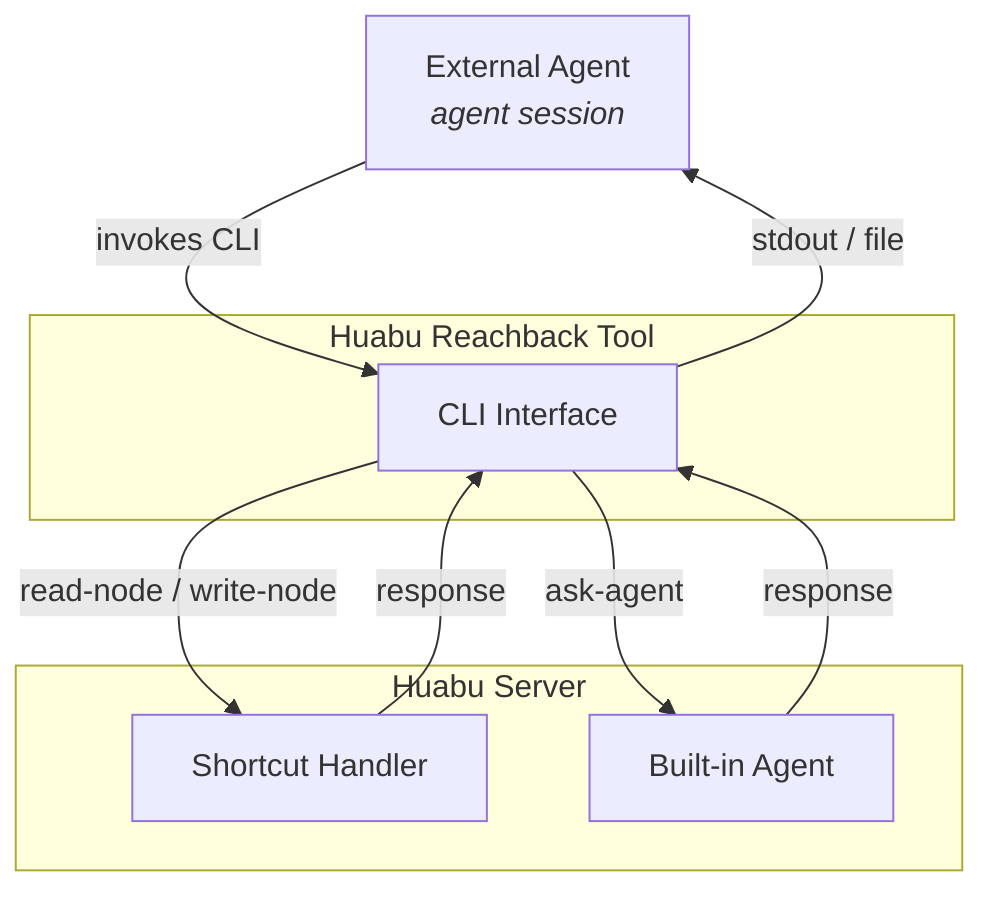

# Huabu Reachback Tool (HRT) — REMOVED (superseded by RFS)

> **⚠️ Historical.** The HRT `.mjs` shortcut tool described below — the
> `read-node` / `write-node` / `snapshot` node-CRUD verbs, the
> `/api/reachback/*` routes, and the `AGENTLET_REACHBACK_DIR` push
> mechanism — **has been removed** from Huabu. External agents now reach
> back into the canvas through the **Remote File System (RFS)**: plain-`curl`
> `download` / `upload` / `agent` / `skill` endpoints under `$HUABU_RFS_URL`,
> with **no client tool** shipped into the agent.
>
> Current sources of truth:
>
> - Server: [`apps/server/src/modules/remote_fs/`](../../apps/server/src/modules/remote_fs/) (`rfs.route.ts`).
> - Agent-facing guide: [`access-huabu.md`](../../apps/server/src/prompt/external-agent/access-huabu.md).
> - Wire contract: [`packages/shared/src/types/api/rfs.ts`](../../packages/shared/src/types/api/rfs.ts).
> - Design: [`../proposals/agent-reachback-rfs.md`](../proposals/agent-reachback-rfs.md) (Reachback v2).
>
> Only the agentlet transport layer
> ([Agent Reachback Interface](../../external/agentlet/spec/agent-reachback.md))
> is unchanged. The rest of this document is kept for history only and does
> **not** describe code that currently exists.

> Huabu's concrete implementation of **Agent Reachback** — the tool external
> agents use to read from and write to the Huabu canvas out-of-band from the
> main prompt flow.
>
> The host-agnostic **transport and protocol** (how the tool script is
> distributed to spawned agents and what environment it runs in) lives in the
> agentlet layer. See the
> [**Agent Reachback Interface**](../../external/agentlet/spec/agent-reachback.md)
> and [`protocol.md` §9 — Resource Distribution](../../external/agentlet/spec/protocol.md#resource-distribution).
> This document covers only the **Huabu-specific** tool and server API.

## Overview

Huabu is a shared workspace for both human users and AI agents. Agents can be
**internal** (built-in agents working within Huabu) or **external** (agents
running outside of Huabu but interacting with it). Giving external agents full
access to the workspace — node contents, spatial/visual canvas information, and
interaction history — is crucial for them to understand user intentions and
provide effective assistance.

External agents connect to Huabu through **agentlet**, a lightweight ACP (Agent
Client Protocol) bridge. The agentlet daemon (analogous to `kubelet` for
Kubernetes) runs on a remote machine (or the same machine) and spawns agent
sessions on behalf of Huabu. The **primary channel** is the ACP prompt→response
flow: Huabu sends prompts, the agent responds with messages that appear on the
canvas.

The **Huabu Reachback Tool (HRT)** is the parallel, out-of-band channel: a
standalone CLI script the external agent invokes to read/write the canvas and
query Huabu's built-in agents, independently of the sequential prompt flow. HRT
is delivered into the agent's environment and authenticated entirely by the
agentlet Reachback Interface — Huabu only authors the script and the endpoints
it calls.

## Motivating Example

On the Huabu canvas, there is a `note` node (`node-id-123456`) containing a
user's idea for a new project feature. The user spawns an external agent session
(`session-id-7890`) via the agentlet daemon on a remote machine with the
project's development environment. The agent is instructed to read the content
of `node-id-123456` and implement the feature.

Typical Reachback interactions:

1. **Read**: The agent reads the content of `node-id-123456` to understand the
   feature request.
2. **Write + Link**: After implementation, the agent writes a summary to a new
   node on the canvas and links it back to `node-id-123456`.
3. **Context gathering**: The agent queries neighboring nodes and interaction
   history around `node-id-123456` for additional context (via a built-in
   agent).

All three interactions are initiated by the external agent through HRT.

## Interaction Model: A2A Skeleton + Shortcuts

HRT exposes two types of commands:

- **Shortcuts**: deterministic, server-handled CRUD operations (fast, no LLM
  reasoning).
- **Built-in agent commands**: natural language requests routed to built-in
  agents with full canvas context (flexible, semantic).

The external agent doesn't need to decide the routing — the command name itself
determines whether it's a shortcut (`read-node`, `write-node`) or an agent
request (`ask-agent`).



**Why this hybrid:**

- Shortcuts cover the high-frequency, deterministic operations (~80% of
  Reachback calls) with minimal latency and zero LLM cost.
- Built-in agents handle the long tail of complex, semantic operations (spatial
  reasoning, multi-node queries, context understanding) without bloating the
  shortcut surface.
- The shortcut boundary is intentionally minimal: **if it takes an explicit ID
  and does one atomic CRUD operation, it's a shortcut. Everything else goes to
  `ask-agent`.**

## Environment

HRT relies on the standard Reachback environment injected by the agentlet daemon
(`AGENTLET_REACHBACK_DIR`, `AGENTLET_SERVER`, `AGENTLET_TOKEN`) — see the
[Agent Reachback Interface §2](../../external/agentlet/spec/agent-reachback.md#2-environment-provisioning).
Huabu adds two host-specific variables via `sessionSpec.env` at spawn time:

| Variable          | Description                                                                                                                                                     |
| ----------------- | --------------------------------------------------------------------------------------------------------------------------------------------------------------- |
| `HUABU_CANVAS_ID` | The canvas ID this agent session is scoped to. HRT reads it automatically so commands don't need a per-call `--canvas` flag.                                    |
| `HUABU_SERVER`    | (Optional override) If set, HRT uses this HTTP base URL directly instead of deriving it from `AGENTLET_SERVER`. Useful for testing or non-standard deployments. |

Distribution and agent prompt injection are handled per the interface contract:
Huabu pushes `huabu-reachback-tool.mjs` to `${AGENTLET_REACHBACK_DIR}` on daemon
connect/reconnect via `server/sendResource`, and includes a short HRT usage
description in the external agent's system prompt so it can use the tool from the
start.

## Commands

### Invocation

```bash
node ${AGENTLET_REACHBACK_DIR}/huabu-reachback-tool.mjs <command> [args...]
```

HRT automatically reads `${AGENTLET_TOKEN}` for authentication.
Machine-consumable results are printed to stdout; metadata and errors go to
stderr. Non-zero exit codes indicate failure. Use `--help` or `-h` on any
command for usage details.

### Shortcuts (deterministic, server-handled)

**`read-node`** — Read node content to a file

```bash
node ${AGENTLET_REACHBACK_DIR}/huabu-reachback-tool.mjs read-node [--output-dir <folder>] <node-id>
```

- `--output-dir` is optional; defaults to the current working directory.
- Saves the node content to `<folder>/<node-id>.<ext>`, where `.<ext>` is
  automatically determined by HRT based on the node's type (e.g., `.md` for
  note, `.html` for web).
- **stdout**: the saved file path (one line) — usable directly in shell
  composition.
- **stderr**: node metadata (`type=<type> size=<bytes>`).

**`write-node`** — Create or update a node

```bash
# Create a new node
node ${AGENTLET_REACHBACK_DIR}/huabu-reachback-tool.mjs write-node --type <type> [options] <path-to-content-file>

# Update an existing node
node ${AGENTLET_REACHBACK_DIR}/huabu-reachback-tool.mjs write-node --id <node-id> [options] <path-to-content-file>
```

- `--type <type>`: create a new node (e.g., `note`, `web`). Returns the new node
  id to stdout.
- `--id <node-id>`: update an existing node. Overwrites current content
  directly.
- Only one of `--type` or `--id` may be specified.
- **stdout**: the node ID (created or updated).
- **stderr**: action metadata (`action=created|updated nodeId=<id>`).

**Additional options:**

| Option                  | Description                                                                                                                                                         |
| ----------------------- | ------------------------------------------------------------------------------------------------------------------------------------------------------------------- |
| `--link-to <node-id>`   | Link the new/updated node → specified node                                                                                                                          |
| `--link-from <node-id>` | Link the specified node → new/updated node                                                                                                                          |
| `--notify`              | Fire-and-forget notification to the default built-in agent for canvas positioning. Non-blocking. (Future: `--notify-to <agent-id>` for targeting a specific agent.) |

**`snapshot`** — Render sketch / image nodes to PNG image(s)

```bash
node ${AGENTLET_REACHBACK_DIR}/huabu-reachback-tool.mjs snapshot [--output-dir <folder>] [--max-pixels <n>] <node-id> [<node-id>...]
```

- Rasterizes `sketch` and `image` nodes to PNG so a vision-capable agent can
  actually _see_ the drawings (text-only `read-node` can't). A `frame` id
  expands to its children.
- Nearby image + sketch nodes are spatially clustered into **one composite PNG
  per cluster** (sharing one viewBox so on-canvas relationships are preserved),
  so a request may yield more than one file.
- `--output-dir` is optional; defaults to the current working directory. Each
  PNG is written as `<folder>/<artifact-key>.png`.
- `--max-pixels <n>` (256–4096, default 1280): longest-edge cap for the output.
  Lower it (e.g. 768) if a downstream LLM rejects the attachment as too large.
- Non-snapshottable node types (`note` / `text` / `pdf` / `video`) passed as a
  top-level id return an error directing you to `read-node` instead.
- **stdout**: the saved PNG file path(s), one per line.
- **stderr**: per-image metadata (`key=<key> size=<WxH> originNodeIds=<ids>`).

### Built-in Agent Commands (semantic, LLM-mediated)

**`ask-agent`** — Query a built-in agent

```bash
# Inline prompt
node ${AGENTLET_REACHBACK_DIR}/huabu-reachback-tool.mjs ask-agent "<prompt>"

# Prompt from file (@ convention, like curl -d @file)
node ${AGENTLET_REACHBACK_DIR}/huabu-reachback-tool.mjs ask-agent @path/to/prompt.txt

# Show intermediate steps (tool calls, thinking) on stdout
node ${AGENTLET_REACHBACK_DIR}/huabu-reachback-tool.mjs ask-agent --show-steps "<prompt>"

# Save full session events to file (auto-named JSONL in reachback dir) — this is the DEFAULT
node ${AGENTLET_REACHBACK_DIR}/huabu-reachback-tool.mjs ask-agent "<prompt>"

# Disable session saving
node ${AGENTLET_REACHBACK_DIR}/huabu-reachback-tool.mjs ask-agent --no-save-session "<prompt>"
```

- Sends a natural language prompt to a built-in agent with full canvas context.
- The built-in agent can perform complex reasoning: spatial queries, semantic
  search, multi-node operations, neighbor discovery, interaction history lookup,
  etc.
- If the argument starts with `@`, the prompt is read from the specified file
  (useful for long or multi-line prompts).
- In v1, a single default built-in agent handles all requests. (Future:
  `--agent <agent-id>` for targeting a specific agent.)
- **stdout** (default): final result text only. With `--show-steps`:
  intermediate events (tool calls, thinking deltas) are also printed.
- **stderr**: progress status line (e.g., "⏳ Agent working...") emitted on first
  server event — keeps the harness aware the tool is alive and prevents idle
  timeout. Session file path also printed here.
- By default, all events are saved to
  `${AGENTLET_REACHBACK_DIR}/sessions/<timestamp>.jsonl`. Use `--no-save-session`
  to disable. Useful for debugging or future `--resume` support.

**Additional options:**

| Option              | Description                                                                                |
| ------------------- | ------------------------------------------------------------------------------------------ |
| `--show-steps`      | Print intermediate events (tool calls, thinking) to stdout in addition to the final result |
| `--no-save-session` | Disable saving event log (default: saves to auto-named JSONL file)                         |

## Sync/Async Behavior & Timeout Resistance

HRT follows the interface's recommended transport model (see
[Agent Reachback Interface §4](../../external/agentlet/spec/agent-reachback.md#4-transport-model-cli-first)):
all commands are **blocking** — they run until the operation completes, then
print the result and exit, like `curl`.

This works because modern agent harnesses (Copilot CLI, Claude Code, Cursor,
etc.) already handle long-running CLI commands gracefully — they start the
command synchronously, and if it exceeds an internal timeout, the harness
automatically promotes it to a background task and retrieves the output later.

**Timeout resistance for `ask-agent`:** the command uses **SSE (Server-Sent
Events)** streaming — the Huabu server sends events incrementally as the built-in
agent works. This prevents timeouts at two layers:

1. **HTTP layer**: chunked `text/event-stream` response keeps the TCP connection
   alive with periodic data (events or heartbeat comments). No socket idle
   timeout.
2. **Harness layer**: HRT emits a stderr status line on the first received event
   ("⏳ Agent working..."). The harness sees process output → knows the tool is
   alive → does not kill or retry.

Because the connection stays active throughout, the
timeout→retry→duplicate-execution problem is eliminated without needing
request-level idempotency. As a result, HRT needs no `--timeout`, `poll-result`,
or explicit async modes — a single blocking call per command. Intermediate
events flow to HRT in real-time; `--show-steps` surfaces them to stdout,
`--save-session` persists them to disk.

## Error Handling (v1)

All error cases produce a descriptive message on stderr and a non-zero exit
code:

- Node not found
- Invalid or expired token
- Network failure
- Target node deleted during operation
- Notified agent offline or not found

No automatic retry or recovery in HRT — the external agent decides how to handle
errors.

## Huabu Server API

REST endpoints HRT calls. All accept `Authorization: Bearer ${AGENTLET_TOKEN}`.

**`GET /api/canvas/:canvasId/nodes/:nodeId/content`** — Read node content
(existing endpoint)

| Field    | Value                                     |
| -------- | ----------------------------------------- |
| Response | `{ nodeId, type, content, ... }`          |
| Errors   | `404` node not found, `401` invalid token |

**`POST /api/canvas/:canvasId/execute`** — Create/update node + link (existing
endpoint)

| Field    | Value                                                                                                    |
| -------- | -------------------------------------------------------------------------------------------------------- |
| Body     | `{ commands: CanvasCommand[], originator }` — HRT constructs add-node / edit-content / add-edge commands |
| Response | `{ canvasId, fromVersion, toVersion, deltas, results }`                                                  |
| Errors   | `401` invalid token, `404` canvas not found                                                              |

HRT translates its CLI flags (`--type`, `--id`, `--link-to`, `--link-from`,
`--notify`) into the appropriate `CanvasCommand[]` internally. The external agent
never sees `CanvasCommand` directly.

**`GET /api/reachback/snapshot`** — Render sketch / image nodes to PNG (new
endpoint)

| Field    | Value                                                                                  |
| -------- | -------------------------------------------------------------------------------------- |
| Query    | `canvasId` (required), `nodeIds` (required, comma-separated), `maxPixels` (256–4096)   |
| Response | `{ canvasId, images: [{ key, width, height, originNodeIds }] }`                        |
| Errors   | `400` empty / oversized / non-snapshottable ids or unknown canvas, `401` invalid token |

Thin exposure of the internal `snapshot_nodes` tool
(`snapshotNodesToArtifacts`): it clusters image + sketch nodes by frame,
rasterizes each cluster to one content-addressed PNG in the canvas
`.artifacts/` store, and returns the artifact `key` per image. HRT then
downloads each PNG via `GET /api/canvas/:canvasId/artifact/:key` (also
Bearer-reachable) and writes it to disk. Re-snapshotting unchanged input is
free — keys are content-addressed by geometry + strokes + `maxPixels`.

**`POST /api/reachback/ask-agent`** — Send prompt to built-in agent (SSE
streaming)

| Field       | Value                                                                            |
| ----------- | -------------------------------------------------------------------------------- |
| Body        | `{ prompt, canvasId }`                                                           |
| Response    | `Content-Type: text/event-stream` — SSE stream of typed events                   |
| Events      | `text_delta`, `thinking_delta`, `tool_call`, `tool_call_update`, `done`, `error` |
| Final event | `done: { message, threadId }`                                                    |
| Errors      | `401` invalid token, `503` agent unavailable                                     |

Design notes:

- **Transport**: SSE. The server pipes `runAgent()` events directly to the HTTP
  response as `data: {type, ...}\n\n` frames. HRT reads incrementally, prints
  progress to stderr on first event, and collects the final `done` message for
  stdout.
- **Tool scope**: Uses `'operate'` scope (full canvas read + write tools).
  **TODO**: discuss with maintainers whether a restricted `'reachback'` scope is
  warranted to limit surface area.
- **System prompt**: Minimal static prompt providing canvas context awareness.
  **TODO**: design offline — should include canvas outline, caller identity,
  usage guidelines.
- **Statefulness**: Each call is stateless. The `done` event includes a
  `threadId` reserved for future `--resume` support.

## Known Issues & Future Work

- **Concurrency / versioning**: `write-node --id` currently overwrites without
  conflict detection. An ETag-based CAS mechanism (`--expect-version` flag)
  should be added for concurrent edits. Interface-compatible — no breaking
  changes when added.
- **Stateful conversations (`--resume`)**: v1 `ask-agent` is stateless. The
  returned `threadId` is reserved for future `--resume <threadId>` support
  (requires server-side thread/context persistence).
- **Target agent identification**: Both `write-node --notify-to <agent-id>` and
  `ask-agent --to <agent-id>` need a way to specify a target built-in agent.
  Requires defining agent identification, discovery, and routing. For v1, all
  requests go to the single default built-in agent.
- **Structured output**: v1 uses plain text output (curl-style). A
  `--format json` flag can be added later for programmatic consumption.
- **Selected node IDs in prompt**: Resolved. The external-agent prompt is built
  deterministically (no preprocessor LLM): every selected node is listed in a
  `## Selected Nodes` table carrying its `nodeId`, `type` and `label`, so the
  agent can always `read-node <id>` / `write-node --id <id>` on demand. The wire
  text is split across two templates — `prompt/external-agent/user_prompt.md`
  (per-turn `task` + the table) and `prompt/external-agent/system_prompt.md`
  (a one-shot persona + `## Canvas Tools (Reachback)` preamble prepended to the
  first turn of each fresh session). See
  `apps/server/src/modules/agent/acp/preprocessor.ts`.
- **Script versioning**: v1 guarantees script existence via bundled
  installation. Auto-update mechanism TBD.
- **Push notifications (server→agent)**: Currently all Reachback communication is
  agent-initiated. Server-push (e.g., "node X was edited by another user") is a
  future consideration.

## Implementation Plan

> The agentlet-side pieces (env registry, `server/sendResource` distribution,
> `sessionSpec.env` forwarding) are defined by the
> [Agent Reachback Interface](../../external/agentlet/spec/agent-reachback.md) and
> [`protocol.md` §9](../../external/agentlet/spec/protocol.md#resource-distribution).
> The items below are Huabu's responsibilities.

### Component: Huabu Reachback Tool (HRT)

The standalone CLI script (`huabu-reachback-tool.mjs`) running in the external
agent's environment. The source lives in the **Huabu project** since
it's a thin client tightly coupled to the server's Reachback API — keeping them
in the same repo ensures API and client stay in sync. The script is shipped as a
build artifact that the agentlet daemon bundles during installation.

- [x] CLI argument parser: command routing (`read-node`, `write-node`,
      `ask-agent`), flag parsing, `--help` / `-h` support
- [x] `read-node`: call server API, write content to
      `<output-dir>/<node-id>.<ext>`, print file path to stdout, metadata to stderr
- [x] `write-node`: read content file, call server API (create or update), print
      node id to stdout, action metadata to stderr
- [x] `write-node --link-to` / `--link-from`: include link creation in the write
      request
- [x] `write-node --notify`: after successful write, calls `ask-agent`
      internally to trigger built-in agent layout
- [x] `ask-agent`: SSE streaming consumer with `--show-steps` and
      `--no-save-session` flags, progress on stderr, session JSONL persistence
- [x] Auth: read `${AGENTLET_TOKEN}` from env, attach to all HTTP requests
- [x] Error handling: map HTTP errors to stderr messages + non-zero exit codes
- [x] Package as standalone `.mjs` with zero external dependencies

### Component: Huabu Server

- [x] Bearer token auth as an alternative to Basic Auth (Fastify `preHandler`
      hook that accepts either) — enables HRT to call existing canvas endpoints
- [x] Implement `POST /api/reachback/ask-agent` — SSE streaming endpoint that
      pipes `runAgent()` events to the client
- [x] Notification dispatch: `--notify` reuses `ask-agent` internally — no
      separate endpoint needed
- [x] Push HRT script to agentlet daemon via `server/sendResource` on
      connect/reconnect
- [ ] Error responses: ensure existing endpoints return consistent `{ message }`
      format for HRT consumption

### Component: Huabu (Host App)

- [x] Prompt injection: include Reachback usage description in the agent's system
      prompt when spawning an external agent session
- [x] Node ID embedding: pass referenced node IDs into the agent's initial
      context
- [x] Pass `HUABU_CANVAS_ID` via `sessionSpec.env` when spawning an external
      agent session

### Component: Built-in Agent (Huabu-side)

The default built-in agent that handles `ask-agent` requests and `--notify`
events.

- [x] `ask-agent` handler: receive natural language prompt, execute with
      `'operate'` scope (TODO: scope TBD), stream events back via SSE, include
      `threadId` in `done` event
- [x] `--save-session` support: HRT-side only (saves SSE events to JSONL); no
      server changes needed
- [x] Notification handler: `--notify` calls `ask-agent` with a layout prompt —
      built-in agent uses canvas tools to position and link
- [ ] Canvas context access: read nodes, edges, spatial info, interaction
      history for reasoning
- [ ] System prompt: minimal v1 prompt (TODO: design offline with maintainers)
