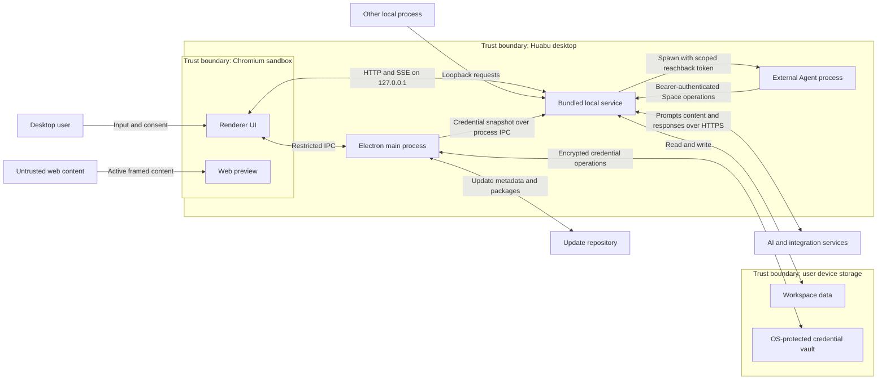

# Huabu Desktop Threat Model

## Architecture and data flows

## Primary threats and mitigations

| Threat                                            | Potential impact                                                                                       | Existing controls                                                                                                           | Remediation                                                                                                                                   |
| ------------------------------------------------- | ------------------------------------------------------------------------------------------------------ | --------------------------------------------------------------------------------------------------------------------------- | --------------------------------------------------------------------------------------------------------------------------------------------- |
| Unauthorized local API access                     | Another process in the same user session reads or changes Spaces or invokes paid services.             | Service binds to `127.0.0.1`; Host, Origin, CORS, and Fetch Metadata guards block remote-browser and DNS-rebinding attacks. | Require a per-launch desktop token on every local API and SSE request.                                                                        |
| Renderer or embedded-content compromise           | Malicious content invokes application capabilities, deceives the user, or requests device permissions. | Chromium sandbox, context isolation, Node integration disabled, narrow preload bridge, and external navigation guard.       | Validate IPC sender origin, deny permissions/downloads by default, and isolate or replace live web previews with inert content.               |
| Prompt injection and unsafe Agent actions         | Untrusted documents or websites cause unintended disclosure, mutation, tool use, or cost.              | Tool schemas, Space scoping, revision checks, server-owned authorship, and change records.                                  | Mark external content as untrusted, grant least-privilege tools, and require confirmation for high-impact operations.                         |
| Untrusted external Agent execution or token theft | Agent code reads unrelated local data, inherits secrets, or gains full Space read/write access.        | Random bearer token, constrained RFS paths, explicit reachback injection, and inherited `HUABU_*` variable stripping.       | Sandbox Agent processes, allowlist environment variables, and use short-lived per-Space read/write capability tokens.                         |
| Malicious URL fetch or preview                    | Server-side request forgery reaches local/private services or oversized responses exhaust resources.   | URL parsing, request timeouts, body limits, and renderer sandbox.                                                           | Reject private, loopback, link-local, and metadata addresses after DNS resolution and redirects; enforce response limits on every fetch path. |
| Update supply-chain compromise                    | A malicious or substituted desktop package executes with application privileges.                       | HTTPS update feed, SHA-512 metadata, user-initiated install, and macOS signing/notarization.                                | Sign Windows releases, verify publisher identity, prevent downgrade, and require complete immutable release artifacts.                        |

## Sensitive assets

- Workspace content, artifacts, memory, history, and settings.
- LLM, integration, and OAuth credentials.
- Agent instructions, responses, tools, and reachback bearer tokens.
- Desktop packages, update metadata, logs, and crash diagnostics.

## Entra permissions

The reviewed desktop application does not request Microsoft Entra tenant permissions or Microsoft Graph permissions. If such permissions are introduced, the exact delegated or application permissions, accessed data, consent requirements, and token flow must be added to this model before tenant review.
