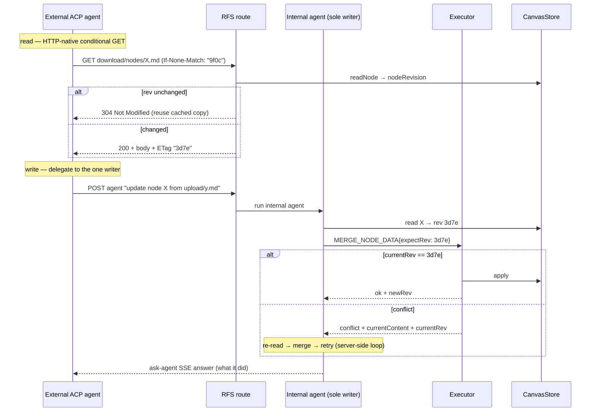

# Agent Node Freshness & Write-Safety (Stateless Rev + CAS)

Status: In-Progress — Phase 1 (read) + Phase 2 (agent write CAS) + Phase 3 (human web content-PUT CAS) implemented.
Last updated: 2026-07-08

> **Context — Reachback v2 (RFS + ask-agent).** External ACP agents no longer
> ship a `.mjs` reachback tool with `read-node` / `write-node`; they get three
> plain-`curl` endpoints under `$HUABU_RFS_URL` — `download` / `upload` /
> `agent` — over a **single-writer** model where **only the internal agent
> mutates the canvas graph** (see
> [agent-reachback-rfs.md](./agent-reachback-rfs.md)). That reshapes this plan:
> the **external write path needs no CAS at all** (external agents never write
> nodes — nothing to conflict), so write-safety collapses to the **one** place
> that still writes: the executor. Read-freshness stays valuable for both agents
> and, on the RFS side, becomes **HTTP-native ETag / `If-None-Match`**.

> **Goal:** let both agent flavors (built-in pi-agent-core loop and the internal
> agent invoked via `ask-agent`) **read smartly** — know when a node they
> already read has changed and needs re-reading — and **write safely** — the
> sole writer never clobbers a node that a human or a concurrent turn modified
> since it last read. Achieved with a single deterministic per-node **revision
> token** (surfaced as an **ETag** on RFS downloads and as `rev` in the
> per-turn refs / neighbourhood), a **stateless** server (no in-memory map, no
> per-thread ledger), and a **compare-and-swap (CAS)** guard on the executor's
> content writes as the hard safety net.

## 0. Problem (post-v2)

|                                    | Current                                                                                                                                                                                                                                           | Gap                                                           |
| ---------------------------------- | ------------------------------------------------------------------------------------------------------------------------------------------------------------------------------------------------------------------------------------------------- | ------------------------------------------------------------- |
| **Reading (built-in)**             | Every `read` re-reads disk fresh; the neighbourhood preamble carries previews but **no version**. "Should I re-read?" is a blind guess.                                                                                                           | No freshness signal reaches the model.                        |
| **Reading (ACP / RFS)**            | `GET download/nodes/<path>` returns `X-Huabu-*` metadata headers but **no ETag / Last-Modified**, so no conditional GET, no `304`.                                                                                                                | No HTTP-native freshness.                                     |
| **Writing (sole internal writer)** | The executor's `MERGE_NODE_DATA` **overwrites unconditionally**. A human edit — or a second concurrent internal-agent turn (multi-tab / multi-thread / an `ask-agent` invocation) — between the agent's read and its write is silently clobbered. | No optimistic-concurrency guard at the one write choke point. |
| **Writing (external ACP)**         | External agents never write nodes (single-writer); `upload/` payloads are inert until an `ask-agent` transaction materializes them.                                                                                                               | **No gap — out of scope by construction.**                    |

The existing `appliedFingerprint` machinery in
[`packages/shared/src/canvas-engine/change.ts`](../../packages/shared/src/canvas-engine/change.ts)
already proves a deterministic, host-agnostic djb2 fingerprint over node
`data` works for the change-review revert staleness check. This proposal
reuses that same primitive for the read/write path.

## 1. Core primitive — `nodeRevision` (stateless, deterministic)

Add a pure function alongside the existing fingerprint helpers in
`change.ts`:

```ts
/** Node version: deterministic djb2 over a canonical projection of `data`,
 *  EXCLUDING cosmetic / geometry keys (style, position, width, height, …) so
 *  a re-measure never flips the rev. Carried out on reads, checked on writes. */
export function nodeRevision(node: CanvasNode | undefined): string;
```

Why a content hash rather than mtime or a stored counter:

- **Deterministic & host-agnostic** — server (producer) and web / agent
  (consumer) compute the identical string; same discipline as
  `fingerprintNodeFields`.
- **Filesystem-independent** — mtime is unreliable on Windows under AV /
  file-watcher churn (the same reason `CanvasStore.tryUnlink` exists).
- **Nothing to store** — the server recomputes it on demand at three moments
  (read response, per-turn preamble, write-time CAS), so there is **no map, no
  ledger, no sidecar** to keep consistent.

Excluded keys mirror the spirit of `PRIMARY_CONTENT_KEYS` — only authored
body/content changes should move the rev; auto-derived (`label`, `summary`,
`keywords`) and cosmetic/geometry fields must not, or the model would be told
to re-read after meaningless churn.

## 2. Read side — surface the rev, let the model judge

The rev is exposed through **whatever the channel's native freshness idiom is**:
an **ETag** on the RFS `download` response (ACP), and a `rev=` attribute on the
`<node>` elements in the per-turn `<selected_nodes>` **and**
`<canvas_neighbourhood>` blocks (both backends). Same value, one source: the
shared `buildAgentNodePreview` computes `rev` from the node's authored content
whenever the caller hands it that content — which both the selection-ref
collector and the neighbourhood builder already do (each reads the node's
on-disk body via `store.readNode`). Same value, multiple carriers.

### 2a. ACP / RFS — rev **is** the ETag (HTTP-native conditional GET)

`GET $RFS/download/nodes/<path>` gains a standard `ETag` whose value is
`nodeRevision`:

```
ETag: "3d7e"
```

The external agent then does a **conditional GET** — the textbook mainstream
move — to decide whether to re-download:

```bash
curl -fsS -H "$AUTH" -H 'If-None-Match: "3d7e"' -D - -o note.md \
  "$HUABU_RFS_URL/download/nodes/My%20note.md"
# → 304 Not Modified  → reuse the copy already on disk (and in context)
# → 200 + new ETag     → content changed, use the fresh body
```

This needs **no server state**: `nodeRevision` is recomputed from disk per
request and compared to the client's `If-None-Match`. It also means the RFS
advice — "save to disk, open only what you need" — composes naturally: a `304`
lets the agent skip both the download **and** the re-read.

### 2b. Per-turn refs / preamble state the current rev — objectively, no `changed` flag

Each turn Huabu already hands the agent its selected refs (`id`, `type`,
`filename`, `label`, `preview` — see
[`node-ref.ts`](../../apps/server/src/modules/agent/node-ref.ts)). Add `rev`:

```jsonc
{
  "id": "node-cbf9",
  "type": "note",
  "filename": "nodes/Assumptions.md",
  "label": "Assumptions",
  "preview": "…",
  "rev": "3d7e",
}
```

The built-in agent's neighbourhood block carries the same fact as an attribute:

```xml
<node id="n-d" type="note" label="Assumptions" rev="3d7e" preview="…" />
```

Because the server keeps **no memory of what the agent last saw**, this is a
plain statement of the current rev — not a `changed` verdict. The **model** owns
the comparison: its earlier read recorded `rev=9f0c` (RFS ETag or a prior
preamble) in the transcript; this turn shows `rev=3d7e`; different → re-read /
re-download (or just pass `If-None-Match` and act on `200` vs `304`). Same →
reuse. This "let the model judge" contract needs a rule in
`external-agent/access-huabu.md` (RFS) and the built-in agent's read-tool docs.

### 2c. `304` / rev-mismatch is the harness-side `stale` signal

Relying purely on the model comparing two rev strings is the least reliable part
(see §5). Mainstream harnesses instead let a **channel-level mismatch** carry
the signal (Aider SEARCH mismatch, Copilot `oldString` mismatch, HTTP `304`).
We get this for free:

- **ACP:** the `200` vs `304` outcome of the conditional GET **is** the stale
  signal — no extra bookkeeping.
- **Built-in:** when the `read` tool runs and the freshly read rev differs from
  the rev the same turn's preamble advertised for that node, the tool result
  appends an explicit, model-facing line — derived from data already in the
  request, so it stays stateless:

  ```
  stale=true was=9f0c now=3d7e  (node changed since the neighbourhood was rendered)
  ```

## 3. Write side — CAS at the one writer (the executor)

### 3.0. Scope — there is exactly one write choke point

Under Reachback v2's **single-writer** model, every canvas-graph mutation —
whether from the built-in chat agent or from an external agent's `ask-agent`
call — flows through the **internal agent → `CanvasCommand[]` → executor**. The
built-in agent's `fs_write` tool only reaches memory / skills / settings sandbox
paths, never `nodes/*.md`; external agents don't write nodes at all. So the
executor is the **sole** place a CAS guard is needed — no CLI flags, no external
surface. But the `CanvasCommand` union does **not** get one uniform guard;
writes split by conflict semantics:

| Class                    | Commands                                                                                                                                                                                        | Guard                                                                                                            | In scope here |
| ------------------------ | ----------------------------------------------------------------------------------------------------------------------------------------------------------------------------------------------- | ---------------------------------------------------------------------------------------------------------------- | ------------- |
| **Content rewrite**      | `mergeNodeData` (content/src), `changeNodeType`                                                                                                                                                 | **rev CAS** (`expectRev`)                                                                                        | ✅            |
| **Delete**               | `deleteNodes`                                                                                                                                                                                   | existence + optional **content-staleness** guard (don't blind-delete a node edited since the writer last saw it) | ✅ (soft)     |
| **Structure / geometry** | `setNodeGeometry`, `align/distribute/reorderNodes`, `setNodeParent`, `connectNodes` / `disconnectEdges`, `setEdgeStyle`, `setFrameLayout`, `dissolveFrame`, `setNodeSelection`, `setNodeLocked` | **op-log LWW / rebase** — owned by [canvas-realtime-sync-plan](./canvas-realtime-sync-plan.md)                   | ❌            |
| **Create**               | `createNodes`, `createQuestion`                                                                                                                                                                 | none (no prior version to clobber)                                                                               | ❌            |

The dividing line is exactly the key set `nodeRevision` hashes: the CAS guards
**authored content** only. Geometry / cosmetic / structural keys are excluded
from the rev and handled by the structure op-log's field-level delta + rebase
model; layering rev CAS on top of them would fight that plan.

### 3a. Command shape

`MERGE_NODE_DATA` patches gain an optional `expectRev`:

```ts
{ type: 'MERGE_NODE_DATA', patches: [{ nodeId, patch: { content }, expectRev?: string }] }
```

The internal agent does **not** hand-carry `expectRev`. The server keeps a
**session-scoped read-set** (`nodeId → rev`, one `Map` per conversation
`threadId`, in-memory, LRU-bounded, lost on restart): populated **only** by the
`read` tool when the agent reads a node's full `.md` body (re-reads overwrite
with the fresh rev). It is deliberately **not** seeded from context previews —
a node ref carries only a ~120-char preview, not the body, so knowing its rev is
no basis for rewriting content. The `canvas_commands` tool auto-injects
`expectRev` on each content patch from that read-set. So "no entry" ⇒ "the
agent never read this node this session" ⇒ no `expectRev` ⇒ the executor rejects
it — true read-before-write, exactly Claude Code's session-scoped model, with no
persistent state and no token bookkeeping in the prompt.

### 3b. Stateless CAS in the executor

Before applying, recompute the current rev **from disk** and compare:

```ts
const current = store.readNode(nodeId); // disk truth
if (guardRequired(patch) && nodeRevision(current) !== patch.expectRev) {
  return conflict({
    nodeId,
    expectedRev: patch.expectRev,
    currentRev: nodeRevision(current),
    currentContent: current.content, // echo latest, saves a round-trip
    changedKeys: changedKeys(prevData, current.data),
  });
}
// match → apply as normal; the change record still stamps appliedFingerprint
```

### 3c. Default-on, no blind bypass (the mainstream discipline we adopt)

Mainstream harnesses **enforce read-before-write** rather than trusting the
model to do it (Claude Code refuses to edit a file it deems modified since the
last read). We adopt the same posture at the executor — and go one step
further: **there is no agent-facing bypass.**

- An **agent** content `MERGE_NODE_DATA` whose `expectRev` is **absent** (the
  writer never read the node this run) is **rejected** with "read the node
  first", not silently applied. There is deliberately **no `force` flag**: the
  current rev is already in the agent's context (the per-turn `rev=` / the ETag
  it downloaded), and the reconcile loop (§3d) handles every legitimate case,
  so a blind overwrite is never needed — and a model must never hold a switch
  that disarms the guard. Since `nodeRevision` is deterministic, re-reading
  always yields a rev that then writes cleanly, so no false-stale can
  persistently block a write.
- **Trusted programmatic writes** (imports, migrations, non-LLM internal code)
  are a _different caller class_, distinguished by **originator**, not a flag
  the model can set. Those may write unconditionally (no `expectRev`); the CAS
  requirement applies only to agent-originated content writes.

### 3d. Conflict → reconcile loop

The executor returns a structured conflict tagged with a **`reason`** so the
model can tell the two rejection classes apart (a `not-read` conflict looks
identical to a `stale` one if only `currentRev` is echoed — the model then
misreads it as a transient glitch and blindly re-issues the same command,
burning a round-trip). The **caller that owns the LLM loop** turns it into a
tool-result the model can act on, and the `canvas_commands` result also carries
a plain-language `conflictHint`:

- **`reason: 'not-read'`** — the writer never read the node this run, so no
  `expectRev` was injected. The model **must `read`** the node (which populates
  the read-set) before writing; it **cannot** hand-carry `expectRev` to bypass
  this, and retrying the identical command is rejected the same way.
- **`reason: 'stale'`** — the writer read an earlier rev that has since changed;
  re-read (or reconcile against the echoed `currentContent`) and re-issue.

```
MERGE_NODE_DATA{expectRev: 9f0c}   →  CONFLICT reason=stale (currentRev 3d7e, + currentContent)
   ↓  re-read echoed currentContent → merge own edit
MERGE_NODE_DATA{expectRev: 3d7e}   →  OK
```

- **Built-in agent:** the conflict comes back as the `canvas_commands` tool
  result; the agent re-reads and retries within the same turn loop.
- **`ask-agent` (external ACP):** the internal agent runs the same loop
  server-side; the conflict never leaves the server as a raw error — the
  internal agent reconciles and the `ask-agent` SSE answer reports what it did
  (or, if it genuinely can't, says so in the final text). The external agent
  sees a normal answer, not a CAS protocol.

## 4. Data flow



## 5. What we deliberately keep non-mainstream vs. lean mainstream

| Decision                    | Mainstream norm                                         | Ours                                                      | Verdict                                       |
| --------------------------- | ------------------------------------------------------- | --------------------------------------------------------- | --------------------------------------------- |
| Read freshness (ACP)        | HTTP conditional GET (ETag / `If-None-Match` → `304`)   | ETag = `nodeRevision`, conditional GET                    | **Fully mainstream**                          |
| Write clobber guard         | Optimistic concurrency (content-match or mtime)         | Explicit `expectRev` CAS at the executor                  | **Aligned**                                   |
| Who enforces write safety   | Harness hard-rejects                                    | Executor CAS hard-rejects, default-on                     | **Aligned (default-on)**                      |
| External write concurrency  | CAS / locks on every writer                             | **Single-writer** — externals never write nodes           | **Simpler than mainstream** (no external CAS) |
| Who decides re-read         | Channel mismatch (`304`, SEARCH fail), or harness guard | `304` (ACP) / `stale` line (built-in) + model rev compare | Lean mainstream via the channel signal        |
| Freshness bookkeeping state | Session read-set (Claude Code, keyed on mtime)          | **Stateless** (deterministic content hash / ETag)         | **Justified divergence** — cleaner, no map    |

The one place we most need mainstream discipline: **read-before-write
enforcement + default-on CAS at the executor, not left to model diligence.**
Everything the model gets right is a token/latency win; correctness is welded
into the one writer.

## 6. Change surface

- **`packages/shared`**
  - `change.ts`: add `nodeRevision()` (reuse `hashDataFields`).
  - `types/api/*`: RFS download response carries `rev` (ETag);
    `MergeNodeDataCommand` patch gains `expectRev?`; new `ExecuteConflict` type +
    zod schema (contract defined here only, web imports as `import type` per
    [api-design.md](../architecture/api-design.md)).
  - `node-ref.ts` ref shape gains `rev`.
- **`apps/server`**
  - `modules/remote_fs/rfs.route.ts`: set `ETag` on `download/nodes/*`;
    honour `If-None-Match` → `304`.
  - `canvas-executor.ts`: `expectRev` CAS + conflict short-circuit on
    content `MERGE_NODE_DATA`; keep the existing `appliedFingerprint` stamping;
    the built-in and `ask-agent` internal-agent loops surface the conflict as a
    tool result and retry.
  - `preprocessor.ts` + `build-prompt.ts`: shared helper that annotates each
    ref / neighbourhood node with its current `rev`.
- **`apps/server/src/prompt/external-agent/access-huabu.md`**
  - Document the conditional-GET (`If-None-Match` → `304`) read pattern and that
    structural writes go through `ask-agent` (which handles conflicts).
- **No reachback `.mjs` changes** — v2 has no `read-node` / `write-node`. The
  `external-agent/system_prompt.md` + `access-huabu.md` are the only
  agent-facing docs to touch. If any of these live under `external/agentlet/`,
  per `.github/copilot-instructions.md` they ship in a **separate commit**.

## 7. Rollout

1. **Phase 1 (read, low-risk, pure upside) — ✅ SHIPPED:** `nodeRevision` +
   RFS `ETag` / `If-None-Match` + `rev` on the `<node>` elements of BOTH
   `<selected_nodes>` and `<canvas_neighbourhood>`. The rev is computed once, in
   the shared `buildAgentNodePreview` (from the on-disk body the ref collectors
   already read), so selection and neighbourhood stay in lock-step with the RFS
   `ETag`. No write behaviour change; ACP gets real `304` caching. Key
   implementation note: `canvas.json` strips `data.content`, so the rev is
   computed over the **hydrated** on-disk body (`store.readNode().content`) at
   every site (RFS lookup, ref builders, and — in Phase 2 — the executor).
2. **Phase 2 (write) — ✅ SHIPPED:** `expectRev` CAS on content
   `MERGE_NODE_DATA` in the executor (agent writes require it; `ui` / `system`
   originators are unconditional). `expectRev` is **auto-injected** from a
   **session-scoped read-set** (per `threadId`, in-memory, populated only by the
   `read` tool — never from context previews, since a preview is no basis for a
   content rewrite), so the model carries no token and "read-before-write" means
   it actually read the full body this session. Conflicts return `currentContent`
   - `currentRev`; the agent reconciles and retries within its loop. Both the
     built-in chat agent and `ask-agent` share the single executor + read-set path.
3. **Phase 3 (human web write path) — ✅ SHIPPED:** the same `nodeRevision` CAS
   now guards the **web per-node content PUT**
   (`PUT /api/canvas/:id/nodes/:nodeId/content`), closing the one write path that
   had no optimistic-concurrency at all. This is the cross-machine safety net for
   users who sync a canvas folder via Google Drive / Dropbox: a stale-baseline
   content write (another tab/device, or a Drive-synced newer copy) is refused
   with `NODE_CONTENT_CONFLICT` instead of silently overwriting the newer body.
   - **Contract** ([`types/api/canvas.ts`](../../packages/shared/src/types/api/canvas.ts)):
     `putNodeContentBodySchema.expectRev?`, `PutNodeContentResponse.rev`,
     `GetNodeContentResponse.rev`, and the `NODE_CONTENT_CONFLICT` code.
   - **Server** ([`canvas.route.ts`](../../apps/server/src/modules/canvas/canvas.route.ts)):
     compares `expectRev` against `nodeRevisionOf` of the on-disk node (empty
     content ⇒ empty rev), 409s on mismatch, and returns the persisted `rev`. A
     brand-new node sends the empty-content rev, so a **create-race** (two
     machines both creating the same node) is also caught. Omitting `expectRev`
     skips the check (backward-compatible / non-CAS callers).
   - **Client** ([`nodeContentQueue.ts`](../../apps/web/src/store/canvasStore/save/nodeContentQueue.ts)):
     a per-node baseline map, seeded on `loadCanvas` and on
     `applyDeltasFromAgent` (for the nodes a broadcast actually applied) and
     advanced to the server-returned `rev` after every successful write.
     **Co-delivery invariant** — content and its baseline always update through
     the same payload/store-write, so there is no window where they diverge and
     a false conflict becomes structurally impossible. On `NODE_CONTENT_CONFLICT`
     the queue keeps the user's text, stops writing (never clobbers the newer
     server content), and shows a one-per-node persistent "reload" toast.
   - **Note**: `nodeRevision` covers authored `content` / `src` only, so this
     protects note/text body loss. Structural (`canvas.json`) cross-machine loss
     still relies on the local-only `version` OCC — a separate follow-up.

## 8. Edge cases

- **Context compaction drops the remembered rev** → the writer may send a stale
  `expectRev`; CAS rejects and it re-reads. Safe by construction — the executor
  guard, not the model's memory, is the correctness boundary.
- **rev collision (32-bit djb2)** → negligible at per-canvas node scale; a
  collision only costs one extra unnecessary re-read / a spurious `304`, never
  data loss.
- **Non-content mutations (geometry / re-measure)** must not move the rev — the
  excluded-key set (§1) prevents false `stale` / spurious `200` noise.
- **`ask-agent` latency** — every external structural write already costs one
  `ask-agent` round-trip (accepted in the RFS plan); the CAS retry adds at most
  a re-read + re-apply inside that same server-side turn, invisible to the
  external agent.
