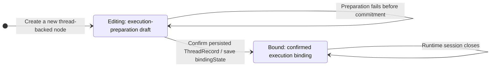
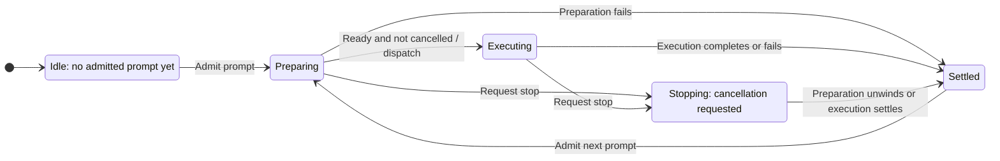

# Server-Owned Agent Node State Machine

Status: Proposed
Last updated: 2026-09-14
Issue: [#163](https://github.com/microsoft/Huabu/issues/163)

## Context and scope

Huabu currently uses `agentBindingPolicy` both for pre-message Profile selection and as a proxy for lifecycle ownership: fixed Agent Nodes receive server-authored lifecycle updates, while selectable Question Nodes retain browser-authored updates. Binding mutability should not decide who owns execution state.

This proposal defines one Huabu Server-owned Agent Node FSM, with two separate dimensions: **execution binding** and **prompt invocation**. It targets a small personal-use application with one Huabu Server, not a distributed orchestration system. It is a proposed contract, not a description of shipped behavior or authorization to implement it.

Reuse `AgentThreadService`, canonical realization, `AgentNodeLifecycle`, and existing Canvas persistence and synchronization. Do not introduce another Agent runtime, FSM library, event journal, or automatic recovery subsystem.

## Terminology and ownership

| Concept                     | Meaning                                                                                                       | Authority                                                                 |
| --------------------------- | ------------------------------------------------------------------------------------------------------------- | ------------------------------------------------------------------------- |
| Execution-preparation draft | Selected Profile and explicit launch overrides saved before execution binding is established                  | Huabu Canvas Node                                                         |
| Execution binding           | Monotonic Editing-to-Bound business state persisted on the node after confirming a canonical execution record | Huabu owns the node state; Agenetes ThreadStore supplies the binding fact |
| Prompt invocation           | One admitted prompt, from preparation through settlement                                                      | Huabu `AgentThreadService`                                                |
| Execution facts             | Workload realization, run events/results, control acknowledgements and existing history                       | Agenetes, interpreted by Huabu                                            |
| Browser-local state         | Unsent input, pending edits, saving, request progress and connection indicators                               | Browser                                                                   |
| Result attention            | Whether the user has viewed the current terminal result                                                       | User acknowledgement, validated by Huabu                                  |

A node may already have a `threadId` without an execution binding. Conversely, an established binding does not mean a process is resident or a prompt is running. Avoid the term "configuration identity": configuration is data; execution binding is the relationship established from it.

## 1. Execution-binding FSM



This diagram describes a new node. A persisted Bound node stays Bound when loaded; it does not recreate a draft. An Editing or legacy node may already have a canonical execution record and must confirm that fact before accepting a configuration change or first interaction. Missing records with existing execution history are inconsistent evidence, not permission to silently bind a different Agent.

The source of truth for establishing Bound is a validated, persisted Agenetes ThreadRecord for the node's namespace and thread. Huabu records that confirmed fact as `bindingState: bound` on the node. Neither sending a browser request, allocating a thread ID, receiving the first token, nor obtaining a native Session ID is the binding criterion. If realization succeeds but session startup or control later fails, the binding remains established.

There is no Bound-to-Editing transition for the same execution binding. Supported runtime settings may still change through existing controls; this does not mean every setting is frozen. Internal thread-associated Jobs retain their existing execution strategy and do not become a separate Agent Node type. Do not assume every workload is an immutable Deployment.

### Binding authority, query and persistence

Use the existing public Agenetes interface:

```typescript
agenetes.record(namespace, threadId): ThreadRecord | undefined
```

This is an in-process library call, not an HTTP/ACP request to the Agent. It delegates to `threadStore.get(namespace, threadId)` and validates an existing record before returning it. It is independent of a live handle and does not create a session or send a prompt/control. The existing external realization path already uses this interface.

The binding coordinator confirms that the returned record belongs to the intended thread/namespace and carries a supported canonical execution identity. Record presence must not bypass existing driver/binding validation. A native Session ID is neither persisted into the node for this purpose nor exposed as its state criterion.

| Data                                                                 | Persistence on the current Disk backend                | Role                                                                          |
| -------------------------------------------------------------------- | ------------------------------------------------------ | ----------------------------------------------------------------------------- |
| `bindingState: editing \| bound` (proposed)                          | `space.json`, in the corresponding node's `data`       | Huabu's durable, monotonic acknowledgement of binding                         |
| `threadId`, selected `agentBinding`, explicit `agentLaunchOverrides` | `space.json`, in node `data`                           | Node association and execution-preparation configuration                      |
| Canonical ThreadRecord / WorkloadSpec                                | `.history/threads.json`, owned by Agenetes ThreadStore | Source of truth for confirming binding and for actual execution configuration |
| Node text and content metadata                                       | `nodes/<label>.md` body and frontmatter                | Authored content, not binding-state persistence                               |

There is one `space.json` per Space, not one `canvas.json` per Agent Node. Application modules use existing Canvas/storage and Agenetes interfaces rather than reading or editing these files directly.

`bindingState` is separate from the prompt result's `status`. Bound is a persisted acknowledgement of an established fact, not a second editable copy of WorkloadSpec and not a continuously refreshed runtime-presence cache. Ordinary editability checks use the node's state; they do not query Agenetes again for a Bound node. Runtime dispatch still uses Agenetes execution records normally.

| Boundary                                                                          | Query and write behavior                                                                              |
| --------------------------------------------------------------------------------- | ----------------------------------------------------------------------------------------------------- |
| Load or display an already Bound node                                             | Read node metadata; no additional ThreadStore lookup solely to determine editability                  |
| Accept a draft configuration edit or first interaction for an Editing/legacy node | Query the canonical record through the binding coordinator; reuse the result within this operation    |
| Existing valid record found                                                       | Persist Bound and use canonical execution identity; reject a requested incompatible draft edit        |
| No record and no conflicting execution evidence                                   | Allow draft editing, or realize on actual interaction; confirm the resulting record and persist Bound |
| Token event, browser render or layout operation                                   | No binding-state lookup or transition                                                                 |

An absent legacy field is unconfirmed, not proof of a genuinely fresh thread. Existing records are recognized lazily at the relevant operation boundary; no whole-Space migration scan or polling loop is required.

### Ordering and the small partial-write case

The ordering is canonical ThreadRecord persistence, confirmation through the existing record interface, then the Canvas write of Bound. A failed Bound write must be surfaced and must not be treated as a successful transition by the caller. It cannot roll back the canonical binding.

If the record exists but the node still says Editing because the Canvas write failed or the process stopped, the next guarded edit/interaction recognizes the record and completes the one-way promotion before proceeding. Do this on an explicit operation path, not as an incidental GET side effect. This is bounded completion of one business transition, not an automatic turn-recovery system.

Keep draft-edit acceptance and first binding ordered through the same local coordination boundary so an edit cannot pass its check and overwrite preparation configuration while realization commits. Reuse existing process-local coordination and keep this critical section focused; no cross-store transaction or distributed lock is proposed.

Once Bound is persisted, a missing or invalid ThreadRecord produces an explicit execution-record error; it never resets the node to Editing. Ordinary Canvas saves and undo cannot demote Bound or modify the established execution-preparation configuration. Supported runtime controls remain separate. This supersedes the earlier decision to defer all post-binding configuration-write restrictions, but does not imply a general authored-content or Canvas write firewall.

## 2. Prompt-invocation FSM



Settled carries an outcome; it is not the end of the thread. The next prompt uses the same execution binding and a new invocation identity.

Rejected requests do not create transitions. Admission must not replace an unsettled invocation. Preserve the existing admission mechanism, including any waiting behavior; waiting for admission is not an admitted prompt. Install cancellation tracking before slow preparation, and do not dispatch after cancellation has intervened.

A stop acknowledgement means cancellation was requested, not that execution ended. Retain admission until actual settlement. A late stop does not rewrite an already established completion or failure as cancellation.

### How the two diagrams relate

| Operation                           | Execution binding                                           | Prompt invocation                          |
| ----------------------------------- | ----------------------------------------------------------- | ------------------------------------------ |
| Save valid draft / open panel       | Editing stays Editing; opening a Bound node leaves it Bound | No change                                  |
| First prompt                        | May become Bound during preparation                         | Preparing -> Executing -> Settled          |
| First external control              | May become Bound                                            | No change; no prompt is invented           |
| Control fails after commitment      | Remains Bound                                               | No change to the previous prompt's outcome |
| Preparation fails before commitment | Remains Editing                                             | Settled with failure                       |
| Preparation fails after commitment  | Remains Bound                                               | Settled with failure                       |
| Follow-up prompt                    | Remains Bound                                               | New invocation                             |

Controls retain their existing driver semantics; the diagrams do not impose blanket mutual exclusion between all controls and prompts. First-interaction realization must still use the existing canonical coordination rather than creating competing execution identities.

## 3. Persisted projection, not a second runtime

Keep the existing Canvas status vocabulary:

| Server invocation state/outcome  | Node `status`                                |
| -------------------------------- | -------------------------------------------- |
| No admitted prompt               | `idle` or absent                             |
| Preparing / Executing / Stopping | `running`                                    |
| Normal completion                | `done`                                       |
| Confirmed cancellation           | `done`, preserving current node presentation |
| Preparation or execution failure | `error`                                      |

The live phase, cancellation controller and settlement guard stay in the existing server invocation object. Agenetes does not expose a universal Agent Node lifecycle enum: Huabu maps supported execution facts, not opaque driver state.

Propose one server-authored current-invocation token on the node. Replace it at admission and retain it with the result. Check it at the serialized write boundary to prevent an old completion from modifying a newer invocation, and use it to validate viewed acknowledgements. It is not a durable Agenetes turn identifier or a restart-recovery log; exact field/API names remain an implementation detail.

Persist `status`, `errorMessage`, the token and result attention through the existing Canvas writer, alongside the separate monotonic `bindingState`. Ordinary browser structure saves and inverse operations must preserve server-owned lifecycle metadata rather than restore stale snapshots or demote Bound. Enforce the binding-specific configuration rule above without redesigning general Canvas or authored-content editing.

## 4. Commands and effects

| Command or fact            | Required effect                                                                                               |
| -------------------------- | ------------------------------------------------------------------------------------------------------------- |
| Draft edit                 | Save through existing Canvas editing; no workload or session creation                                         |
| First interaction          | Use the intended acknowledged saved configuration; do not substitute stale ChatStore values                   |
| Accepted prompt            | Publish the new token and running state before dispatch; a failed initial projection prevents dispatch        |
| First accepted user prompt | Fill an empty, never-submitted node's content using fresh state; preserve existing authored content           |
| Terminal result            | Publish the matching outcome and unread attention, then release admission with guaranteed cleanup             |
| View result                | Mark only the observed current terminal token viewed                                                          |
| Projection-write failure   | Surface/log projection failure separately from the Agent outcome; release resources without inventing success |

The first-content rule records submitted intent, not proof of model execution. Preparation failure or cancellation does not erase that text. Controls and follow-ups do not replace it. Never use a stale `status === idle` snapshot as proof that this is the first prompt.

The browser owns pending edits and request feedback, but not authoritative node running/done/error writes or history-based repair. A save queue finishing is not necessarily acknowledgement that the intended draft was saved. Fail explicitly on a conflicting selection instead of silently dispatching a different Agent.

Valid empty output is not an execution failure, and a handled tool error is not automatically a failed prompt. Existing Done/error/abort event precedence needs targeted characterization before changing adapter behavior; the ownership refactor must not silently redefine driver outcomes.

## 5. Refresh and restart boundaries

Browser refresh observes the running server and its persisted projection. Disconnection alone is not execution settlement; preserve any route's existing explicit cancellation contract.

After server restart, a persisted running node with no matching live tracking is **untracked**, not proven successful, failed, or stopped. Expose that discrepancy through server observation and existing UI feedback without a read-triggered Canvas repair, an old-history guess, or automatic replay.

For an untracked attempt, use existing supported runtime admission/status behavior if it can establish that a follow-up is safe. Otherwise report that the previous execution cannot be confirmed instead of starting a duplicate prompt. A surviving external process is not assumed dead just because Huabu's memory was lost.

Automatic reattachment, guaranteed crash recovery, durable invocation-to-turn correlation, background repair sweeps and a new recovery workflow are not prerequisites. If a concrete driver leaves ordinary personal use stuck, resolve that specific UX problem separately rather than building speculative infrastructure.

## 6. Implementation boundary and open details

| Area                   | Focused change                                                                                                                                                                        |
| ---------------------- | ------------------------------------------------------------------------------------------------------------------------------------------------------------------------------------- |
| Server coordinator     | Use one lifecycle owner for node-backed Web/direct RFS prompts regardless of policy; include cancellable preparation in the admitted lifetime                                         |
| Resolver / realization | Reuse generic node identity resolution and existing validation; confirm ThreadRecord through `agenetes.record`, persist Bound once, and use canonical execution identity for dispatch |
| Canvas projection      | Extend the existing lifecycle writer with current-invocation guards and narrowly protected fields                                                                                     |
| Browser                | Persist draft selection through existing APIs; remove policy-dependent lifecycle/rescue writes on migrated paths                                                                      |
| Contracts / docs       | Define changed HTTP/SSE fields in shared schemas and update architecture with eventual implementation                                                                                 |

Task/Run/Interactive View are currently little-used features. Per the user's 2026-09-14 scope clarification, their detailed compatibility is not an implementation-readiness gate for #163. Reuse the common binding/invocation path and make only low-cost caller adjustments needed for ordinary happy paths. Do not design task-specific edit restrictions, new association checks, owner-eligibility policies, or pre-start A-to-B rebinding race handling for these features. Their redesign remains out of scope; intentionally removing them is not part of this change. Node-less chat behavior is not converted into an Agent Node FSM.

Global deletion of `agentBindingPolicy`, Profile lock indicators, new FSM dependencies, distributed locks, cross-store transactions and general autosave/undo redesign are not required.

The binding coordinator belongs to Huabu Server's Agent Node business layer under `modules/agent/`; its exact name is not decided. It owns binding reads, guarded draft edits and first-binding orchestration through existing resolver/realization/Canvas interfaces. `AgentThreadService` owns each live prompt invocation and calls this coordinator during preparation; the external control path uses the same binding entry without creating a prompt invocation. `AgentNodeLifecycle` remains a projection writer, not a third independent state machine. No event bus or bidirectional FSM synchronization is needed.

Before implementation approval, settle the binding-state and invocation-token wire schemas, concrete field-preservation/ordering points, first-submission detection for legacy empty nodes, and driver terminal-event compatibility. Detailed Task/Run/View edge cases do not block this work. This proposal does not claim those integration details are implemented.

## 7. Acceptance scenarios

- Absent/selectable/fixed policy does not change lifecycle ownership on migrated paths.
- Creating/configuring/opening a node does not realize an Agent; first actual control can bind without creating a prompt.
- First and follow-up prompts use the same server transitions and canonical execution binding.
- Failed draft saving does not silently dispatch stale configuration.
- Preparation failure/cancellation cannot dispatch a delayed prompt or erase an established binding.
- Stop acknowledgement alone does not release admission.
- Old completion, browser snapshots and viewed acknowledgements cannot overwrite a newer invocation/result.
- Refresh observes server state; restart uncertainty does not fabricate a result or trigger replay.
- Existing Job behavior is preserved. Task/Run/View receive only low-cost happy-path coverage; their detailed edge-case compatibility is not an acceptance prerequisite.
- A validated ThreadRecord promotes Editing/legacy state to persisted Bound; subsequent editability checks on Bound do not query Agenetes.
- A failure between ThreadRecord persistence and the Bound write cannot permit rebinding; the next guarded operation completes promotion.
- Missing records, session closure, old snapshots and undo never demote a Bound node to Editing.

## 8. Implementation-readiness evaluation

Evaluation date: 2026-09-14. Baseline: `fdf5a0e4` on `fix/issue-163`, the documentation-only head of PR #178 at evaluation time. This section evaluates the proposal against existing code; recommendations below are not runtime changes or implementation authorization.

### Decisions already established

Do not reopen server ownership, persisted Editing-to-Bound, ThreadRecord confirmation via `agenetes.record`, session-independent binding, existing four-value node status, or the personal-project scope. These are the design baseline. Global policy deletion, lock indicators and automatic recovery infrastructure are not prerequisites.

A valid thread-associated Job record is binding evidence under the agreed rule, not a new product decision about a "Job Agent Node." Agenetes persists threaded Jobs, rejects a change of driver kind, and reuses a prior Deployment spec; where the prior record is not a Deployment it can use a new same-driver spec (`instance.ts:518-585`). Thus Bound freezes the agreed host binding/preparation inputs, not every byte of the internal workload or the Job/Deployment strategy.

### Remaining product questions

| Question                                                                                        | Why it matters now                                                                                                                                                                   | Recommended resolution for review                                                                                                                                                                                                                                                                                                                                                   |
| ----------------------------------------------------------------------------------------------- | ------------------------------------------------------------------------------------------------------------------------------------------------------------------------------------ | ----------------------------------------------------------------------------------------------------------------------------------------------------------------------------------------------------------------------------------------------------------------------------------------------------------------------------------------------------------------------------------- |
| Which execution-preparation fields become non-editable at Bound?                                | Existing fields mix identity, launch inputs, presentation and runtime behavior. An object-wide equality check would also freeze Profile aliases/icons or internal per-turn settings. | Protect thread association, driver/Profile identity and explicit launch overrides; keep display metadata and supported runtime controls separate. Explicitly classify internal `agentMode` (ask/operate) before implementing the guard; preserve its existing behavior rather than silently freeze it.                                                                              |
| What is the binding rule when a node is copied, forked, moved, or attached to an existing chat? | These are existing paths, not newly requested features. Copying a Bound flag onto a fresh thread would be false evidence; dropping it during move would allow a forbidden rollback.  | Plain copies start a new Editing identity and clear old invocation metadata; successful conversation forks and attaching an existing realized chat confirm their own record and become Bound; moves preserve binding. Keep existing plain-copy versus conversation-fork behavior, including a control-only node with no prompt history, unless the user explicitly changes that UX. |

An admitted prompt that fails before realization may retain its submitted text while remaining Editing. The selector must therefore stop treating node `status`, a locally appended user message, or nonempty content as equivalent to Bound. This follows the two-axis model and does not require another state.

Task/Run/View compatibility was initially listed as a review question in this evaluation. The user's subsequent scope decision removes it: the common Editing/Bound rule should not acquire extra restrictions merely to preserve these little-used callers' historical fixed behavior. Do not spend design effort deciding whether a Run accepts a pre-start Profile change; retain cheap normal-path integration and report a concrete limitation if encountered, without making it a new compatibility project.

### Engineering details to settle without expanding the product scope

| Detail                     | Focused implementation direction                                                                                                                                                                                                                                                                                                                |
| -------------------------- | ----------------------------------------------------------------------------------------------------------------------------------------------------------------------------------------------------------------------------------------------------------------------------------------------------------------------------------------------- |
| Exact type and API names   | Define the binding state and current invocation/acknowledgement contracts once in shared types/schemas; keep absent legacy state distinguishable from confirmed Bound. Module naming is not a user decision.                                                                                                                                    |
| Draft save acknowledgement | Prefer the existing Canvas execute request/response for a focused configuration edit rather than redefining every autosave. Reuse owner addressing and delta reconciliation, but not its stale optimistic fallback. Ensure initial node creation is acknowledged before an edit/dispatch targets it.                                            |
| Field ownership            | Preserve current server-owned metadata in bulk structural snapshots/inverse replay; reject incompatible explicit binding edits. Validate user-facing transitions, not merely field presence. Share one decision helper across writers rather than a separate rule per endpoint.                                                                 |
| Local ordering             | Extend existing admission/realization coordination to reserve first binding against draft edits, and keep Canvas critical sections short. Do not wait for a turn while holding a Canvas write lock or recursively acquire the executor's non-reentrant lock. Final lock ordering must include move and be demonstrated with interleaving tests. |
| Internal realization seam  | Add an awaited confirmation/projection seam immediately after existing internal `agenetes.create()` and before controls/run, or extract that small preparation boundary. Do not create a second internal runner just to match the external API shape.                                                                                           |
| Terminal interpretation    | Characterize current Done/error/abort behavior and centralize it. Preserve handled tool errors and valid empty output; do not silently replace the adapter contract with "any error wins."                                                                                                                                                      |
| Untracked execution        | Return explicit server-observed uncertainty through an existing thread read/control surface, without a repair-on-GET or replay loop. Use existing runtime admission where sufficient; otherwise surface the limitation rather than add automatic recovery.                                                                                      |

### Source-to-target gap matrix

Sizes below are relative integration effort, not calendar estimates. "High" means several existing paths must change together, not that a new infrastructure layer is needed.

| Surface and source anchors at the baseline                                                                                                                   | Existing behavior                                                                                                                                                                    | Required change / reuse                                                                                                                                                           | Gap                             |
| ------------------------------------------------------------------------------------------------------------------------------------------------------------ | ------------------------------------------------------------------------------------------------------------------------------------------------------------------------------------ | --------------------------------------------------------------------------------------------------------------------------------------------------------------------------------- | ------------------------------- |
| Shared node/API contract: `types/canvas/node.ts:781-827`, `types/api/canvas.ts`                                                                              | No binding state or invocation token; World-reference source shape is separately bounded                                                                                             | Add narrow shared fields/guards and propagate observation/ack identity where needed; no new storage file                                                                          | Low-medium                      |
| Creation/configuration: `questionCompose.ts:94-120`, `chatStore.ts:setAgentBinding`, `ChatPanel/index.tsx:704-728`, `agent-node.service.ts:254-272`          | Web birth omits binding and inherits ChatStore selection; picker writes local state; server-created nodes carry fixed policy and configuration                                       | Save initial/changed drafts, reconcile authoritative selection, and use common binding-state guards without new Task/Run/View-specific restrictions                               | Medium                          |
| Binding resolver/external realization: `agent-thread-resolver.ts:102-196`, `external-agent-realization.ts:195-335`                                           | Generic identity exists, but rich binding/overrides are fixed-target-specific; canonical record read/create and single-flight already exist                                          | Generalize validated configuration resolution; add confirm-and-promote coordinator reused by prompt/control and guarded edits                                                     | Medium                          |
| Internal realization: `agent.service.ts:258-322`, `agent-thread.service.ts:501-528`, `skill-model-routing.ts:58-70`                                          | Internal record is created inside the lazy run path; first runtime settings precede `handle.run`; skill dispatch can request a Job                                                   | Promote Bound at the actual create seam even if later control/run fails; preserve existing internal spec and runtime behavior                                                     | Medium                          |
| Invocation: `agent-thread.service.ts:248-391,439-466`                                                                                                        | External realization precedes admission/cancellation tracking; fixed-only lifecycle; cleanup and turn readiness already exist                                                        | Cover preparation in admitted lifetime, use one lifecycle owner, fence current attempt and keep admission through settlement                                                      | Medium-high                     |
| Projection: `agent-node-lifecycle.ts:39-91`                                                                                                                  | Fixed target; first content inferred from resolver snapshot; queued writes without invocation identity                                                                               | Reuse writer/queue but resolve fresh content and guard at actual write; separate first-submission intent from execution result                                                    | Medium                          |
| Canonical Canvas writers: `canvas.route.ts:1155-1283`, `canvas-executor.ts:674-709,1115-1248`                                                                | Structure PUT accepts metadata wholesale with version CAS; executor/inverse replay use Canvas mutex, but PUT is not enclosed by it                                                   | Apply the same monotonic/field-ownership decision at all three final-write paths; coordinate first binding without holding a whole Canvas during model work                       | High                            |
| Browser lifecycle/ack: `useAgentStream.ts:857-928,1008-1176`, `useChatHistory.ts:278-465`, `conversationOwner.ts:123-128,192-242`                            | Selectable lifecycle and reconnect repair are client-authored; viewed is a plain boolean; response fallback can reapply an old optimistic patch                                      | Remove duplicate lifecycle authority; send current-result acknowledgement; do not reapply stale state after newer SSE                                                             | Medium-high                     |
| Dirty-content sync: `canvasStore.ts:1537-1605`                                                                                                               | A dirty node drops the whole incoming REPLACE_NODE, while version still advances                                                                                                     | Preserve local authored content but accept server-owned binding/lifecycle metadata; otherwise the browser can remain Editing/running after a valid server transition              | Medium, mandatory               |
| Save acknowledgement: `canvasStore.ts:2102-2210`, `conversationOwner.ts:192-242`                                                                             | `saveCanvas` can resolve after coalescing/conflict/failure; direct executor patch has an applied result                                                                              | Use exact edit acknowledgement; avoid broad navigation/autosave redesign                                                                                                          | Medium                          |
| Copy/fork/save-chat/move: `resolvePasteClipboard.ts:121-138`, `canvasStore.ts:3754-3839`, `ChatPanel/index.tsx:749-765`, `space-move.service.ts:204,281-318` | Runtime reset has no future fields; fork clones metadata before async success; save-chat attaches an existing thread; move holds Canvas locks and tries a turn lease without waiting | Initialize by thread identity/evidence, not source flag; clear old invocation tokens on fresh identity; preserve Bound on move and account for its existing nonblocking admission | Medium                          |
| Task/Run/View callers                                                                                                                                        | Share fixed-target creation/validation and invocation paths                                                                                                                          | Reuse the common path with low-cost happy-path adjustments only; no dedicated race/eligibility analysis or special binding rules                                                  | Low priority; not a design gate |

The dirty-content filter and node-copy/attachment paths are additional integration requirements beyond the original six-step outline. They follow directly from introducing authoritative persisted metadata and do not justify general sync or copy-system redesign.

### Feasibility and implementation order

The design is feasible with existing Huabu/Agenetes services. The largest work is closing metadata write/sync gaps and migrating both client and server together, not adding the FSM enum. It is a medium-to-large cross-layer change, not a two-file policy replacement. No Agenetes protocol change is currently required; internal realization needs a Huabu-side integration seam.

1. Resolve the frozen-field and node-identity questions above and write exact shared transition/ack contracts plus focused invariants.
2. Implement binding confirmation, monotonic Canvas writes and initial draft persistence as one coherent path; include existing-node/copy/fork/attachment handling.
3. Unify admitted preparation/execution/settlement and wire the internal/external realization seams; retain cleanup and stop semantics.
4. Switch Web lifecycle to observation and guarded acknowledgement, including dirty-content metadata merge and selector/cache behavior. Do not hand off with two competing authoritative writers.
5. Add narrow untracked-state feedback, complete core-path regressions and low-cost caller smoke coverage, and update architecture with shipped behavior. Do not block the core migration on Task/Run/View edge cases.

These are implementation slices, not permission to publish a partially migrated feature. Runtime implementation remains unapproved while this document is reviewed.

### Existing baseline and regression additions

Focused baseline execution at this revision passed 52 server tests across seven files (`agent-thread.service`, `agent-node-lifecycle`, `agent-thread-resolver`, `acp/external-agent-realization`, `acp/threads.route`, `skill-model-routing`, `canvas/space-move.service`) and 23 Web tests across five files (`useAgentStream.sessionMeta`, `useChatHistory`, `conversationOwner`, `canvasStore.structureSaveReconciliation`, `questionCompose`). These tests describe current behavior; they do not prove that the proposed FSM or new guards exist.

Extend those suites and the existing Canvas writer/copy suites to cover: Editing with an existing record; create-success/promotion-failure; first control with no user message; cancellation during preparation; Job-to-ordinary-prompt binding retention; fixed/selectable lifecycle equivalence; explicit versus stale-snapshot binding edits; dirty content plus Bound/terminal SSE; old result/viewed token; ordinary copy, completed fork and saved chat; move during first realization; and simple untracked reporting without replay.

## Code and design references

| Reference                                                                                     | Responsibility                                         |
| --------------------------------------------------------------------------------------------- | ------------------------------------------------------ |
| [AgentThreadService](../../apps/server/src/modules/agent/agent-thread.service.ts)             | Admission, cancellation, dispatch and settlement       |
| [AgentNodeLifecycle](../../apps/server/src/modules/agent/agent-node-lifecycle.ts)             | Existing server projection writer                      |
| [AgentThreadResolver](../../apps/server/src/modules/agent/agent-thread-resolver.ts)           | Generic and fixed-target resolution                    |
| [External realization](../../apps/server/src/modules/agent/acp/external-agent-realization.ts) | Canonical first-interaction realization                |
| [Question Node architecture](../architecture/question-node.md)                                | Current persisted fields and split lifecycle ownership |
| [Agent architecture](../architecture/agent-architecture.md)                                   | Existing runtime and transport                         |
| [API design](../architecture/api-design.md)                                                   | Shared wire-contract rules                             |
| [Canonical realization proposal](./external-agent-capability-cache-and-realization.md)        | Capability reads versus real interaction               |
