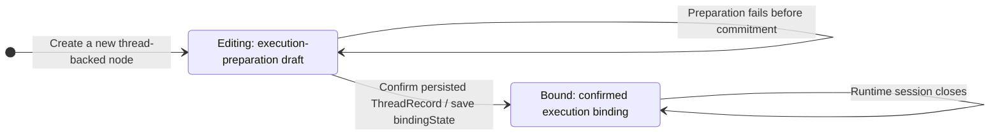
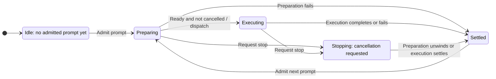

# Server-Owned Agent Node State Machine

Status: Implemented (pending merge)
Last updated: 2026-09-15
Issue: [#163](https://github.com/microsoft/Huabu/issues/163)

## Context and scope

Before this change, Huabu used `agentBindingPolicy` both for pre-message Profile selection and as a proxy for lifecycle ownership: fixed Agent Nodes received server-authored lifecycle updates, while selectable Question Nodes retained browser-authored updates. Binding mutability must not decide who owns execution state.

This approved design defines one Huabu Server-owned Agent Node FSM, with two separate dimensions: **execution binding** and **prompt invocation**. It targets a small personal-use application with one Huabu Server, not a distributed orchestration system. The implementation is complete on `fix/issue-163` pending merge; current behavior is documented in [Question Node](../architecture/question-node.md), [Agent architecture](../architecture/agent-architecture.md), [Canvas commands](../architecture/canvas-command-architecture.md), and [Canvas sync](../architecture/canvas-realtime-sync.md). The sections below preserve the approved contract and implementation plan.

Reuse `AgentThreadService`, canonical realization, `AgentNodeLifecycle`, and existing Canvas persistence and synchronization. Do not introduce another Agent runtime, FSM library, event journal, or automatic recovery subsystem.

## Terminology and ownership

| Concept                     | Meaning                                                                                                       | Authority                                                                 |
| --------------------------- | ------------------------------------------------------------------------------------------------------------- | ------------------------------------------------------------------------- |
| Execution-preparation draft | Selected Profile and explicit launch overrides saved before execution binding is established                  | Huabu Canvas Node                                                         |
| Execution binding           | Monotonic Editing-to-Bound business state persisted on the node after confirming a canonical execution record | Huabu owns the node state; Agenetes ThreadStore supplies the binding fact |
| Prompt invocation           | One admitted prompt, from preparation through settlement                                                      | Huabu `AgentThreadService`                                                |
| Execution facts             | Workload realization, run events/results, control acknowledgements and existing history                       | Agenetes, interpreted by Huabu                                            |
| Browser-local state         | Unsent input, pending edits, saving, request progress and connection indicators                               | Browser                                                                   |
| Result attention            | Whether the user has viewed the current terminal result                                                       | User acknowledgement, validated by Huabu                                  |

A node may already have a `threadId` without an execution binding. Conversely, an established binding does not mean a process is resident or a prompt is running. Avoid the term "configuration identity": configuration is data; execution binding is the relationship established from it.

## 1. Execution-binding FSM



This diagram describes a new node. A persisted Bound node stays Bound when loaded; it does not recreate a draft. An Editing or legacy node may already have a canonical execution record and must confirm that fact before accepting a configuration change or first interaction. Missing records with existing execution history are inconsistent evidence, not permission to silently bind a different Agent.

The source of truth for establishing Bound is a validated, persisted Agenetes ThreadRecord for the node's namespace and thread. Huabu records that confirmed fact as `bindingState: bound` on the node. Neither sending a browser request, allocating a thread ID, receiving the first token, nor obtaining a native Session ID is the binding criterion. If realization succeeds but session startup or control later fails, the binding remains established.

There is no Bound-to-Editing transition for the same execution binding. Supported runtime settings may still change through existing controls; this does not mean every setting is frozen. Internal thread-associated Jobs retain their existing execution strategy and do not become a separate Agent Node type. Do not assume every workload is an immutable Deployment.

### Binding authority, query and persistence

Use the existing public Agenetes interface:

```typescript
agenetes.record(namespace, threadId): ThreadRecord | undefined
```

This is an in-process library call, not an HTTP/ACP request to the Agent. It delegates to `threadStore.get(namespace, threadId)` and validates an existing record before returning it. It is independent of a live handle and does not create a session or send a prompt/control. The existing external realization path already uses this interface.

The binding coordinator confirms that the returned record belongs to the intended thread/namespace and carries a supported canonical execution identity. Record presence must not bypass existing driver/binding validation. A native Session ID is neither persisted into the node for this purpose nor exposed as its state criterion.

| Data                                                                 | Persistence on the current Disk backend                | Role                                                                          |
| -------------------------------------------------------------------- | ------------------------------------------------------ | ----------------------------------------------------------------------------- |
| `bindingState: editing \| bound` (proposed)                          | `space.json`, in the corresponding node's `data`       | Huabu's durable, monotonic acknowledgement of binding                         |
| `threadId`, selected `agentBinding`, explicit `agentLaunchOverrides` | `space.json`, in node `data`                           | Node association and execution-preparation configuration                      |
| Canonical ThreadRecord / WorkloadSpec                                | `.history/threads.json`, owned by Agenetes ThreadStore | Source of truth for confirming binding and for actual execution configuration |
| Node text and content metadata                                       | `nodes/<label>.md` body and frontmatter                | Authored content, not binding-state persistence                               |

These physical paths describe Disk only. SQLite stores Space/node records and Agenetes conversation records through the existing storage adapters. Application modules use the portable `space(canvasId)` facade and `agenetes.record()`; `conversation-stores.ts` dispatches to the existing backing for the namespace. No new persistence layer, direct file access, or new database transaction is needed for this FSM.

`bindingState` is separate from the prompt result's `status`. Bound is a persisted acknowledgement of an established fact, not a second editable copy of WorkloadSpec and not a continuously refreshed runtime-presence cache. Ordinary editability checks use the node's state; they do not query Agenetes again for a Bound node. Runtime dispatch still uses Agenetes execution records normally.

| Boundary                                                                          | Query and write behavior                                                                              |
| --------------------------------------------------------------------------------- | ----------------------------------------------------------------------------------------------------- |
| Load or display an already Bound node                                             | Read node metadata; no additional ThreadStore lookup solely to determine editability                  |
| Accept a draft configuration edit or first interaction for an Editing/legacy node | Query the canonical record through the binding coordinator; reuse the result within this operation    |
| Existing valid record found                                                       | Persist Bound and use canonical execution identity; reject a requested incompatible draft edit        |
| No record and no conflicting execution evidence                                   | Allow draft editing, or realize on actual interaction; confirm the resulting record and persist Bound |
| Token event, browser render or layout operation                                   | No binding-state lookup or transition                                                                 |

An absent legacy field is unconfirmed, not proof of a genuinely fresh thread. Existing records are recognized lazily at the relevant operation boundary; no whole-Space migration scan or polling loop is required.

### Ordering and the small partial-write case

Timing clarification accepted during the 2026-09-14 sequence review: creating a Canvas Agent Node is not `agenetes.create(spec)`. Agenetes writes the durable ThreadRecord during `create()`, before returning the handle, for Deployments and thread-associated Jobs; it does not wait for `handle.run()` or `handle.control()`. Huabu defers that create call until an actual first interaction. The first-interaction order is saved draft, canonical create/record confirmation, persisted Bound, then prompt/control execution. Internal preparation exposes the same confirmation point before subsequent controls/run. Implementation was separately authorized on 2026-09-15.

The ordering is canonical ThreadRecord persistence, confirmation through the existing record interface, then the Canvas write of Bound. A failed Bound write must be surfaced and must not be treated as a successful transition by the caller. It cannot roll back the canonical binding. Keep this ordering across supported persistent backends rather than relying on a Disk filename or a SQLite-specific transaction.

If the record exists but the node still says Editing because the Canvas write failed or the process stopped, the next guarded edit/interaction recognizes the record and completes the one-way promotion before proceeding. Do this on an explicit operation path, not as an incidental GET side effect. This is bounded completion of one business transition, not an automatic turn-recovery system.

Keep draft-edit acceptance and first binding ordered through the same local coordination boundary so an edit cannot pass its check and overwrite preparation configuration while realization commits. Reuse existing process-local coordination and keep this critical section focused; no cross-store transaction or distributed lock is proposed.

Once Bound is persisted, a missing or invalid ThreadRecord produces an explicit execution-record error; it never resets the node to Editing. Ordinary Canvas saves and undo cannot demote Bound or modify the established execution-preparation configuration. Supported runtime controls remain separate. This supersedes the earlier decision to defer all post-binding configuration-write restrictions, but does not imply a general authored-content or Canvas write firewall.

## 2. Prompt-invocation FSM



Settled carries an outcome; it is not the end of the thread. The next prompt uses the same execution binding and a new invocation identity.

Rejected requests do not create transitions. Admission must not replace an unsettled invocation. Preserve the existing admission mechanism, including any waiting behavior; waiting for admission is not an admitted prompt. Install cancellation tracking before slow preparation, and do not dispatch after cancellation has intervened.

A stop acknowledgement means cancellation was requested, not that execution ended. Retain admission until actual settlement. A late stop does not rewrite an already established completion or failure as cancellation.

### How the two diagrams relate

| Operation                           | Execution binding                                           | Prompt invocation                          |
| ----------------------------------- | ----------------------------------------------------------- | ------------------------------------------ |
| Save valid draft / open panel       | Editing stays Editing; opening a Bound node leaves it Bound | No change                                  |
| First prompt                        | May become Bound during preparation                         | Preparing -> Executing -> Settled          |
| First external control              | May become Bound                                            | No change; no prompt is invented           |
| Control fails after commitment      | Remains Bound                                               | No change to the previous prompt's outcome |
| Preparation fails before commitment | Remains Editing                                             | Settled with failure                       |
| Preparation fails after commitment  | Remains Bound                                               | Settled with failure                       |
| Follow-up prompt                    | Remains Bound                                               | New invocation                             |

Controls retain their existing driver semantics; the diagrams do not impose blanket mutual exclusion between all controls and prompts. First-interaction realization must still use the existing canonical coordination rather than creating competing execution identities.

## 3. Persisted projection, not a second runtime

Keep the existing Canvas status vocabulary:

| Server invocation state/outcome  | Node `status`                                |
| -------------------------------- | -------------------------------------------- |
| No admitted prompt               | `idle` or absent                             |
| Preparing / Executing / Stopping | `running`                                    |
| Normal completion                | `done`                                       |
| Confirmed cancellation           | `done`, preserving current node presentation |
| Preparation or execution failure | `error`                                      |

The live phase, cancellation controller and settlement guard stay in the existing server invocation object. Agenetes does not expose a universal Agent Node lifecycle enum: Huabu maps supported execution facts, not opaque driver state.

Persist one server-authored current-invocation token (`invocationToken`) on the node. Replace it at admission and retain it with the result. Check it at the serialized write boundary to prevent an old completion from modifying a newer invocation, and use it to validate viewed acknowledgements. It is not a durable Agenetes turn identifier or a restart-recovery log.

Persist `status`, `errorMessage`, the token and result attention through the existing Canvas writer, alongside the separate monotonic `bindingState`. Separate the complete node read model from owner-specific write contracts: ordinary Canvas edits do not submit FSM-owned fields, and ordinary undo does not restore them. Server-side validation enforces this boundary rather than treating every incoming node snapshot as writable state.

### Field ownership and write contracts

Owner means the business component authorized to decide a value, not the component that physically writes the file. All persistence still passes through Huabu Server. Both browser and server may read a complete Node; that read model is not a replacement-write DTO.

| Field group                                                        | Decision owner                                                        | Write contract                                                                                |
| ------------------------------------------------------------------ | --------------------------------------------------------------------- | --------------------------------------------------------------------------------------------- |
| Layout, authored content and ordinary editable presentation fields | Canvas editing business path, including authorized user/Agent edits   | Submit the intended editable fields through existing content or Canvas operations             |
| Execution-preparation configuration                                | Canvas editing path while Editing, guarded by the binding coordinator | Submit an explicit draft edit; reject incompatible preparation changes after Bound            |
| `bindingState`                                                     | Server binding coordinator                                            | Confirm canonical ThreadRecord, then perform the one-way transition                           |
| Invocation `status`, `errorMessage`, current-invocation token      | Server invocation coordinator, projected by AgentNodeLifecycle        | Apply a transition for the identified current invocation                                      |
| `viewed` / result attention                                        | Server validates user observation of a particular terminal result     | Submit an acknowledgement identifying the observed result, not an arbitrary boolean overwrite |
| Node/thread association                                            | Server-validated creation, attachment, fork or move path              | Not a freely editable field in an ordinary node patch                                         |

The existing first-submitted-content initialization is a narrowly defined server effect through the authored-content path: fill an empty never-submitted node using fresh state. It does not give the FSM authority to overwrite later user-authored content.

**Remove unrestricted whole-Node replacement semantics from ordinary client saves, not necessarily the HTTP PUT method.** A batched layout save can still use PUT, but its request contains the supported editable fields rather than serializing every property of `node.data`. The server composes the persisted record from the current node and the permitted edit, so omitted FSM fields remain unchanged rather than being deleted. Existing topology creation/deletion rules remain explicit; absence of a protected field is not an instruction to reset it.

Use shared, bounded edit schemas/projections for the affected Agent Node surfaces. Apply the same ownership boundary to ordinary `MERGE_NODE_DATA` commands: merely selecting a different endpoint or marking a request as system-originated must not let a client forge FSM transitions. Server transitions use the trusted business path. No general-purpose permission registry or per-field ACL framework is required.

Undo/redo records the editable effect of a user operation. Undoing a drag restores position, not an older binding or invocation state. Server FSM transitions do not enter ordinary UI undo. While adapting existing snapshot/inverse machinery, project its effects onto the permitted editable fields and retain current server state; do not replay historical complete nodes as authoritative replacements. An explicit configuration undo is still subject to the current Editing/Bound rule.

The migrated client omits FSM-owned fields; the server does not accept them as ordinary edits. If handling old full snapshots is necessary during migration, any stripping adapter must be explicit and bounded, not a permanent ambiguity in the new contract. There is no requirement to rewrite unrelated node APIs or general Canvas storage in #163.

Omitted fields mean unchanged; clearing is explicit and field-specific, such as empty authored text or a supported launch-override reset. Do not convert every `undefined` into an empty string. Keep internal `agentMode` outside driver/Profile identity comparisons and preserve existing ask/operate behavior.

On reads and SSE updates, merge authoritative FSM metadata even when local authored content is dirty. Main already handles metadata-only REPLACE_NODE deltas by preserving local content and comparing content metadata by value. Reuse that path. The remaining change is a mixed content-plus-FSM delta: retain the existing content-conflict/rebase behavior while accepting the server-owned FSM fields rather than dropping them with the conflicting content. Do not turn this into general field-level sync or change geometry/deletion conflict policy.

Preserve the existing auto-accept preference, manual change-card revert and editable-operation undo. Auto-accept suppresses new Agent review records, not broadcasts or local undo snapshots; it is not an ownership guard. FSM-only transitions must not create ordinary undo effects, and replay of an editable effect must preserve current FSM fields regardless of this preference.

## 4. Commands and effects

Presentation and interaction compatibility, confirmed by the user on 2026-09-14: this work migrates state ownership and prevents stale writes; it does not redefine user-visible status meanings, badges, stop behavior, viewed interaction, or first-prompt presentation. The rules below describe the intended compatibility target, not approval for a new UX. Preserve supported existing behavior and characterize any differences between current paths before unifying them. If a difference requires a visible behavior change, report it explicitly rather than silently selecting a new definition.

| Command or fact            | Required effect                                                                                               |
| -------------------------- | ------------------------------------------------------------------------------------------------------------- |
| Draft edit                 | Save through existing Canvas editing; no workload or session creation                                         |
| First interaction          | Use the intended acknowledged saved configuration; do not substitute stale ChatStore values                   |
| Accepted prompt            | Publish the new token and running state before dispatch; a failed initial projection prevents dispatch        |
| First accepted user prompt | Fill an empty, never-submitted node's content using fresh state; preserve existing authored content           |
| Terminal result            | Publish the matching outcome and unread attention, then release admission with guaranteed cleanup             |
| View result                | Mark only the observed current terminal token viewed                                                          |
| Projection-write failure   | Surface/log projection failure separately from the Agent outcome; release resources without inventing success |

The first-content rule records submitted intent, not proof of model execution. Preparation failure or cancellation does not erase that text. Controls and follow-ups do not replace it. Never use a stale `status === idle` snapshot as proof that this is the first prompt.

The browser owns pending edits and request feedback, but not authoritative node running/done/error writes or history-based repair. A save queue finishing is not necessarily acknowledgement that the intended draft was saved. Fail explicitly on a conflicting selection instead of silently dispatching a different Agent.

Valid empty output is not an execution failure, and a handled tool error is not automatically a failed prompt. Existing Done/error/abort event precedence needs targeted characterization before changing adapter behavior; the ownership refactor must not silently redefine driver outcomes.

## 5. Refresh and restart boundaries

Browser refresh observes the running server and its persisted projection. Disconnection alone is not execution settlement; preserve any route's existing explicit cancellation contract.

After server restart, a persisted running node with no matching live tracking is **untracked**, not proven successful, failed, or stopped. This is an internal description of missing evidence, not a new persisted status or required UI state. Preserve existing observation/error surfaces without a read-triggered Canvas repair, an old-history guess, or automatic replay. A new "unknown" badge, notice, resolution action or interaction flow is not part of this PR.

For an untracked attempt, reuse existing supported runtime admission/status behavior. Do not introduce a new blanket retry prohibition or recovery interaction, and do not invent successful completion or automatically launch a duplicate prompt. If moving authority to the server exposes a concrete case that cannot preserve existing behavior safely, report that case rather than designing a new recovery policy. A surviving external process is not assumed dead just because Huabu's memory was lost.

Automatic reattachment, guaranteed crash recovery, durable invocation-to-turn correlation, background repair sweeps and a new recovery workflow are not prerequisites. If a concrete driver leaves ordinary personal use stuck, resolve that specific UX problem separately rather than building speculative infrastructure.

## 6. Implementation boundary and open details

| Area                   | Focused change                                                                                                                                                                        |
| ---------------------- | ------------------------------------------------------------------------------------------------------------------------------------------------------------------------------------- |
| Server coordinator     | Use one lifecycle owner for node-backed Web/direct RFS prompts regardless of policy; include cancellable preparation in the admitted lifetime                                         |
| Resolver / realization | Reuse generic node identity resolution and existing validation; confirm ThreadRecord through `agenetes.record`, persist Bound once, and use canonical execution identity for dispatch |
| Canvas projection      | Reuse the lifecycle writer for trusted transitions; separate ordinary edit DTOs and undo effects from FSM-owned fields, retaining invocation guards                                   |
| Browser                | Persist draft selection through existing APIs; remove policy-dependent lifecycle/rescue writes on migrated paths                                                                      |
| Contracts / docs       | Define changed HTTP/SSE fields in shared schemas and update architecture with eventual implementation                                                                                 |

Task/Run/Interactive View are currently little-used features. Per the user's 2026-09-14 scope clarification, their detailed compatibility is not an implementation-readiness gate for #163. Reuse the common binding/invocation path and make only low-cost caller adjustments needed for ordinary happy paths. Do not design task-specific edit restrictions, new association checks, owner-eligibility policies, or pre-start A-to-B rebinding race handling for these features. Their redesign remains out of scope; intentionally removing them is not part of this change. Node-less chat behavior is not converted into an Agent Node FSM.

Global deletion of `agentBindingPolicy`, Profile lock indicators, new FSM dependencies, distributed locks, cross-store transactions and general autosave/undo redesign are not required.

The binding coordinator belongs to Huabu Server's Agent Node business layer under `modules/agent/`; its exact name is not decided. It owns binding reads, guarded draft edits and first-binding orchestration through existing resolver/realization/Canvas interfaces. `AgentThreadService` owns each live prompt invocation and calls this coordinator during preparation; the external control path uses the same binding entry without creating a prompt invocation. `AgentNodeLifecycle` remains a projection writer, not a third independent state machine. No event bus or bidirectional FSM synchronization is needed.

The product choices are settled. Shared edit/transition/ack schemas, local ordering and adapter characterization are implementation deliverables, not another product-design gate. Section 8 records the implemented work against the merged baseline. Runtime implementation was explicitly authorized on 2026-09-15.

## 7. Acceptance scenarios

- Absent/selectable/fixed policy does not change lifecycle ownership on migrated paths.
- Creating/configuring/opening a node does not realize an Agent; first actual control can bind without creating a prompt.
- First and follow-up prompts use the same server transitions and canonical execution binding.
- Failed draft saving does not silently dispatch stale configuration.
- Preparation failure/cancellation cannot dispatch a delayed prompt or erase an established binding.
- Stop acknowledgement alone does not release admission.
- Old completion, browser snapshots and viewed acknowledgements cannot overwrite a newer invocation/result.
- Refresh observes server state; restart uncertainty does not fabricate a result or trigger replay.
- Existing Job behavior is preserved. Task/Run/View receive only low-cost happy-path coverage; their detailed edge-case compatibility is not an acceptance prerequisite.
- A validated ThreadRecord promotes Editing/legacy state to persisted Bound; subsequent editability checks on Bound do not query Agenetes.
- A failure between ThreadRecord persistence and the Bound write cannot permit rebinding; the next guarded operation completes promotion.
- Missing records, session closure, old snapshots and undo never demote a Bound node to Editing.
- Ordinary save and command payloads exclude FSM-owned fields; direct attempts to write them do not become accepted transitions.
- Layout/content saves preserve server metadata by construction, and undo restores only the editable effect rather than the full historical node.

## 8. Implementation plan on the merged baseline

Baseline: `origin/main` at `54d1e6cb`, merged into `fix/issue-163` as `56dc5048` on 2026-09-15. This section replaces the earlier gap matrix and repeated readiness checkpoints; prior review history remains in Git and the Issue Execution Note. The user authorized main integration and proposal adjustment, then authorized committing and pushing the revised proposal and integrated branch on 2026-09-15. Runtime implementation was subsequently authorized on 2026-09-15 and completed against this plan.

The user confirmed the mixed-content synchronization rule on 2026-09-15: retain existing authored-content conflict handling while accepting server-owned FSM fields from the same update. This confirms the bounded extension below, not a new general merge policy.

### Reuse instead of rebuilding

| Existing implementation                                                                                               | Remaining FSM-specific work                                                                                                                                                                                 |
| --------------------------------------------------------------------------------------------------------------------- | ----------------------------------------------------------------------------------------------------------------------------------------------------------------------------------------------------------- |
| `canvasStore.applyDeltasFromAgent` already preserves dirty content for metadata-only updates (`2aec991d`, `0d12310a`) | Extend the mixed content/FSM case only, preserving content conflict notices, revision rebasing and pending-content baselines. No replacement sync subsystem.                                                |
| `resolveConversationAgentBinding` is already shared by ChatPanel and send paths (#182)                                | Keep owner-first reads. Persist initial and changed Editing drafts with exact acknowledgement so an older saved binding cannot override a cache-only picker change. Do not add a second selection resolver. |
| Executor auto-accept handling and existing change-card/manual undo (#176)                                             | Keep review preference behavior; exclude FSM effects from ordinary undo and preserve current FSM fields during editable replay. Do not redesign review cards.                                               |
| Portable Space storage and Agenetes conversation-store dispatchers (#92)                                              | Add node metadata through existing contracts and confirm through `agenetes.record()`. No file-store assumptions, new backend or cross-store transaction.                                                    |
| Existing realization single-flight, turn admission, invocation cleanup and lifecycle writer                           | Extend their ownership and ordering; do not add another runtime, runner or event bus.                                                                                                                       |

The main integration alone did not implement Editing/Bound or invocation fencing. The subsequent implementation replaces policy-dependent lifecycle branching, unrestricted Question metadata saves, browser rescue writes, and unguarded viewed updates with the coordinated migration below.

### Implemented slices

1. **Shared ownership contracts and Canvas composition.** Add the proposed binding state and current-invocation identity, with separate editable payloads and result acknowledgement. Reuse the same writable subset across structure PUT, commands and editable inverse replay; retain current server-owned fields and serialize composition with FSM writes. Propagate the read fields through bounded owner/reference projections. Do not build a general field-permission registry.
2. **Binding and admitted invocation.** Generalize existing validated resolver/realization paths beyond fixed policy. Order draft edits against first binding locally; register admission/cancellation before slow prompt preparation. Confirm and persist Bound immediately after external/internal create and before controls/run. Reuse `AgentNodeLifecycle` for fresh-state, current-invocation-guarded projection and preserve existing settlement/cleanup behavior.
3. **Browser intent and observation.** Persist draft configuration through the existing acknowledged Canvas command path, after acknowledged node creation. Reuse owner-first binding reads; treat ChatStore as a cache rather than an alternative authority. Remove migrated lifecycle/rescue writes, replace plain viewed writes with current-result acknowledgement, and remove stale optimistic response fallback. Extend existing delta reconciliation only where protected FSM fields would still be dropped.
4. **Identity boundaries and regressions.** Apply the copy/fork/attach/move rules below, preserve state presentation and auto-accept/manual-revert behavior, and update architecture docs when implementation ships. Extend existing suites rather than introducing testing infrastructure. Do not publish an intermediate state with competing lifecycle owners.

### Bounded integration rules

| Boundary                       | Rule                                                                                                                                                                                                                                                                                                                                                                                                             |
| ------------------------------ | ---------------------------------------------------------------------------------------------------------------------------------------------------------------------------------------------------------------------------------------------------------------------------------------------------------------------------------------------------------------------------------------------------------------- |
| Frozen preparation fields      | Protect driver/Profile identity and explicit launch overrides after Bound; keep display metadata and supported runtime controls separate. Preserve internal ask/operate behavior, including initial saved mode, without treating it as binding identity.                                                                                                                                                         |
| Draft acknowledgement          | Use the actual Canvas command `applied` result and version-aware reconciliation, not autosave queue completion. Do not reapply an old optimistic patch after newer SSE. Pending selection is request feedback, not permission to dispatch stale configuration.                                                                                                                                                   |
| Local ordering                 | Write one prompt/control/edit sequence using existing process-local coordination. Never wait for turn release while holding a Canvas mutex or recursively acquire its non-reentrant executor lock. Preserve move's existing nonblocking turn-lease acquisition and test its interleaving with first realization. No Canvas write lock spans model execution; invocation admission remains held until settlement. |
| First user content             | Inspect fresh authored content and prior submission evidence before replacing the invocation token. Reuse a prior token for migrated nodes and existing history evidence for legacy empty nodes; control-only Bound is not a submitted prompt. Do not add a journal.                                                                                                                                             |
| Terminal outcomes              | Characterize the existing Done/error/abort precedence before centralizing it. Valid empty output and handled tool errors retain existing behavior; no new status or recovery interaction.                                                                                                                                                                                                                        |
| Copy/fork/attach/move          | A plain copy creates a fresh Editing identity without old invocation metadata. A successful conversation fork or realized-chat attachment confirms its own record; a move preserves the same binding. Preserve existing plain-copy versus fork UX, including control-only nodes.                                                                                                                                 |
| Deleted Profile / empty thread | Replace message-count/policy proxies with binding evidence where they control rebinding. An Editing node may have submitted text after failed preparation; a control-only Bound node may have no messages. Neither case may silently choose the wrong Agent.                                                                                                                                                     |
| Thread-associated Jobs         | A valid record confirms binding. Preserve Agenetes's existing Job/Deployment strategy and same-driver spec behavior; Bound is not byte-for-byte immutability of every internal workload setting.                                                                                                                                                                                                                 |

### Regression focus

Reuse the existing server suites for thread service, lifecycle, resolver, external realization/control, skill routing, Canvas writers and Space moves. Cover first prompt/control, existing-record promotion, create-success/promotion-failure, preparation cancellation, policy-independent lifecycle, stale transition/acknowledgement, forbidden snapshot writes and editable undo. Exercise persistence through the existing Disk/SQLite contracts; keep node-less transient conversations outside the node FSM.

Reuse Web suites for `conversationOwner`, stream/history, `questionCompose`, `canvasStore.structureSaveReconciliation` and `canvasStore.agentDeltaConflict`. Cover persisted draft selection after refresh, metadata-only and mixed-content FSM deltas, content-CAS baselines, late HTTP responses after SSE, copy/fork/attachment, and auto-accept with editable undo. Preserve existing refresh/error behavior without automatic replay; Task/Run/View need only low-cost happy-path coverage.

**Implementation status:** the bounded server/Web contract migration is implemented pending merge. Shared owner-specific edits, canonical binding confirmation, admitted token-fenced invocation, acknowledged browser drafts, mixed-content FSM reconciliation, and validated copy/association/move integration are covered by existing-runner regression suites, including Disk and SQLite persistence. Architecture documents are updated in the same change. No recovery framework, native-session dependency, Task/Run/View redesign, or global `agentBindingPolicy` deletion was introduced.

## Code and design references

| Reference                                                                                     | Responsibility                                          |
| --------------------------------------------------------------------------------------------- | ------------------------------------------------------- |
| [AgentThreadService](../../apps/server/src/modules/agent/agent-thread.service.ts)             | Admission, cancellation, dispatch and settlement        |
| [AgentNodeLifecycle](../../apps/server/src/modules/agent/agent-node-lifecycle.ts)             | Existing server projection writer                       |
| [AgentThreadResolver](../../apps/server/src/modules/agent/agent-thread-resolver.ts)           | Generic and fixed-target resolution                     |
| [External realization](../../apps/server/src/modules/agent/acp/external-agent-realization.ts) | Canonical first-interaction realization                 |
| [Conversation owner](../../apps/web/src/store/conversationOwner.ts)                           | Shared owner-first binding reads and current patch path |
| [Conversation stores](../../apps/server/src/modules/agent/agenetes/conversation-stores.ts)    | Existing backend dispatch behind Agenetes storage ports |
| [Canvas real-time sync](../architecture/canvas-realtime-sync.md)                              | Dirty-content reconciliation and change-review behavior |
| [Canvas storage](../architecture/canvas-storage.md)                                           | Portable Space persistence and backend contracts        |
| [Question Node architecture](../architecture/question-node.md)                                | Current persisted fields and server-owned lifecycle     |
| [Agent architecture](../architecture/agent-architecture.md)                                   | Existing runtime and transport                          |
| [API design](../architecture/api-design.md)                                                   | Shared wire-contract rules                              |
| [Canonical realization proposal](./external-agent-capability-cache-and-realization.md)        | Capability reads versus real interaction                |
