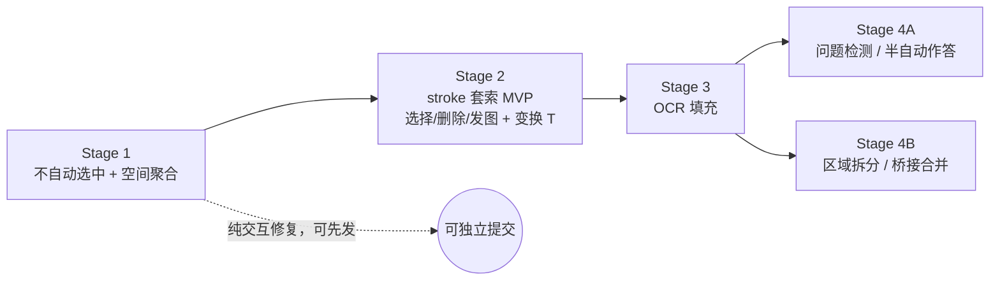

# Sketch 区域化重构 · 分阶段方案

Status: In progress — **Stage 1 + Stage 2 implemented** (Stage 1: draw no longer auto-selects; stroke merging is purely spatial. Stage 2: stroke-level lasso selection + delete). Stage 3–4 remain design drafts; each needs its open questions confirmed before implementation.

Owner: canvas / sketch

Last updated: 2026-07-19

> 本文是把一次较长的设计讨论收敛后的定稿路线。它重新定位 sketch：从「每笔猜边界、每涂鸦一个节点」演进为「**墨迹 + 可识别文本的区域节点**」，并把操作单元下沉到**笔画（stroke）**。目标是同时改善手写体验、减少无意义的文件碎片，并为「AI 自动捕获手写问题」这一产品目标铺路。落地时遵循 docs-first：每阶段发货后，把已实现部分并回 `docs/architecture/sketch-node.md`。

---

## 1. 背景与动机

现状（见 [sketch-node.md](../architecture/sketch-node.md)）下暴露的问题，按用户反馈排序：

1. **绘画被选择框打断**：新建节点默认自动选中（[createNodes.ts](../../packages/shared/src/canvas-engine/commands/createNodes.ts) 的 `selectableCreatedNodeIds`），用笔连续书写时节点不断被选中，外框打断绘制。
2. **时间聚合把一段手写劈开**：当前聚合用「5 秒时间窗 + 80px 距离」全局扫描（[sketchMerge.ts](../../apps/web/src/components/Nodes/sketch/sketchMerge.ts)、[config/canvas.ts](../../apps/web/src/config/canvas.ts) 的 `SKETCH_STROKE_MERGE_MAX_GAP_MS` / `SKETCH_STROKE_MERGE_MAX_DISTANCE_SCREEN_PX`）。写「1. …」后写「2.」再思考 >5s 才写内容时，「2.」被粘到上一行、其后的内容又另起新节点，数字与内容被拆散。
3. **选中的 sketch 透明区遮挡后方节点**：`.react-flow__node-sketch.selected` 让整个包围盒 `pointer-events: auto`（[index.css](../../apps/web/src/index.css)），选中态下透明区会拦截本应落到后方节点的点击。
4. **文件碎片**：sketch 是 md-backed（`MD_BACKED_NODE_TYPES`，见 [nodeContentFields.ts](../../apps/web/src/store/canvasStore/save/nodeContentFields.ts)），每个 sketch 节点写一个仅含 label 的近乎空的 `nodes/<safeLabel>.md`，涂鸦一多文件即碎片化且无内容。
5. **不能部分选择**：套索是节点级（[useCanvasLasso.ts](../../apps/web/src/hooks/useCanvasLasso.ts) 的 `onSelect(nodeIds)`），聚合成大节点后无法圈选其中部分笔画，不符合笔记工具的手感。

未来产品目标：用户在画布上手写「这里是为什么」「有什么更好的方案吗」之类句子，AI 自动捕获这些问题并调用 Agent 去查询/作答。

---

## 2. 核心模型决策

- **区域 = sketch 节点（演进，非重写）**：一个「区域」就是一个 sketch 节点，持有一簇空间上聚在一起的笔画。保留 ReactFlow 节点语义（可嵌 frame、可连边、可按 id snapshot、可移动），并复用现有 `data.strokes[]` 与 [sketchMerge.ts](../../apps/web/src/components/Nodes/sketch/sketchMerge.ts) 的合并几何。
- **存储单元 = 区域；操作单元 = 笔画**：区域是持久化 / AI / 快照的单位（一区域一 MD、一个快照目标）；笔画是选择 / 删除 / 移动 / 抽出的单位（套索下沉到 stroke 级）。
- **「接触即合并」保证不重叠**：区域按空间就近生长；桥接两区域的笔画会把两区域并成一个。重叠 ⟹ 合并，因此不可能出现两层 sketch 叠在同一区域。
- **时间退出「边界判定」，但保留为「区域内信息」**：决定「要不要另起一个节点」只看空间，时间不再参与——这才是治好问题 2（「2.」被劈开）的根因。隔很久回来在旧区域旁书写，只要空间就近仍并入该区域。而「这段是很久以后才补的」这一事实，天然记录在每条笔画既有的 `SketchStroke.createdAt` 上（[SketchOverlay.tsx](../../apps/web/src/components/Nodes/sketch/SketchOverlay.tsx) 写入）。将来可用于来源/历史、视觉区分、OCR 重分段提示——但现在不做，也不加新字段。
- **sketch 只杀 sketch-vs-sketch 叠放**：手写叠在 note / image 等其他节点上的穿透问题，仍需描边级命中（原「支柱 3」）来解决；但该场景少见，已延后。
- **文本层与节点边界解耦**：OCR 产出「文本 + 逐行 bbox + stroke 映射」，问题检测跑在文本的句子/span 上，而非节点粒度。不要用节点边界承载语义单元。
- **拆分/合并靠「重跑 OCR」而非「拼接文本」**：区域拆分或合并后，只需重新划分笔画 + 标记受影响区域 OCR 过期 + 各区域独立重跑 OCR。重跑永远正确并复用同一管线，省掉最脏的「文本重分段」代码。
- **快照走区域/选区**：把「stroke 集合 / 区域矩形」栅格化成 PNG 的工具，OCR 与「发图给大模型」共用。`snapshot_node` 仍按 node id 寻址（[snapshot-node.ts](../../apps/server/src/modules/agent/tools/handlers/snapshot-node.ts)），不受影响。

### 已确认延后的项

- 原「支柱 3」（选中态描边命中 / 透明区穿透）：sketch 完全覆盖其他节点类型的场景少见，延后。延后同时保留了「选中的 sketch 从任意位置可拖」的手感，也避免了「描边可抓 vs 整框可抓」的取舍。
- 区域拆分（套索抽出笔画 → 新区域）与桥接合并：低频、高价值、且是全模型最难的一块，放到 Stage 4。
- OCR 内容、问题检测、（半）自动作答：放到 Stage 3 / 4。
- 全自动作答、word 级映射、多列阅读顺序：Stage 4 之外。
- **节点级时间 provenance（跨切面，最终统一）**：「节点在一段时间后被修改」这类时间信息不是 sketch 独有的，note / text 等所有类型都需要 capture。现状：空间级有 `createdAt` / `updatedAt`（[canvas-storage.md](../architecture/canvas-storage.md)），节点级只有 `rev`（内容哈希，freshness/CAS，见 [agent-node-freshness-cas-plan.md](agent-node-freshness-cas-plan.md)），**无统一的每节点修改时间**。因此它应在**节点/画布层统一设计**，覆盖所有类型，放到最后做。**护栏**：本方案不在 sketch 里先造一套时间 provenance——Stage 1 只用既有 `SketchStroke.createdAt` 且不发明新字段/API；即便 Stage 3 用到该时间戳，也当**内部实现细节**，不对外暴露成公共契约，让将来的统一设计自由定义规范表示。sketch 的每笔时间戳届时只是喂给统一机制的更细粒度输入。

### 关键：Stage 1 不预留 OCR schema

向前兼容**不需要**预写空 schema。契约是「**没有 `ocr` 字段即等于未识别**（`status: empty`）」——字段缺失就是合法初始态。因此 Stage 1 完全不碰持久化格式；Stage 3 等 schema 真正定稿时首次 OCR 才写字段；存量无字段的区域天然表示「尚未 OCR」，**零迁移**。预先写死一个还没想清楚的形状，反而会在 Stage 3 造成 persistence churn。

---

## 3. 分阶段步骤

### Stage 1 — 基座：交互修复 + 区域模型骨架

目标：解决问题 1、2，立住「区域=节点、就近合并」的行为。**纯行为改动，不碰任何持久化字段、不碰选中态命中。**

1. **绘制不自动选中**：`AddNodeInput`（[uiIntent.ts](../../apps/web/src/handler/canvasCommand/uiIntent.ts)）加 `selectOnCreate?: boolean`（默认 `true`）；[resolveAddNodes.ts](../../apps/web/src/handler/canvasCommand/resolvers/resolveAddNodes.ts) 透传到 `CREATE_NODES` node 输入；[createNodes.ts](../../packages/shared/src/canvas-engine/commands/createNodes.ts) 的 `selectableCreatedNodeIds` 额外排除 `selectOnCreate === false`；[SketchOverlay.tsx](../../apps/web/src/components/Nodes/sketch/SketchOverlay.tsx) 的 `addNode` 传 `selectOnCreate: false`。用 per-input 标志而非按 `type` 排除，避免误伤 paste。
2. **空间聚合取代时间窗**：[SketchOverlay.tsx](../../apps/web/src/components/Nodes/sketch/SketchOverlay.tsx) pointer-up 的聚合从「5s 时间窗全局扫描」改为「并入**最近的已有区域**（同 parent、空间就近）」；**边界判定纯空间、时间完全退出**。保留 [sketchMerge.ts](../../apps/web/src/components/Nodes/sketch/sketchMerge.ts) 的 `buildMergeCommands` 几何与容错回退，以及每条笔画既有的 `createdAt`（作为区域内时间信息，不参与边界）。
3. **区域=sketch 节点**：确立「新笔画并入最近区域」的单目标合并；bridging（两已有区域相并）与拆分延后到 Stage 4。
4. **文档**：更新 [sketch-node.md](../architecture/sketch-node.md) §3 为「不自动选中 + 空间区域聚合」，并写明契约：区域将来会有 `ocr` 字段、**缺失即未识别**、schema 待 Stage 3 定稿——只写文字约定，不落数据。

明确不做：支柱 3、OCR 内容、套索改造、拆分。

提交拆分：`feat(canvas): sketch 绘制不自动选中` / `feat(canvas): 空间区域聚合取代时间窗` / 文档更新。两项功能正交、可各自回滚。

已定：**边界判定纯空间，时间完全退出边界**；时间以每条笔画既有的 `createdAt` 形式保留为区域内信息，**不加新字段**（「怎么用这份时间信息」留到真正需要时再做）。

### Stage 2 — stroke 级套索选择 + 就地编辑（纯客户端，无 AI/渲染）

目标：把「选择」下沉到笔画级，并让笔画选择成为**一等可编辑对象**（选 / 移 / 调样式 / 删），与 sketch 节点同等操作空间。渲染 PNG / 发大模型 / 部分选择的 AI 上下文移到 Stage 3；抽出/拆分移到 Stage 4。

**已定决策**

- **选择规则（R3，按类型）**：sketch 节点永远走**笔画选择**（圈到哪几条选哪几条；全部圈到只是「≈选中整块」但仍是笔画，永不整节点选择）；其它类型节点走**整节点选择**；两者可共存。「笔画在多边形内」判据 ≥ 1 点在内；stroke 命中在消费端算，[useCanvasLasso.ts](../../apps/web/src/hooks/useCanvasLasso.ts) 不耦合 sketch。
- 选中状态存 [gesturePreviewStore](../../apps/web/src/store/gesturePreviewStore.ts) 瞬态 slice（不持久、不进 undo）。
- **移动模型**：在**套索工具内拖动选区**移动（不切工具）；只做**原节点内平移**，跨节点/抽出 = Stage 4。
- **纯笔画工具栏**：对齐 sketch 节点的 [SketchControls](../../apps/web/src/components/Nodes/sketch/SketchControls.tsx)（调色 + 粗细，作用于选中笔画、**不改画笔预设**）。**删除键仅触摸端显示**，桌面端用键盘 Delete。
- **混选（笔画 + 节点）**：走 B（只留共同能力，**无移动**）；删除仅触摸端，**桌面端无工具栏**；节点工具栏在「存在笔画选择」时隐藏。

**已实现（第一批）**

1. 套索 stroke 级选择（R3）+ 逐笔高亮（`gesturePreviewStore.sketchStrokeSelection` + [SketchNode.tsx](../../apps/web/src/components/Nodes/sketch/SketchNode.tsx)）。
2. 删除浮条 [StrokeSelectionToolbar](../../apps/web/src/components/Panels/Canvas/FloatingToolbars/StrokeSelectionToolbar.tsx)（复用 [buildEraseCommands](../../apps/web/src/components/Nodes/sketch/sketchMerge.ts)：子集移除 + 重算 bbox + 清空则删节点 + 单条 undo）；有节点选择时让位（单浮条护栏）。

**待实现（本阶段扩展）** 3. **移动（GoodNotes 式：保留套索区）**：套索完成后**保留其多边形**作为选区（存 `gesturePreviewStore`、flow 空间、随选择一起清除，并持久画出虚线选区，复用 lasso preview path 的画法）。独立 hook `useSketchStrokeDrag` 在 Canvas 指针链**排在套索前**——pointerdown **落在保留选区多边形内** → 移动（平移所有选中笔画 + 选区本身，松手按各自节点重算 bbox、单条 undo）；落在选区外 → 让位给套索（开始新套索，先清旧选）。这把消歧从「模糊的描边命中」简化成「点在保留多边形内」，也更好抓（选区内空白也能拖），是 A 变简单的关键。只做**原节点内平移**；跨节点/抽出 = Stage 4。4. **样式**：笔画工具栏加调色 + 粗细（复用 `SketchControls`，只 map 选中笔画）。5. **键盘删除**：Delete / Backspace 删选中笔画（复用 `buildEraseCommands`），与 React Flow 的节点删除并存（混选一次删两者）。6. **工具栏仲裁**：纯笔画 → 样式条（触摸多一个删除）；混选 → 桌面无、触摸只删除；纯节点 → 现有节点条。节点工具栏（MultiSelect / 单选）在存在笔画选择时隐藏。

明确不做：渲染 PNG、发大模型、抽出/拆分（Stage 4）、OCR、混选的移动。

### Stage 3 — OCR：手写转文本

目标：填充区域的 OCR，让手写变成可搜索、可被 AI 当文本读的内容。引擎用已验证的 Azure AI Vision Read（[scripts/test-azure-vision.mjs](../../scripts/test-azure-vision.mjs)，`features=read`，返回 `blocks[].lines[]`：行文本 + `words[]` + bounding polygon + confidence）。

0. **stroke→PNG 渲染器（从 Stage 2 移入）**：复用/扩展服务端 [clusterToSvg](../../apps/server/src/modules/agent/tools/handlers/snapshot-node.ts)——它已用 perfect-freehand→SVG→resvg 渲整节点/集群；加一个**可选 per-node stroke-id 过滤**以渲染子集；渲染时**捕获 flow→pixel 变换 T**（OCR 坐标对齐要用）。客户端旧 `sketchToImage.ts` 已删除、渲染已迁到服务端（见 snapshot-node.ts:413），**不要重建客户端渲染器**。
1. **OCR 端点**：新增服务端 `ocr` 路由，复用 [sketch.service.ts](../../apps/server/src/modules/agent/sketch.service.ts) 的 vision 基座；输入 = 上面渲染器产出的区域 PNG，调 Azure Read，归一成 `{ text, lines[] }`。
2. **坐标对齐**：用渲染时记录的 T⁻¹ 把 Azure 像素多边形换回**区域本地 flow 坐标**。T 必须在栅格化当刻记下，是最易埋 bug 的点。
3. **stroke ↔ line 映射**：每条笔画分配给质心 / 重叠所在的行 → `line.strokeIds`（供锚定 / 高亮，不参与拆分文本运算）。
4. **阅读顺序**：行按 (top, then left) 排；多列延后。
5. **落库**：`text` → 节点 body（可搜索、可 `read`、喂后续问题检测）；`lines[]`（bbox + strokeIds + confidence）→ frontmatter；写入 `strokesHash` + `status: 'ready'`。此时才定稿并首次写入 `ocr` schema。
6. **触发与过期**：区域稳定后 debounce 触发（~1.5–3s 或工具切走）；`strokesHash` 守卫跳过未变区域；区域一变标 `stale` 重跑。
7. **字/画门槛**：整体低 `confidence` → 标「非文本区域」，`text` 留空，后续跳过，避免把示意图当文字识别。

明确不做：word 级映射、多列、拆分、问题检测。

开放问题：映射粒度（line 级 v1 够用 / word 级留待逐词高亮）、成本与隐私（是否惰性 OCR）、字/画置信度阈值取值、text 落 body 还是 frontmatter 的最终定稿。

**部分选择 → AI 上下文（从 Stage 2 移入的难点，待定）**：现在选**整节点**时 node id 进 selected-node 上下文，agent 可 `snapshot_node(id)` 看整节点。但选**节点内部分 stroke**时，「node X 的某几条笔画」无法用 node id 寻址。两条路：

- **Option A · 预渲染成图片直接附到这轮对话**：把选中 stroke 渲成 PNG（用上面 stroke 过滤渲染器）作为**图片上下文**贴到 chat turn。agent 直接看到，无需新寻址方案；但无法事后重寻址/重渲。简单。
- **Option B · 子节点引用**：引入「node X, strokes[ids]」引用，贯穿 selected-node 上下文 + `snapshot_node` 接受 stroke 过滤 + wire 类型。强大（可重渲、可持久引用）但要改一整条链路，重。
  推荐先做 **Option A**（和 OCR / 图片附件基座一起），Option B 视需求再评估。

### Stage 4 — 语义与重组层（两条独立子轨，均依赖 Stage 3）

**子轨 A · 问题检测 + 半自动作答**（原始产品目标）

1. 在 OCR `text` 上做**问句检测**（句子分割 + 分类）。
2. 检测到问句 → 用 `line.bbox` 锚定，在手写旁给**轻量确认**（下划线 + 「Ask」徽标）。
3. 确认 → 复用 question / answer 节点 + 边（见 [question-node.md](../architecture/question-node.md)）：生成 question 节点（带该句文本）→ agent 作答 → 答案节点连回手写。
4. 沿用 Accept / Revert 式**预览**，先**半自动**（不静默全自动），观察准确率后再考虑全自动。

**子轨 B · 区域拆分 + 桥接合并**（低频高价值）

> **交互模型线索（frame 类比）**：把 sketch 区域类比成 **frame**、里面的笔画类比成 **frame 内的节点**——「把笔画从区域 A 拖到区域 B」≈ 节点在 frame 间重定父，「拖到空白」≈ 拖出成顶层（新区域）。frame 系统已解决的**成员归属 + drag-to-reparent 判定 + fit-to-content** 逻辑可作为拆分/合并的 UX 外形与可复用判定逻辑来借鉴（见 [useFrameDragToCreate](../../apps/web/src/hooks/useFrameDragToCreate.ts) 及 canvas-engine 的 frame reparent）。
>
> **但不要照字面把每条 stroke 变成 ReactFlow 节点**：一页手写数百条 stroke → 数百节点，会冲击性能、持久化（stroke 现为节点 data 内联数组）、渲染（一节点一 SVG）、以及 AI 快照/OCR（都依赖「区域=节点、stroke 内联」）。正确综合是**借 frame 的判定逻辑当模式、stroke 仍保持内联**——「拖 stroke 换区域」= 操作内联 strokes 数组 + 区域 bbox + 重跑 OCR，与下面第 1–6 步一致。

1. 套索抽出笔画 S → 新区域 B = S，A' = A − S（几何复用 [sketchMerge.ts](../../apps/web/src/components/Nodes/sketch/sketchMerge.ts) 的 union-bbox / scale 反向）。
2. **身份**：A' 保留原 id / MD（剩余体即原体）；B 拿新 id / 新 MD。
3. **文本正确性靠重跑**：A' 与 B 都标 `stale` → 各自重跑 OCR，不手术式拼接文本（关键简化）。
4. 边 / frame：A' 继承原边与父 frame；B 若空间上仍在原 frame 内则继承。
5. **桥接合并**（Stage 1 延后的另一半）：两区域并一 → 保留吸收方 id、删另一 MD、union 重算、重跑 OCR、被吸收方的边改接存活方。
6. 全程单条 undo。

明确不做（Stage 4 之外）：全自动作答、word 级抽出、多列阅读顺序。

开放问题：合并时被吸收方的边改接还是丢弃；拆分身份规则（remainder 保 id）的边界情形。

---

## 4. 阶段依赖

- Stage 1 两项正交、可各自提交回滚，能马上开工。
- Stage 2 是纯客户端编辑（stroke 套索选择 + 删除），不依赖 AI/渲染，可独立发。
- Stage 3 自带 stroke→PNG 渲染器（复用服务端 `clusterToSvg` + stroke 过滤 + 捕获 T），OCR、部分选择→AI 上下文都收在这里。
- Stage 4 两条子轨都只依赖 Stage 3，彼此独立、可并行或分先后。

---

## 5. 误合并的退路（Stage 1 起就有）

「接触即合并」较激进 + 拆分延后，需保证误合并不致卡死。MVP 天然有两条退路：撤销（合并本就是单条 undo，`buildMergeCommands` 折成一个 gesture）；stroke 套索删除（Stage 2 起可事后擦掉并错的几笔）。因此延后完整拆分不会陷入死胡同。

---

## 6. 决策记录（为何如此）

- **为何 sketch 近期不去 md 化 / 不动持久化**：sketch 的 `.md` 仅为持久化 label（结构 PUT 会剥掉 `label` / `labelSource`），并非 AI 特性；agent 看到的 `label` 与 `file=` 由 [node-ref.ts](../../apps/server/src/modules/agent/node-ref.ts) / [node-element.ts](../../apps/server/src/modules/agent/conversation/prompt/node-element.ts) 从结构态纯函数现算，不依赖文件存在。未来 OCR 会让区域 MD 有真实文本内容，届时 sketch 更应保持 text-bearing（body 存转写）而非无文件——因此「归零 .md」被反转，改为「区域存转写」。
- **为何不把 sketch 收编进 PointerRouterCore / 不动 `acceptsPointer`**：这是已论证过的取舍（overlay 形态对 sketch 密集开发更内聚）。触发重构的信号是语义（出现手掌拒识 / 压感 / 笔尾橡皮等专属输入规则）而非结构。本方案不引入这些规则，故维持现状；仅建议 Stage 1 把会话 / 聚合逻辑隔离成独立 helper，为将来可能的收编留干净接缝。
- **为何拆分靠重跑而非拼接**：见 §2；把最脏的「文本重分段」化简为「各区域独立重跑 OCR」，永远正确且复用同一管线。
