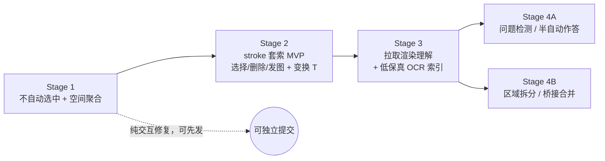

# Sketch 区域化重构 · 分阶段方案

Status: In progress — **Stage 1 + Stage 2 + Stage 4B(拆分 + 拖入合并)已发货并折回 [sketch-node.md](../architecture/sketch-node.md)**（不自动选中、纯空间区域聚合、stroke 级套索选择/删除/样式/保留选区移动、混选一起移动 + 框内 sketch carried 对账、跨区域拆分/合并、部分笔画作为 AI 上下文 + 聊天悬浮高亮）。**本 proposal 现只保留未完成的部分**：Stage 3（OCR 低保真索引 + 拉取渲染理解，其中 `snapshot_nodes` 的 `strokeSubsets` 拉取与部分笔画持久化已发货，**eager OCR 本身未做**）、Stage 4A（问句检测 + 半自动作答），以及 Stage 4B 的延后项（自动接触合并/方案 B、边改接、拆分后 OCR 重跑）。**Stage 3 redesigned 2026-07-20** after an empirical Azure Read run: OCR is now a low-fidelity search/trigger index (not authoritative content), agent comprehension goes through pull-render (`snapshot_nodes`, extended with an optional `strokeIds` filter), and OCR is lazy-by-default.

Owner: canvas / sketch

Last updated: 2026-07-21

> 本文是把一次较长的设计讨论收敛后的定稿路线。它重新定位 sketch：从「每笔猜边界、每涂鸦一个节点」演进为「**墨迹 + 可识别文本的区域节点**」，并把操作单元下沉到**笔画（stroke）**。目标是同时改善手写体验、减少无意义的文件碎片，并为「AI 自动捕获手写问题」这一产品目标铺路。落地时遵循 docs-first：每阶段发货后，把已实现部分并回 [sketch-node.md](../architecture/sketch-node.md)——**Stage 1 / 2 / 4B 已并入，实现细节以架构文档为准，本文不再复述。**

---

## 1. 背景与动机

原始动机里的多数交互问题已随 Stage 1/2 解决并折回 [sketch-node.md](../architecture/sketch-node.md)：绘画被选择框打断（问题 1）、时间聚合把手写劈开（问题 2）、不能部分选择（问题 5）均已修复。**仍在驱动本文剩余工作的动机**：

- **文件碎片 → 让区域承载可识别文本**（问题 4）：sketch 是 md-backed（`MD_BACKED_NODE_TYPES`，见 [nodeContentFields.ts](../../apps/web/src/store/canvasStore/save/nodeContentFields.ts)），当前每个 sketch 节点只写一个仅含 label 的近乎空 `.md`，涂鸦一多即碎片化且无内容。OCR（Stage 3）会让区域 MD 带上低保真索引文本（可搜索、供问句检测），这是 sketch 保持 text-bearing 的方向。
- **AI 自动捕获手写问题**（产品目标，Stage 4A）：用户在画布上手写「这里是为什么」「有什么更好的方案吗」之类句子，AI 自动捕获并调用 Agent 去查询/作答。
- **已延后**：选中态透明区遮挡后方节点（问题 3 / 原「支柱 3」）——sketch 完全覆盖其他节点类型的场景少见，延后（见 §2）。

---

## 2. 核心模型决策

- **区域 = sketch 节点（演进，非重写）**：一个「区域」就是一个 sketch 节点，持有一簇空间上聚在一起的笔画。保留 ReactFlow 节点语义（可嵌 frame、可连边、可按 id snapshot、可移动），并复用现有 `data.strokes[]` 与 [sketchMerge.ts](../../apps/web/src/components/Nodes/sketch/sketchMerge.ts) 的合并几何。
- **存储单元 = 区域；操作单元 = 笔画**：区域是持久化 / AI / 快照的单位（一区域一 MD、一个快照目标）；笔画是选择 / 删除 / 移动 / 抽出的单位（套索下沉到 stroke 级）。
- **「接触即合并」保证不重叠**：区域按空间就近生长；桥接两区域的笔画会把两区域并成一个。重叠 ⟹ 合并，因此不可能出现两层 sketch 叠在同一区域。
- **时间退出「边界判定」，但保留为「区域内信息」**：决定「要不要另起一个节点」只看空间，时间不再参与——这才是治好问题 2（「2.」被劈开）的根因。隔很久回来在旧区域旁书写，只要空间就近仍并入该区域。而「这段是很久以后才补的」这一事实，天然记录在每条笔画既有的 `SketchStroke.createdAt` 上（[SketchOverlay.tsx](../../apps/web/src/components/Nodes/sketch/SketchOverlay.tsx) 写入）。将来可用于来源/历史、视觉区分、OCR 重分段提示——但现在不做，也不加新字段。
- **sketch 只杀 sketch-vs-sketch 叠放**：手写叠在 note / image 等其他节点上的穿透问题，仍需描边级命中（原「支柱 3」）来解决；但该场景少见，已延后。
- **文本层与节点边界解耦**：OCR 产出「文本 + 逐行 bbox + stroke 映射」，问题检测跑在文本的句子/span 上，而非节点粒度。不要用节点边界承载语义单元。
- **OCR = 低保真索引/触发器，不是 agent 推理的权威内容**：OCR 文本只服务两件事——「全文搜索」与「被动问句捕获（Stage 4A）」。agent **真正理解**一块 sketch 走**按需拉取渲染**：复用现有 `snapshot_nodes`（[snapshot-node.ts](../../apps/server/src/modules/agent/tools/handlers/snapshot-node.ts) 已把 sketch path 渲成 PNG，内容寻址、可复用），让多模态模型直接看图，而**不读 OCR 文本**。依据（一次真实手写 sketch 的 Azure Read 实测）：箭头被读成 `-`（confidence 99）、`∫f(x)`→`Estif(x)`、中文行草整行错乱——这类高置信度误识别只能留在容错的索引层，绝不进推理链。定位/寻址由「区域=节点」天然承载：**node id 即区域地址**（agent 可 `snapshot_nodes(id)` 重渲、可从节点状态直接取坐标做锚定/连边，无需额外的 bbox 信封字段）；细到「行/句」用 OCR `line.bbox`，细到「部分 stroke」用 `snapshot_nodes` 的可选 stroke 过滤（见 Stage 3）。
- **拆分/合并靠「重跑 OCR」而非「拼接文本」**：区域拆分或合并后，只需重新划分笔画 + 标记受影响区域 OCR 过期 + 各区域独立重跑 OCR。重跑永远正确并复用同一管线，省掉最脏的「文本重分段」代码。
- **快照走区域/选区**：把「stroke 集合 / 区域矩形」栅格化成 PNG 的工具，OCR 与「发图给大模型」共用。`snapshot_node` 仍按 node id 寻址（[snapshot-node.ts](../../apps/server/src/modules/agent/tools/handlers/snapshot-node.ts)），不受影响。

### 已确认延后的项

- 原「支柱 3」（选中态描边命中 / 透明区穿透）：sketch 完全覆盖其他节点类型的场景少见，延后。延后同时保留了「选中的 sketch 从任意位置可拖」的手感，也避免了「描边可抓 vs 整框可抓」的取舍。
- 区域拆分（套索抽出笔画 → 新区域）与桥接合并：低频、高价值、且是全模型最难的一块，放到 Stage 4。
- OCR 内容、问题检测、（半）自动作答：放到 Stage 3 / 4。
- 全自动作答、word 级映射、多列阅读顺序：Stage 4 之外。
- **节点级时间 provenance（跨切面，最终统一）**：「节点在一段时间后被修改」这类时间信息不是 sketch 独有的，note / text 等所有类型都需要 capture。现状：空间级有 `createdAt` / `updatedAt`（[canvas-storage.md](../architecture/canvas-storage.md)），节点级只有 `rev`（内容哈希，freshness/CAS，见 [agent-node-freshness-cas-plan.md](agent-node-freshness-cas-plan.md)），**无统一的每节点修改时间**。因此它应在**节点/画布层统一设计**，覆盖所有类型，放到最后做。**护栏**：本方案不在 sketch 里先造一套时间 provenance——Stage 1 只用既有 `SketchStroke.createdAt` 且不发明新字段/API；即便 Stage 3 用到该时间戳，也当**内部实现细节**，不对外暴露成公共契约，让将来的统一设计自由定义规范表示。sketch 的每笔时间戳届时只是喂给统一机制的更细粒度输入。

### 关键：Stage 1 不预留 OCR schema

向前兼容**不需要**预写空 schema。契约是「**没有 `ocr` 字段即等于未识别**（`status: empty`）」——字段缺失就是合法初始态。因此 Stage 1 完全不碰持久化格式；Stage 3 等 schema 真正定稿时首次 OCR 才写字段；存量无字段的区域天然表示「尚未 OCR」，**零迁移**。预先写死一个还没想清楚的形状，反而会在 Stage 3 造成 persistence churn。

---

## 3. 分阶段步骤

### Stage 1 — 基座：交互修复 + 区域模型骨架 ✅ 已发货

解决问题 1、2，立住「区域=节点、就近合并」的行为：绘制不自动选中 + 空间聚合取代时间窗（边界纯空间、时间退出）。**实现细节见 [sketch-node.md](../architecture/sketch-node.md) §3.1–3.2**；本文不再复述。已定契约：区域将来会有 `ocr` 字段、**缺失即未识别**、schema 待 Stage 3 定稿（见下「Stage 1 不预留 OCR schema」）。

### Stage 2 — stroke 级套索选择 + 就地编辑 ✅ 已发货

把「选择」下沉到笔画级并成为一等可编辑对象（选 / 移 / 调样式 / 删），纯客户端、无 AI/渲染：stroke 级套索选择（R3：sketch 永远笔画级、其它类型整节点、可共存）+ 逐笔高亮 + 删除浮条 + GoodNotes 式保留选区移动 + 样式条 + 键盘删除 + 单浮条工具栏仲裁；混选时被选中的整节点与笔画一起移动（走 store 拖拽生命周期）。**实现细节与「node 层 vs 套索笔画层」两层模型见 [sketch-node.md](../architecture/sketch-node.md) §3.4–3.5**；本文不再复述。

> **两层模型（要点）**：sketch 在数据/引擎层就是**普通 node**（id/position/parentId/命令/undo 全同其它节点，整节点移动用 Select 工具）；「笔画选择」只是**套索工具下的瞬态选择粒度**（`gesturePreviewStore.sketchStrokeSelection`，不持久、不进 undo），存在的唯一理由是表达「只操作一部分笔画」。由此 sketch 有**两条独立移动通道**（整节点走 node-drag、笔画走 preview/bake），单次手势同时驱动两者时需对账（carried-node）。

### Stage 3 — OCR：手写转「低保真索引」（理解走拉取渲染）

目标：给区域填一层**低保真、容错的 OCR 索引**，让手写变得**可搜索**、并能**被动触发**问句捕获（Stage 4A）。**理解不靠这层文本**——agent 要看懂一块 sketch 时，走「按需拉取渲染」（`snapshot_nodes`）直接看图。引擎用已验证的 Azure AI Vision Read（[scripts/test-azure-vision.mjs](../../scripts/test-azure-vision.mjs)，`features=read`，返回 `blocks[].lines[]`：行文本 + `words[]` + bounding polygon + confidence）。

> **实测定调（2026-07-20）**：拿一张真实的多语言潦草手写 sketch 跑 Azure Read——英文清晰词与短问句（`why now?` / `why canvas?` / `more idea?`）可识别（60–95）；中文行草大面积部分正确但整行出错常见；**箭头/圈/框基本丢失或被误读成高置信度标点**（箭头→`-`@99、`∫f(x)`→`Estif(x)`、圈住的 `4`→`(4)`@14）。结论：OCR 文本作「搜索/触发」索引够用，作「转写/理解」不可信——故本阶段把它定位成**只读低保真索引**，理解一律交给拉取的区域图片。

0. **stroke→PNG 渲染器（从 Stage 2 移入）**：复用/扩展服务端 [clusterToSvg](../../apps/server/src/modules/agent/tools/handlers/snapshot-node.ts)——它已用 perfect-freehand→SVG→resvg 渲整节点/集群；加一个**可选 per-node stroke-id 过滤**以渲染子集；渲染时**捕获 flow→pixel 变换 T**（OCR 坐标对齐要用）。客户端旧 `sketchToImage.ts` 已删除、渲染已迁到服务端（见 snapshot-node.ts:413），**不要重建客户端渲染器**。
1. **OCR 端点**：新增服务端 `ocr` 路由（原方案复用已删除的 `sketch.service.ts` vision 基座，现需自建）；输入 = 上面渲染器产出的区域 PNG，调 Azure Read，归一成 `{ text, lines[] }`。
2. **坐标对齐**：用渲染时记录的 T⁻¹ 把 Azure 像素多边形换回**区域本地 flow 坐标**。T 必须在栅格化当刻记下，是最易埋 bug 的点。
3. **stroke ↔ line 映射**：每条笔画分配给质心 / 重叠所在的行 → `line.strokeIds`（供锚定 / 高亮，不参与拆分文本运算）。
4. **阅读顺序**：行按 (top, then left) 排；多列延后。
5. **落库（作为索引，不作权威内容）**：`text` → 节点 body（**可搜索、喂问句检测的低保真索引**，**不是 agent 的权威读取源**——理解走拉取的区域图片）；`lines[]`（bbox + strokeIds + confidence）→ frontmatter；写入 `strokesHash` + `status: 'ready'`。此时才定稿并首次写入 `ocr` schema。
6. **触发：默认惰性，仅被动特性需要时才转主动**：自动 OCR 的**唯一存在理由**是服务「搜索」与「Stage 4A 被动问句捕获」。因此——这两个特性未上线前，OCR 做成**惰性/按需**（agent 撞到看不懂的 sketch 才拉图理解，顺带可缓存一次 OCR），Stage 3 第一版可以**只做拉取渲染、完全不跑 eager OCR**；只有 Stage 4A 落地时才把 OCR 升级成 debounce **主动**跑（~1.5–3s 或工具切走）。无论主动/惰性，都用 `strokesHash` 守卫跳过未变区域、区域一变标 `stale`。
7. **字/画门槛（实测加强）**：两道闸——(a) 整体低 `confidence` → 标「非文本区域」、`text` 留空、后续跳过；(b) **纯标点/单符号 token（如 `-`、`(4)`、`-->`）无论 confidence 多高一律剔除**。加 (b) 是因为实测中箭头被读成 `-`@99——只靠低置信度门槛挡不住这种「符号被误识别成高置信度标点」，会污染索引与问句检测。

明确不做：word 级映射、多列、拆分、问题检测。

开放问题：映射粒度（line 级 v1 够用 / word 级留待逐词高亮）、字/画置信度阈值与「纯符号 token」判定的具体取值、text 落 body 还是 frontmatter 的最终定稿。已定：**OCR 是低保真索引、理解走拉图**；**默认惰性 OCR**（成本/隐私顺带解决——只在真正需要时才把手写送出）。

**理解 → AI 上下文：统一走「拉取渲染」，不做 eager 附图**。现有链路已经是这套（[build-prompt.ts](../../apps/server/src/modules/agent/conversation/prompt/build-prompt.ts) + [sketch-hint.ts](../../apps/server/src/modules/agent/conversation/prompt/sketch-hint.ts)）：选中节点在发送时被自动预渲染进 `<selected_nodes_visuals>`（带 origin id），agent 也能主动 `snapshot_nodes(nodeIds)` 拉更多。分两种粒度：

- **整节点（≈整区域）**：**零新增**。node id 进 selected-nodes 上下文，agent 用现有 `snapshot_nodes(id)` 拉图理解、或直接复用自动推送的 selection-visual；定位坐标从节点状态直接取，**不需要发明 `flowBbox` 信封字段**。
- **部分 stroke**：现有 `snapshot_nodes` 渲的是整节点/整簇，无法寻址「node X 的某几笔」。唯一新增 = **给 `snapshot_nodes` 加可选 per-node `strokeIds` 过滤**（Stage 3 手顺 0 已列该渲染器能力），agent 传 `{ nodeId, strokeIds }` 拉子集渲染。这是「统一拉取」模型的自然延伸，不引入新的附图旁路。

明确不做：**eager 预渲染+附图的旁路**（冗余，现有 selection-visual + `snapshot_nodes` 已覆盖）；把 stroke 变节点的持久化引用（超出所需）。

**已实现（2026-07-20）**：`snapshot_nodes` 加可选 `strokeSubsets`（per-node 的 KEEP-list：`[{ nodeId, strokeIds }]`，只渲列出的笔画，内容寻址独立、不撞整节点快照）；wire `WireSelectionNode` 加可选 `strokeIds`；`getAgentChatContext` 把 Stage-2 笔画选择（`gesturePreviewStore.sketchStrokeSelection`）注入选择；服务端 auto-snapshot 只渲那几笔并给附件打「partial stroke selection」标注。UI 侧：来源计数（`SourceCount`）与发送后 user-message 的 `selectedNodeIds` 都已把「有笔画选择的 sketch 节点」计入（否则纯笔画选择在发送前/后都看不出是 source）。

**后续增强 · 部分笔画的持久化 + 历史悬浮高亮（已实现 2026-07-20）**：用户在聊天记录里悬浮某条 user message 的 source chip 时，画布重新高亮当时发送的那几笔。

- **持久化（零迁移）**：strokeIds 本就随 `request.selectedNodes[].strokeIds` 持久化（turn 记录存整份请求），无需新存储。surface 方式：消息加 `selectedStrokeIds?: SelectedStrokeSubset[]`（运行时 [chatTypes.ts](../../apps/web/src/store/chatTypes.ts) + wire [chat.ts](../../packages/shared/src/types/agent/chat.ts)）；envelope 的 `focus.selection` 加**可选** `strokeSubsets`（旧记录天然缺 → 优雅降级），[history.ts](../../apps/server/src/modules/agent/conversation/transcript/history.ts) 回读时 emit，[useChatHistory.ts](../../apps/web/src/hooks/useChatHistory.ts) 透传，[useAgentStream.ts](../../apps/web/src/hooks/useAgentStream.ts) 实时写入。**只影响新消息，存量零改动。**
- **高亮通道**：瞬态 `gesturePreviewStore.sketchStrokeHighlight`（与活动选择 `sketchStrokeSelection` **分开**，避免打架）；[SketchNode.tsx](../../apps/web/src/components/Nodes/sketch/SketchNode.tsx) 渲染 `selection ∪ highlight`。**高亮用与选择相同的 `--color-info`**（app 统一的选择/高亮色，不另造视觉）；[UserMessage.tsx](../../apps/web/src/components/Messages/UserMessage.tsx) 的 chip `onMouseEnter/Leave` 写/清。
- **删除兜底**（核心原则：**持久化的是历史事实，高亮是对当前画布的尽力而为**）：SketchNode **只高亮自己 `data.strokes` 里仍存在的 id** → 笔画被擦/节点被删天然被过滤，无需额外清理；节点被删时 chip 复用 [NodeRef](../../apps/web/src/components/Common/NodeRef.tsx) 现成的删除线降级、悬浮 no-op；计数标签取**发送当时**的记录数（持久 strokeIds 长度），不按当前重算。
- **标签**：显示「N 笔」（`chat.partialStrokeCount`，en/zh）；「N/M」需额外持久化发送时总笔数 M，未做。
- **提交**：① `feat(chat): persist and re-surface partial stroke selection`（持久化 + 「N 笔」标签）；② `feat(canvas): highlight referenced strokes on hovering a chat stroke chip`（高亮通道 + chip 悬浮 + 删除兜底）。

### Stage 4 — 语义与重组层（两条独立子轨，均依赖 Stage 3）

**子轨 A · 问题检测 + 半自动作答**（原始产品目标）

1. 在 OCR `text` 上做**问句检测**（句子分割 + 分类）。
2. 检测到问句 → 用 `line.bbox` 锚定，在手写旁给**轻量确认**（下划线 + 「Ask」徽标）。
3. 确认 → 复用 question / answer 节点 + 边（见 [question-node.md](../architecture/question-node.md)）：生成 question 节点（带该句文本）→ agent 作答 → 答案节点连回手写。
4. 沿用 Accept / Revert 式**预览**，先**半自动**（不静默全自动），观察准确率后再考虑全自动。

**子轨 B · 区域拆分 + 桥接合并**（低频高价值）

**✅ 已发货：拖放式拆分 + 拖入合并（intent 路径）** — 纯笔画选择拖到空白即拆成新区域、拖到另一区域即并入，经 `MOVE_SKETCH_STROKES_TO_REGION` intent + 绝对-flow（跨 frame 安全）transfer builder + 落点 frame 重定父 + 单条 undo 实现。**实现细节见 [sketch-node.md](../architecture/sketch-node.md) §3.5「Cross-region split / merge」**；本文不再复述。

**仍未完成（本子轨剩余）**：

- **自动接触合并（方案 B）**：桥接两区域的笔画使两区自动并成一个（不靠拖放，靠空间接触判定）。
- **边改接**：源区域被全清空删除时，其边现随 `DELETE_NODES` 丢弃；应在 Stage 4A 给区域连边后补「顶点收缩 / 改接存活方」。
- **拆分/合并后 OCR 重跑**：现为 no-op（Stage 3 未落地，缺 `ocr` 字段即未识别）；Stage 3 后各受影响区域标 `stale` 并独立重跑。

> **交互模型线索（frame 类比）**：把 sketch 区域类比成 **frame**、里面的笔画类比成 **frame 内的节点**——「把笔画从区域 A 拖到区域 B」≈ 节点在 frame 间重定父，「拖到空白」≈ 拖出成顶层（新区域）。frame 系统已解决的**成员归属 + drag-to-reparent 判定 + fit-to-content** 逻辑可作为拆分/合并的 UX 外形与可复用判定逻辑来借鉴（见 [useFrameDragToCreate](../../apps/web/src/hooks/useFrameDragToCreate.ts) 及 canvas-engine 的 frame reparent）。
>
> **但不要照字面把每条 stroke 变成 ReactFlow 节点**：一页手写数百条 stroke → 数百节点，会冲击性能、持久化（stroke 现为节点 data 内联数组）、渲染（一节点一 SVG）、以及 AI 快照/OCR（都依赖「区域=节点、stroke 内联」）。正确综合是**借 frame 的判定逻辑当模式、stroke 仍保持内联**——「拖 stroke 换区域」= 操作内联 strokes 数组 + 区域 bbox + 重跑 OCR。

**桥接合并的设计（未实现部分）**：

1. **文本正确性靠重跑**：合并/拆分后受影响区域都标 `stale` → 各自重跑 OCR，不手术式拼接文本（关键简化）。
2. **身份**：拆分时 remainder 保留原 id / MD（剩余体即原体），新区域拿新 id / 新 MD；桥接合并保留吸收方 id、删另一 MD、union 重算。
3. **边 / frame**：拆分时 A' 继承原边与父 frame；被吸收方的边改接存活方（见上「边改接」延后项）。
4. 全程单条 undo。

明确不做（Stage 4 之外）：全自动作答、word 级抽出、多列阅读顺序。

开放问题：合并时被吸收方的边改接还是丢弃；拆分身份规则（remainder 保 id）的边界情形。

---

## 4. 阶段依赖

- Stage 1 两项正交、可各自提交回滚，能马上开工。
- Stage 2 是纯客户端编辑（stroke 套索选择 + 删除），不依赖 AI/渲染，可独立发。
- Stage 3 **拉取优先**：理解走现有 `snapshot_nodes`（+ 新增可选 `strokeIds` 过滤）拉图；OCR 只做**低保真索引/触发**，默认惰性，Stage 3 第一版可只做拉图、不跑 eager OCR。渲染器复用服务端 `clusterToSvg`（+ stroke 过滤 + 捕获变换 T 供 `line.bbox` 对齐）。
- Stage 4 两条子轨都只依赖 Stage 3，彼此独立、可并行或分先后。

---

## 5. 决策记录（为何如此）

- **为何 sketch 近期不去 md 化 / 不动持久化**：sketch 的 `.md` 仅为持久化 label（结构 PUT 会剥掉 `label` / `labelSource`），并非 AI 特性；agent 看到的 `label` 与 `file=` 由 [node-ref.ts](../../apps/server/src/modules/agent/node-ref.ts) / [node-element.ts](../../apps/server/src/modules/agent/conversation/prompt/node-element.ts) 从结构态纯函数现算，不依赖文件存在。未来 OCR 会让区域 MD 带上**低保真索引文本**（可搜索、供问句检测），届时 sketch 更应保持 text-bearing（body 存该索引）而非无文件——因此「归零 .md」被反转，改为「区域存 OCR 索引」。注意：该 body 文本是**索引、非权威内容**，agent 的理解仍走拉取的区域图片（见 Stage 3）。
- **为何不把 sketch 收编进 PointerRouterCore / 不动 `acceptsPointer`**：这是已论证过的取舍（overlay 形态对 sketch 密集开发更内聚）。触发重构的信号是语义（出现手掌拒识 / 压感 / 笔尾橡皮等专属输入规则）而非结构。本方案不引入这些规则，故维持现状；仅建议 Stage 1 把会话 / 聚合逻辑隔离成独立 helper，为将来可能的收编留干净接缝。
- **为何拆分靠重跑而非拼接**：见 §2；把最脏的「文本重分段」化简为「各区域独立重跑 OCR」，永远正确且复用同一管线。
