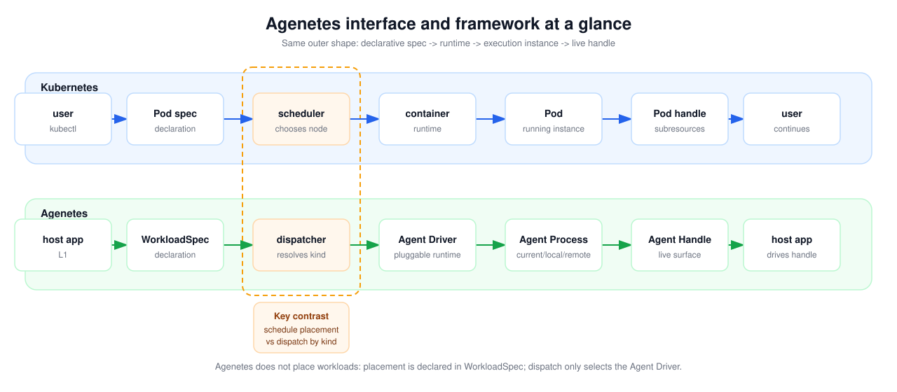

# Agenetes - The Kubernetes-Like Aggregating Control Plane for Agents Across Environments

Agenetes is a control plane for agent workloads. Just as Kubernetes' key capability is to guarantee that a declared pod (e.g., a docker container) exists and is reachable, Agenetes guarantees that **given an agent workload declaration, a process running that agent exists and is reachable**. According to the declaration, that process may run **in the current process** (the agent invoked directly as a library, with no cross-process communication), **on the current machine** (spawned as a local subprocess), or **on a remote server reached through Agenetes**. With its pluggable agent runtimes, various supported transports, a two-tier persistent logging system, and (soon) an agent service gateway, Agenetes lets you run any kind of agent behind a single runtime contract, connect it wherever its execution environment lives, keep every conversation durable and replayable, and let agents and external tools discover and call one another as services. So you can focus on your agent's logic and not on the plumbing.

Agenetes 是一个面向 agent workload 的控制平面。正如 Kubernetes 的关键能力在于保证一个已声明的 pod（例如一个 docker 容器）**存在且可达**，Agenetes 保证的是：**给定一份 agent workload 声明，就存在一个跑着该 agent 的进程，且它是可达的**。根据声明的不同，这个进程可以**就在当前进程内**运行（agent 作为库被直接调用，没有任何跨进程通信）、**在当前机器上**运行（作为本机子进程被拉起）、或**在一台通过 Agenetes 连接的远程服务器上**运行。凭借**可插拔的 agent runtime**、**多种受支持的 transport**、一套**两级持久化日志系统**，以及（即将支持的）**agent service gateway**，Agenetes 让你可以用同一套运行时契约运行任意类型的 agent、连接它所在的执行环境、让每段对话都可持久化并可回放，并让 agent 与外部工具彼此发现、作为服务相互调用。于是你可以专注于 agent 自身的逻辑，而不必操心底层管道。

Note that Agenetes is not a full agent-hosting platform like [Microsoft Azure AI Foundry](https://azure.microsoft.com/en-us/products/ai-foundry) or [Agent Substrate](https://github.com/agent-substrate/substrate). It does not promise sandboxing, multi-tenant isolation, fleet orchestration, or managed runtime hosting. Instead, it is an aggregating control plane for agent execution points across environments — local processes, agentlet-managed subprocesses, remote daemons, cloud servers, local-network machines, and host-builtin agents — so the host application can declare, invoke, interact with, and persist agent conversations through one uniform contract.

注意，Agenetes 不是像 [Microsoft Azure AI Foundry](https://azure.microsoft.com/en-us/products/ai-foundry) 或 [Agent Substrate](https://github.com/agent-substrate/substrate) 那样的完整 agent 托管平台。它不承诺 sandbox、多租户隔离、fleet orchestration 或托管 runtime。它更像一个聚合控制面，把分散在不同环境中的 agent execution points——本地进程、由 agentlet 管理的子进程、远程 daemon、云服务器、本地网络机器、以及 host-builtin agents——接到同一套契约之下，让 host application 可以统一声明、调用、交互并持久化 agent 对话。

## Core Concepts / 核心概念

Agenetes follows the same outer shape that makes Kubernetes easy to reason about: a declarative spec is bound to a runtime, the runtime materializes an execution instance, and the caller receives a live handle for continued interaction.



The same concepts can be read as a compact vocabulary map:

| Kubernetes                                                | Agenetes                                                       | Meaning                                                                                                          |
| --------------------------------------------------------- | -------------------------------------------------------------- | ---------------------------------------------------------------------------------------------------------------- |
| user / kubectl                                            | host application                                               | Declares and invokes workloads.                                                                                  |
| Pod spec                                                  | `WorkloadSpec`                                                 | The declarative workload description.                                                                            |
| Job / long-running workload                               | Workload lifecycle type (`workloadType`: `Job` / `Deployment`) | Lifecycle semantics: a `Job` mints a fresh handle for a run; a `Deployment` keeps one live handle by `threadId`. |
| scheduler                                                 | dispatcher                                                     | Kubernetes chooses a node; Agenetes resolves `WorkloadSpec.kind` to a driver.                                    |
| container runtime, such as containerd (previously Docker) | Agent Driver                                                   | The pluggable runtime implementation that materializes the workload.                                             |
| Pod                                                       | Agent Process                                                  | The execution instance that actually runs the declared workload.                                                 |
| Pod handle / pod subresources                             | Agent Handle                                                   | The live per-workload surface for running turns, sending controls, receiving streams, and closing the workload.  |
| Service / DNS                                             | agent service gateway _(planned)_                              | The stable discovery and invocation surface for agents and external tools.                                       |

From the host application's point of view, the flow is straightforward: declare a `WorkloadSpec`, invoke it, let Agenetes resolve the spec to an Agent Driver, and then drive the returned Agent Handle. The driver materializes the Agent Process at the placement already declared by the spec — in the current process, on the local machine, or on a remote server — and the handle is the live per-workload surface exposed through the uniform runtime contract. This is dispatching rather than scheduling because Agenetes resources are not fungible: an in-process runtime is tied to the current process and its injected capabilities, while a local or remote runtime may be tied to a particular filesystem, credential set, daemon, or execution environment. Treating those environments as interchangeable nodes would create the wrong abstraction.

从 host application 的视角看，流程很直接：声明一份 `WorkloadSpec`，调用它，让 Agenetes 把这份 spec 解析到某个 Agent Driver，然后继续驱动返回的 Agent Handle。driver 会在 spec 已经声明好的位置物化 Agent Process——当前进程、本机、或远程服务器——而 handle 则是通过统一运行时契约暴露出来的、每工作负载一个的 live surface。这是分发而不是调度，因为 Agenetes 面对的资源并不是可互换的：进程内 runtime 绑定在当前进程及其注入能力上，本机或远程 runtime 则可能绑定在某个特定文件系统、凭据集合、daemon 或执行环境上。把这些环境当作可互换 node 来选择，会制造错误的抽象。

## User-facing API surface / 面向用户的 API 表面

The user-facing API surface separates four concerns:

面向用户的 API 表面分为四类关注点：

| Surface             | Responsibility                                                                                                                |
| ------------------- | ----------------------------------------------------------------------------------------------------------------------------- |
| Instance            | Top-level workload entrypoint: accept a `WorkloadSpec`, dispatch it to a driver, and return or locate the Agent Handle.       |
| Agent Handle        | Per-workload live interaction surface: run turns, stream output, send controls, inspect capabilities, and close.              |
| Persistent Querying | Durable read surface: inspect persisted thread records, replay folded history, and follow live state/event tails.             |
| Configuration       | Embedding-time setup surface: mount Agenetes, provide persistence backends, register driver factories, and bind driver kinds. |

Each surface has an in-process programmatic form today, used when Agenetes is mounted directly into a host application. The API-shaped forms below are suggested projections for a future process or network boundary; they describe the expected REST/SSE shape, not a finalized HTTP contract.

每个 surface 当前都有一种进程内的程序调用形态，用于 Agenetes 被直接 mount 进 host application 的场景。下表中的 API-shaped forms 是未来跨进程或网络边界时的投影建议；它们描述的是预期的 REST/SSE 形态，而不是最终 HTTP contract。

| Surface             | Current in-process API                                                               | Suggested API-shaped form _(planned)_                           | Meaning                                                                                                      |
| ------------------- | ------------------------------------------------------------------------------------ | --------------------------------------------------------------- | ------------------------------------------------------------------------------------------------------------ |
| Instance            | `Agenetes.create(spec) -> AgentHandle`                                               | `POST /workloads`                                               | Realize a `WorkloadSpec`: Jobs mint a fresh handle; Deployments get-or-create the live handle by `threadId`. |
| Instance            | `Agenetes.get(threadId) -> AgentHandle \| undefined`                                 | `GET /workloads/:threadId/live`                                 | Return the live Deployment handle when one is already running; never spawns.                                 |
| Instance            | `Agenetes.close(threadId) -> void`                                                   | `DELETE /workloads/:threadId/live`                              | Close and evict the live handle for a thread.                                                                |
| Agent Handle        | `AgentHandle.run(request, render, ctx) -> AsyncGenerator<AgentStreamEvent, TResult>` | `POST /workloads/:threadId/runs` + stream                       | Run one turn, stream `AgentStreamEvent`s, and return the driver's per-turn result.                           |
| Agent Handle        | `AgentHandle.control(msg) -> Promise<ControlAck>`                                    | `POST /workloads/:threadId/control`                             | Send an out-of-turn `ControlMsg` and receive a `ControlAck`.                                                 |
| Agent Handle        | `AgentHandle.close() -> void`                                                        | `DELETE /workloads/:threadId/live`                              | Release this workload through the handle surface.                                                            |
| Agent Handle        | `AgentHandle.capabilities -> AgentCapabilities`                                      | `GET /workloads/:threadId/capabilities`                         | Read the operations and features this handle advertises.                                                     |
| Persistent Querying | `Agenetes.record(namespace, threadId) -> ThreadRecord \| undefined`                  | `GET /namespaces/:namespace/workloads/:threadId`                | Read one durable thread record independent of handle liveness.                                               |
| Persistent Querying | `Agenetes.records(namespace) -> ThreadRecord[]`                                      | `GET /namespaces/:namespace/workloads`                          | Enumerate persisted thread records in one namespace.                                                         |
| Persistent Querying | `Agenetes.notifications(threadId) -> AsyncIterable<AgentMetadata>`                   | `GET /workloads/:threadId/notifications`                        | Subscribe to persisted AgentMetadata updates.                                                                |
| Persistent Querying | `Agenetes.history(namespace, threadId, { withTail? }) -> ThreadHistory`              | `GET /namespaces/:namespace/workloads/:threadId/history?tail=1` | Read folded turns, optionally with a live tail fenced after the last folded turn.                            |
| Persistent Querying | `Agenetes.tail(namespace, threadId) -> AsyncIterable<AgentStreamEvent>`              | `GET /namespaces/:namespace/workloads/:threadId/events`         | Follow the live Tier-1 event tail after the latest folded turn.                                              |
| Configuration       | `mountAgenetes(options) -> AgenetesBuilder`                                          | deployment / configuration API                                  | Create a builder and inject persistence backends such as thread, event, and turn stores.                     |
| Configuration       | `AgenetesBuilder.addFactory(factoryName, factory) -> AgenetesBuilder`                | deployment / configuration API                                  | Add a driver factory to the embedding's factory dictionary.                                                  |
| Configuration       | `AgenetesBuilder.register(driverName, factoryName, args?) -> AgenetesBuilder`        | deployment / configuration API                                  | Bind a workload `kind` (`driverName`) to a named driver factory and its configuration.                       |
| Configuration       | `AgenetesBuilder.build() -> Agenetes`                                                | deployment / configuration API                                  | Materialize the configured `Agenetes` instance.                                                              |

## The Name: Agenetes / 名称：Agenetes

The name is coined in the shape of its model, Kubernetes. Ancient Greek κυβερνήτης (_kubernḗtēs_, "helmsman/governor") is built from the root _kubern-_ plus the agentive suffix **-ήτης (_-ētēs_)**, "the one who does." Agenetes keeps **ag- / agen-** legible as "agent" while pointing back to the older "act / drive / lead" family behind Greek ἄγω and Latin _agō_ → _agent_; it then mirrors the same **-ētēs** agentive ending. The result suggests "the one who drives agents / sets agent workloads in motion" — precisely a control plane's job. It scans like its model: Ku-ber-NÉ-tēs ⟷ A-ge-NÉ-tēs.

这个名字是按 Kubernetes 的构词方式造出的。古希腊语 κυβερνήτης（_kubernḗtēs_，“舵手 / 治理者”）由词根 _kubern-_ 加施事后缀 **-ήτης (_-ētēs_)** 构成，意为“那个去做……的人”。Agenetes 中的 **ag- / agen-** 既保留了 “agent” 的可辨识性，也指向希腊语 ἄγω 与拉丁语 _agō_ → _agent_ 背后的“行动 / 驱动 / 引导”语义；结尾则对应同一个 **-ētēs** 施事后缀。因此它表达的不是简单的 `agen + netes` 切分，而是“驱动 agent / 使 agent workload 运转起来的人”——这正是 control plane 的工作。它的重音节奏也与其模型对应：Ku-ber-NÉ-tēs ⟷ A-ge-NÉ-tēs。

## Core invariants (the design consensus) / 核心不变量（设计共识）

The numbered invariants below (I1–I10, with sub-clauses I*n*._m_) are the design consensus, meant to be cited by reference id. Each is stated in English then Chinese; code blocks and tables are not duplicated.

下列带编号的不变量（I1–I10，含子条款 I*n*._m_）即设计共识，供按编号引用。每条先英文后中文；代码块与表格不做双语重复。

### I1. Agenetes is not a scheduler — it is an executor / 不是调度器，而是执行器

Working the Kubernetes analogy to its breaking point is the fastest way to record what Agenetes deliberately is **not**. A scheduler _chooses_ a placement among interchangeable candidates (scoring, bin-packing, preemption, rescheduling). Agenetes has no such choice.

把 Kubernetes 类比推到它的断裂点，是记录 Agenetes 刻意**不是**什么的最快方式。调度器会在可互换的候选之间*挑选*一个放置位置（打分、装箱、抢占、重新调度）。Agenetes 没有这种选择权。

**I1.1 Drivers are not fungible — each _is_ its resource / Driver 不可互换——每个 driver 就是它绑定的资源.**
The K8s scheduler assumes interchangeable Nodes with state externalised to a PV; Agenetes drivers are the opposite. An ACP driver is bound to a specific agentlet daemon + that machine's filesystem (the session's files and live process live _there_); a host-builtin driver is bound to this process + the capability ports injected at registration. Neither can move.

K8s 调度器假设 Node 可互换、状态被外置到 PV；Agenetes 的 driver 恰好相反。ACP driver 绑定到某个特定的 agentlet daemon + 那台机器的文件系统（session 的文件与活进程就*在那里*）；host-builtin driver 绑定到本进程 + 注册时注入的能力端口。两者都不可迁移。

**I1.2 Routing has two dimensions with opposite mutability / 路由有两个可变性相反的维度.**
The **class** (`kind → driver type`) is static wiring Agenetes owns and may re-point. The **instance** (which daemon / which live session) is _pinned by the spec's resource reference_ (a profile id, a persisted session id) and is **not** relocatable.

**类**（`kind → driver 类型`）是 Agenetes 拥有、可重新指向的静态接线。**实例**（哪个 daemon / 哪个活 session）由 _spec 的资源引用_（profile id、已持久化的 session id）钉死，**不可**迁移。

**I1.3 Failure is rebuild-or-fail, never reschedule / 失败即重建或失败，绝不重新调度.**
If the bound resource is gone, the workload is rebuilt from durable state (the turn log / persisted session) or it fails. There is no K8s-style "pod drifts to another node".

如果被绑定的资源没了，工作负载要么从持久状态（轮次日志 / 已持久化的 session）重建，要么失败。不存在 K8s 那种"pod 漂移到另一个 node"。

So the control-plane roles Agenetes fills are:

因此 Agenetes 承担的控制面角色是：

| K8s control-plane role                                 | In Agenetes?                                                   |
| ------------------------------------------------------ | -------------------------------------------------------------- |
| Scheduler (choose placement among candidates)          | **No** — placement is declared in the spec, pinned by affinity |
| Admission (gate: requested capabilities ⊆ advertised)  | Yes                                                            |
| kubelet / CRI (execute + reconcile a _given_ workload) | Yes — `create` + pipe + lifecycle                              |
| Service / DNS (resolve a name → a fixed endpoint)      | Yes — deterministic `kind → driver`                            |

Agenetes is therefore closer to a **service-mesh sidecar / reverse proxy**: resolve by declared identity, admit, and pipe. Cross-resource scheduling (fleet bin-packing, autoscaling across machines) is an explicit **non-goal** — were it ever needed it would be a _new_ layer above Agenetes, not a widening of this one. (The daemon's lazy-spawn / idle-suspend / resume is lifecycle _reconcile_ of one already-bound resource — a kubelet job — not placement selection.)

因此 Agenetes 更接近一个 **service-mesh sidecar / 反向代理**：按声明的身份解析、准入、然后转接。跨资源调度（机队装箱、跨机自动扩缩）是明确的**非目标**——真要用到，那也是 Agenetes 之上的一个*新层*，而不是把这一层撑大。（daemon 的惰性 spawn / idle 挂起 / resume 是对*一个已绑定资源*的生命周期 _reconcile_——一件 kubelet 的活——而非放置选择。）

### I2. Drivers: pluggable agent runtimes — standard Agenetes vs host-builtin custom, and today's object-injection interface / Driver：可插拔 agent runtime——standard Agenetes 与 host-builtin custom，及当前的对象注入接口

A **driver** teaches Agenetes how to run one _kind_ of agent workload — the direct analogue of a container runtime such as containerd or CRI-O. It is invisible to whoever _defines_ the agent: the definition names a semantic offering, and Agenetes resolves that to a driver behind the scenes. Two representative drivers exist today: a **host-builtin driver** and a **standard Agenetes driver**. The host-builtin driver is owned by the host application and tightly coupled to its native agents and capability ports, so it is not something Agenetes can offer as a generic supported driver. The current standard Agenetes driver is the **ACP driver**, which is generic and speaks ACP over stdio / WebSocket transport.

一个 **driver** 教会 Agenetes 如何运行*一类* agent workload——它对应 containerd、CRI-O 这样的容器运行时。它对*定义* agent 的人不可见：定义只命名一个语义化的"供给项（offering）"，Agenetes 在幕后把它解析到某个 driver。今天有两个代表性 driver：一个 **host-builtin driver**，以及一个 **standard Agenetes driver**。host-builtin driver 由宿主应用拥有，并与宿主的原生 agent 和能力端口紧耦合，因此不是 Agenetes 能作为通用 supported driver 提供的东西。当前的 standard Agenetes driver 是 **ACP driver**，它是通用的，并通过 stdio / WebSocket transport 说 ACP。

For a deeper driver-specific model, see [`docs/concepts/driver_cn.md`](docs/concepts/driver_cn.md): it explains drivers by three mostly independent dimensions — binding schema, runtime protocol, and transport — and separates driver concerns from agent templates / profiles.

关于 driver 的更细模型，见 [`docs/concepts/driver_cn.md`](docs/concepts/driver_cn.md)：它用三根基本维度——binding schema、runtime protocol、transport——解释 driver，并把 driver 关注点与 agent template / profile 区分开。

**I2.1 Standard Agenetes vs host-builtin custom — who ships the driver / standard Agenetes 与 host-builtin custom——谁来交付这个 driver.**
A **standard Agenetes driver** is generic and ships _inside_ Agenetes: the mounted instance can pre-mount it, the analogue of a container runtime built into the platform. The current example is the ACP driver. A **host-builtin custom driver** is business-coupled and **host application-owned**: the host application's own native agents (canvas-coupled tools, host capability ports) that only make sense in that host application, always **registered by the host application at bootstrap**, never shipped as a generic Agenetes-supported driver. Note the naming: the driver the code calls `builtin` is _built into the host application_ (its in-process native agents) — from Agenetes' point of view that is a host-builtin custom driver, distinct from a standard driver built into _Agenetes_.

**standard Agenetes driver** 是通用的，随 Agenetes *内部*一起交付：被挂载的实例可以预挂载它，相当于平台自带的容器运行时。当前例子是 ACP driver。**host-builtin custom driver** 则与业务耦合、由**宿主拥有**：宿主自己的原生 agent（与画布耦合的工具、宿主能力端口），只在那个宿主里才有意义，总是**由宿主在 bootstrap 时注册**，绝不作为 Agenetes 的通用 supported driver 交付。注意命名：代码里叫 `builtin` 的那个 driver 是*内建于宿主*的（宿主的进程内原生 agent）——从 Agenetes 的视角看，它是 host-builtin custom driver，区别于内建于 _Agenetes_ 的 standard driver。

**I2.2 The runtime framework (`AgentRuntime`) has two orthogonal faces / 运行时框架 `AgentRuntime` 有两个正交面.**
`AgentRuntime` is the runtime framework; drivers are the runtimes it dispatches to. Its two faces are: (a) _driver dispatch_ — `register(driver)` / `resolve(kind)` / `has(kind)` / `kinds`: map a driver _kind_ to the object that knows how to create its handles; (b) _handle lifecycle_ — `get(threadId)` / `create(threadId, factory)` / `close(threadId)`: hold the one live Deployment handle for a `threadId` (get-or-create by identity; **reuse-ignores-spec**, i.e. no desired-state reconcile — changing a spec is an explicit `close()` + `create()` the caller decides, never a hidden reconcile). A one-shot Job never enters this lifecycle registry — its handle lives only for its single run.

`AgentRuntime` 是运行时框架；driver 是它分发的目标运行时。它的两个面是：(a) _驱动分发_——`register(driver)` / `resolve(kind)` / `has(kind)` / `kinds`：把 driver 的 _kind_ 映射到知道如何创建其 handle 的对象；(b) _handle 生命周期_——`get(threadId)` / `create(threadId, factory)` / `close(threadId)`：为一个 `threadId` 持有那唯一的活 Deployment handle（按身份 get-or-create；**复用即忽略 spec**，即不做期望状态 reconcile——改 spec 是调用方显式的 `close()` + `create()`，绝非隐式 reconcile）。一次性的 Job 从不进入这个生命周期注册表——它的 handle 只在那单次运行期间存在。

**I2.3 Registration advertises candidacy; Agenetes decides the binding / 注册即声明候选资格；绑定由 Agenetes 决定.**
Only a driver knows what it implements, so at registration it _advertises_ the binding kinds it serves and the capabilities (tools, control verbs) it carries — an _input_ to routing, not routing itself. Agenetes stays the authority over the **route** (which registered driver actually backs a `kind`) and the **admission** check (the tool names in a spec ⊆ what the driver advertises).

只有 driver 才知道自己实现了什么，因此在注册时它会*声明*自己服务哪些 binding kind、携带哪些能力（工具、控制动作）——这是路由的*输入*，而非路由本身。Agenetes 始终是**路由**（哪个已注册 driver 实际支撑某个 `kind`）与**准入**检查（spec 中的工具名 ⊆ driver 声明的能力）的权威。

**I2.4 The driver interface (`AgentDriver`) / driver 接口 `AgentDriver`.**
A driver is its metadata (`AgentDriverInfo` — an optional natural-language `description` plus the driver-class `AgentCapabilities` candidate set for discovery / admission) plus a single factory method. The dispatch `kind` is supplied by the instance registry (`register(kind, driver)`), not carried by the driver object itself:

一个 driver = 它的元数据（`AgentDriverInfo`——一个可选的自然语言 `description`，加上供发现 / 准入使用的 driver 类级 `AgentCapabilities` 候选集合）+ 一个工厂方法。分发键 `kind` 由 instance registry（`register(kind, driver)`）提供，并不由 driver 对象自己携带：

```ts
interface AgentDriver<TInput = unknown, …> extends AgentDriverInfo {
  readonly description?: string;             // natural-language self-description for discovery / UX
  readonly capabilities: AgentCapabilities;  // driver-class candidate capabilities
  create(input: TInput): AgentHandle;        // wrap a backing object into a handle
}
```

**I2.5 Object-injection — today's stand-in for the clean `create(spec)` factory / 对象注入——当前对干净的 `create(spec)` 工厂的过渡替代.**
The end-state factory is _spec in, no host application objects_: `driver.create(spec)`, the driver resolving its own backing state from a serializable `WorkloadSpec`. Until the package boundaries make a driver's host application resources injectable, the host application still constructs each backing runtime object (it owns the host application singletons and host application coupling) and hands it in via `create(input)`, where `TInput` is a **host-application-shaped construction bundle** kept fully generic so the framework never names a host application type.

终态工厂是*传入 spec、不传宿主对象*：`driver.create(spec)`，由 driver 从一个可序列化的 `WorkloadSpec` 自行解析出它的后端状态。在包边界尚未让 driver 的宿主资源变得可注入之前，宿主仍然自己构造每个后端运行时对象（它拥有宿主单例与宿主耦合），并经 `create(input)` 递入；其中 `TInput` 是一个**宿主形状的构造包**，保持完全泛型，使框架永不指名任何宿主类型。

**I2.5.1 The host-builtin custom driver / host-builtin custom driver.**
A **Job**, cancel-only control — takes the whole backing agent as its input: `create: ({ agent }) => new BuiltinAgentHandle(agent)`. The SDK `Agent` is a fresh instance per invocation, so it _is_ the construction input; per-turn context flows through the handle's `run(...)`.

一个 **Job**，只支持 cancel 控制——把整个后端 agent 作为输入：`create: ({ agent }) => new BuiltinAgentHandle(agent)`。SDK 的 `Agent` 每次调用都是全新实例，所以它*就是*构造输入；每轮上下文经 handle 的 `run(...)` 流入。

**I2.5.2 The current standard Agenetes driver: ACP / 当前 standard Agenetes driver：ACP.**
A **Deployment**, full control + session-load — takes only the addressable id: `create: ({ threadId }) => new AcpAgentHandle(threadId)`. The handle is long-lived and holds only its `threadId`; the live session entry and per-turn context arrive on each `run(...)`, so reuse-ignores-spec holds trivially.

一个 **Deployment**，完整控制 + session-load——只取可寻址的 id：`create: ({ threadId }) => new AcpAgentHandle(threadId)`。该 handle 长期存活，只持有它的 `threadId`；活 session entry 与每轮上下文在每次 `run(...)` 时到达，因此"复用即忽略 spec"天然成立。

This object-injection form is the pragmatic bridge; collapsing it into the clean `create(spec)` factory (moved _inside_ the mounted instance, so the host application never calls `create` itself) is the target end-state.

这种对象注入形态是务实的过渡桥；把它收拢进干净的 `create(spec)` 工厂（挪到被挂载实例*内部*，从而宿主永不自己调用 `create`）才是目标终态。

### I3. Workload lifecycle types: Job vs Deployment / 工作负载生命周期类型：Job vs Deployment

Callers do not choose a reconcile strategy (declarative vs imperative — that is an internal detail); they choose a **workload lifecycle type** (`workloadType`), which differs only in **completion semantics**:

调用方不选择 reconcile 策略（声明式 vs 命令式——那是内部细节）；他们选择一个**工作负载生命周期类型（workload lifecycle type）**，也就是 `workloadType`，二者只在**完成语义**上不同：

| Lifecycle type | Desired state                                               | Completion                    | K8s analogue  |
| -------------- | ----------------------------------------------------------- | ----------------------------- | ------------- |
| **Deployment** | "while the thread is live, a conversational session exists" | never (idle-suspend / resume) | Deployment    |
| **Job**        | "run this prompt once, stream the result, then close"       | terminal (Complete / Failed)  | Job / CronJob |

**I3.1 Both lifecycle types are owned by Agenetes / 两种生命周期类型都由 Agenetes 拥有.**
Both are built-in, first-class lifecycle types owned by Agenetes — completion semantics _are_ the control plane's core responsibility; a host only fills in a workload spec, never defines a type's reconcile logic.

两者都是 Agenetes 拥有的内建一等 kind——完成语义*正是*控制面的核心职责；宿主只填写工作负载 spec，绝不定义某个 kind 的 reconcile 逻辑。

**I3.2 Realizability constraint (kind × driver) / 可实现性约束（kind × driver）.**
A **Job** runs on a stateless SDK driver _or_ an ACP session; a **Deployment** (live conversation with in-process state, slash commands, mode/config switching) requires a stateful runtime — the ACP driver only.

一个 **Job** 可跑在无状态的 SDK driver *或*一个 ACP session 上；一个 **Deployment**（带进程内状态、斜杠命令、模式/配置切换的活会话）需要有状态运行时——只有 ACP driver。

**I3.3 The initiator need not be human / 发起者不必是人.**
A program, a workflow step, or another agent can start a workload (especially a Job); "who triggered it" is not a layering discriminant.

一个程序、一个工作流步骤或另一个 agent 都能发起工作负载（尤其是 Job）；"谁触发的"不是分层的判据。

**I3.4 Reserved terms — `Service` and `sessionId` / 保留术语——`Service` 与 `sessionId`.**
The word **`Service`** is reserved for a _different_, future concept — a capability/endpoint exposed _into_ Agenetes for other agents to consume (agent-as-a-service, MCP, the reachback surface) — matching the K8s meaning of a stable endpoint, orthogonal to a workload. The lower-level **`sessionId`** (the concrete execution instance — the "pod") stays a distinct term.

**`Service`** 一词保留给一个*不同的*、未来的概念——一个*暴露进* Agenetes、供其它 agent 消费的能力/端点（agent-as-a-service、MCP、回连面）——对应 K8s 中"稳定端点"之意，与工作负载正交。更底层的 **`sessionId`**（具体执行实例——那个"pod"）保持为一个独立术语。

### I4. Identity model: namespace → threadId → sessionId / 身份模型：namespace → threadId → sessionId

A three-level identity model, each level opaque to Agenetes (pure data it persists/routes on but never interprets):

一个三层身份模型，每一层对 Agenetes 都是不透明的（它据以持久化/路由、但从不解释的纯数据）：

**I4.1 `namespace` — the storage / metadata scope, _above_ the thread / 存储/元数据作用域，位于 thread _之上_.**
A group-of-threads tenant/**isolation** boundary with its own `storage` scope (`{ name, storage? }`, where `storage` is plain, serializable data `{ root }` — a location root, **not** a method-bearing resolver, since the namespace rides the serializable `WorkloadSpec`, I8.5). Each internal Agenetes consumer derives its own sub-path below `root`, so _thread history_ and the _persistent thread table_ share one namespace root but differ in sub-path. The K8s namespace / Virtual Cluster. A thread belongs to exactly one namespace. Because the namespace **is** the isolation boundary, Agenetes partitions its durable state per namespace — the **persistent thread table is one-per-namespace** — which is exactly why the **query surface (I9.4) is namespace-scoped**, addressed by `(namespace, threadId)`, while the _live_ handle table (I9.3) stays global and `threadId`-keyed (I4.2). The host gives the namespace meaning. `root` is optional: omitted, Agenetes derives a default under its own data root; and `storage` may later grow typed per-purpose entries or non-filesystem persistence services without breaking the contract.

一个"多 thread 成组"的租户/**隔离**边界，带自己的 `storage` 作用域（`{ name, storage? }`，其中 `storage` 是纯粹、可序列化的数据 `{ root }`——一个位置根，**而非**带方法的解析器，因为 namespace 搭乘可序列化的 `WorkloadSpec`，见 I8.5）。每个 Agenetes 内部消费者在 `root` 之下派生自己的子路径，因此*thread 历史*与*持久 thread table*共用同一个 namespace 根、但子路径不同。对应 K8s 的 namespace / Virtual Cluster。一个 thread 恰好属于一个 namespace。因为 namespace **就是**隔离边界，Agenetes 按 namespace 分片其持久状态——**持久 thread table 每个 namespace 一张**——这正是**查询表面（I9.4）按 namespace 作用域寻址**（按 `(namespace, threadId)`）、而*活* handle 表（I9.3）保持全局、按 `threadId` 键（I4.2）的原因。含义由宿主赋予。`root` 可选：省略时 Agenetes 在自有数据根下派生默认位置；`storage` 日后可长出 typed 的 per-purpose 条目或非文件系统的持久化服务，而不破坏契约。

**I4.2 `threadId` — the caller-side _slot_ identity, host-minted / 调用侧的*槽位*身份，由宿主铸造.**
Agenetes routes on it, caches the live handle on it, and keys the durable log on it; it never interprets its structure. Everything the slot _represents_ (which canvas, node, user) is held by the host, indexed by `threadId`, and never enters the Agenetes contract. `threadId` is **globally unique** (a host guarantee), so the live handle table and `get(threadId)` (I9.3) need no namespace; the durable thread table is nonetheless namespace-partitioned for isolation (I4.1), addressed by `(namespace, threadId)`.

Agenetes 据它路由、据它缓存活 handle、据它作为持久日志的键；但从不解释它的结构。这个槽位所*代表*的一切（哪个画布、节点、用户）由宿主持有、按 `threadId` 索引，绝不进入 Agenetes 契约。`threadId` **全局唯一**（宿主保证），因此活 handle 表与 `get(threadId)`（I9.3）无需 namespace；而持久 thread table 出于隔离仍按 namespace 分片（I4.1），按 `(namespace, threadId)` 寻址。

**I4.3 `sessionId` — the concrete execution instance (pod-level) / 具体执行实例（pod 级）.**
The instance backing a workload; the unit `session/load` recovery keys on.

支撑一个工作负载的实例；也是 `session/load` 恢复所依据的单元。

### I5. Dispatch is on a caller-set `kind` discriminant / 分发基于调用方设定的 `kind` 判别式

**I5.1 The caller names its driver, in the contract namespace / 调用方点名它要的 driver，且用契约命名空间.**
Unlike a fungible K8s PodSpec, the Agenetes caller **knows exactly which driver it wants and names it** — because the drivers are not interchangeable. So the `WorkloadSpec` is a tagged union keyed on a required, top-level, public `kind` field (`internal` / `external`, …), each member carrying only the fields its driver consumes. Crucially `kind` is a value in the **contract** namespace, never Agenetes' _implementation_ identifier (`acp` / `sdk`): the alias `kind → driver` is what lets a driver be renamed, split, or merged without breaking every spec (including persisted ones).

不同于可互换的 K8s PodSpec，Agenetes 的调用方**明确知道自己要哪个 driver 并点名它**——因为 driver 不可互换。因此 `WorkloadSpec` 是一个以必填、顶层、公开的 `kind` 字段（`internal` / `external`……）为键的 tagged union，每个成员只携带其 driver 消费的字段。关键在于：`kind` 是**契约**命名空间里的值，绝非 Agenetes 的*实现*标识符（`acp` / `sdk`）：正是 `kind → driver` 这层别名，才让一个 driver 可以被重命名、拆分或合并，而不破坏每一份 spec（包括已持久化的）。

**I5.2 Two orthogonal top-level discriminants coexist / 两个正交的顶层判别式共存.**
The driver route (`kind`) and the workload lifecycle type (`workloadType`: `Job` / `Deployment`) are independent top-level axes.

驱动路由（`kind`）与工作负载生命周期类型（`workloadType`：`Job` / `Deployment`）是两根独立的顶层轴。

### I6. The request is driver-agnostic and polymorphic / request 与 driver 无关且多态

The per-turn `request` is _not_ owned by the driver: it is a separate, driver-agnostic union keyed on its own `type` (a canvas selection, a dictionary, …), the same shared union in every spec member. The axis of variation is the request _variant_, not the driver — the same driver's next turn may receive a completely different variant with completely different rendering. A request is plain, JSON-serializable data; the durable log persists it verbatim as the source of truth for replay. **Rendering** a request into the uniform input fed to the agent is a separate, host application-owned concern: each variant declares its own `render`, the host application composes them, and a driver invokes the injected renderer at the last moment — **the driver never owns rendering.**

每轮的 `request` *不*归 driver 拥有：它是一个独立的、与 driver 无关的 union，以自己的 `type`（一次画布选择、一个字典……）为键，且在每个 spec 成员里都是同一个共享 union。变化的轴是 request 的*变体*，而非 driver——同一个 driver 的下一轮，可能收到一个渲染方式完全不同的变体。request 是普通、可 JSON 序列化的数据；持久日志原样保存它，作为回放的真相之源。把一个 request **渲染**成喂给 agent 的统一输入，是一个独立的、由宿主拥有的关注点：每个变体声明自己的 `render`，宿主把它们组合起来，driver 在最后一刻调用被注入的渲染器——**driver 从不拥有渲染。**

### I7. Host application↔Agenetes is a full-duplex in-process seam; Agenetes never talks to the browser / host application↔Agenetes 是进程内全双工接缝；Agenetes 从不直接对浏览器说话

The host application mounts Agenetes _in-process_. The path is always `UI → host application server → Agenetes`; across that in-process seam Agenetes only ever speaks one **full-duplex channel** (calls / callbacks / async-iter). Any half-duplex transport artefact (HTTP + SSE to a browser) is confined to the host application's own UI hop and bridged _inside the host application server_ — it must never leak into, or contaminate the design of, the host application↔Agenetes interface. The reverse permission call is the tell: one duplex method at host application↔Agenetes, split into two correlated halves only across the browser wire.

host application 以*进程内*方式挂载 Agenetes。路径永远是 `UI → host application server → Agenetes`；在这条进程内接缝上，Agenetes 只说一条**全双工通道**（调用 / 回调 / async-iter）。任何半双工的传输产物（到浏览器的 HTTP + SSE）都被限制在 host application 自己的 UI 这一跳，并*在 host application server 内部*桥接——它绝不能泄漏进、也不能污染 host application↔Agenetes 接口的设计。反向的权限调用就是明证：在 host application↔Agenetes 处是一个全双工方法，只有跨越浏览器线路时才被拆成两个相关联的半边。

### I8. `AgentHandle` — the per-workload runtime contract, and the host application↔Agenetes binding / `AgentHandle`——每工作负载的运行时契约，也是 host application↔Agenetes 的绑定

`AgentHandle` is Agenetes' transport-agnostic per-workload runtime contract. Two roles meet at the handle: a **driver** implements it from below by creating one handle for a workload (I2), while the host application consumes it from above by driving `run`, `control`, and `close`. The handle is therefore the live surface of one workload, not a separate third concept: a driver's `create` produces it, and the host application drives the running workload only through it. Because its I/O is serializable messages, the same handle contract admits a direct in-memory binding (host-builtin fast path, zero serialization) or a remote binding (over agentlet) with no change upward — in-process is a transport optimisation of one serializable contract.

`AgentHandle` 是 Agenetes 面向每个 workload 的、与 transport 无关的运行时契约。有两个角色在 handle 这里相遇：**driver** 从下方通过为一个 workload 创建 handle 来实现它（见 I2），而 host application 从上方通过 `run`、`control`、`close` 来消费它。因此 handle 就是一个 live workload 的操作表面，而不是额外的第三个概念：driver 的 `create` 生产它，host application 只通过它驱动运行中的 workload。因为它的 I/O 是可序列化消息，同一 handle 契约既可承载进程内绑定（host-builtin 快路径，零序列化），也可承载远程绑定（经 agentlet），对上层无变化——进程内只是同一份可序列化契约的 transport 优化。

```ts
interface AgentHandle {
  // core — every driver implements this
  // One run/turn: render + submit this turn's input, then stream its output.
  // Merges the earlier separate submit + events() — a run *is* "submit, then stream".
  run(
    request: AgentRequest | null, // null = "no new input"; meaning is driver-defined
    render: RenderFn, // host-composed renderer (I6), invoked at the last moment
    ctx: TurnCtx, // per-turn overlay / abort signal / logger / live backing object
  ): AsyncGenerator<AgentStreamEvent, Message[]>; // yields the turn's events; returns its transcript delta
  control(msg: ControlMsg): Promise<ControlAck>; // control-plane, capability-gated; usable out-of-turn
  close(): void; // Deployment: teardown; Job: no-op
  readonly capabilities: AgentCapabilities; // runtime descriptor
}
interface Cancellable {
  cancel(): Promise<void>;
} // opt-in facets — a Job carries no
interface ModeSwitchable {
  setMode(id: string): Promise<void>;
} // NotImplemented stubs
interface ModelSelectable {
  setModel(id: string): Promise<void>;
}
// Behavioural capabilities add NO method: reverse permission is an injected
// onPermissionRequest port; slash commands arrive as availableCommandsUpdate in the run stream.
```

**I8.1 It is an anti-corruption wrapper over the ACP _client role_, not a re-export of the ACP SDK / 它是对 ACP _客户端角色_ 的防腐包装，而非 ACP SDK 的再导出.**
The interface is modelled on the ACP client role (a complete, well-worn duplex vocabulary), but Agenetes owns it and surfaces only the subset it needs. ACP is _one downward driver_, never the upward contract: `AcpAgentHandle` wraps the ACP SDK, `BuiltinAgentHandle` wraps the in-process harness, and both satisfy the same `AgentHandle`. Replacing ACP later never reaches the host application.

该接口以 ACP 客户端角色为原型（一套完整、久经考验的全双工词汇），但由 Agenetes 拥有，只暴露它需要的子集。ACP 只是*一个向下的 driver*，绝非面向上层的契约：`AcpAgentHandle` 包装 ACP SDK，`BuiltinAgentHandle` 包装进程内 harness，二者满足同一个 `AgentHandle`。日后替换 ACP，绝不波及 host application。

**I8.2 One `run` is the shared unit; data plane vs control plane stay logically distinct / 一次 `run` 是共享的单元；数据面与控制面在逻辑上仍不同.**
A single **run/turn** — `run(request, render, ctx)` — is the unit both workload lifecycle types share, since a run _is_ "submit this turn's input, then stream its output" (M2's separate `submit` + `events()` merged into one call). A **Job** _is_ exactly one run then terminal (its handle's life == the run; `close()` a no-op); a **Deployment** _has-a_ run-producer: a long-lived session hosting many runs plus `control` / notifications / liveness. Content updates (message / tool / plan / thought) flow as the run's yielded `AgentStreamEvent`s — the **data plane**. A run additionally **returns** a generator `TResult`, but **Agenetes never reads it** — the durable transcript is folded from the run's _yielded_ `AgentStreamEvent`s (I9.8), so a driver's `TResult` stays **free** (native to that driver, or `void`). The **control plane** is affordance/meta traffic, split by direction. Host application→agent operations are the handle's `control(msg: ControlMsg): Promise<ControlAck>`: `ControlMsg` is a **closed, Agenetes-owned vocabulary** of exactly six ops — `cancel`, `set_mode`, `set_model`, `set_config_option`, `answer_permission`, `set_context` — each **capability-gated** (a Job honours only `cancel`; a Deployment honours the subset listed in `AgentCapabilities.supportedControlMessages`) and resolving to a **minimal `ControlAck`** (`{ ok: true }`, or `{ ok: false, error, code? }` with a `code` like `unsupported`), never a stream. Agent→host application affordance updates (`available_commands_update`, `current_mode_update`, `permission_request`) do _not_ use `control` — they ride the run's `AgentStreamEvent`s as notifications; `answer_permission` is precisely the host application _replying_ to a `permission_request`, correlated by `requestId`. Slash follows ACP exactly: discover via an `available_commands_update` notification, _invoke_ by putting the command text into an ordinary data-plane prompt — there is no `runCommand`.

一次**run/轮次**——`run(request, render, ctx)`——是两种工作负载生命周期类型共享的单元，因为一次 run _就是_"提交本轮输入、再流式输出其结果"（M2 中分开的 `submit` + `events()` 已合并为一次调用）。**Job** *就是*恰好一次 run 然后终止（其 handle 的生命 == 那次 run；`close()` 为空操作）；**Deployment** *拥有*一个 run 生产者：一个长期存活、承载多次 run 的 session，外加 `control` / 通知 / 存活性。内容更新（message / tool / plan / thought）作为 run 产出的 `AgentStreamEvent` 流动——即**数据面**。一次 run 还会以其生成器 **返回**一个 `TResult`，但 **Agenetes 从不读取它**——持久 transcript 是从 run *产出*的 `AgentStreamEvent` 折叠而来（I9.8），因此 driver 的 `TResult` 保持**自由**（可以是该 driver 的原生形状，或 `void`）。**控制面**是能力/元信息流量，按方向拆分。host application→agent 的操作是 handle 的 `control(msg: ControlMsg): Promise<ControlAck>`：`ControlMsg` 是一个**由 Agenetes 拥有的封闭词汇**，恰好六个操作——`cancel`、`set_mode`、`set_model`、`set_config_option`、`answer_permission`、`set_context`——每个都受**能力门控**（Job 只认 `cancel`；Deployment 认 `AgentCapabilities.supportedControlMessages` 列表里自己真正支持的子集），并解析为一个**极简 `ControlAck`**（`{ ok: true }`，或带 `code`（如 `unsupported`）的 `{ ok: false, error, code? }`），绝非一条流。agent→host application 的能力更新（`available_commands_update`、`current_mode_update`、`permission_request`）*不*走 `control`——它们作为通知走在 run 的 `AgentStreamEvent` 上；`answer_permission` 恰恰是 host application 对某个 `permission_request` 的*回复*，按 `requestId` 关联。所以 `control` 是 **host application→agent 单向的，本身不是双工**——即便两个方向共用同一条物理流，在逻辑上仍不同。斜杠命令完全遵循 ACP：经 `available_commands_update` 通知*发现*，通过把命令文本放进普通的数据面 prompt 来*执行*——没有 `runCommand`。

**I8.3 A run's inputs are `request` / `render` / `ctx`; `render` is stateful over the session via a driver-supplied `AgentTurnState` / 一次 run 的入参是 `request` / `render` / `ctx`；`render` 通过 driver 提供的 `AgentTurnState` 对 session 有状态.**
A run's per-turn inputs are three positional args — `run(request, render, ctx)` — over the create-time `WorkloadSpec` the handle already holds (the full four-layer lifetime/ownership table, incl. the spec, is I9.6; here we fix only the handle-side seam). `request` is the driver-agnostic turn envelope (I6); `render` is the caller's `request → wire blocks` closure, kept a **separate positional arg, not a `ctx` field**, precisely because rendering belongs to the host application, not the handle (I6), and is invoked at the last moment; `ctx` is the per-turn host application injections (`overlay`, `signal`, `onPrepared?`). Crucially `render` is **stateful over the session**: the handle feeds it a second positional arg — a small, **driver-agnostic** `AgentTurnState` (today `{ isFirstMessage }`; later generic fields such as a turn index or resume flag, **never** driver-specific ones) carrying descriptive session-position facts the handle owns (I4.3). `render(request, state)` interprets it (e.g. include the system preamble only on the first message): render still owns the _content_ decision, the handle only _describes_ the position — keeping "preamble already sent" inside Agenetes while the preamble text stays with the host application (I6). The `state` is **offered, not imposed**: a render is free to ignore it and stay stateless — consuming it is the render's own implementation choice.

一次 run 的每轮入参是三个位置参数——`run(request, render, ctx)`——外加 handle 已持有的 create 期 `WorkloadSpec`（含 spec 的完整四层生命周期/归属表见 I9.6；此处只固定 handle 侧的接缝）。`request` 是 driver 无关的轮次 envelope（I6）；`render` 是调用方的 `request → wire blocks` 闭包，刻意作为**独立位置参数、而非 `ctx` 字段**，正因为渲染归 host application、不归 handle（I6），且在最后一刻才被调用；`ctx` 是每轮的 host application 注入（`overlay`、`signal`、`onPrepared?`）。关键在于 `render` **对 session 有状态**：handle 反向喂它第二个位置参数——一个小而 **driver 无关**的 `AgentTurnState`（今天是 `{ isFirstMessage }`；日后可长出如 turn index 或 resume 标志之类的通用字段，**绝不**长 driver-specific 的），承载 handle 拥有的描述性 session 位置事实（I4.3）。`render(request, state)` 去解释它（例如仅在首条消息时附上 system preamble）：render 仍然拥有*内容*决策，handle 只*描述*位置——从而把"preamble 已发送"这一知识留在 Agenetes，而 preamble 文本仍归 host application（I6）。`state` 是**提供而非强制**的：render 完全可以忽略它、保持 stateless——是否消费它是 render 自己的实现自由。

**I8.4 It is an in-process duplex peer — no sidecar / 它是进程内全双工对等体——没有 sidecar.**
Because the seam lives inside the host application process, host application→agent and agent→host application calls share one logical channel (JSON-RPC-style `id` correlation). A reverse call (permission request) is a **method the host application implements** — an injected `onPermissionRequest` port Agenetes awaits — not a second channel. The browser's SSE-down / POST-up split is the host application bridging this duplex onto a half-duplex wire; it is _not_ part of the host application↔Agenetes contract.

因为接缝在 host application 进程之内，host application→agent 与 agent→host application 的调用共用一条逻辑通道（类 JSON-RPC 的 `id` 关联）。反向调用（权限请求）是 **host application 实现的一个方法**——一个 Agenetes 去 await 的注入端口 `onPermissionRequest`——而非第二条通道。浏览器的 SSE 下行 / POST 上行拆分，是 host application 把这条全双工桥接到半双工线路上；它*不*属于 host application↔Agenetes 契约。

**I8.5 Messages, not closures — "data customizes, code extends" / 传消息，不传闭包——"数据做定制，代码做扩展".**
Handle I/O is serializable messages, never method calls carrying live objects or closures across the seam (a closure crossing is the welding smell). A control op is a message (`control({ type: 'set_mode', … })`). Injecting _new behaviour_ (a tool impl, a new harness) is a registration act (code, below the seam); a serializable spec only _parameterises_ pre-registered capabilities.

handle 的 I/O 是可序列化消息，绝不用携带活对象或闭包的方法调用跨越接缝（闭包跨越就是把两层焊死的坏味道）。控制操作是一条消息（`control({ type: 'set_mode', … })`）。注入*新行为*（一个工具实现、一个新 harness）是注册行为（代码，在接缝之下）；可序列化的 spec 只*参数化*已注册的能力。

**I8.6 Capabilities are composable and negotiated, not all-or-nothing / 能力是可组合、经协商的，而非全有或全无.**
The handle is a small core plus segregated opt-in facets (`Cancellable`, `ModeSwitchable`, …), aligned to the workload lifecycle type: a **Job** is core + `Cancellable`; a **Deployment** can negotiate additional facets, but advertises only the subset its runtime actually honours. Capabilities are negotiated in two phases mapped onto the candidacy/binding split (I2.3): a driver _class_ advertises candidate capabilities at `register` (static — feeds discovery/UI/admission), a _handle_ reports the actually-negotiated set after create/initialize (dynamic). The primary callable capability contract is `AgentCapabilities.supportedControlMessages`; only genuinely non-callable traits (e.g. `turnInput`, `loadSession`) remain separate fields. The capability set is open (open/closed): adding one touches no existing driver.

handle 是一个小内核加上分离的可选 facet（`Cancellable`、`ModeSwitchable`……），与工作负载生命周期类型对齐：**Job** = 内核 + `Cancellable`；**Deployment** 可以协商出更多 facet，但只声明其 runtime 真实支持的子集。能力分两阶段协商，对应候选/绑定的划分（I2.3）：driver _类_ 在 `register` 时声明候选能力（静态——喂给发现/UI/准入），_handle_ 在 create/initialize 后报告实际协商到的集合（动态）。主 callable 能力契约是 `AgentCapabilities.supportedControlMessages`；只有真正*不可调用*的 trait（如 `turnInput`、`loadSession`）才保留为独立字段。能力集合是开放的（开闭原则）：新增一项不触动任何现有 driver。

### I9. The host addresses one mounted instance; the core surface stays minimal / 宿主面对一个被挂载的实例；核心表面保持最小

**I9.1 One mounted instance, like one cluster / 一个被挂载的实例，就像一个集群.**
The host talks to **one mounted Agenetes instance** — the way a user talks to _one_ Kubernetes cluster / API server, never to a kubelet or a container runtime directly — not to scattered driver internals. The instance owns the runtime, pre-mounts the standard (ACP) driver, and accepts host-injected **custom** drivers (business-coupled, host-owned) plus transport wiring.

宿主面对**一个被挂载的 Agenetes 实例**——就像用户面对*一个* Kubernetes 集群 / API server，绝不直接面对某个 kubelet 或容器运行时——而不是面对散落的 driver 内部件。该实例拥有 runtime、预挂载标准（ACP）driver，并接收宿主注入的 **custom** driver（与业务耦合、宿主拥有）以及传输接线。

**I9.2 The core surface stays narrow; upper-layer sugar is the upper layer's own / 核心表面保持狭窄；上层的语法糖归上层自己.**
The instance's surface stays deliberately narrow and identity-addressed: the host drives a workload through its **`AgentHandle`** (I8) — the one operational object it faces — obtained by `threadId` (I4.2), never touching the underlying `sessionId` (I4.3, the pod-level execution instance, an Agenetes-internal concept the host does not see); and whatever host→agent control the instance exposes ultimately delegates to that handle's `control(msg)` (I8.2, the shipped contract) — the closed vocabulary, capability gating, and `ControlAck` do not change by being reached through the instance. Equally deliberate is what the surface **excludes**: any convenience tied to the upper layer's own business flow or data is solved **by the upper layer itself**, never folded into Agenetes — the core does not care about, or model, that sugar.

实例的表面刻意保持**狭窄**且**按身份寻址**——宿主透过工作负载的 **`AgentHandle`**（I8，它面对的那个操作对象）来驱动，按 `threadId`（I4.2）取得它，而绝不触碰底层的 `sessionId`（I4.3，pod 级执行实例，一个宿主看不到的 Agenetes 内部概念）；实例对外暴露的任何 host→agent 控制，最终都委托给该 handle 的 `control(msg)`（I8.2，已落地的契约）——封闭词汇、能力门控、`ControlAck` 不因经由实例而改变。同样刻意的是这个表面**排除**什么：任何与上层自身业务流程或数据相关的便利/语法糖，都**由上层自己解决**，绝不塞进 Agenetes——核心既不关心、也不建模那些语法糖。

**I9.3 The runtime surface is exactly three methods / 运行期表面恰好三个方法.**

The instance is a **handle factory/registry addressed by `threadId`** (I9.1) — the host application obtains an `AgentHandle` and drives the workload _through that handle_ (I8). The runtime surface is exactly three methods:

实例是一个**按 `threadId` 寻址、发放 handle 的工厂/注册表**（I9.1）——host application 取得一个 `AgentHandle`，_透过该 handle_ 驱动工作负载（I8）。运行期表面恰好三个方法：

| Method                                     | Contract                                                                                                                                                                                                                                                                                                                              |
| ------------------------------------------ | ------------------------------------------------------------------------------------------------------------------------------------------------------------------------------------------------------------------------------------------------------------------------------------------------------------------------------------- |
| `create(spec) → AgentHandle`               | Get-or-create by `spec.threadId`, dispatching on `spec.kind`. **Reuse-ignores-spec**: an existing live handle is returned as-is, no reconcile (changing a spec is an explicit `close()` + `create()` the caller decides). A **Deployment** enters the live registry; a one-shot **Job** gets a transient handle that never registers. |
| `get(threadId) → AgentHandle \| undefined` | Pure lookup — **never spawns**. A missing handle is a precondition failure (e.g. a control write on a dead thread), not a lazy spawn.                                                                                                                                                                                                 |
| `close(threadId)`                          | Tear the handle down and evict it from the registry.                                                                                                                                                                                                                                                                                  |

`run` / `control` / `capabilities` live on the **`AgentHandle`** (I8), not on the instance, so the host composes them:

`run` / `control` / `capabilities` 在 **`AgentHandle`**（I8）上，不在实例上，宿主据此组合：

```ts
// drive a turn
for await (const event of instance.create(spec).run(request, render, ctx)) { … }
// issue a control op (never spawns)
await instance.get(threadId)?.control(msg);
// open a session with no turn — create and discard the handle
instance.create(spec);
```

`create` performs the `kind → driver` dispatch (`resolve(spec.kind).create(spec)`) internally. **Out of the instance:** `getMeta` / cached-meta (it mixes the host application's profile-schema-cache — cold-start UX is host application sugar, I9.2); the push stream itself is the `notifications()` surface (I9.7).

`create` 在内部完成 `kind → driver` 分发（`resolve(spec.kind).create(spec)`）。**不进实例：** `getMeta` / cached-meta（掺了 host application 的 profile-schema-cache——冷启动 UX 是 host application 语法糖，I9.2）；推送流本身即 `notifications()` 表面（I9.7）。

**I9.4 A query surface reads durable records, orthogonal to the runtime surface / 查询表面读取持久记录，与运行期表面正交.**

Alongside the imperative _runtime surface_ (I9.3, which owns _live_ handles) the instance exposes a distinct **query surface** over the **durable records** Agenetes owns, addressed by `namespace` / `threadId` (I4). It is deliberately orthogonal: it operates on persisted state, **independent of whether a handle is live** — so a control write does not lazily spawn a session (I9.3 `get`), and a persisted-record read does not require one either. The confirmed durable instance today is the framework's own `FileThreadStore`, which persists `(namespace, threadId) → record` as `<namespace.storage.root>/threads.json`, one file per namespace (I4.1); enumerating a namespace's persisted threads is a native query over this per-namespace **persistent thread table**. Each record is `{ spec, state }`, where `state` is a driver-agnostic **`AgentStateSnapshot { sessionId?, metadata? }`** (I9.7) — the opaque low-level driver `sessionId` (I4.3) plus a folded `AgentMetadata` snapshot (M5.5). A driver supplies a translator from its native meta, but the persistence itself is unified and driver-neutral. The surface stays host-agnostic like `run`'s `TResult`: it returns Agenetes-owned, driver-agnostic records, never a canvas-shaped projection — any host-shaped view (e.g. the chat transcript) is the host's own projection over what it reads (the folded `AgentTurn` history is likewise an Agenetes-owned record read through the I9.8 log surface, from which a host derives its own message-shaped `Context`). `create(spec)` upserts a record only when the workload has a durable thread identity: a Deployment always does (its `threadId` is also the live-table key), and so does a Job with a non-empty `threadId`; a **transient Job** — a stateless one-shot invoked with an empty `threadId` — writes no record, since an empty key would collide across every transient Job in the namespace and accumulate junk records nobody reads.

在命令式的*运行期表面*（I9.3，拥有*活* handle）之外，实例还暴露一个独立的**查询表面**，面向 Agenetes 所拥有的**持久记录**，按 `namespace` / `threadId`（I4）寻址。它刻意与运行期表面正交：它操作已持久化的状态，**与是否有活 handle 无关**——所以一次控制写不会惰性拉起 session（I9.3 的 `get`），一次持久记录读同样不需要活 session。今天已确认的持久实例是框架自带的 `FileThreadStore`，它把 `(namespace, threadId) → 记录` 持久化为 `<namespace.storage.root>/threads.json`、每个 namespace 一个文件（I4.1）；枚举某个 namespace 已持久化的 thread 就是在这张 per-namespace **持久 thread table** 上的一次原生查询。每条记录是 `{ spec, state }`，其中 `state` 是 driver-agnostic 的 **`AgentStateSnapshot { sessionId?, metadata? }`**（I9.7）——不透明的底层 driver `sessionId`（I4.3）加上一个折叠后的 `AgentMetadata` 快照（M5.5）。driver 只提供一个从其原生 meta 到该形状的翻译器，而持久化本身是统一且 driver 中立的。该表面像 `run` 的 `TResult` 一样保持宿主无关：它返回 Agenetes 拥有的、driver-agnostic 的记录，绝不返回 canvas 形状的投影——任何宿主形状的视图（例如聊天记录）都是宿主基于所读内容的自有投影。`create(spec)` 只有在工作负载具备持久 thread 身份时才 upsert 记录：Deployment 总是有（其 `threadId` 同时是活表的键），带非空 `threadId` 的 Job 也有；而**瞬时 Job**——以空 `threadId` 发起的无状态一次性调用——不写任何记录，因为空键会在同一 namespace 内的所有瞬时 Job 之间相互碰撞，堆积无人读取的垃圾记录。

**I9.5 The bootstrap surface is a driver-factory dictionary; drivers are fixed as static wiring at mount / 引导期表面是一个 driver factory 字典；driver 在 mount 时定死为静态接线.**

The instance holds a **driver factory dictionary** `dfs: Record<factoryName, DriverFactory>`, each factory of the form `(cfg?) => AgentDriver`. The standard factory (e.g. `acp`) is **pre-registered** by the instance; the host customises via two mechanisms — **(a)** append factories (`customDriverFactories`, where the business/canvas-coupled built-in enters, structurally identical to a pre-registered one), and **(b)** instantiate drivers as `(driverName, factoryName, factoryArgs)` entries (which factory builds which driver, with what args):

实例持有一个 **driver factory 字典** `dfs: Record<factoryName, DriverFactory>`，每个 factory 形如 `(cfg?) => AgentDriver`。标准 factory（如 `acp`）由实例**预置**；宿主用两条机制定制——**(a)** 追加 factory（`customDriverFactories`，业务/canvas 耦合的 built-in 从此进入，与预置项同构），**(b)** 以 `(driverName, factoryName, factoryArgs)` 条目实例化 driver（哪个 factory 用什么参数构造哪个 driver）：

```ts
const instance: Agenetes = mountAgenetes(app)
  .addFactory('acp', acpDriverFactory) // pre-registered by the instance
  .addFactory('builtin', builtinDriverFactory) // (a) host-appended, canvas-coupled
  // (b) instantiate: driverName === the I5 contract `kind`
  .register('external', 'acp', {
    app,
    connectionToken,
    dataDir,
    daemonEntryPath,
    logger,
  })
  .register('internal', 'builtin', { logger })
  .build();
```

- **`driverName` === the dispatch `kind` (I5).** It is the required, unique key in the _contract_ namespace that `create(spec)` resolves on. This realises I5.1's `kind → driver` alias: `factoryName` is the _implementation_ identity (`acp` / `sdk`), `driverName` the contract `kind` (`external`) — so a driver can be renamed, split, or merged without touching any spec.

  **`driverName` === 分发键 `kind`（I5）.** 它是*契约*命名空间里必填、唯一的键，`create(spec)` 据此解析。这落地了 I5.1 的 `kind → driver` 别名：`factoryName` 是*实现*身份（`acp` / `sdk`），`driverName` 是契约 `kind`（`external`）——driver 可重命名/拆分/合并而不动任何 spec。

- **`factoryArgs` carries that factory's construction dependencies** — both the _kind-private backing resources_ (e.g. the ACP factory's `{ app, connectionToken, dataDir, daemonEntryPath }`, the agentlet _downward_ transport that `@agenetes/agentlet-host` labels `TRANSPORT · ACP-private`; the host-builtin driver never touches it — unrelated to I7's _upward_ host application↔Agenetes seam) and the _cross-cutting_ `logger` (no longer a special top-level opt — just an ordinary factory arg passed through the same channel to whichever factory declares it).

  **`factoryArgs` 承载该 factory 的构造依赖**——既有 _kind 私有 backing 资源_（如 ACP factory 的 `{ app, connectionToken, dataDir, daemonEntryPath }`，即 agentlet _向下_ transport，`@agenetes/agentlet-host` 标注为 `TRANSPORT · ACP-private`；host-builtin driver 从不碰它——与 I7 那条*向上*的 host application↔Agenetes 接缝无关），也有*横切*的 `logger`（不再是顶层特殊 opt，只是普通 factory arg，经同一条通道传给声明支持它的 factory）。

- All `factoryArgs` are **bootstrap-time DI** (below the seam): they may carry live objects / the logger, and are _not_ bound by I8.5 ("messages, not closures" governs the per-workload / per-turn handle I/O seam, not mount-time wiring).

  所有 `factoryArgs` 都是 **bootstrap 期 DI**（接缝之下）：允许携带 live 对象 / logger，*不*受 I8.5 约束（"传消息不传闭包"约束的是 per-workload / per-turn 的 handle I/O 接缝，而非 mount 期接线）。

- **Type safety.** The heterogeneous per-factory `cfg` is _not_ `unknown`: an accumulating builder threads a `factoryName → cfg` type map through its generics, so `(b)`'s `factoryArgs` is checked against the named factory with full inference (no hand-written registry interface) — fitting custom drivers arriving from the host application's single composition root. Cross-package / third-party factory contribution can later layer an augmentable registry interface (declaration merging) on top.

  **类型安全.** 各 factory 异构的 `cfg` *不*用 `unknown`：累积式 builder 用泛型串起 `factoryName → cfg` 类型映射，`(b)` 的 `factoryArgs` 被具名 factory 精确约束、全程推理（无需手写注册表接口）——契合 custom driver 来自 host application 的单一 composition root。日后若需跨包/第三方贡献 factory，再叠加可增强注册表接口（declaration merging）。

This invariant fixes only the **mechanism**. Implementation choices (whether the ACP transport is mounted inside its factory via `mountAgentletServer(app, …)` or mounted once by the instance and passed in as a server reference; whether the built-in's canvas couplings arrive via `(a)`'s closure or `(b)`'s `factoryArgs`) are settled at implementation time, not here.

本不变量只钉**机制**。实现选择（ACP transport 是在 factory 内 `mountAgentletServer(app, …)` 挂载，还是实例挂一次再把 server 引用传入；built-in 的 canvas 耦合走 (a) 的闭包还是 (b) 的 `factoryArgs`）留待实作时定，不在此固化。

**I9.6 The `spec` / `request` / `render` / `ctx` boundary / `spec`、`request`、`render`、`ctx` 边界.**

A turn's inputs split across four layers by lifetime and ownership — the handle's `run(request, render, ctx)` signature (I8) keeps `render` a separate positional parameter, _not_ a `ctx` field, because rendering belongs to the caller, not the handle (I6); the handle-side seam itself, including render's second `AgentTurnState` argument, is fixed by I8.3:

一次轮次的输入按生命周期与归属分为四层——handle 的 `run(request, render, ctx)` 签名（I8）刻意让 `render` 作为独立的位置参数，_而非_ `ctx` 的字段，因为渲染归调用方所有、不归 handle（I6）；handle 侧的接缝本身（含 render 的第二个 `AgentTurnState` 参数）由 I8.3 固定：

| Layer                                                     | Lifetime                                                                 | Carries                                                                                                                                                                                                                       |
| --------------------------------------------------------- | ------------------------------------------------------------------------ | ----------------------------------------------------------------------------------------------------------------------------------------------------------------------------------------------------------------------------- |
| **`WorkloadSpec`** — _"which workload"_                   | baked by the host application at `create`; durable, serializable, opaque | `threadId` · `kind` · `binding {alias, profileId}` · `cwd` · `recipe` · `namespace {name, storage}` · `env` (the opaque reachback env, I10)                                                                                   |
| **request** — _"this turn's input"_ (driver-agnostic, I6) | per `run`                                                                | the `envelope`, passed as `handle.run(request, …)`'s first arg                                                                                                                                                                |
| **render** — _"how to render this turn's request"_ (I6)   | per `run` (separate positional arg)                                      | the canvas-coupled `envelope → ACP blocks` closure (genuine host application prompt semantics), invoked by the driver at the last moment for a non-null request; also given the handle's `AgentTurnState` as a 2nd arg (I8.3) |
| **ctx** — _"this turn's host application injections"_     | per `run`                                                                | `{ overlay, signal, onPrepared? }` — `onPrepared` the host application's debug dump                                                                                                                                           |

The ACP handle **self-resolves its own live session per turn** (calling the in-package `ensureAcpSession`), but its _durable_ state rides the I9.7 channel, not the handle: it **rehydrates** `sessionId` / `metadata` from the down-fed `priorState` (never reading a store) and **up-reports** changes via `onState` (never writing one). So the `ctx` still carries neither the live session nor a persistence callback — the low-level session (I4.3) stays entirely below the instance, unseen by the host application. The spawn `recipe` is **not** part of this state channel: it rides the durable `WorkloadSpec`, baked by the host application, which owns keeping a returning thread's recipe stable — Agenetes forwards the spec's recipe verbatim and at most **warns** when it drifts from the persisted record.

ACP handle **每轮自解析自己的活 session**（调用包内的 `ensureAcpSession`），但其*持久*状态走 I9.7 的通道、不再挂在 handle 上：它从 down-fed 的 `priorState` **rehydrate** `sessionId` / `metadata`（绝不读 store），并经 `onState` **up-report** 变更（绝不写 store）。因此 `ctx` 仍既不携带活 session、也不携带持久化回调——底层 session（I4.3）完全留在实例之下，host application 看不到。spawn `recipe` **不**属于这条状态通道：它搭乘持久的 `WorkloadSpec`、由 host application 烘焙，host application 负责让回归 thread 的 recipe 保持稳定——Agenetes 原样转发 spec 的 recipe，至多在其与持久记录**漂移**时发一条 warning。

**I9.7 A notification surface pushes durable-state changes; the handle is the sole folder / 通知表面推送持久状态变更；handle 是唯一折叠点.**

The instance owns a **durable thread-state channel** around one `AgentStateSnapshot`, running in two directions. **Down-feed** (create-time, instance → handle): the instance walks the resolution ladder — live handle → durable `ThreadRecord` — and passes the prior snapshot to the driver as the optional second argument of `create(spec, priorState?)`; a handle _resumes_ from `priorState.sessionId` and _rehydrates_ from `priorState.metadata`, and so never reads a store to recover its own state. **Up-report** (out-of-turn, handle → instance) is the notification surface that follows.

在命令式的运行期表面（I9.3）与查询表面（I9.4）之外，实例围绕同一个 `AgentStateSnapshot` 拥有一条**持久 thread-state 通道**，双向运行。**Down-feed（create 时，实例 → handle）**：实例沿解析阶梯——live handle → 持久 `ThreadRecord`——把 prior 快照作为 `create(spec, priorState?)` 的可选第二参传给 driver；handle 据此从 `priorState.sessionId` _resume_、从 `priorState.metadata` _rehydrate_，因而绝不为恢复自身状态去读任何 store。**Up-report（turn 外，handle → 实例）** 就是紧随其后的通知表面。

Beyond the imperative runtime surface (I9.3) and the query surface (I9.4), the instance exposes a **notification surface** — `notifications(threadId): AsyncIterable<AgentMetadata>` — the push stream reflecting an agent's observable control-plane state as it changes. It is the out-of-turn companion of the in-turn `*_update` frames that already ride a run's `AgentStreamEvent` stream (I8): the same selectable / usage surface, delivered whether or not a run is active. The flow has exactly one primitive and one derived read-side:

- **Up-report (primitive, handle → instance).** A handle folds its driver-native meta into a single driver-agnostic **`AgentStateSnapshot { sessionId?, metadata? }`** and pushes the _whole current snapshot_ on every change — a **full snapshot, never a per-field delta**: the fold lives in exactly one place, so every downstream consumer stays stateless and replaces wholesale. `sessionId` is the opaque low-level driver resume token (I4.3, absent for drivers that have none); `metadata` is the folded `AgentMetadata` (M5.5). The handle is the **sole folder** and pushes via an internal emitter, so the instance registers **one listener per handle at `create`** — never a per-handle polling loop.
- **Persist-then-notify (instance).** The instance is the **sole writer** of the `ThreadStore`: on each up-report it replaces `record.state` wholesale, _then_ re-emits to the host application. The durable record is committed before any watcher sees the change, so a query-surface read after a notification always observes the latest state. The `ThreadStore` is thus **upstream** of `notifications()`, not a peer subscriber.
- **Read-side (instance → host application).** `notifications(threadId)` is an `AsyncIterable` view over the instance's per-thread stream carrying the driver-agnostic `metadata`; the host application consumes the part it needs (e.g. an SSE bridge repaints the mode / model / command selectors), and the opaque `sessionId` is simply never read by the host application. This channel **replaces the M3 `profileCachePort` stopgap** — the host application's profile-schema-cache becomes an ordinary subscriber, not a driver-injected sink.

There is exactly **one source of the durable snapshot** — the handle's fold — so in-turn meta never double-folds into the record: on an in-turn meta event the handle both _yields the raw frame to the run stream_ (the UI's live animation) and _pushes the folded snapshot up-report_ (persistence). The record and any cache read **solely** from `notifications()`, never from the run stream. The surface is a **Deployment** affordance (a long-lived session has out-of-turn state); a **Job** has no out-of-turn life, so its stream is empty.

在命令式的运行期表面（I9.3）与查询表面（I9.4）之外，实例还暴露一个**通知表面**——`notifications(threadId): AsyncIterable<AgentMetadata>`——推送 agent 可观察的控制平面状态随其变化的流。它是那些已经搭乘 run 的 `AgentStreamEvent` 流（I8）的 turn 内 `*_update` 帧的**turn 外**同伴：同一套可选/用量表面，无论是否有活跃 run 都能送达。该数据流恰好一个原语 + 一个派生读侧：

- **Up-report（原语，handle → instance）.** handle 把自己 driver 原生的 meta 折叠成单一的、driver-agnostic 的 **`AgentStateSnapshot { sessionId?, metadata? }`**，每次变化都推送*当前完整快照*——**全量快照、绝非 per-field delta**：折叠只发生在唯一一处，因此下游每个消费者都无状态、整块替换。`sessionId` 是不透明的底层 driver 恢复令牌（I4.3，无此概念的 driver 则缺省）；`metadata` 是折叠后的 `AgentMetadata`（M5.5）。handle 是**唯一折叠点**、经内部 emitter 推送，因此实例在 `create` 时**每个 handle 注册一个 listener**——绝不为每个 handle 起一条轮询循环。
- **先落盘再通知（instance）.** 实例是 `ThreadStore` 的**唯一 writer**：每次 up-report 都整块替换 `record.state`，*然后*才向 host application 再广播。持久记录在任何 watcher 看到变更之前就已提交，因此在收到通知后读查询表面，总能观察到最新状态。故 `ThreadStore` 是 `notifications()` 的**上游**，而非平级订阅者。
- **读侧（instance → host application）.** `notifications(threadId)` 是实例 per-thread 流的一个 `AsyncIterable` 视图，携带 driver-agnostic 的 `metadata`；host application 只消费自己需要的部分（例如 SSE 桥重绘模式/模型/命令选择器），而不透明的 `sessionId` 根本不被 host application 读取。这条通道**取代 M3 的 `profileCachePort` stopgap**——host application 的 profile-schema-cache 变成一个普通订阅者，而非被 driver 注入的 sink。

持久快照**只有一个来源**——handle 的折叠——因此 turn 内 meta 绝不会二次折进记录：收到 turn 内 meta 事件时，handle 既*把原始帧 yield 到 run 流*（UI 的实时动画）、又*把折叠后的快照 up-report*（持久化）。记录与任何缓存**只**从 `notifications()` 读，绝不从 run 流读。该表面是 **Deployment** 的能力（长命 session 才有 turn 外状态）；**Job** 没有 turn 外生命，其流为空。

**I9.8 A two-tier conversation log; the host application reads it, Agenetes alone writes it / 两级会话日志；host application 只读，唯 Agenetes 写.**

Alongside the runtime (I9.3), query (I9.4) and notification (I9.7) surfaces, the instance owns the durable **conversation log** per `(namespace, threadId)` — so "an agent's history" is framework infrastructure every driver writes and the host application only _reads_. The log is **two-tier**, unifying what the host application historically solved with three redundant "in-flight turn survival" mechanisms (an in-memory event buffer, a rewrite-heavy draft sidecar, and the transport's own per-session replay store):

- **Tier 1 — the fine event log (write-ahead / streaming).** Append-only, monotonically-sequenced `AgentStreamEvent`s; every frame a `run()` yields is appended as it streams, with an Agenetes-internal pub/sub for live subscribers. It is append-only — never rewritten, renamed or deleted — so it dissolves the fragile mutable draft slot and makes the live buffer durable.
- **Tier 2 — the folded turn log (compacted checkpoint).** Append-only `AgentTurn`s, one per completed run, produced when Agenetes **folds** a turn's Tier-1 event range (never the run's return value — I9.8). The fold is **Agenetes'**, invoked on `run()` return; **the host application never appends a turn** — the sole writer is this fold.

The two tiers are the WAL-plus-compaction pattern (LSM / Kafka log-plus-compacted-topic); the sequence number is the internal **fence** pinning a Tier-2 record to its Tier-1 range, so live-tail reconnect and crash-recovery are the same primitive. **All of this machinery — sequence numbers, pub/sub, fold, live-tail — is Agenetes-internal and never leaks to the host application.** The surface facing the host application is exactly:

- `history(namespace, threadId, { withTail? }): { turns: AgentTurn[]; tail?: AsyncIterable<AgentStreamEvent> }` — the folded Tier-2 history (drives UI render, context assembly, search), plus, when `withTail` is set, a live event stream fenced by Agenetes to continue **exactly** after the last folded turn — the atomic "snapshot + watch" (K8s `get --watch`) that opens a thread with a running agent in one call, with no gap, no duplicate, and **no sequence number ever exposed**.
- `tail(namespace, threadId): AsyncIterable<AgentStreamEvent>` — pure reconnect: replay the uncommitted Tier-1 tail (everything since the last fold) then follow live, taking **no** sequence argument. Serves "history already rendered, just resume the stream."

`AgentTurn` (in `@agenetes/protocol`) is the _folded_ twin of the _delta_ `AgentStreamEvent`, over the same event vocabulary — `{ request, transcript }`, the transcript a driver-agnostic folded form (**not** any one host application's message shape; a host application's own message array degrades to a host application projection it derives for its context assembly, as with `run`'s `TResult`, I9.4). Because the folded transcript is fully derivable from the deltas a driver already yields, **Agenetes folds the Tier-1 event stream** into Tier-2 with a single generic, driver-agnostic fold (`createTranscriptFolder`) — it **never reads `run()`'s return value**, so a driver's `TResult` stays **free** (ACP returns `void`; the built-in returns its native pi-ai messages; neither must equal `FoldedMessage[]`). This is the symmetric twin of how each driver already translates its backend's native stream (`session/update`) into `AgentStreamEvent`: once the deltas are on the shared vocabulary, the collapse into messages is generic and lives in Agenetes once. The fold carries each event's `data` **verbatim** (a shallow copy, never a strict schema parse) so host application extension fields ride through untouched — e.g. the built-in's `tool_call.data.internalToolName`, which the base schema does not declare but the host application reads back when rendering history. The one invariant this imposes is healthy: **anything the log must capture has to appear on the event stream** (e.g. `usage` rides `done.meta`, an interrupted turn surfaces a terminal frame) — which is already true, since the live stream is the observable truth the UI renders. Any workload with a **durable `threadId`** is logged — a Deployment (its `threadId` is also the live-table key) or a **threaded Job** (a multi-turn conversation minted fresh per turn, e.g. the host application's built-in chat); only a **transient Job** (empty `threadId`) is unlogged, holding no durable transcript. Because the host application cannot append, **fork** (seeding a new thread from another's history) is no longer expressible as a host application turn-copy; it is a separate thread-lifecycle concern, tracked as an unsupported-legacy-feature debt until it earns its own Agenetes seeding primitive — it is deliberately **not** part of this read-only surface.

在运行期（I9.3）、查询（I9.4）与通知（I9.7）表面之外，实例还按 `(namespace, threadId)` 拥有持久的**会话日志**——于是“一个 agent 的历史”成为框架基础设施：每个 driver 都写它，host application 只*读*。日志是**两级**的，统一了 host application 历史上用三套冗余的“在飞 turn 存活”机制（一个内存事件 buffer、一个频繁重写的草稿 sidecar、以及传输层自己的 per-session 重放 store）各自解决的同一问题：

- **Tier 1——细粒度事件日志（预写 / 流式）.** append-only、单调 seq 的 `AgentStreamEvent`；`run()` 每 yield 一帧就随流追加，配一个 Agenetes 内部的 pub/sub 供实时订阅者使用。它 append-only——绝不重写、重命名或删除——因而溶解掉脆弱的可变草稿槽，并让实时 buffer 变得持久。
- **Tier 2——折叠 turn 日志（压实检查点）.** append-only 的 `AgentTurn`，每个完成的 run 一条，由 Agenetes 把该 turn 的 Tier-1 事件区间 **折叠**而成（绝不读取 run 的返回值——I9.8）。折叠归 **Agenetes**、在 `run()` return 时触发；**host application 永不 append turn**——唯一 writer 就是这次折叠。

两级即 WAL-加-压实模式（LSM / Kafka log-加-compacted-topic）；seq 是把 Tier-2 记录钉到其 Tier-1 区间的内部 **fence**，因此 live-tail 重连与崩溃恢复是同一个原语。**所有这些机制——seq、pub/sub、折叠、live-tail——都是 Agenetes 内部的，绝不泄漏给 host application。** 面向 host application 的表面恰好是：

- `history(namespace, threadId, { withTail? }): { turns: AgentTurn[]; tail?: AsyncIterable<AgentStreamEvent> }`——折叠后的 Tier-2 历史（驱动 UI 渲染、context 组装、搜索）；当置 `withTail` 时，附带一条由 Agenetes 精确接在最后一条 folded turn 之后的实时事件流——即原子的“snapshot + watch”（对应 K8s `get --watch`），一次调用就打开一个正在跑 agent 的 thread，无 gap、无重复、且**从不暴露任何 seq**。
- `tail(namespace, threadId): AsyncIterable<AgentStreamEvent>`——纯重连：重放未提交的 Tier-1 尾巴（自上次折叠以来的一切）再跟直播，**不**接受 seq 参数。服务“历史已渲染、只想续流”。

`AgentTurn`（在 `@agenetes/protocol`）是 _delta_ 的 `AgentStreamEvent` 的 _折叠_ 孪生，共用同一套事件词汇——`{ request, transcript }`，transcript 是 driver-agnostic 的折叠形态（**不是**任何单一 host application 的消息形状；某 host application 自己的消息数组降级为它为自身 context 组装派生的 host application 投影，正如 `run` 的 `TResult`，I9.4）。由于折叠后的 transcript 完全可以从 driver 本就产出的 delta 推导出来，**Agenetes 折叠的是 Tier-1 事件流**——用一个泛型、driver-agnostic 的折叠器（`createTranscriptFolder`）collapse 成 Tier-2，它**从不读取 `run()` 的返回值**，因此 driver 的 `TResult` 保持**自由**（ACP 返回 `void`；内置返回其原生 pi-ai 消息；两者都无需等于 `FoldedMessage[]`）。这正是"每个 driver 已经在把后端原生流（`session/update`）翻译成 `AgentStreamEvent`"的对称孪生：一旦 delta 落在共享词汇上，把它们 collapse 成消息就是泛型的，在 Agenetes 里只写一份。折叠时逐条**原样**（浅拷贝，绝不做 strict schema parse）搬运每个事件的 `data`，使 host application 扩展字段无损透传——例如内置的 `tool_call.data.internalToolName`，基础 schema 并不声明它，但 host application 渲染历史时要读回它。由此强加的唯一不变式是健康的：**凡是日志要捕获的信息，都必须出现在事件流上**（例如 `usage` 骑在 `done.meta` 上、被中断的一轮产出一个终止帧）——这本就成立，因为 live 流就是 UI 渲染所依据的可观测真相。任何带**持久 `threadId`** 的工作负载都会被记录——Deployment（其 `threadId` 同时是活表键）或**带 thread 的 Job**（每轮新建的多轮会话，例如 host application 的内置聊天）；只有**瞬时 Job**（空 `threadId`）不被记录，它不持有持久 transcript。因为 host application 不能 append，**fork**（从另一 thread 历史播种新 thread）不再能表达为 host application 的 turn 拷贝；它是独立的 thread 生命周期关注点，作为 unsupported-legacy-feature 债务追踪，直到它挣得自己的 Agenetes 播种原语——刻意**不**属于这条只读表面。

### I10. Agenetes handles the spec by contract only — no upper-layer semantics / Agenetes 只按约定处理 spec——不做上层语义操作

Agenetes acts on each `WorkloadSpec` field solely as the contract mechanically prescribes — dispatch on `kind` (I5), identity and lifecycle by `threadId` (I4), the store scope resolved from `namespace` (M5.0) — and treats everything else as opaque data passed through verbatim: it never adds host or business semantics, and never derives anything from a host helper.

Agenetes 对 `WorkloadSpec` 的每个字段只按契约机械地处理——按 `kind` 分发（I5）、按 `threadId` 定身份与生命周期（I4）、存储作用域从 `namespace` 解析（M5.0）——其余一律当作不透明数据原样透传：它绝不注入宿主或业务语义，也绝不从宿主 helper 推导任何东西。

The sharpest case is `env`: everything host-specific a workload needs at spawn — including any agent reachback env the host arranges (e.g. a host callback URL + thread id) — is assembled in full by the host and carried as opaque `spec.env`. Agenetes passes it straight through to the spawn call: it does not merge, add, or interpret any entry, and never composes a host URL or reads a host port. What the reachback env points at, and how the agent uses it, is entirely a host concern Agenetes never sees. Likewise the binding `recipe` is persisted and forwarded verbatim (an opaque spawn blob), and the on-disk store location is derived only from `spec.namespace`, never from a host path helper.

最锋利的例子是 `env`：一个工作负载在 spawn 时所需的一切宿主相关内容——包括宿主安排的任何 agent 回连 env（例如宿主回调 URL + thread id）——都由宿主完整拼装好，作为不透明的 `spec.env` 搭载。Agenetes 把它原样传给 spawn 调用：不合并、不添加、不解释任何条目，也从不拼装宿主 URL 或读取宿主端口。回连 env 指向什么、agent 如何使用它，完全是宿主的关注点，Agenetes 从不接触。同理，binding `recipe` 被原样持久化与转发（一个不透明的 spawn blob），磁盘存储位置也仅由 `spec.namespace` 推出，绝不借助宿主路径 helper。

## Packages

```
external/agenetes/packages/
  @agenetes/protocol       [BASE · contracts]        deps: zod, acp-sdk
  @agenetes/runtime        [BASE · empty framework]  deps: protocol
  @agenetes/agentlet-host  [TRANSPORT · ACP-private] deps: protocol, @agentlet/server, fastify
  @agenetes/acp-driver     [DRIVER · standard]       deps: protocol, runtime, agentlet-host
  @agenetes/agenetes       [INSTANCE · assembly]     deps: protocol, runtime, acp-driver, agentlet-host
```

- **`@agenetes/protocol`** — the host application↔Agenetes wire/control contracts: `WorkloadSpec` building blocks (`defineBinding` / `composeWorkloadSpec`, `defineRequest` / `composeRequest`), `AgentStreamEvent`, `AgentTurn` (the folded twin of `AgentStreamEvent` — `{ request, transcript }` over the same event vocabulary, the Tier-2 conversation-log record, I9.8; skeleton now, the `transcript` folded-message vocabulary filled in with M5.6), `ControlMsg` / `ControlAck`, `AgentCapabilities`, `AgentMetadata` (the folded control-plane state snapshot `ControlMsg` mutates and the `*_update` events fold into), `AgentStateSnapshot` (the `{ sessionId?, metadata? }` durable-state snapshot the handle up-reports and the `ThreadStore` persists verbatim, I9.7), the `Namespace` scope, and the branded `threadId` / `sessionId` ids. Host-agnostic (zod + ACP SDK only).
- **`@agenetes/runtime`** — the driver registry + live-handle lifecycle owner (the `AgentRuntime`): `register` / `resolve` a driver by kind, and `get` / `create` / `close` a long-lived handle by `threadId`. Depends only on `@agenetes/protocol`.
- **`@agenetes/agentlet-host`** — the ACP transport host: mounts the agentlet WebSocket server and supervises the agentlet daemon. ACP-private (not shared base).
- **`@agenetes/acp-driver`** — the standard ACP driver and all its ACP-specific session state/logic: the handle, the client, the `session/update → AgentStreamEvent` translator, the in-memory session registry, the `ensureAcpSession` orchestration, and the ACP session-meta handling. It keeps no on-disk store: the handle rehydrates from the down-fed `priorState` and up-reports via `onState` (I9.7), so durable persistence lives entirely behind the instance's `ThreadStore`.
- **`@agenetes/agenetes`** — the top **assembly** package: elevates `mountAgenetes`, constructs the runtime, pre-mounts the standard ACP driver, accepts the injected custom driver factory + instance-level `logger` + transport wiring, and returns the `Agenetes` instance (`create` / `get` / `close`). The only package the host application imports at the composition root. _(Surface defined in I9.3–I9.6.)_
