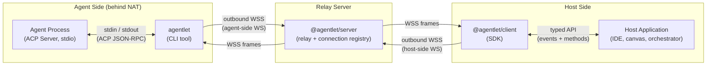

# Agentlet — Specification

> Make your local agents accessible from anywhere, without exposing them to the public internet.

---

## 1. Overview

**ACP agents are local-only, but the world needs them over the network — from machines that cannot be publicly reached.**

[Agent Client Protocol](https://agentclientprotocol.com) (ACP) is rapidly becoming the standard interface for AI agents. Most of the popular agents today (Claude Code, Copilot CLI, Gemini CLI, etc.) implement the ACP server side over stdio — they run as subprocesses and communicate via stdin/stdout. This design is stable, battle-tested, and works across all platforms. However, it has a critical limitation: it assumes the agent (the server) must be on the same machine as the client, because the only transport is stdio. Even for the in-draft WebSocket transport, the agent is still a server that listens for inbound connections, which means it must be on a machine with a public IP or properly configured NAT/firewall. However, many real-world use cases require the agent to run on a developer's local machine (where the code, credentials, and tools are) while being driven by a remote system (cloud-hosted IDE, canvas, orchestrator). This creates a fundamental mismatch: the agent is running in an environment that is not designed to accept inbound connections, yet the demand is for remote access from machines that cannot reach it directly.

This is the same class of problem that `ngrok` solves for HTTP servers, or SSH reverse tunnels solve for arbitrary TCP — **but for ACP agents specifically.** The agent can't be a server; someone needs to bridge it out.

### 1.1. What Agentlet Does

**Agentlet** is a thin relay process (~500 lines) that upgrades any stdio-only ACP agent into a network-accessible agent. It:

1. Spawns the agent locally via ACP stdio (the only stable transport)
2. Opens an **outbound** WebSocket to a remote server (traversing NAT naturally)
3. Relays ACP JSON-RPC messages bidirectionally — transparently, without interpretation
4. Handles reconnection and buffering so the agent is never disturbed by network issues

It has **zero AI logic**, **zero application knowledge**, and is completely server-agnostic. Any system that accepts an ACP-over-WebSocket connection can use Agentlet as its local-side adapter.

### 1.2. Why not wait for ACP's native WebSocket transport?

The [Streamable HTTP & WebSocket Transport RFD](https://agentclientprotocol.com/rfds/streamable-http-websocket-transport) is in active development (Working Group formed April 2026), but:

- It may take 6–12+ months to stabilize and for agents to adopt it
- Even when stable, it makes the **agent** a WebSocket server — the NAT/firewall problem remains (the remote system still can't reach a server behind the developer's firewall)
- Agentlet is forward-compatible: once agents expose native WebSocket, Agentlet simply connects locally instead of spawning, and the remote relay stays the same

| Constraint | How Agentlet solves it |
|---|---|
| Agent only speaks stdio | Agentlet spawns it locally and bridges stdio ↔ WebSocket |
| Agent is behind NAT | All connections are **outbound** from the user's machine — no public IP needed |
| Remote system needs push | WebSocket is full-duplex — server can send prompts at any time |
| Network is unreliable | Agentlet buffers and reconnects; agent subprocess is never touched |

---

## 2. Get Started

### 2.1. Prerequisites

- Node.js ≥ 20
- pnpm ≥ 9 (for building from source)
- An ACP-compatible agent installed locally (e.g., Claude Code, Copilot CLI, Gemini CLI)

### 2.2. Quick Start (standalone server + one agent)

**1. Install packages**

```bash
npm install -g agentlet @agentlet/server
```

Since packages are not yet published to npm, install from the git repository:

```bash
git clone https://github.com/anthropics/agentlet.git
cd agentlet
pnpm run source-install
```

After linking, `agentlet` and `agentlet-server` are available as global commands.

**2. Start the server**

```bash
# With inline token (simplest)
agentlet-server --port 8080 --token "tok_dev_123" --allow-insecure
# Multiple tokens via JSON file:
# { "tok_dev_123": { "user": "alice", "expireTime": null }, "tok_dev_456": { "user": "bob", "expireTime": null } }
agentlet-server --port 8080 --token "./tokens.json" --allow-insecure
```

The server is now listening on `http://localhost:8080` with the Web UI, REST API, and WebSocket endpoints.

**3. Connect an agent (self-spawn mode)**

In the agent-side terminal, where you previously ran the agent command (e.g., `copilot --allow-all` or `claude`, etc.), run the `agentlet` CLI to start an agent instance in the current directory and connect it to the server:

```bash
agentlet daemon --agent "copilot --acp --allow-all" \
         --server "ws://localhost:8080/api/bridge" \
         --token "tok_dev_123" \
         --allow-insecure
```

**3b. Or: run an idle agentlet (server-driven agent spawning)**

Instead of manually specifying which agent to run, start an idle agentlet and let the server decide:

```bash
agentlet daemon --server "ws://localhost:8080/api/bridge" \
         --token "tok_dev_123" \
         --allow-insecure
```

The agentlet connects to the server and waits. Spawn agents remotely via the REST API or Web UI:

```bash
curl -X POST http://localhost:8080/api/agentlets/<agentletId>/spawn \
  -H "Authorization: Bearer tok_dev_123" \
  -H "Content-Type: application/json" \
  -d '{"appId": "canvas-1", "sessionSpec": {"command": "copilot --acp --allow-all", "cwd": "/home/user/project"}}'
```

**4. Open the Web UI**

Navigate to `http://localhost:8080` — select the agent from the dropdown and start chatting. The Web UI also shows connected agentlets and lets you spawn/stop agents on them.

You can also use the headless WebSocket API (e.g., via `@agentlet/client`) or embed `@agentlet/server` directly in your own host application for programmatic access.

---

## 3. Architecture

### 3.1. Three Components

| Component | Package | Where it runs | Nature |
|---|---|---|---|
| **Agent-side adapter** | `agentlet` | User's machine (next to the agent) | CLI tool (installed by end user) |
| **Agent-side agentlet** | `agentlet` (without `--agent`) | Worker node (always-on) | CLI tool — idle mode, awaits server-driven spawn |
| **Relay server** | `@agentlet/server` | Remote server | Library (embedded) or standalone executable |
| **Host-side SDK** | `@agentlet/client` | Inside the host application | Library (imported by host app developers) |
| **Web UI** | `@agentlet/ui` | Browser (served by standalone server) | Built-in first-party host app (Vue 3 SPA — thin message viewport) |



### 3.2. The `agentlet` CLI: daemon and agent-team roles

The `agentlet` CLI exposes two subcommands:

| Subcommand | Purpose |
|---|---|
| `agentlet daemon …` | Run the network adapter that bridges local ACP agents to a remote server. |
| `agentlet agent-team …` | Prepare and inspect [Agent Team](#) packages (`setup` / `validate` / `doctor`). |

Within `agentlet daemon`, the presence of `--agent` determines the role:

| Role | Use case | How |
|---|---|---|
| **Self-spawn** | User explicitly spawns one agent (ad-hoc / development) | `agentlet daemon --agent "copilot --acp" --server wss://...` |
| **Idle agentlet** | Machine is an always-on worker node; server controls which agents to spawn | `agentlet daemon --server wss://...` (no `--agent`) |

When `--agent` is provided, the agentlet spawns the agent, bootstraps its ACP session, and immediately begins relaying. Without `--agent`, the agentlet connects to the server and waits for `server/spawn` requests — analogous to `kubelet` in Kubernetes. Each spawned agent gets its own session — from the server's perspective, server-spawned agents are indistinguishable from self-spawned agents.

Self-spawn is useful during development or when connecting a single agent on demand. Idle agentlet mode is preferred for production because it enables centralized orchestration — the server decides what to run, where, and when.

### 3.3. Two modes for the relay server

| Mode | Use case | How |
|---|---|---|
| **Embedded (library)** | Host app runs its own server and wants in-process access | `import { AgentletServer } from '@agentlet/server'` — mount on existing HTTP server |
| **Standalone (executable)** | Quick setup, self-hosted, or when host app is a separate service | `agentlet-server --port 8080 --token tok_abc` — runs its own HTTP server with REST + WS endpoints |

When embedded, the host app imports `@agentlet/server` and interacts with agents directly via TypeScript API (no network hop on the host side — `@agentlet/client` is not needed).

When standalone, the host app connects remotely via `@agentlet/client` SDK, which provides the **same typed API** as the embedded mode.

### 3.4. Data flow

```
Host Application
    ↕ @agentlet/client (typed API, or direct import of @agentlet/server)
Relay Server — @agentlet/server (manages connections, routes messages, stores session profiles)
    ↕ WebSocket (ACP JSON-RPC + agent/* control messages)
Agent-side adapter — agentlet (session bootstrap + transparent relay)
    ↕ stdin/stdout (ACP JSON-RPC)
Agent Process (Claude Code / Copilot CLI / etc.)
```

Every message between the relay server and the agent is a **standard ACP JSON-RPC 2.0** message. The agent-side adapter does not interpret, transform, or filter these messages — it is a transparent pipe.

### 3.5. Session Ownership Model

**Agentlet owns the ACP session lifecycle.** When an agent process is spawned (whether self-spawned via `--agent` or server-driven), agentlet immediately sends `initialize` and `session/new` (or `session/resume`/`session/load` when resuming a previous session) to the agent — before any remote client connects. The resulting session profile (sessionId, agent capabilities) is reported to the server via `agent/hello`.

This means:
- The server never sends `initialize` or `session/new` — it's a pure message router
- The UI never sends `initialize` or `session/new` — it attaches to an active session
- The UI is a **thin message viewport**: it fetches the sessionId from the REST API, opens a WebSocket, and immediately starts sending `session/prompt`
- Session bootstrap happens once, locally, with the correct `cwd` — no remote CWD guessing
- The `sessionId` is the primary key everywhere — stable across reconnects and resumes
- Sessions have a human-readable `displayName` (editable via UI or REST API), defaulting to the `sessionId`

```
agentlet spawns agent → initialize → session/new or session/resume → sessionProfile
                                                                         ↓
                                                         agent/hello {sessionId, sessionProfile}
                                                                         ↓
                                                             server stores session info
                                                                         ↓
                                                         GET /api/sessions → [{sessionId, displayName, connected, ...}]
                                                                         ↓
                                                             UI reads sessionId, opens WS
                                                                         ↓
                                                             UI sends session/prompt directly
```

### 3.6. Protocol & API Specifications

The host app uses JSON-RPC 2.0 over WebSocket to send ACP messages to a specific agent and receive ACP, lifecycle, and connection-state events. The agent channel protocol (connection establishment, handshake, control messages, reconnection) is documented in detail in [`spec/protocol.md`](spec/protocol.md).

The [`spec/agent-reachback.md`](spec/agent-reachback.md) guide describes the host-agnostic **Agent Reachback Interface** — how the daemon distributes host-provided tool scripts to spawned agents (via `server/sendResource`) and provisions their environment so the agents can reach back into the host app out-of-band.

For machine-readable API contracts:
- [`spec/openapi.yaml`](spec/openapi.yaml) — REST API (OpenAPI 3.1.0), viewable in [Swagger Editor](https://editor.swagger.io/) or [Swagger Viewer VSC Ext](https://marketplace.visualstudio.com/items?itemName=Arjun.swagger-viewer)
- [`spec/asyncapi.yaml`](spec/asyncapi.yaml) — WebSocket protocols (AsyncAPI 3.0.0), viewable in [AsyncAPI Studio](https://studio.asyncapi.com/) or [AsyncAPI Preview VSC Ext](https://marketplace.visualstudio.com/items?itemName=asyncapi.asyncapi-preview)

#### Standalone Endpoint Summary

When running the server in standalone mode (`agentlet-server`), the following endpoints are available:

| Endpoint | Client | Protocol | Purpose |
|---|---|---|---|
| `WS /api/bridge` | agentlet CLI | Agent JSON-RPC + raw ACP | Agent registration, lifecycle, bidirectional ACP relay |
| `WS /api/host` | UI / host apps | JSON-RPC 2.0 | Multiplexed session access: subscribe/unsubscribe for event replay + live streaming, send messages, receive lifecycle notifications |
| `GET /api/sessions` | UI / host apps | REST | List sessions (filtered by Bearer token). Each session includes `connected: boolean`. |
| `GET /api/sessions/:id` | UI / host apps | REST | Get session details |
| `PATCH /api/sessions/:id` | UI / host apps | REST | Update session (e.g. `displayName`) |
| `GET /api/agentlets` | UI / host apps | REST | List connected agentlets |
| `GET /api/agentlets/:id` | UI / host apps | REST | Get agentlet info |
| `POST /api/agentlets/:id/spawn` | UI / host apps | REST | Spawn (or resume if `sessionId` provided) an agent session on an agentlet |
| `POST /api/agentlets/:id/stop` | UI / host apps | REST | Stop an agent session on an agentlet |
| `GET /api/agentlets/:id/sessions` | UI / host apps | REST | List agent sessions running on an agentlet |
| `GET /api/health` | Any | REST | Health check |
| `GET /` | Browser | HTTP | Web UI (static SPA) |
| `GET /api/admin/tokens` | Admin | REST | List tokens (requires `--admin-token`) |
| `POST /api/admin/tokens` | Admin | REST | Replace full token map (requires `--admin-token`) |

Deprecated REST endpoints (still available with `Deprecation: true` header): `GET /api/agents`, `GET /api/agents/:id`, `DELETE /api/agents/:id` — use `/api/sessions` instead.

All REST endpoints accept `Authorization: Bearer <token>` for user-scoped filtering. Admin endpoints require `--admin-token` to be set at server startup. See [`spec/openapi.yaml`](spec/openapi.yaml) and [`spec/asyncapi.yaml`](spec/asyncapi.yaml) for full schemas and message definitions.

#### WebSocket Protocol Reference

Both channels use **JSON-RPC 2.0** framing. Each message is either a
**request** (has `id`, expects a response) or a **notification** (no `id`,
fire-and-forget). The method name follows an **`entity/verb`** or **`entity/adjective`** convention
where the entity identifies the sender, making direction self-evident.
The Direction key in the tables below indicates which party sends the message: H = Host/UI, S = Server, A = Agentlet adapter.

##### Host Channel — `WS /api/host`

Multiplexed session access for UIs and host applications. Supports per-session
event subscriptions with catch-up replay.

| Method               | Dir | Params                                     | Result | Description                                          |
|---                   |---  |---                                         |---     |---                                                   |
| `host/send`          | H→S | `{ sessionId, message }`                   | —      | Send ACP message to agent                            |
| `host/subscribe`     | H→S | `{ sessionId, afterSeq? }`                 | —      | Subscribe to session events (replay from `afterSeq`) |
| `host/unsubscribe`   | H→S | `{ sessionId }`                            | —      | Unsubscribe from session events                      |
| `server/event`       | S→H | `{ sessionId, seq, ts, dir, event }`       | —      | Persisted event (replayed or live)                   |
| `server/replayed`    | S→H | `{ sessionId, lastSeq }`                   | —      | Catch-up replay finished                             |
| `server/error`       | S→H | `{ sessionId?, code, message }`            | —      | Error                                                |
| `agent/connected`    | S→H | `{ sessionId, sessionProfile }`            | —      | Agent connected                                      |
| `agent/disconnected` | S→H | `{ sessionId, reason }`                    | —      | Agent disconnected                                   |
| `agent/exited`       | S→H | `{ sessionId, code, signal, willRestart }` | —      | Agent process exited                                 |
| `agent/restarted`    | S→H | `{ sessionId, pid, attempt }`              | —      | Agent restarted after crash                          |
| `agent/suspended`    | S→H | `{ sessionId, reason }`                    | —      | Session suspended (idle timeout)                     |

##### Agent Channel — `WS /api/bridge`

Agentlet CLI ↔ Server. After handshake, raw ACP messages (non-JSON-RPC)
are forwarded as-is between the agent process and connected host clients.

**Connection flow:**
1. Agentlet opens WebSocket to `/api/bridge?token=<token>`
2. Sends `agent/hello { sessionId, sessionProfile }` within 10 s handshake timeout
3. Server authenticates, registers by `sessionId`, responds with result
4. If `sessionProfile.agent` is present → ACP relay begins immediately (self-spawn mode, no `appId`)
5. If no agent attached → agentlet waits for `server/spawn` requests from host

**`sessionProfile`** contains all session metadata:
`{ agentletId, appId?, bridge, agent?, session?, machine?, capabilities }`

| Method            | Dir | Params                                       | Result                                                            | Description                              |
|---                |---  |---                                           |---                                                                |---                                       |
| `agent/hello`     | A→S | `{ sessionId, sessionProfile }`              | `{ sessionId, status }`                                           | Handshake and registration               |
| `agent/exited`    | A→S | `{ code, signal, willRestart }`              | —                                                                 | Agent process exited                     |
| `agent/restarted` | A→S | `{ pid, attempt }`                           | —                                                                 | Agent restarted after crash              |
| `agent/goodbye`   | A→S | `{ reason }`                                 | —                                                                 | Agentlet shutting down                   |
| `agent/overflow`  | A→S | `{ dropped }`                                | —                                                                 | Buffer limit reached, messages dropped   |
| `agent/suspended` | A→S | `{ sessionId, reason }`                      | —                                                                 | Idle session suspended                   |
| `agent/pong`      | A→S | `{}`                                         | —                                                                 | Keepalive response                       |
| `server/replay`   | S→A | `{ messages }`                               | —                                                                 | Replay buffered messages after reconnect |
| `server/shutdown` | S→A | `{ reason }`                                 | —                                                                 | Request agentlet shutdown                |
| `server/ping`     | S→A | `{}`                                         | —                                                                 | Keepalive ping                           |
| `server/spawn`    | S→A | `{ appId, sessionId?, sessionSpec }`         | `{ sessionId, pid }`                                              | Spawn agent (sessionSpec: command, cwd?, env?, autoRestart?, idleTimeoutSecs?) |
| `server/stop`     | S→A | `{ sessionId }`                              | `{ stopped }`                                                     | Stop agent session                       |
| `server/list`     | S→A | `{}`                                         | `{ agents: [{ sessionId, appId?, command, pid, cwd, status }] }`  | List agent sessions on this agentlet  |


See [`spec/asyncapi.yaml`](spec/asyncapi.yaml) for full schemas and [`spec/openapi.yaml`](spec/openapi.yaml) for REST endpoints.

---

## 4. Agent-Side Adapter — `agentlet` CLI

### 4.1. Session Identity (`sessionId` and `displayName`)

Each agent session is identified by a unique `sessionId` assigned during ACP session bootstrap (`session/new` or `session/resume` response). This is the **primary key** used everywhere — connection registry, REST API, event logs, and WebSocket routing.

Sessions also have a human-readable `displayName` that can be set or changed via the UI or REST API (`PATCH /api/sessions/:id`). The display name defaults to the `sessionId` if not explicitly set.

| Field | Source | Purpose |
|---|---|---|
| `sessionId` | ACP `session/new` or `session/resume` response | Primary key — unique, immutable, used for routing |
| `displayName` | User-set via UI or REST API | Human-readable label shown in the session list |

**Lifecycle:** The `sessionId` is stable across WebSocket reconnections, agent restarts, and session resumes. When a session is resumed (via `session/load` or `session/resume`), the same `sessionId` is reused, preserving the full event history.

### 4.2. Core Responsibilities

| # | Responsibility | Details |
|---|---|---|
| 1 | **Spawn agent subprocess** | Start the agent command via child process with stdio pipes. Respect the agent's expected working directory and environment. |
| 2 | **Bootstrap ACP session** | After spawn, send `initialize` and `session/new` (or `session/resume`/`session/load` when resuming) to the agent. Capture the session profile (sessionId, capabilities). This happens before any remote connection. |
| 3 | **Establish outbound WebSocket** | Connect to the relay server's endpoint using the provided token for authentication. Report agent info + session profile in `agent/hello`. TLS required in production. |
| 4 | **Relay messages bidirectionally** | Forward every complete JSON-RPC message from stdout → WebSocket and from WebSocket → stdin. No buffering beyond message framing. |
| 5 | **Handle reconnection** | On WebSocket disconnect: buffer agent stdout, reconnect with exponential backoff, replay buffered messages on reconnection. Agent subprocess is unaffected. |
| 6 | **Report lifecycle events** | Notify the server of lifecycle events (agent crash, agent exit, session suspended, shutting down) via `agent/*` control messages. |
| 7 | **Idle timeout management** | Track inactivity (no host-to-agent messages) per agent. When the configured `idleTimeoutSecs` elapses, suspend the session: notify the server via `agent/suspended`, then gracefully stop the agent. |
| 8 | **Graceful shutdown** | On SIGINT/SIGTERM: send `agent/goodbye` to server, close stdin to agent, wait for exit, then SIGTERM/SIGKILL if needed. |

### 4.3. Non-responsibilities (explicit)

- ❌ No AI logic — never generates prompts or interprets agent responses.
- ❌ No application knowledge — does not know what the remote system does (canvas, IDE, orchestrator — irrelevant).
- ❌ No message transformation — after session bootstrap, all ACP messages pass through verbatim.
- ❌ No credential management — does not handle the agent's API keys (those belong to the agent's own environment).
- ❌ No agent configuration — the agent command is passed opaquely; doesn't know or care which agent it is.

---

### 4.4. Installation

```bash
npm install -g agentlet
```

### 4.5. Usage

```bash
agentlet daemon --server <wss-url> --token <token> [--agent <command>] [options]
agentlet agent-team <setup|validate|doctor> [dir] [--harness <name>]
```

With `agentlet daemon --agent`: spawns the agent locally, bootstraps the ACP session, and relays immediately (**self-spawn**).
With `agentlet daemon` and no `--agent`: connects to the server and waits for `server/spawn` requests (**idle agentlet** — analogous to `kubelet`).
With `agentlet agent-team`: prepares per-harness workspaces from an Agent Team manifest, or inspects readiness.

> **Sources:** [`packages/local/src/bridge.ts`](packages/local/src/bridge.ts) (self-spawn), [`packages/local/src/daemon.ts`](packages/local/src/daemon.ts) (idle mode), [`packages/agent-team`](packages/agent-team) (agent-team)

### 4.6. Arguments

The arguments below apply to `agentlet daemon`.

| Argument | Required | Default | Description |
|---|---|---|---|
| `--server` | ✅ | — | Server's agent channel endpoint (WSS URL). | 
| `--token` | ✅ | — | Authentication token identifying this connection. |
| `--agent` | — | (idle mode) | Shell command to spawn the agent. Must support ACP stdio. If omitted, agentlet waits for server-driven spawn. |
| `--cwd` | — | Current directory | Working directory for the agent subprocess |
| `--max-agents` | — | `10` | Maximum concurrent agents (idle mode only) |
| `--reconnect-max` | — | `300` (5 min) | Maximum reconnection backoff in seconds |
| `--buffer-limit` | — | `1000` | Max messages buffered during disconnection (oldest dropped on overflow) |
| `--auto-restart` | — | `false` | Restart agent subprocess if it exits unexpectedly |
| `--restart-delay` | — | `2000` | Milliseconds to wait before restarting agent |
| `--restart-max` | — | `5` | Maximum consecutive restart attempts before giving up |
| `--log-level` | — | `info` | Logging verbosity: `debug`, `info`, `warn`, `error` |
| `--log-file` | — | (none) | Path to write structured log output (JSON lines) |
| `--env` | — | (none) | Extra environment variables for the agent: `--env KEY=VALUE` (repeatable) |
| `--heartbeat` | — | `30` | WebSocket ping interval in seconds (0 to disable) |
| `--allow-insecure` | — | `false` | Allow ws:// (non-TLS) connections (local development only) |

The `agentlet agent-team <subcommand> [dir]` arguments:

| Argument | Required | Default | Description |
|---|---|---|---|
| `dir` | — | Current directory | Path to the Agent Team package directory (the folder containing `agentlet.yaml`). |
| `--harness` | — | (all in manifest) | Restrict the action to a single harness (e.g. `claude`, `copilot`). |

### 4.7. Examples

```bash
# Self-spawn: connect Claude Code to a remote server
agentlet daemon --agent "claude --acp --stdio" \
         --server "wss://app.example.com/api/bridge" \
         --token "tok_from_server_ui"

# Self-spawn: Copilot CLI with a specific project directory
agentlet daemon --agent "copilot --acp --stdio" \
         --server "wss://localhost:3001/api/bridge" \
         --token "tok_dev_local" \
         --cwd "/home/user/my-project" \
         --auto-restart

# Self-spawn: custom environment for the agent
agentlet daemon --agent "gemini-cli --stdio" \
         --server "wss://app.example.com/api/bridge" \
         --token "tok_xyz" \
         --env "GEMINI_API_KEY=sk-..." \
         --env "PROJECT_ROOT=/workspace"

# Idle agentlet: worker node waiting for server-driven spawn
agentlet daemon --server "wss://app.example.com/api/bridge" \
         --token "tok_worker_node_1"

# Idle agentlet: local development with higher agent limit
agentlet daemon --server "ws://localhost:8080/api/bridge" \
         --token "tok_dev_123" \
         --max-agents 20 \
         --allow-insecure

# Agent Team: prepare a package's workspaces for all declared harnesses
agentlet agent-team setup ./agent-teams/hackmd-publisher

# Agent Team: check readiness for a single harness
agentlet agent-team doctor ./agent-teams/hackmd-publisher --harness copilot
```

### 4.8. How it works

**Self-spawn** (`--agent` provided):
1. Agentlet spawns the agent subprocess, bootstraps the ACP session (`initialize` + `session/new`).
2. Connects to `/api/bridge?token=<token>`, sends `agent/hello { sessionId, sessionProfile }` with `sessionProfile.agent` present.
3. Server registers with role `agent-session`, ACP relay begins immediately.

**Idle mode** (no `--agent`):
1. Agentlet connects to `/api/bridge?token=<token>`, sends `agent/hello` without `sessionProfile.agent`.
2. Server registers with role `agentlet`, waits for spawn commands.
3. Server (via REST API or UI) sends `server/spawn { appId, sessionId?, sessionSpec }`.
4. Agentlet spawns the agent, bootstraps ACP session, opens a second WebSocket for relay.
5. Server can send `server/stop` to terminate an agent, or `server/list` to list running agents.

See [Protocol Specification — Connection Establishment](spec/protocol.md#connection-establishment) for full sequence diagrams and message formats.

---

### 4.9. Agent Subprocess Management

#### Spawning

> **Source:** [`packages/local/src/agent-process.ts`](packages/local/src/agent-process.ts)

- **stdin**: Writable — Agentlet writes ACP messages (from server) here.
- **stdout**: Readable — Agent writes ACP responses here. Agentlet reads and relays.
- **stderr**: Readable — Agent diagnostic output. Logged by Agentlet but **not relayed** to server (it's not ACP protocol traffic).

#### Exit Handling

| Exit type | Action |
|---|---|
| Clean exit (code 0) | Send `agent/exited` with code 0. Do not restart. |
| Crash (code ≠ 0) | Send `agent/exited`. If `--auto-restart` enabled, restart after delay (up to `--restart-max`). |
| Signal (SIGTERM, SIGKILL) | Send `agent/exited` with signal name. Respect `--auto-restart`. |

#### Graceful Shutdown

> **Source:** `Bridge.shutdown()` in [`packages/local/src/bridge.ts`](packages/local/src/bridge.ts)

On SIGINT or SIGTERM to Agentlet:

1. Send `agent/goodbye` to server.
2. Close stdin to agent (signals EOF → agent should exit).
3. Wait up to 5 seconds for agent to exit.
4. If agent still alive, send SIGTERM.
5. Wait 2 more seconds, then SIGKILL if necessary.
6. Close WebSocket.
7. Exit with code 0.

---

## 5. Relay Server — `@agentlet/server`

### 5.1. Overview

`@agentlet/server` is a lightweight TypeScript package that manages agent connections over WebSocket. It can be used in two ways:

1. **Embedded library** — import into your own server for in-process access to agents
2. **Standalone executable** — run independently, exposing REST + WebSocket APIs for host apps to connect remotely

The relay server is where **multiplexing** happens — a single instance manages connections from many agents simultaneously.

### 5.2. Installation

```bash
npm install @agentlet/server
```

### 5.3. Embedded Mode (Library API)

Import `AgentletServer` into your own HTTP server for in-process access to agents. The host app is responsible for four things: **mounting** the server, **orchestrating** thread-to-session mapping, **communicating** via the ACP SDK, and **persisting** sessions for recovery after restart.

#### Quick start

```ts
import { AgentletServer } from '@agentlet/server'

const server = new AgentletServer({
  storeDir: './data',
  authenticate: async (token, meta) => {
    if (token !== process.env.AGENTLET_TOKEN) throw new Error('Invalid token')
    return { metadata: {} }
  },
  onConnection: (agent) => console.log(`Agent connected: ${agent.sessionId}`),
  onDisconnection: (agent, reason) => console.log(`Agent disconnected: ${reason}`),
})
```

#### Mounting on your HTTP server

Initialize the server and attach the WebSocket upgrade handler. The `handleUpgrade` call works with any Node.js HTTP framework:

```ts
// Fastify
app.addHook('onReady', async () => {
  await server.init()
  app.server.on('upgrade', (req, socket, head) => {
    if (req.url?.startsWith('/api/bridge')) server.handleUpgrade(req, socket, head)
  })
})

// Express
const httpServer = app.listen(3001)
await server.init()
httpServer.on('upgrade', (req, socket, head) => {
  if (req.url?.startsWith('/api/bridge')) server.handleUpgrade(req, socket, head)
})

// Plain Node.js http
const httpServer = http.createServer()
await server.init()
httpServer.on('upgrade', (req, socket, head) => {
  server.handleUpgrade(req, socket, head)
})
httpServer.listen(3001)
```

> ⚠️ Call `server.init()` **after** the HTTP server is bound, not at import time. In Fastify, use `onReady` or `onListen`; in Express, call it inside the `listen()` callback.

#### Spawning agents per thread

The agentlet daemon connects once; the host spawns individual agent sessions on demand using `spawnOnAgentlet()`. Each application thread should get its **own** agent process to prevent state bleed (conversation history, model, mode).

```ts
// Resolve the connected daemon
const agentlets = server.getAgentlets()
const agentlet = agentlets[0]
if (!agentlet) throw new Error('No agent worker online')

// Spawn an agent for this thread (one process per thread)
const { sessionId, pid } = await server.spawnOnAgentlet(agentlet.sessionId, {
  appId: threadId,
  sessionSpec: { command: 'claude', cwd: '/projects/myapp', idleTimeoutSecs: 600 },
})

// Wait for the agent to finish its WS handshake
// (poll server.getConnection(sessionId) until status === 'connected')
```

#### Sending prompts

The daemon already bootstraps the ACP session (`initialize` → `session/new`) during spawn. The host should **not** re-issue these RPCs. Instead, seed capabilities from the DataStore and send prompts directly.

**Using raw JSON-RPC** (simplest, but no request correlation or schema validation):

```ts
const conn = server.getConnection(sessionId)
if (!conn || conn.status !== 'connected') throw new Error('Agent offline')

// Send prompt — no initialize or session/new needed
conn.send({
  jsonrpc: '2.0', method: 'session/prompt', id: 1,
  params: { sessionId, prompt: [{ type: 'text', text: 'Refactor the auth module' }] },
})

// Listen for responses
conn.onMessage((msg) => {
  if (msg.method === 'session/update') renderToUI(msg.params)
  if (msg.id === 1 && msg.result) console.log('Prompt finished')
})
```

**Using `@agentclientprotocol/sdk`** (recommended for production — gives you request/response correlation, typed results, capability handler dispatch, and abort support):

```ts
import {
  ClientSideConnection,
  type Stream, type AnyMessage, type Client as SdkClient, type Agent as SdkAgent,
} from '@agentclientprotocol/sdk'

// Adapt AgentConnection to the SDK's Stream interface
function streamFromAgentConnection(conn: AgentConnection): {
  stream: Stream; close: () => void
} {
  let controller: ReadableStreamDefaultController<AnyMessage> | null = null
  let closed = false
  const readable = new ReadableStream<AnyMessage>({
    start(c) {
      controller = c
      conn.onMessage((msg) => {
        if (!closed) try { controller?.enqueue(msg as unknown as AnyMessage) } catch {}
      })
    },
  })
  const writable = new WritableStream<AnyMessage>({
    write(msg) { if (!closed) conn.send(msg) },
  })
  return {
    stream: { readable, writable },
    close: () => { closed = true; try { controller?.close() } catch {} },
  }
}

// Create the SDK connection with capability handlers
const conn = server.getConnection(sessionId)
const { stream, close } = streamFromAgentConnection(conn)
const sdk = new ClientSideConnection(
  (_agent: SdkAgent): SdkClient => ({
    sessionUpdate: async (params) => { renderToUI(params.update) },
    requestPermission: async (req) => {
      const option = req.options.find(o => o.kind === 'allow_always') ?? req.options[0]
      return { optionId: option.optionId }
    },
    readTextFile: async (req) => {
      return { content: fs.readFileSync(resolve(projectRoot, req.path), 'utf-8') }
    },
    writeTextFile: async () => { throw new Error('Write not supported') },
  }),
  stream,
)

// Seed capabilities from DataStore — skip redundant initialize()
const record = server.getDataStore().getSession(sessionId)
// record.initializeResult contains agentCapabilities from the daemon's bootstrap

// Send a prompt — resolves when the agent finishes the turn
const result = await sdk.prompt({
  sessionId,
  prompt: [{ type: 'text', text: 'Refactor the auth module' }],
})
console.log('Prompt finished:', result.stopReason)

// Cancel mid-turn (from a UI button, for example)
// await sdk.cancel({ sessionId })

// Cleanup
close()
```

For a full production wrapper class (with session listeners, orphan-update buffering, and permission gating), see the [**Host App Integration Guide** §6](spec/host.md#6-acp-client-wrapper).

#### Graceful shutdown

```ts
// Fastify
app.addHook('onClose', () => server.close())

// Or manually
process.on('SIGTERM', async () => {
  await server.close()  // sends server/shutdown to all agents
  process.exit(0)
})
```

#### Production integration guide

The examples above cover the basics. For production host apps, the [**Host App Integration Guide**](spec/host.md) covers the additional patterns you will need:

- **Spawn orchestration** — `threadId → sessionId` cache with daemon-swap invalidation
- **Skip redundant handshake** — seed from DataStore + replay EventStore notifications
- **Concurrency guards** — in-flight promise coalescing to prevent duplicate sessions
- **Stale-entry eviction** — detect binding/scope changes and closed clients
- **Session persistence & recovery** — resume after host restart via `session/load`
- **ACP SDK wrapper** — `ClientSideConnection` with capability handlers (fs, permissions)
- **Error handling** — daemon-offline errors, mid-prompt disconnects, status endpoints

> See [Protocol Specification — Protocol Type Reference](spec/protocol.md#protocol-type-reference) for full `AgentletServerOptions` and `AgentConnection` definitions.

### 5.4. Standalone Mode (CLI)

```bash
agentlet-server --port 8080 --token "tok_abc"
```

| Argument | Default | Description |
|---|---|---|
| `--host` | `0.0.0.0` | Bind address |
| `--port` | `8080` | Listen port |
| `--token <value\|path>` | (required) | A single token string, or path to a JSON token file (see format below) |
| `--admin-token <token>` | (disabled) | Enable admin API with this token. If not set, admin routes are disabled. |
| `--store-dir <path>` | (in-memory) | Directory for persistent storage. Session metadata is stored in `<store-dir>/sessions.db` and event logs in `<store-dir>/events/` (JSONL per session). If not set, session data is in-memory only and lost on restart. |
| `--allow-insecure` | `false` | Allow ws:// (non-TLS) for local development |
| `--no-ui` | `false` | Disable the built-in web UI (headless mode) |

**Token file format:**

```json
{
  "tok_alice_123": { "user": "alice", "expireTime": null },
  "tok_bob_456": { "user": "bob", "expireTime": 1735689600 }
}
```

Each key is a token string. `expireTime` is a Unix timestamp (seconds) or `null` for no expiry.

> **Endpoints:** See [§3.6 Standalone Endpoint Summary](#standalone-endpoint-summary) for the full list of REST, WebSocket, and Admin endpoints.

### 5.5. `AgentletServer` instance methods

> **Source:** [`packages/server/src/server.ts`](packages/server/src/server.ts)

Key methods: `handleUpgrade()`, `getConnection(sessionId)`, `getConnections(filter?)`, `connectionCount`, `close()`.

> **Library design notes:**
> - Multiple `AgentletServer` instances in a single process are supported (no global state, no singletons).
> - In embedded mode, the server never calls `listen()` — it only accepts already-upgraded sockets.
> - Importing the package has zero side effects.
> - Call `server.close()` during shutdown to ensure all agents receive `server/shutdown`.

> For full type definitions of `AgentletServerOptions`, `AuthResult`, `AgentConnection`, and lifecycle event types, see [Protocol Specification — Protocol Type Reference](spec/protocol.md#protocol-type-reference).

### 5.6. Connection Registry & Reconnection

The relay server maintains an internal registry: `Map<sessionId, AgentConnection>`. The `sessionId` is the primary routing key — always available after session bootstrap. Sessions also have a `displayName` for human-readable identification in the UI. See [Protocol Specification — Reconnection Protocol](spec/protocol.md#reconnection-protocol) for the full reconnection flow.

### 5.7. Data Model

The server uses a three-layer data model separating durable metadata, live connection state, and append-only event logs:

```
 ┌─────────────────────────────────────────────────────┐
 │  SQLite (sessions.db) — durable metadata            │
 │  ┌──────────────┐  ┌───────────────────────────┐    │
 │  │  agentlets   │  │  sessions                 │    │
 │  │──────────────│  │───────────────────────────│    │
 │  │  agentlet_id │◄─│  agentlet_id (FK)         │    │
 │  │  owner       │  │  session_id               │    │
 │  │  machine     │  │  display_name             │    │
 │  │  bridge      │  │  owner                    │    │
 │  │  capabilities│  │  command, cwd, env        │    │
 │  │  registered_ │  │  profile (JSON)           │    │
 │  │    at        │  │  capabilities             │    │
 │  │  updated_at  │  │  created_at, updated_at   │    │
 │  └──────────────┘  └───────────────────────────┘    │
 ├─────────────────────────────────────────────────────┤
 │  In-memory — live WS handles                        │
 │  ┌───────────────────────────────────────────────┐  │
 │  │  connections: Map<id, ConnectionHandle>        │  │
 │  │  ─ id (agentletId | sessionId)                │  │
 │  │  ─ role ('agentlet' | 'agent-session')        │  │
 │  │  ─ ws: WebSocket                              │  │
 │  │  ─ connectedAt                                │  │
 │  │  ─ outboundBuffer (for reconnect replay)      │  │
 │  │  ─ messageHandlers (runtime callbacks)        │  │
 │  └───────────────────────────────────────────────┘  │
 ├─────────────────────────────────────────────────────┤
 │  JSONL files — per-session event logs               │
 │  events/<sessionId>.jsonl                           │
 │  ─ {seq, ts, dir, event}                            │
 └─────────────────────────────────────────────────────┘
```

**Layer separation:**

- **SQLite** holds durable metadata that survives server restarts: agentlet registrations, session records, profiles (as JSON blobs), and ownership (`owner = sha256(token)`). Managed by the `DataStore` class.
- **In-memory** holds only live WebSocket handles and runtime state. Profiles and auth data are *not* cached on connections — they are read from SQLite on demand. This keeps the connection handle slim and avoids stale-profile bugs on reconnect.
- **JSONL** provides append-only, per-session event logs for replay. Each event carries a global sequence number (`seq`), enabling catch-up subscriptions and UI reconnect without `session/load`.

### 5.8. Core Responsibilities

| # | Responsibility | Details |
|---|---|---|
| 1 | **Agent-side WebSocket endpoint** | Accept incoming WSS connections from agent-side adapters (`agentlet` CLI). |
| 2 | **Host-side WebSocket endpoint** | Accept incoming WSS connections from host apps (standalone mode) or provide in-process API (embedded mode). |
| 3 | **Token validation** | Delegate to `authenticate` callback (embedded) or static token file (standalone). Reject invalid/expired tokens. |
| 4 | **Connection registry** | Track all active agent connections. Provide lookup by sessionId. |
| 5 | **Message routing** | Forward ACP messages from host → correct agent, and from agent → host. Pure fan-out relay — no ACP-level inspection or rewriting. |
| 6 | **Reconnection handling** | Recognize reconnecting agents (same sessionId), restore connection state, replay buffered messages. |
| 7 | **Data store** | Persist agentlet and session records (sessionId, displayName, spawn params, capabilities, profile) in a sql.js-backed SQLite store. Session `connected` status is derived on-the-fly from the live connection registry. Token ownership via `sha256(token)`. |
| 8 | **Event persistence** | Append every ACP JSON-RPC message (both directions) to a per-session event log. Each event has a global sequence number (`seq`), timestamp, direction (`agent`/`host`), and the raw JSON-RPC message. Storage backend is JSONL (append-only, one file per session in `<store-dir>/events/`). |
| 9 | **Session event replay** | Expose per-session event replay via the `/api/host` WebSocket using subscribe/unsubscribe commands with catch-up subscription pattern: replay historical events from `afterSeq`, then stream live events. Enables UI reconnect without `session/load`. |
| 10 | **Session suspension handling** | Receive `agent/suspended` notifications from agentlets, update session status, and surface to host apps. |
| 11 | **Lifecycle events** | Surface `agent/exited`, `agent/suspended`, `agent/goodbye`, etc. to host via typed events. |

### 5.9. Non-responsibilities

- ❌ No AI logic — never generates prompts or interprets agent responses.
- ❌ No ACP session management — never sends `initialize`, `session/new`, or `session/load`. Session bootstrap is owned by agentlet.
- ❌ No message rewriting — all ACP messages pass through verbatim. No CWD injection, no session interception.
- ❌ No token generation — host app generates and manages tokens. Server only validates.

### 5.10. Web UI (Standalone Mode)

When running in standalone mode, `agentlet-server` serves a built-in web interface at the root path (`/`). This provides a **first-party host application** for interactive use — chatting with agents, monitoring traffic, and managing connections — without requiring a separate host app.

#### Per-Agent Raw ACP WebSocket Endpoint *(Deprecated)*

> **⚠️ Deprecated:** Use `/api/host` with subscribe/unsubscribe instead. The per-agent raw ACP WebSocket does not support event persistence or replay.

To support standard ACP-compatible UIs, the standalone server exposes a **raw ACP WebSocket** per connected agent:

```
WS /agents/:sessionId/ws
```

This endpoint speaks **raw ACP JSON-RPC** — no envelope protocol. Each WebSocket frame is a single ACP JSON-RPC message, identical to how standard ACP clients expect to communicate.

#### Session Event WebSocket Endpoint

The recommended way to interact with agent sessions is via the **multiplexed host WebSocket** at `WS /api/host`. See [§3.6 WebSocket Protocol Reference](#websocket-protocol-reference) for the full JSON-RPC 2.0 method table and [§3.4 Data flow](#34-data-flow) for the end-to-end message path.

On page refresh, the UI reconnects to `/api/host` and subscribes with `afterSeq` — the server replays missed events from the JSONL log, then switches to live streaming. The UI reconstructs chat history from both host events (user prompts) and agent events (responses).

#### UI Features

| Feature | Description |
|---|---|
| **Chat** | Send prompts, receive streaming responses, view agent messages |
| **Message persistence** | Full chat history survives page refresh — events replayed from server-side JSONL logs via session event WS |
| **Delta sync** | On reconnect, only missed events are replayed (via `afterSeq`). `lastSeq` cached in localStorage per session |
| **Multi-agent** | Agent selector — switch between connected agents (discovered via REST API) |
| **Agentlet management** | View connected agentlets, spawn agents on them, stop agents — all from the UI |
| **Permissions** | Approve/deny agent permission requests (tool calls, file access) |
| **Traffic monitor** | Inspect raw ACP JSON-RPC messages in real time |
| **Session attach** | Automatically attaches to the agent's active session (bootstrapped by agentlet) — no manual session creation |
| **Connection status** | Live indicator for agent online/offline/reconnecting state |

#### Technology Stack

The UI is a Vue 3 single-page application (SPA) built with Vite, bundled as static assets:

- **Framework:** Vue 3 + TypeScript + Pinia (state management)
- **Build:** Vite → static `dist/` directory
- **Transport:** Host WebSocket (`/api/host`) with subscribe/unsubscribe for per-session event replay + live streaming
- **Session model:** Thin viewport — fetches session list from `GET /api/sessions`, subscribes via `/api/host`. No `initialize` or `session/new` from the UI.
- **Persistence:** `lastSeq` cached in localStorage per session for delta sync on reconnect
- **Session discovery:** `GET /api/sessions` REST endpoint

> **Endpoints:** See [§3.6 Standalone Endpoint Summary](#standalone-endpoint-summary) for the full list.

#### Reference: acp-ui

The UI design is adapted from [acp-ui](https://github.com/formulahendry/acp-ui) (MIT licensed, Vue 3 + Vite). Key adaptations from acp-ui:

| acp-ui (original) | agentlet UI (adapted) |
|---|---|
| Tauri desktop app + web build | Web-only (served by `agentlet-server`) |
| Agent config via local JSON file | Session discovery via `GET /api/sessions` |
| Connects to agent URL directly | Connects via `/api/host` with subscribe (server proxies) |
| Supports stdio + WebSocket transport | WebSocket only (agents are always remote via agentlet) |
| Single-agent per connection | Multi-agent (selector UI with all connected agents) |

---

### 5.11. Admin Control Plane

When `--admin-token` is set, the server exposes admin routes for token management:

```bash
agentlet-server --port 8080 --token "./tokens.json" --admin-token "admin_secret_xyz"
```

#### Admin API

All admin requests require `Authorization: Bearer <admin-token>` header.

**`GET /api/admin/tokens`** — Returns the current full token map:

```json
{
  "tok_alice_123": { "user": "alice", "expireTime": null },
  "tok_bob_456": { "user": "bob", "expireTime": 1735689600 }
}
```

**`POST /api/admin/tokens`** — Atomically replaces the entire token map:

```bash
curl -X POST http://localhost:8080/api/admin/tokens \
  -H "Authorization: Bearer admin_secret_xyz" \
  -H "Content-Type: application/json" \
  -d '{"tok_new": {"user": "charlie", "expireTime": null}}'
```

This is a full-map swap (not per-token CRUD) — designed for POC simplicity. For any token changes, modify your local file and POST the entire file content.

#### Multi-User Flow

Each token represents a user. The token is used for:
1. **Agentlet authentication** — `agentlet --token <tok>` identifies which user owns this agentlet
2. **REST API filtering** — `GET /api/sessions` with `Authorization: Bearer <tok>` returns only that user's sessions
3. **WebSocket authentication** — `/api/host` validates token, scopes operations by ownership
4. **UI login** — user enters their token in the web UI to see only their agents

---

### 5.12. Session Lifecycle

**Agentlet owns the ACP session lifecycle.** The server is a pure message router and the UI is a thin viewport.

#### How It Works

```
agentlet spawns agent process
    ↓
agentlet sends initialize → agent responds with capabilities
    ↓
agentlet sends session/new {cwd: actual_local_cwd} → agent responds with sessionId
    ↓
agentlet connects to server via agent/hello {session: {sessionId, supportsLoad, initializeResult}}
    ↓
server stores session info in AgentConnection
    ↓
UI fetches GET /api/sessions → receives [{sessionId, displayName, connected, ...}]
    ↓
UI opens WebSocket, sets sessionId locally → immediately ready for session/prompt
```

#### Key Design Decisions

- **No session map on the server** — the server never intercepts or rewrites `initialize`, `session/new`, or `session/load`.
- **No CWD injection** — agentlet knows the correct `cwd` (it spawned the process there) and passes it in `session/new` directly.
- **No ACP handshake from UI** — the UI never sends `initialize` or `session/new`. It reads the sessionId from the sessions list and subscribes via `/api/host`.
- **Session info in REST API** — `GET /api/sessions` returns `{sessionId, displayName, connected, supportsLoad, supportsResume}` so any client can discover active sessions.
- **`supportsLoad` flag** — if the agent supports `session/load` (from `initializeResult.agentCapabilities.loadSession`), a future reconnecting agentlet can resume the session instead of creating a new one.

---

---

## 6. Security Considerations

| Concern | Mitigation |
|---|---|
| **Token exposure** | Token is passed via CLI argument. Recommend: environment variable (`AGENTLET_TOKEN`) as alternative. Token should be short-lived and revocable from the server. |
| **WebSocket TLS** | Production connections MUST use `wss://`. Agentlet should reject `ws://` unless `--allow-insecure` is explicitly passed (for local development only). |
| **Agent command injection** | The `--agent` value (or server-driven spawn `command`) is passed to `spawn` with `shell: true`. Document that users should only run trusted agent commands. Only the token owner can trigger spawns. |
| **Message integrity** | Agentlet relays messages verbatim — no validation of ACP semantics. Server-side must validate all incoming ACP messages. |
| **Credential isolation** | Agentlet never touches the agent's credentials (API keys, SSH keys). Those live in the agent's own process environment. |
| **Token revocation** | If the server revokes the token, it sends `server/shutdown`. Agentlet terminates agent and exits. |

---

## 7. Observability

### 7.1. Logging

Structured JSON-lines output when `--log-file` is specified:

```jsonc
{"ts":"2026-05-20T10:30:00Z","level":"info","event":"ws_connected","server":"wss://app.example.com/api/bridge"}
{"ts":"2026-05-20T10:30:00Z","level":"info","event":"agent_spawned","pid":12345,"command":"claude --acp --stdio"}
{"ts":"2026-05-20T10:30:01Z","level":"info","event":"handshake_ok","sessionId":"sess_abc123"}
{"ts":"2026-05-20T10:35:22Z","level":"warn","event":"ws_disconnected","code":1006,"reason":""}
{"ts":"2026-05-20T10:35:23Z","level":"info","event":"reconnecting","attempt":1,"backoff_ms":1000}
{"ts":"2026-05-20T10:35:24Z","level":"info","event":"ws_reconnected","buffered_replayed":3}
```

### 7.2. Metrics (future)

Optional Prometheus-compatible metrics endpoint (`--metrics-port`):

- `agentlet_messages_relayed_total{direction="to_server|to_agent"}`
- `agentlet_ws_reconnections_total`
- `agentlet_buffer_depth`
- `agentlet_agent_restarts_total`
- `agentlet_uptime_seconds`

---

## 8. Technology Choices

| Decision | Choice | Rationale |
|---|---|---|
| **Language** | TypeScript (Node.js) | Excellent child process and WebSocket support; broad ecosystem familiarity. |
| **WebSocket client** | `ws` (npm) | De-facto standard, lightweight, well-maintained. |
| **CLI parsing** | `commander` or `yargs` | Mature, minimal dependencies. |
| **Process management** | Node.js `child_process.spawn` | Native, no extra dependencies. |
| **Session persistence** | `sql.js` (SQLite compiled to WASM) | Zero native dependencies, ~1MB, works on all platforms without build tools. 13.6k GitHub stars, 3.7M monthly downloads. |
| **Packaging** | Single executable via `pkg` or `esbuild` bundle | Zero-dependency distribution for users without Node.js installed. |
| **Distribution** | npm (`npm install -g agentlet`) + standalone binaries | Dual distribution for different user preferences. |
| **ACP dependency** | None — define minimal JSON-RPC 2.0 types in `@agentlet/protocol` | Agentlet is transport-only; never interprets ACP semantics. Avoids coupling to evolving ACP spec. Host apps bring their own ACP SDK if needed. |

---

## 9. Future Evolution

### 9.1. When ACP HTTP/WebSocket transport stabilizes

The [Streamable HTTP & WebSocket Transport RFD](https://agentclientprotocol.com/rfds/streamable-http-websocket-transport) (Working Group formed April 2026) will allow agents to expose a native HTTP/WebSocket endpoint.

**Impact on Agentlet:**

| Scenario | Agentlet's role |
|---|---|
| Agent exposes local HTTP endpoint | Agentlet becomes a **WebSocket tunnel** only — no subprocess management. Connects to agent's local HTTP and relays to remote server's WSS. Simpler, ~100 lines. |
| Agent exposes public WebSocket | Agentlet is **unnecessary** — remote server connects directly to agent. Agentlet retired for that agent. |
| Agent is still stdio-only | No change — Agentlet continues as today. |

The current architecture is **forward-compatible**: the `agent/hello` handshake and relay protocol remain identical regardless of how the agent is reached locally. Only the "local side" connector changes.

### 9.2. Multi-agent support

**Current design:** The relay server and Web UI **natively support multiple agents** — any number of agent-side adapters can connect simultaneously, each identified by its unique `sessionId`. The server maintains a connection registry (`Map<sessionId, AgentConnection>`), the REST API lists all sessions, and the UI provides an agent selector.

**Agent-side (self-spawn):** Each `agentlet daemon --agent ...` instance spawns and manages exactly **one** agent process. To connect multiple agents, run multiple `agentlet daemon` instances (one per agent). This keeps each adapter simple and independently restartable.

**Agent-side (idle agentlet):** A single idle `agentlet` instance can manage **multiple** agent processes concurrently — each spawned on demand from the server. This is the recommended approach for worker nodes that need to run multiple agents.

**Future (post-v1):** Static config file support:

```bash
agentlet --config agents.yaml --server "wss://app.example.com/api/bridge"
```

```yaml
# agents.yaml
agents:
  - name: claude
    command: "claude --acp --stdio"
    token: "tok_111"
    cwd: "/home/user/project-a"
  - name: copilot
    command: "copilot --acp --stdio"
    token: "tok_222"
    cwd: "/home/user/project-b"
```

---

## 10. Project Structure

```
agentlet/
├── packages/
│   ├── local/                    # Agent-side adapter (CLI tool: `agentlet`)
│   │   ├── src/
│   │   │   ├── index.ts          # CLI entry point
│   │   │   ├── cli.ts            # Argument parsing & validation (single command)
│   │   │   ├── bridge.ts         # Self-spawn orchestrator (lifecycle state machine)
│   │   │   ├── daemon.ts         # Idle agentlet orchestrator (multi-agent, server-driven)
│   │   │   ├── agent-process.ts  # Subprocess spawning, stdio handling, restart logic
│   │   │   ├── session-bootstrap.ts # ACP session bootstrap (initialize + session/new + session/resume + session/load)
│   │   │   ├── ws-client.ts      # WebSocket connection, reconnection, buffering
│   │   │   ├── relay.ts          # Bidirectional message forwarding (transparent pipe, idle timeout tracking)
│   │   │   └── logger.ts         # Structured logging
│   │   ├── tests/
│   │   └── package.json          # name: "agentlet"
│   │
│   ├── server/                    # Relay server (`@agentlet/server`)
│   │   ├── src/
│   │   │   ├── index.ts          # Public API exports
│   │   │   ├── server.ts         # Main AgentletServer class (connection registry, lifecycle, stores, event wiring)
│   │   │   ├── connection.ts     # AgentConnection implementation (stores session profile, persist callback)
│   │   │   ├── event-store.ts    # EventStore class + IEventStorage interface (per-session event log with pub/sub)
│   │   │   ├── jsonl-storage.ts  # JSONL storage backend (append-only, seq=line number)
│   │   │   ├── session-events-ws.ts # Session event WebSocket endpoint (replay + live streaming)
│   │   │   ├── agent-ws.ts       # Agent-side WebSocket handler (transparent relay)
│   │   │   ├── host-ws.ts        # Host-side WebSocket endpoint (standalone mode)
│   │   │   ├── rest-api.ts       # REST endpoints (standalone mode, session + agent APIs)
│   │   │   ├── token-store.ts    # Token validation and management
│   │   │   ├── session-store.ts  # Session persistence (sql.js-backed, in-memory or file)
│   │   │   └── standalone.ts     # CLI entry point for standalone mode (--store-dir option)
│   │   ├── tests/
│   │   └── package.json          # name: "@agentlet/server"
│   │
│   ├── client/                    # Host-side SDK (`@agentlet/client`)
│   │   ├── src/
│   │   │   ├── index.ts          # Public API exports
│   │   │   └── client.ts         # AgentletClient — connects to standalone server
│   │   ├── tests/
│   │   └── package.json          # name: "@agentlet/client"
│   │
│   ├── ui/                        # Built-in Web UI (`@agentlet/ui`)
│   │   ├── src/
│   │   │   ├── main.ts           # Vue app entry point
│   │   │   ├── App.vue           # Root component (layout, agent selector)
│   │   │   ├── components/
│   │   │   │   ├── ChatView.vue      # Chat interface (prompts, responses, streaming)
│   │   │   │   ├── AgentSelector.vue  # Connected agents picker (uses session event WS)
│   │   │   │   ├── PermissionDialog.vue  # Agent permission approval UI
│   │   │   │   ├── TrafficMonitor.vue    # Raw ACP message inspector
│   │   │   │   └── SessionList.vue       # Session management
│   │   │   ├── stores/
│   │   │   │   ├── session.ts    # ACP session state (Pinia) — supports legacy + session event transports
│   │   │   │   └── agents.ts     # Agent connection state (from REST API)
│   │   │   └── lib/               # (no separate transport files — UI uses /api/host directly)
│   │   │   
│   │   ├── index.html            # SPA shell
│   │   ├── vite.config.ts
│   │   └── package.json          # name: "@agentlet/ui"
│   │
│   └── protocol/                  # Shared protocol definitions (`@agentlet/protocol`)
│       ├── src/
│       │   ├── index.ts          # Public exports
│       │   ├── json-rpc.ts       # JSON-RPC 2.0 base types
│       │   ├── messages.ts        # Protocol message type definitions (entity/verb naming)
│       │   ├── gateway-types.ts   # AgentletServerOptions, AgentConnection, AuthResult
│       │   └── constants.ts      # Protocol version, method names (AgentMethods, ServerMethods, HostMethods), error codes
│       └── package.json          # name: "@agentlet/protocol"
│
├── package.json                   # Workspace root (pnpm)
├── pnpm-workspace.yaml
├── tsconfig.json
├── vitest.config.ts
└── README.md
```

---

## 11. Milestone Plan

| Milestone | Scope | Exit Criteria | Status |
|---|---|---|---|
| **M1: Transparent relay** | Spawn agent, connect WSS, relay messages. No reconnection, no restart. | Can relay ACP `initialize` → response between a mock agent and a mock server. | ✅ Done |
| **M2: Resilience** | Reconnection with buffering, exponential backoff, replay. | Survives 30s network disconnect without losing messages. Agent unaffected. | Not started |
| **M3: Agent lifecycle** | Auto-restart, graceful shutdown, exit reporting. | Agent crash → auto-restart → server notified → new session resumes. | Not started |
| **M4: Standalone server** | REST API, host-side WS, per-agent raw ACP WS endpoint, static token auth. | `agentlet-server --port 8080` works; agents connectable via REST + WS. | ✅ Done |
| **M5: Web UI** | Built-in Vue 3 SPA: chat, agent selector, permissions, traffic monitor. | Can chat with a connected agent via browser at `http://localhost:8080/`. | ✅ Done |
| **M5.5: Idle agentlet mode** | Agentlet idle mode, server-side connection registry, REST API, UI spawn/stop panel. | `agentlet` (without `--agent`) registers with server; agents spawnable/stoppable via REST/UI. | ✅ Done |
| **M5.6: Session lifecycle** | Session store (sql.js), idle timeout, session suspend/resume, display names. | Sessions persist across agent restarts; idle agents auto-suspend; `server/spawn` with `sessionId` resumes. | ✅ Done |
| **M5.7: Event persistence** | Per-session event log (JSONL), session event WS (replay + live), session REST APIs, UI delta sync. | Chat history survives page refresh; `afterSeq` delta sync on reconnect; agent API deprecated in favor of session API. | ✅ Done |
| **M6: Production readiness** | TLS enforcement, logging, error handling, tests, docs. | CI green, README complete, npm publishable. | Not started |
| **M7: Distribution** | Standalone binaries (macOS, Linux, Windows). | `npx agentlet` works; standalone binary works without Node.js. | Not started |

---

## 12. Appendix A: ACP Message Examples

See [Protocol Specification — ACP Message Examples](spec/protocol.md#acp-message-examples).

---

## 13. Appendix B: Server-Side Contract

See [Protocol Specification — Server-Side Contract](spec/protocol.md#server-side-contract).
