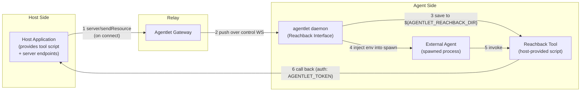

# Agent Reachback Interface

> The **fundamental, host-agnostic** layer of Agent Reachback: how the agentlet
> daemon distributes tool scripts to spawned agents and provisions the
> environment they need to reach back into their host application.
>
> For the wire-level control message that carries the distribution, see
> [`protocol.md` §9 — Resource Distribution](protocol.md#resource-distribution).
> For a concrete host implementation, see Huabu's
> [`docs/architecture/agent-reachback.md`](../../../docs/architecture/agent-reachback.md).

## 1. Concept

The **primary channel** between a host application and an external agent is the
ACP prompt→response flow relayed by agentlet: the host sends prompts, the agent
streams back messages.

**Agent Reachback** is a parallel, out-of-band channel: a spawned external agent
_reaches back_ into the host application that launched it to read and write
shared state (documents, a canvas, a workspace, …) independently of that
sequential prompt flow. The name is literal — the agent reaches back to its
host — and deliberately carries no networking connotation.

Reachback is **layered**, and the two layers have a clean separation of concerns:

| Layer | Owner | Responsibility |
| ----- | ----- | -------------- |
| **Reachback Interface** (this doc) | **agentlet** (host-agnostic) | Transport & distribution: push tool scripts into each spawned agent's environment and inject the env vars they need. Knows nothing about what the tools do. |
| **Reachback Tool** | **host app** (e.g. Huabu) | Provides the concrete tool script(s) and the server-side endpoints they call. Knows nothing about how the scripts were delivered. |

agentlet never parses, validates, or understands a tool's contents — it only
transports an opaque script to a well-known location and makes that location
discoverable to spawned agents. This keeps the daemon generic: any host app can
ship any Reachback tool without changing agentlet.



## 2. Environment Provisioning

When the daemon spawns an agent process, it injects a set of **well-known environment variables** so the agent (and the Reachback tool it invokes) can locate its tools and authenticate back to the host. Precedence is `AGENTLET_SERVER` < daemon `envRegistry` < `sessionSpec.env`, with `AGENTLET_TOKEN` always set from the daemon's authenticated launch options.

| Variable | Provided by | Description |
| -------- | ----------- | ----------- |
| `AGENTLET_REACHBACK_DIR` | daemon `envRegistry` | Absolute path to the directory where Reachback tool scripts are saved. Defaults to `node_modules/.cache/agentlet/reachback`; overridable via the daemon's `process.env`. Resolved to an absolute path so agents with a different `cwd` still find it. |
| `AGENTLET_SERVER` | daemon `--server` | The daemon's control-channel WebSocket URL (e.g. `ws://127.0.0.1:3001/api/bridge`). Tools derive an HTTP base URL from this (`ws://`→`http://`, strip path) unless the host provides its own override. |
| `AGENTLET_TOKEN` | daemon `--token` | Bearer token the tool attaches to every call back to the host. May double as user/session identity for per-token access scoping. |
| _host-specific_ | `sessionSpec.env` | Any additional variables the host app passes at spawn time (e.g. a workspace/document ID). These override defaults but cannot replace the daemon-owned `AGENTLET_TOKEN`. |

The daemon maintains resource-directory variables in an `envRegistry` keyed by variable name. The registry is the single source of truth for `${ENV_VAR}` interpolation in resource destinations (§3). Spawned-agent environments combine the daemon's server URL and token with that registry and `sessionSpec.env`, so a token supplied through `--token` does not depend on also being present in the daemon process environment.

## 3. Tool Distribution

Tool scripts are delivered over the **already-authenticated agentlet control
WebSocket** using the protocol's `server/sendResource` notification — no
separate HTTP endpoint, no public download, no extra auth.

### When

The host app pushes its Reachback tool(s) through the Gateway **when the agentlet daemon connects**, and **re-pushes on reconnection** (the daemon's cache directory may have been cleared while it was suspended). Because delivery is idempotent — a plain overwrite at a fixed path — re-pushing is always safe and also keeps the script version in lock-step with the running host.

### How

`server/sendResource { destination, content }` is sent on the control channel.
The `destination` supports `${ENV_VAR}` interpolation against the daemon's
`envRegistry`, so the host references the well-known dir without knowing its
absolute path on the remote machine:

```jsonc
// Server → Agentlet (control channel)
{
  "jsonrpc": "2.0",
  "method": "server/sendResource",
  "params": {
    "destination": "${AGENTLET_REACHBACK_DIR}/my-reachback-tool.mjs",
    "content": "#!/usr/bin/env node\n…"
  }
}
```

The daemon resolves the destination, creates parent directories as needed,
writes the file, and logs `resource_saved`. An unknown `${ENV_VAR}` is rejected;
a write failure is logged as `resource_save_failed` (non-fatal). See
[`protocol.md` §9](protocol.md#resource-distribution) for the full wire
contract.

### Discovery

Because the script lands in `${AGENTLET_REACHBACK_DIR}` and that same variable
is injected into every spawned agent, the agent can invoke the tool by an
env-relative path without any per-host configuration:

```bash
node ${AGENTLET_REACHBACK_DIR}/<tool-script> <command> [args...]
```

`server/sendResource` is **general-purpose** — it can place any
`${ENV_VAR}/filename` resource, not just Reachback tools — but Reachback is its
primary use today.

## 4. Transport Model (CLI-first)

The Reachback Interface standardises on **distributing a CLI script** rather
than, say, registering an MCP server, because it must work uniformly across
heterogeneous agent harnesses and support long-running, streaming operations:

| Consideration | MCP | CLI script (Reachback) |
| ------------- | --- | ---------------------- |
| Setup | Zero-install, JSON config | Requires distribution — solved by §3 |
| Sync/Async | Sync only (blocking tool calls) | Both sync & async, streaming |
| Flexibility | Fixed request/response | Rich interaction patterns |
| Agent support | Widely supported | Universally supported (any shell) |

The interface only mandates the *delivery + environment* contract. The script's
commands, output conventions, and the server API it calls are entirely up to the
host app. Two transport properties are, however, recommended for any compliant
tool so that agent harnesses behave well:

- **Blocking, `curl`-like calls.** A command runs to completion, prints a
  machine-consumable result to stdout, diagnostics to stderr, and exits
  non-zero on failure. Harnesses already promote a slow command to a background
  task and collect its output later, so the tool needs no explicit async mode.
- **Streaming for long operations.** For potentially long calls (e.g. invoking
  another agent), stream incrementally (e.g. SSE) and emit an early stderr
  status line. Continuous output keeps both the HTTP connection and the harness
  alive, eliminating the timeout→retry→duplicate-execution problem without
  request-level idempotency.

## 5. Host Contract

To expose Reachback, a host application must:

1. **Provide a tool script** that authenticates with `AGENTLET_TOKEN`, resolves
   its server base URL from `AGENTLET_SERVER` (or a host-specific override), and
   exposes whatever commands its agents need.
2. **Push the script on connect/reconnect** via `server/sendResource` to `${AGENTLET_REACHBACK_DIR}/<tool-script>` from the embedding Gateway's connection callbacks.
3. **Serve the endpoints** the script calls, accepting `Authorization: Bearer
   ${AGENTLET_TOKEN}`.
4. **(Recommended) Inject usage into the agent's system prompt** at spawn time
   so the agent can use Reachback immediately, with no discovery round-trip.
5. **(Optional) Pass host context** to spawned agents via `sessionSpec.env`
   (e.g. a workspace ID the tool reads automatically).

agentlet provides items needed to make 1–5 work — distribution, the
`AGENTLET_*` environment, and `sessionSpec.env` forwarding — but never the tool
itself.

## 6. Type & Protocol References

| Concern | Source |
| ------- | ------ |
| `server/sendResource` params | [`SendResourceParams`](../packages/protocol/src/messages.ts) |
| Wire contract & timing | [`protocol.md` §9 — Resource Distribution](protocol.md#resource-distribution) |
| Env registry & spawn env | [`packages/local/src/agentlet.ts`](../packages/local/src/agentlet.ts) (`envRegistry`, `resolveDestination`, `handleSendResource`) |
| Host integration (connection callbacks) | Embedding Gateway implementation |
| Concrete host implementation | [Huabu — `docs/architecture/agent-reachback.md`](../../../docs/architecture/agent-reachback.md) |
