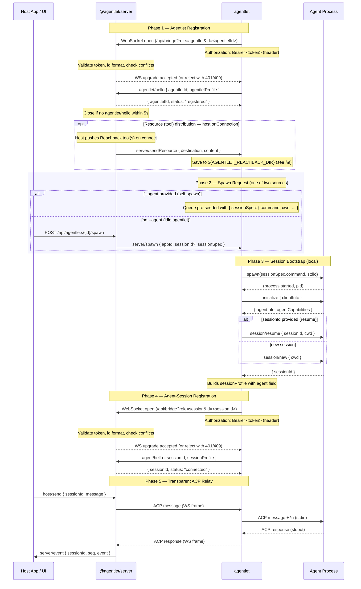
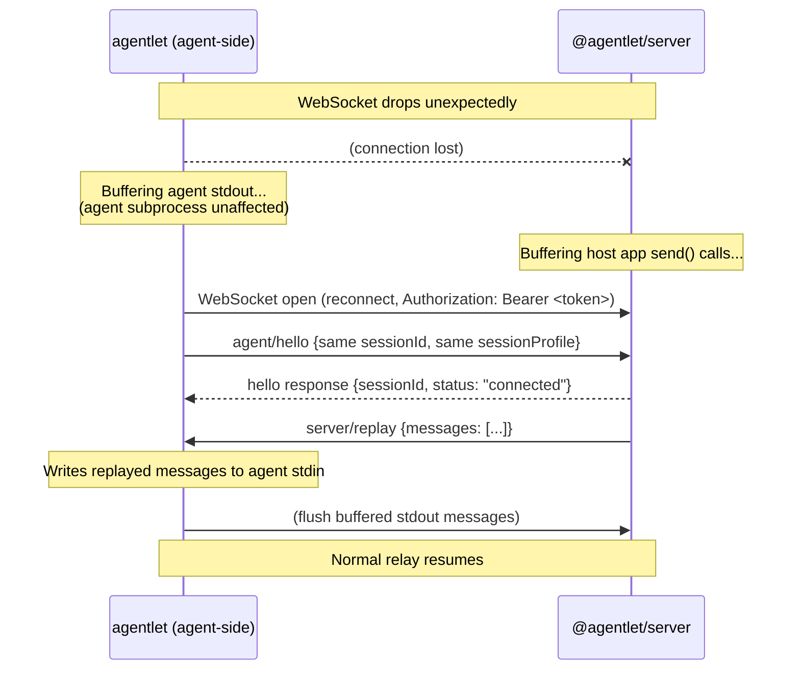
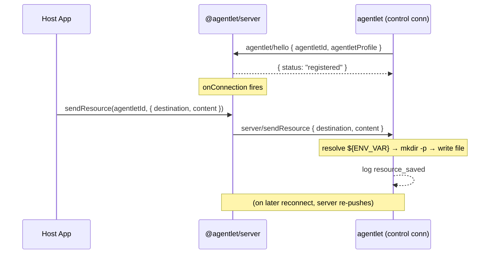

# Agentlet Protocol

> Note: For formal machine-readable specs, see [`openapi.yaml`](openapi.yaml) for the REST API and [`asyncapi.yaml`](asyncapi.yaml) for the WebSocket protocols.

<a id="connection-establishment"></a>

## 1. Connection Establishment

Every agent session follows the **same lifecycle**, regardless of how it was initiated. The `agentlet` CLI first registers with the server via `agentlet/hello`, then processes spawn requests from a queue. The only difference is *who seeds the queue*:

| Source | How the spawn request arrives |
|---|---|
| **Self-spawn** (`--agent`) | CLI pre-seeds the queue with a single `{ sessionSpec }` at startup |
| **Server-driven** (no `--agent`) | Server sends `server/spawn { appId, sessionSpec }` via WS |



**Key insight:** In self-spawn mode, the agentlet registration (Phase 1) and spawn processing (Phase 2–4) happen back-to-back automatically. In idle mode, Phase 1 completes and the agentlet waits — Phase 2 is triggered later by `server/spawn`. But the bootstrap and relay logic (Phase 3–5) is identical in both cases.

The two handshakes serve distinct purposes: `agentlet/hello` registers the **adapter** (machine, capabilities); `agent/hello` registers an **agent session** (process info, ACP capabilities). Each opens its own WebSocket — the agentlet control channel and per-session relay channels are independent connections.

### Agentlet Registration & Control Messages

The agentlet registers itself using a two-step handshake: minimal identity in the WebSocket query parameters for early validation, followed by a rich `agentlet/hello` message with the full profile.

**Step 1 — WebSocket open:** The query string includes `role` (`agentlet` or `session`) and `id` (the agentlet's self-chosen identifier or the session ID). Authentication is via `Authorization: Bearer <token>` header (not query param — avoids token leaking in server logs). The server validates the token, checks the ID for format and conflicts, and upgrades the connection. If `id` is already in use by another active connection, the server rejects the upgrade with HTTP 409.

**Step 2 — `agentlet/hello`:** The first message on the new connection must be `agentlet/hello` with the full `agentletProfile`. The server must receive this within 5 seconds or close the connection with code `HANDSHAKE_TIMEOUT`.

```jsonc
// Agentlet → Server (first message after WS open)
{
  "jsonrpc": "2.0",
  "method": "agentlet/hello",
  "id": 1,
  "params": {
    "agentletProfile": {
      "bridge": { "name": "agentlet", "version": "1.0.0" },
      "machine": { "hostname": "worker-01", "platform": "linux" },
      "capabilities": { "autoRestart": true, "bufferLimit": 1000, "maxAgents": 10 }
    }
  }
}

// Server → Agentlet (response)
{
  "jsonrpc": "2.0",
  "id": 1,
  "result": {
    "agentletId": "worker-01:agentlet",
    "status": "registered"
  }
}
```

The `agentletId` in the response is the server-confirmed identifier — either echoing back the `id` from the query param, or a server-assigned ID if none was provided.

The server registers the connection in a **connection registry**. Registered agentlets are addressable via REST API (`GET /api/agentlets`, `POST /api/agentlets/:agentletId/spawn`, etc.).

For the full control message schemas (`server/spawn`, `server/stop`, `server/list`, `agent/suspended`), see the [Bridge channel in asyncapi.yaml](asyncapi.yaml).

**Spawn lifecycle:** On `server/spawn`, the agentlet validates `sessionSpec.command` / `sessionSpec.cwd`, spawns the process, performs session bootstrap (`session/new` or `session/resume` / `session/load` if `sessionId` is provided), opens a second WebSocket (standard `agent/hello` with attached `sessionProfile.agent`), and returns the result. If bootstrap fails, the agentlet terminates the agent and returns a JSON-RPC error.

**Session resume:** If the spawn request includes a `sessionId`, the agentlet will attempt to resume the session (preferring `session/resume`, falling back to `session/load` if the agent supports it). The spawn arguments (`cwd`, `mcpServers`, etc.) are re-passed to the resume request. The session store records the latest spawn params so callers can omit unchanged fields.

**Idle timeout:** If `idleTimeoutSecs` is specified, the agentlet tracks inactivity on the host→agent direction. When the timeout elapses, the agentlet:
1. Notifies the server via `agent/suspended`
2. Gracefully stops the agent without sending `session/close` (preserving resume eligibility)
3. Suppresses `autoRestart` to avoid restarting the suspended agent

### Identity Model

| Entity | Identity Source | Format | Example | Lifecycle |
|---|---|---|---|---|
| Agentlet | `?id=` query param or server-assigned | `<hostname>:agentlet` | `worker-01:agentlet` | Stable for the agentlet connection lifetime |
| Agent session | ACP session bootstrap (`session/new`) | `<sessionId>` | `sess_abc123` | Primary routing key for the session — stable across resumes |

The agentlet's identity (`agentletId`) is established during the WebSocket handshake — either self-chosen via `?id=xxx` or assigned by the server in the `agentlet/hello` response. The agent session's identity (`sessionId`) is established during Phase 3 bootstrap and is the primary routing key for ACP message relay. Display-oriented metadata such as `displayName` is derived separately from the session command and is not part of the bridge handshake. The `authenticate()` callback validates the query token and returns optional metadata; it does not assign identity.

**Duplicate session:** If an agentlet connects with a `sessionId` that is already in use by another incompatible active connection, the server rejects the connection with error code `-32004` (`DUPLICATE_SESSION`). If the existing connection is disconnected (stale), the new connection is treated as a reconnection.

### Security (Agentlet Control)

- **Authentication:** `Authorization: Bearer <token>` header on WebSocket upgrade. For browser clients (which cannot set WS headers), use a short-lived single-use ticket obtained from a REST endpoint, passed as `?ticket=<ticket>` query param.
- Only the token owner can spawn / stop / list sessions on their agentlet
- The agentlet only accepts `server/spawn`, `server/stop`, and `server/list` from the server over its authenticated WebSocket
- All agent commands run under the agentlet's OS user — no privilege escalation
- The `sessionSpec.command` field in `server/spawn` is passed to `spawn` with `shell: true` — only trusted commands should be sent

<a id="agent-handshake"></a>

## 2. Handshake Protocol

Two distinct handshakes serve different purposes:

| Handshake | Method | Phase | Purpose |
|---|---|---|---|
| Agentlet registration | `agentlet/hello` | Phase 1 | Register the adapter with its profile and capabilities |
| Agent-session registration | `agent/hello` | Phase 4 | Register an agent session for ACP relay, with full session profile |

Both must be the **first message** sent after the WebSocket connection opens. The server rejects any other traffic until the handshake completes. On success, the WebSocket enters its steady-state role: agent-sessions relay raw ACP JSON-RPC transparently, while agentlet connections receive server control requests (`server/spawn`, `server/stop`, etc.).

For the full `AgentletHelloParams` and `AgentHelloParams` schemas, response formats, and examples, see the [Bridge channel in asyncapi.yaml](asyncapi.yaml).

## 3. Message Relay (Steady State)

```
Server → Agentlet → Agent stdin:   ACP requests  (initialize, session/new, session/prompt, ...)
Agent stdout → Agentlet → Server:  ACP responses (results, notifications, streaming chunks)
```

**Framing:** Each WebSocket text frame contains exactly one JSON-RPC message (same as ACP stdio framing — newline-delimited JSON on stdio, one message per WS frame on WebSocket).

**Agentlet behavior:**
- Read stdout line-by-line; parse as JSON; forward each valid JSON-RPC message as a WebSocket text frame.
- Read each WebSocket text frame; write as a line to agent stdin (append `\n`).
- Invalid JSON from stdout: log warning, skip (do not forward garbage to server).
- Binary WebSocket frames: reject and log (protocol violation).

## 4. Control Messages

Control methods follow an **entity/verb** naming convention where the entity is the sender or subject: `agentlet/*` for agentlet adapter messages, `agent/*` for agent-session messages, `server/*` for server-originated messages, and `host/*` on the host channel. Lifecycle notifications use `agent/exited`, `agent/restarted`, `agent/goodbye`, `agent/overflow`, and `agent/suspended`. Server control uses `server/replay`, `server/ping`, `server/shutdown`, `server/spawn`, `server/stop`, `server/list`, and `server/sendResource` (file/tool distribution — see [§9](#resource-distribution)).

- `agentlet/hello`, `agent/hello`, `server/spawn`, `server/stop`, and `server/list` are **requests** (have `id`, expect a response). All others are **notifications** (no `id`, no response expected).
- Heartbeat: The agent-side adapter sends WebSocket-level pings at `--heartbeat` interval. `server/ping` / `agent/pong` are application-level keepalives initiated by the server for connection liveness detection.

For the complete message catalog with schemas and examples, see the [Bridge channel in asyncapi.yaml](asyncapi.yaml).

<a id="reconnection-protocol"></a>

## 5. Reconnection Protocol

When the WebSocket drops unexpectedly:

1. **Buffer**: Continue reading agent stdout into an in-memory queue (up to `--buffer-limit` messages).
2. **Backoff**: Reconnect attempts with exponential backoff: 1s, 2s, 4s, 8s, ... capped at `--reconnect-max`.
3. **Re-handshake**: On reconnection, send the appropriate hello — `agent/hello` (same `sessionId`) for agent-session connections, or `agentlet/hello` (same `agentletId`) for agentlet control connections. Auth token travels in the `Authorization` header.
4. **Server replay first**: If the server has buffered outbound messages (from host app `send()` calls during disconnect), it sends `server/replay` immediately after the hello response.
5. **Client replay second**: After receiving the hello response (and any `server/replay`), Agentlet flushes its own buffered messages to the server in order.
6. **Resume**: Normal relay resumes.



**Agent subprocess is never restarted due to network issues.** The agent continues running, writing to stdout, which Agentlet buffers. From the agent's perspective, nothing happened.

<a id="protocol-type-reference"></a>

## 6. Protocol Type Reference

The definitive type contract for the protocol lives in `@agentlet/protocol` (source of truth). See the source files directly:

| Types | Source |
|---|---|
| **Base Types** — `JsonRpcRequest`, `JsonRpcNotification`, `JsonRpcResponse`, `JsonRpcError`, `JsonRpcMessage`, `AcpMessage` | [`packages/protocol/src/json-rpc.ts`](../packages/protocol/src/json-rpc.ts) |
| **Agentlet Handshake** — `AgentletProfile`, `AgentletHelloParams`, `AgentletHelloResult` | [`packages/protocol/src/messages.ts`](../packages/protocol/src/messages.ts) |
| **Agent Handshake** — `AgentHelloParams`, `AgentHelloResult`, `AgentHelloError` | [`packages/protocol/src/messages.ts`](../packages/protocol/src/messages.ts) |
| **Agent Notifications** — `AgentExitedParams`, `AgentRestartedParams`, `AgentGoodbyeParams`, `AgentOverflowParams`, `AgentSuspendedParams`, `AgentPongParams` | [`packages/protocol/src/messages.ts`](../packages/protocol/src/messages.ts) |
| **Server Control** — `ServerReplayParams`, `ServerPingParams`, `ServerShutdownParams`, `SpawnParams`, `SpawnResult`, `StopParams`, `StopResult`, `ListParams`, `ListResult`, `SendResourceParams` | [`packages/protocol/src/messages.ts`](../packages/protocol/src/messages.ts) |
| **Lifecycle Events** — `LifecycleEvent` | [`packages/protocol/src/messages.ts`](../packages/protocol/src/messages.ts) |
| **Server Configuration** — `AgentletServerOptions`, `AuthResult` | [`packages/protocol/src/gateway-types.ts`](../packages/protocol/src/gateway-types.ts) |
| **AgentConnection** — the interface host apps interact with | [`packages/protocol/src/gateway-types.ts`](../packages/protocol/src/gateway-types.ts) |
| **Error Codes & Constants** — `ErrorCodes`, `AgentletMethods`, `AgentMethods`, `ServerMethods`, `HostMethods`, `PROTOCOL_VERSION` | [`packages/protocol/src/constants.ts`](../packages/protocol/src/constants.ts) |

### Error Codes

See the `ErrorCodes` schema in [asyncapi.yaml](asyncapi.yaml) for the complete error code reference.

<a id="acp-message-examples"></a>

## 7. ACP Message Examples

For reference — these are the ACP messages involved in the session lifecycle. Session bootstrap (`initialize` + `session/new` or `session/resume`) is performed **locally by agentlet** before connecting to the server. All subsequent messages flow through the relay transparently.

```jsonc
// ─── Session Bootstrap: New Session (agentlet → agent, LOCAL, before server connection) ───

// Agentlet → Agent: Initialize the ACP session
{ "jsonrpc": "2.0", "method": "initialize", "id": 1, "params": { "protocolVersion": 1, "clientInfo": { "name": "agentlet", "version": "1.0" }, "clientCapabilities": {} } }

// Agent → Agentlet: Initialization response (capabilities)
{ "jsonrpc": "2.0", "id": 1, "result": { "agentInfo": { "name": "claude-code", "version": "2.1" }, "agentCapabilities": { "streaming": true, "loadSession": true, "sessionCapabilities": { "resume": true } } } }

// Agentlet → Agent: Start a new session (with correct local cwd)
{ "jsonrpc": "2.0", "method": "session/new", "id": 2, "params": { "cwd": "/home/user/project", "mcpServers": [] } }

// Agent → Agentlet: Session created
{ "jsonrpc": "2.0", "id": 2, "result": { "sessionId": "sess_1" } }

// ─── Session Bootstrap: Resuming a Previous Session (alternative to session/new) ───

// After initialize, if a sessionId was provided in spawn params and agent supports resume:
// Agentlet → Agent: Resume an existing session (preferred — no history replay)
{ "jsonrpc": "2.0", "method": "session/resume", "id": 2, "params": { "sessionId": "sess_1", "cwd": "/home/user/project", "mcpServers": [] } }

// Agent → Agentlet: Session resumed
{ "jsonrpc": "2.0", "id": 2, "result": { "sessionId": "sess_1" } }

// Fallback: If agent supports loadSession but not resume, use session/load instead:
// Agentlet → Agent: Load session (agent replays history via session/update notifications)
{ "jsonrpc": "2.0", "method": "session/load", "id": 2, "params": { "sessionId": "sess_1", "cwd": "/home/user/project", "mcpServers": [] } }

// Agent → Agentlet: (session/update notifications with history, then response)
{ "jsonrpc": "2.0", "id": 2, "result": { "sessionId": "sess_1" } }

// ─── After bootstrap, agentlet connects to server with session profile in agent/hello ───
// ─── All subsequent messages below flow THROUGH the relay transparently ───

// Host → Agent: Send a prompt (UI only needs sessionId)
{ "jsonrpc": "2.0", "method": "session/prompt", "id": 3, "params": { "sessionId": "sess_1", "prompt": [{ "type": "text", "text": "Refactor the auth module to use JWT" }] } }

// Agent → Host: Streaming response chunks (notifications, no id)
{ "jsonrpc": "2.0", "method": "session/update", "params": { "sessionId": "sess_1", "update": { "sessionUpdate": "agent_message_chunk", "content": { "type": "text", "text": "I'll start by..." } } } }

// Agent → Host: Permission request
{ "jsonrpc": "2.0", "method": "session/permission", "id": 4, "params": { "sessionId": "sess_1", "permission": { "type": "tool_call", "tool": "bash", "args": { "command": "rm -rf node_modules" } } } }

// Host → Agent: Permission granted
{ "jsonrpc": "2.0", "id": 4, "result": { "granted": true } }

// Host → Agent: Cancel a running session
{ "jsonrpc": "2.0", "method": "session/cancel", "id": 5, "params": { "sessionId": "sess_1" } }
```

<a id="server-side-contract"></a>

## 8. Server-Side Contract

Agentlet is intentionally server-agnostic. Any system can accept Agentlet connections by implementing:

1. **WebSocket endpoint** — accepts incoming WSS connections at `/api/bridge` with `role` and `id` query parameters. Authenticates via `Authorization: Bearer <token>` header (CLI clients) or short-lived ticket / cookie (browser clients).
2. **Handshakes** — `agentlet/hello` for agentlet registration (validates query params, stores agentlet profile, returns `agentletId`), and `agent/hello` for agent-session registration (validates token, stores session profile, returns `sessionId`).
3. **ACP message relay** — forwards ACP JSON-RPC messages between host apps and agents transparently (no interpretation or rewriting).
4. **Control messages** — handles `agent/exited`, `agent/goodbye`, etc. as lifecycle signals, plus `server/spawn`, `server/stop`, and `server/list` for idle agentlets.
5. **Reconnection** — recognizes a reconnecting agentlet (same token + `sessionId`) and optionally replays lost messages.

Note: The server does **not** need to implement ACP client behavior (`initialize`, `session/new`). Session bootstrap is owned by agentlet — the server only stores and exposes the resulting session profile.

This enables:

- **Independent development** — Agentlet can be versioned, released, and tested without any specific server deployment.
- **Ecosystem reuse** — Any application (IDE backend, AI canvas, CI orchestrator, research platform) can integrate by implementing the server side of this contract.
- **User trust** — Agentlet is open-source and auditable. Users can verify it doesn't exfiltrate code (it's ~500 lines of relay logic with no network calls beyond the configured server).
- **Minimal install** — Users install one small tool. No SDK, no heavy dependencies.

<a id="resource-distribution"></a>

## 9. Resource Distribution

The server can push files to a connected agentlet daemon over the control
channel using the `server/sendResource` notification. The primary use is **tool
distribution for [Agent Reachback](agent-reachback.md)** — delivering the
host-provided tool script(s) that spawned agents invoke to reach back into the
host app — but the mechanism is general-purpose and can place any file.

### When it happens

Resource pushes ride the **agentlet control channel** (the `role=agentlet`
connection), not a per-session channel. The host app (via `@agentlet/server`)
should push on the daemon's `onConnection` and re-push on `onReconnection`:

- **On connect** — the daemon's cache directory may be empty (fresh start), so
  the tool must be delivered before any agent is spawned.
- **On reconnect** — the cache may have been cleared while the daemon was
  suspended (idle auto-suspend → resume), so the resource is re-pushed.

Delivery is **idempotent** — a plain overwrite at a fixed path — so re-pushing
is always safe and keeps the delivered script version in lock-step with the
running server.



### Message

`server/sendResource` is a **notification** (no `id`, no response expected) sent
from server to agentlet on the control connection:

```jsonc
// Server → Agentlet (control channel)
{
  "jsonrpc": "2.0",
  "method": "server/sendResource",
  "params": {
    // Destination path; supports ${ENV_VAR} interpolation
    "destination": "${AGENTLET_REACHBACK_DIR}/my-reachback-tool.mjs",
    // File content (text)
    "content": "#!/usr/bin/env node\n…"
  }
}
```

### Daemon behavior

1. **Interpolate** `${ENV_VAR}` references in `destination` against the daemon's
   `envRegistry` (the same well-known variables injected into spawned agents,
   e.g. `AGENTLET_REACHBACK_DIR`). An unknown variable is an error and the write
   is skipped.
2. **Create** parent directories (`mkdir -p`) for the resolved path.
3. **Write** `content` to the resolved absolute path (UTF-8), overwriting any
   existing file.
4. **Log** `resource_saved` on success, or `resource_save_failed` (non-fatal) on
   error.

Because destinations are resolved against the env registry and that same
registry seeds every spawned agent's environment, a pushed tool is automatically
discoverable to agents via the corresponding `${ENV_VAR}` path — no absolute
paths cross the wire. See the [Agent Reachback Interface](agent-reachback.md)
for how this composes into the full tool-distribution + environment contract,
and [`SendResourceParams`](../packages/protocol/src/messages.ts) for the type.

